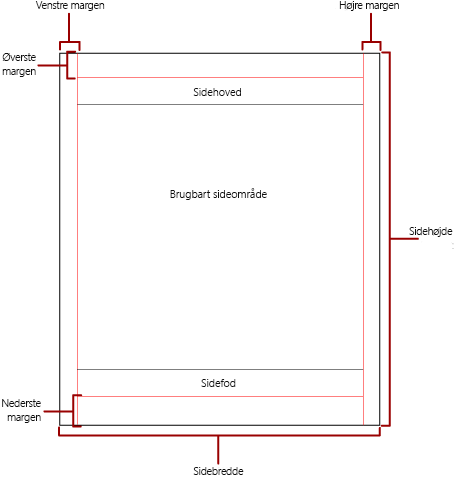
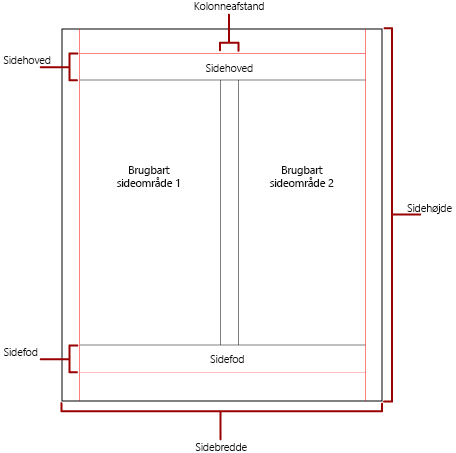

# Sideinddeling i Power BI-sideinddelte rapporter

 *Sideinddeling* henviser til antallet af sider i en rapport, og hvordan rapportelementer er arrangeret på disse sider. Sideinddeling i Power BI sideinddelte rapporter varierer afhængigt af den gengivelsesudvidelse, du bruger til at få vist og levere rapporten. Når du kører en rapport på rapportserveren, bruger rapporten HTML-gengivelsen. HTML følger et bestemt sæt af regler for sideinddeling. Hvis du eksporterer den samme rapport til PDF, kan du f. eks. bruge PDF-gengivelse, som anvender et andet sæt regler. Rapporten sideinddeles derfor på en anden måde. Du skal forstå de regler, der bruges til at styre sideinddeling i sideinddelte rapporter i Power BI. Derefter kan du designe en læsevenlig rapport, som du optimerer til den gengivelse, du vil bruge til at levere din rapport.  
  
 I dette emne beskrives virkningen af den fysiske sidestørrelse og rapportlayoutet for, hvordan gengivere med hårde sideskift gengiver rapporten. Du kan angive egenskaber for at ændre den fysiske sidestørrelse og margenerne og opdele rapporten i kolonner ved hjælp af ruden **Egenskaber for rapport**, ruden **Egenskaber** eller dialogboksen **Sideopsætning**. Opret adgang til ruden **Rapportegenskaber** ved at klikke på det blå område uden for rapportens brødtekst. Opret adgang til dialogboksen **Sideopsætning** ved at klikke på **Kør** på fanen Hjem og derefter **Sideopsætning** under fanen Kør.  
  
> [!NOTE]  
>  Hvis du har designet en rapport, der er én side bred, men som gengives på tværs af flere sider, skal du kontrollere, at bredden af rapportens brødtekst inklusive margener ikke er større end bredden på den fysiske side. Hvis du vil forhindre, at tomme sider føjes til din rapport, kan du reducere størrelsen på objektbeholderen ved at trække objektbeholderens hjørne til venstre.  

## Rapportens brødtekst  
 Brødteksten i rapporten er en rektangulær objektbeholder, der vises som et hvidt felt på designoverfladen. Den kan udvides eller reduceres, så det passer til de rapportelementer, der er indeholdt i den. Rapportens brødtekst afspejler ikke den fysiske sidestørrelse, og rapportens brødtekst kan faktisk blive større end grænserne for den fysiske sidestørrelse, så den spænder over flere rapportsider. Nogle gengivelser såsom Microsoft Excel, Word, HTML og MHTML gengiver rapporter, der vokser eller formindskes afhængigt af sidens indhold. Rapporter, der gengives i disse formater, er optimeret til skærmbaseret visning, f.eks. i en webbrowser. Disse gengivelser tilføjer lodrette sideskift, når det er nødvendigt.  
  
 Du kan formatere brødteksten i rapporten med en kantfarve, en kanttype og en kantbredde. Du kan også tilføje en baggrundsfarve og et baggrundsbillede.  
  
## Den fysiske side  
 Den fysiske sidestørrelse er papirstørrelsen. Den papirstørrelse, du angiver for rapporten, bestemmer, hvordan rapporten gengives. Rapporter, der gengives i formaterne med hårdt sideskift, indsætter sideskift vandret og lodret på basis af den fysiske sidestørrelse. Disse sideskift giver en optimeret læseoplevelse ved udskrivning eller visning i et format med hårdt sideskift. Rapporter, der gengives i formaterne med blødt sideskift, indsætter sideskift vandret på basis af den fysiske størrelse. Igen giver sideskift en optimeret læseoplevelse ved visning i en webbrowser.  
  
 Sidestørrelsen er som standard 8,5 x 11 tommer, men du kan ændre denne størrelse i ruden **Rapportegenskaber** eller dialogboksen **Sideopsætning** eller ved at ændre egenskaberne PageHeight og PageWidth i Ruden **egenskaber**. Sidestørrelsen vokser eller tilpasses ikke, så den passer til indholdet i rapportens brødtekst. Hvis rapporten skal vises på en enkelt side, skal al indholdet i rapportens brødtekst kunne være på den fysiske side. Hvis der ikke er plads til det, og du bruger formatet med hårdt sideskift, kræver rapporten flere sider. Hvis rapportens brødtekst vokser ud over den højre kant på den fysiske side, indsættes et vandret sideskift. Hvis rapportens brødtekst vokser ud over den nederste kant på den fysiske side, indsættes et lodret sideskift.  
  
 Hvis du vil tilsidesætte den fysiske sidestørrelse, der er defineret i rapporten, kan du angive den fysiske sidestørrelse ved hjælp af indstillingerne for enhedsoplysninger for den specifikke gengivelsesenhed, som du bruger til at eksportere rapporten. Du kan finde en komplet liste under [Indstillinger for enhedsoplysninger for gengivelsesudvidelser](https://docs.microsoft.com/sql/reporting-services/device-information-settings-for-rendering-extensions-reporting-services?view=sql-server-2017) i dokumentationen til SQL Server Reporting Services.  
  
### Margener

 Der tegnes margener indad fra kanten af de fysiske sides dimensioner til den angivne margenindstilling. Hvis et rapportelement udvides ind i margenområdet, beskæres det, så det overlappende område ikke gengives. Hvis du angiver margenstørrelser, der medfører, at den vandrette eller lodrette bredde på siden svarer til nul, er margenindstillingerne som standard nul. Margener angives i ruden med **Rapportegenskaber** eller dialogboksen **Sideopsætning** eller ved at ændre egenskaberne TopMargin, BottomMargin, LeftMargin og RightMargin i ruden **Egenskaber**. Hvis du vil tilsidesætte den margenstørrelse, der er defineret i rapporten, kan du angive margenstørrelsen ved hjælp af indstillingerne for enhedsoplysninger for den specifikke gengivelsesenhed, som du bruger til at eksportere rapporten.  
  
 Det område på den fysiske side, der forbliver, efter at pladsen er allokeret til margener, kolonneafstand og sidehoveder og sidefødder, kaldes det *brugbare sideområde*. Margener anvendes kun, når du gengiver og udskriver rapporter i gengivelsesformater med hårdt sideskift. Det følgende billede angiver margenen og det brugbare sideområde på en fysisk side.  
  
 
  
### Kolonner som i et nyhedsbrev  

 Din rapport kan inddeles i kolonner på samme måde som kolonner i en avis. Kolonner behandles som *logiske* sider, der gengives på den samme *fysiske* side. De er arrangeret fra venstre mod højre fra top til bund og adskilt af et blanktegn mellem hver kolonne. Hvis rapporten er inddelt i mere end én kolonne, opdeles hver fysiske side lodret i kolonner, og hver kolonne anses som en logisk side. Antag for eksempel, at du har to kolonner på en fysisk side. Indholdet af rapporten fylder den første kolonne og derefter den anden kolonne. Hvis rapporten ikke passer fuldstændigt inden for de første to kolonner, udfylder rapporten derefter den første og anden kolonne på den næste side. Udfyldningen af kolonnerne fortsætter fra venstre mod højre, top til bund, indtil alle rapportelementer er gengivet. Hvis du angiver kolonnestørrelser, der medfører, at den vandrette eller lodrette bredde er lig med nul, er kolonneafstanden som standard nul.  
  
 Du angiver margener i ruden med **Rapportegenskaber** eller dialogboksen **Sideopsætning** eller ved at ændre egenskaberne TopMargin, BottomMargin, LeftMargin og RightMargin i ruden **Egenskaber**. Hvis du vil bruge en margenstørrelse, der ikke er defineret, kan du specificere margenstørrelsen med indstillingerne Enhedsoplysninger for den specifikke gengiver, som du eksporterer rapporten til. Kolonner anvendes kun, når du gengiver og udskriver rapporter i PDF- eller Image-format. Det følgende billede viser det brugbare sideområde på en side, der indeholder kolonner.  
  

  
## Sideskift og sidenavne

 En rapport kan være mere læselig og dens data nemmere at overvåge og eksportere, når rapporten indeholder sidenavne. SQL Server Reporting Services indeholder egenskaber for rapporter, tabel-, matrix-og listedataområder, filgrupper og rektangler i rapporten til at styre sideinddeling, nulstille sidetal og angive nye rapportsidenavne på sideskift. Disse funktioner kan forbedre rapporter, uanset hvilket format rapporterne er gengivet i, men er især nyttige ved eksport af rapporter til Excel-projektmapper.

> [!NOTE]
> Tabel-, matrix- og listedataområder er reelt den samme type dataområde bag kulisserne: en *tablix.* Så du kan møde dette navn. 

 Egenskaben InitialPageName angiver rapportens indledende sidenavn. Hvis rapporten ikke indeholder sidenavne til sideskift, bruges det indledende navn til alle de nye sider, der oprettes af sideskift. Det er ikke nødvendigt at bruge et indledende sidenavn.  
  
 En gengivet rapport kan indeholde et nyt sidenavn til den nye side, som et sideskift medfører. Hvis du vil angive sidenavnet, skal du indstille egenskaben PageName for en tabel, en matrix, en liste, en gruppe eller et rektangel. Du behøver ikke angive sidenavne ved sideskift. Hvis du ikke gør det, bruges værdien af InitialPageName i stedet for. Hvis InitialPageName også er tom, har den nye side intet navn.  
  
 Tabel-, matrix- og listedataområder, -grupper og -rektangler understøtter sideskift.  
  
 Sideskiftet indeholder følgende egenskaber:  
  
- **BreakLocation** angiver sideskiftets placering for det aktiverede rapportelement for sideskift: i starten, i slutningen eller i starten og slutningen. I grupper kan BreakLocation placeres mellem grupper.  
  
- **Disabled** angiver, om der anvendes et sideskift på rapportelementet. Hvis denne egenskab evalueres som Sand, ignoreres sideskiftet. Denne egenskab bruges til at deaktivere sideskift dynamisk baseret på udtryk, når rapporten køres.  
  
- **ResetPageNumber** angiver, om sidetallet skal nulstilles til 1, når der vises et sideskift. Hvis denne egenskab evalueres som Sand, nulstilles sidetallet.  
  
 Du kan angive egenskaben BreakLocation i dialogboksene **Egenskaber for tablix**, **Egenskaber for rektangel** eller **Egenskaber for grupper**, men du skal angive egenskaberne Disabled, ResetPageNumber og PageName i ruden Egenskaber i Report Builder. Hvis egenskaberne i ruden Egenskaber er organiseret efter kategori, finder du egenskaberne i kategorien **PageBreak**. For grupper er kategorien **PageBreak** placeret i kategorien **Gruppe**.  
  
 Du kan bruge konstanter og simple eller komplekse udtryk til at angive værdien af egenskaberne Disabled og ResetPageNumber. Du kan dog ikke bruge udtryk sammen med egenskaben BreakLocation. Du kan finde flere oplysninger om at skrive og bruge udtryk i [Udtryk i Power BI Report Builder](report-builder-expressions.md).  
  
 Du kan skrive udtryk i din rapport, der refererer til de aktuelle sidenavne eller sidenumre, ved hjælp af samlingen **Globals**. Du kan finde flere oplysninger i [Indbyggede Globals og brugerreferencer](https://docs.microsoft.com/sql/reporting-services/report-design/built-in-collections-built-in-globals-and-users-references-report-builder?view=sql-server-2017) i dokumentationen til Report Builder og Reporting Services.
  
### Navngivning af Excel-regnearksfaner

 Disse egenskaber er nyttige, når du eksporterer rapporter til Excel-projektmapper. Brug egenskaben InitialPage til at angive et standardnavn for projektmappens fanenavn, når du eksporterer rapporten, og brug sideskift og egenskaben PageName til at angive forskellige navne til hvert regneark. Hver ny rapportside, der er defineret af et sideskift, eksporteres til et andet regneark, som navngives af værdien af egenskaben PageName. Hvis PageName er tom, men rapporten har et indledende sidenavn, bruger alle regneark i Excel-projektmappen det samme navn, som er det indledende sidenavn.  
  
 Du kan finde flere oplysninger om, hvordan disse egenskaber fungerer, når rapporter eksporteres til Excel, under [Eksport til Microsoft Excel](https://docs.microsoft.com/sql/reporting-services/report-builder/exporting-to-microsoft-excel-report-builder-and-ssrs?view=sql-server-2017) i dokumentationen til Report Builder og Reporting Services.  
  
## De næste trin

- [Publicer en sideinddelt rapport i Power BI-tjenesten](consumer/paginated-reports-view-power-bi-service.md)
- [Undgå tomme sider ved udskrivning af sideinddelte rapporter](guidance/report-paginated-blank-page.md)
- Har du flere spørgsmål? [Prøv at spørge Power BI-community'et](https://community.powerbi.com/)
