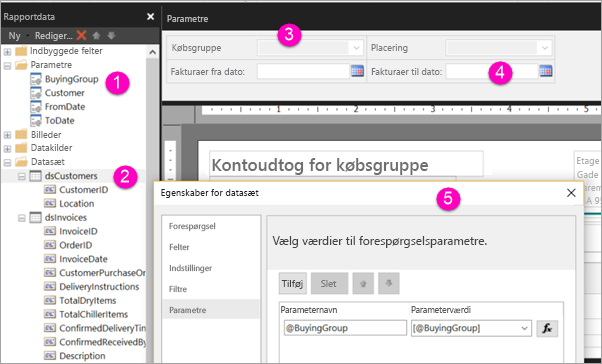

# Opret parametre for sideinddelte rapporter i Power BI-tjenesten

I denne artikel kan du lære, hvordan du opretter parametre for sideinddelte rapporter i Power BI-tjenesten.  En rapportparameter gør det muligt at vælge rapportdata og variere rapportpræsentationen. Du kan angive en standardværdi og en liste over tilgængelige værdier, og læserne af din rapport kan ændre valget.  

På følgende illustration ses visningen Design i Power BI Report Builder for en rapport med parametrene @BuyingGroup, @Customer, @FromDate og @ToDate. 
  

  
1.  Rapportparametrene i ruden Rapportdata.  
  
2.  Tabellen med en af parametrene i datasættet.  
  
3.  Ruden Parametre. Du kan tilpasse layoutet af parametre i ruden Parametre. 
  
4.  Parametrene @FromDate og @ToDate har datatypen **DateTime**. Når du får vist rapporten, kan du enten skrive en dato i tekstfeltet eller vælge en dato i kalenderkontrolelementet. 

5.  En af parametrene i dialogboksen **Egenskaber for datasæt**.  

  
## Opret eller rediger en rapportparameter  
  
1.  Åbn din sideinddelte rapport i Power BI Report Builder.

1. I ruden **Rapportdata** skal du højreklikke på **Parametre** node > **Tilføj parameter**. Dialogboksen **Egenskaber for rapportparametre** åbnes.  
  
2.  Under **Navn** skal du skrive et navn for parameteren eller acceptere standardnavnet.  
  
3.  Under **Prompt** skal du skrive en tekst, der skal vises ud for tekstfeltet Parameter, når brugeren kører rapporten.  
  
4.  Under **Datatype** skal du vælge datatypen for parameterværdien.  
  
5.  Hvis parameteren kan indeholde en tom værdi, skal du vælge **Tillad tom værdi**.  
  
6.  Hvis parameteren kan indeholde en null-værdi, skal du vælge **Tillad null-værdi**.  
  
7.  Hvis du vil tillade, at en bruger vælger mere end én værdi for parameteren, skal du vælge **Tillad flere værdier**.  
  
8.  Angiv indstillingen synlighed.  
  
    -   Du kan få vist parameteren på værktøjslinjen øverst i rapporten ved at vælge **Synlig**.  
  
    -   Hvis du vil skjule parameteren, så den ikke vises på værktøjslinjen, skal du vælge **Skjult**.  
  
    -   Hvis du vil skjule parameteren og beskytte den mod at blive ændret på rapportserveren, når rapporten er publiceret, skal du vælge **Intern**. Rapportparameteren kan derefter kun vises i rapportdefinitionen. Du skal angive en standardværdi for denne indstilling eller tillade, at parameteren accepterer en null-værdi.  
  
9. Vælg **OK**. 

## Overvejelser og fejlfinding

- Hvis du bruger et Power BI-datasæt eller en Analysis Services-model som datakilde, kan du ikke overføre mere end 1.000 parameterværdier i en enkelt anmodning på grund af DAX-begrænsninger. 

 
## Næste trin

Se [få vist parametre for sideinddelte rapporter](consumer/paginated-reports-view-parameters.md) for at se, hvordan parametrene ser ud i Power BI-tjenesten.

Du kan finde detaljerede oplysninger om parametre i sideinddelte rapporter under [Rapportparametre i Power BI Report Builder](report-builder-parameters.md).
