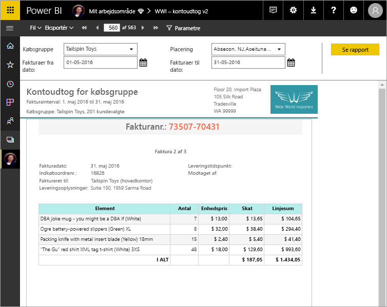

# Hvad er sideinddelte rapporter i Power BI Premium? (Eksempelvisning)
Sideinddelte rapporter, der længe har været standardrapportformatet i SQL Server Reporting Services, er nu tilgængelige i Power BI-tjenesten. Disse rapporter kan udskrives eller deles. De kaldes "sideinddelte", fordi de er formateret til at passe godt på en side. De viser alle data i en tabel, selvom tabellen strækker sig over flere sider. De kaldes også nogle gange "perfekt pixel", fordi du kan styre deres rapportsidelayout helt præcist. Sideinddelte rapporter er baseret på RDL-rapportteknologien i SQL Server Reporting Services. Report Builder er det separate værktøj, der bruges til oprettelse af sideinddelte rapporter. 

Sideinddelte rapporter kan indeholde mange sider. Denne rapport indeholder f.eks. 563 sider. Hver side viser præcis én side pr. faktura og har gentagne sidehoveder og sidefødder.

Du kan få vist et eksempel på rapporten i Report Builder og derefter publicere den i Power BI-tjenesten, http://app.powerbi.com. Du skal bruge en Power BI Pro-licens for at publicere en rapport i tjenesten. Du kan publicere og dele sideinddelte rapporter i Mit arbejdsområde eller i apparbejdsområder, så længe arbejdsområdet er placeret i Power BI Premium-kapaciteten. En Power BI-administrator skal også aktivere sideinddelte rapporter på Power BI-administrationsportalen. Læs mere om [konfiguration af arbejdsbelastninger](service-admin-premium-manage.md#configure-workloads). 

## Opret rapporter i Report Builder

Sideinddelte rapporter har deres eget designværktøj, Report Builder. Det er samme værktøj og samme version, som du brugte til at oprette sideinddelte rapporter til Power BI-rapportserveren eller SQL Server Reporting Services (SSRS). Sideinddelte rapporter, som du opretter til SSRS-2016 og -2017 eller til Power BI-rapportserveren i det lokale miljø, er faktisk kompatible med Power BI-tjenesten. Power BI-tjenesten opretholder bagudkompatibilitet, så du kan fortsat bruge tidligere oprettede rapporter, og du kan opgradere sideinddelte rapporter, der er oprettet i en tidligere version. Det er ikke alle rapportfunktioner, der er tilgængelige ved lanceringen. Se under [Begrænsninger og overvejelser](#limitations-and-considerations) i denne artikel for at få flere oplysninger.
     
## Rapport fra forskellige datakilder

En enkelt sideinddelt rapport kan have en række forskellige datakilder. Til forskel fra Power BI-rapporter har den ikke en underliggende datamodel. I forbindelse med den første version af sideinddelte rapporter i Power BI-tjenesten kan du oprette integrerede datakilder og datasæt i selve rapporten. I øjeblikket kan du ikke bruge delte datakilder eller delte datasæt. Du opretter rapporter i Report Builder på din lokale computer. Hvis en rapport er forbundet med data i det lokale miljø, skal du efter upload af rapporten til Power BI-tjenesten oprette en gateway og omdirigere dataforbindelsen. Her er de datakilder, du kan oprette forbindelse til i den første version:

- Azure SQL Database og Data Warehouse
- SQL Server via en gateway
- SQL Server Analysis Services via en gateway
 
Der vil komme flere datakilder til i løbet af prøveperioden.

## Design rapporten  

### Opret sideinddelte rapporter med matrix-, diagram- og frihåndslayout

Tabelrapporter fungerer godt i forbindelse med kolonnebaserede data. Matrixrapporter, som f.eks. krydsklassifikation eller pivottabeller, er velegnet til opsummerede data. Diagramrapporter viser data i et grafisk format, og *listerapporter* i frihåndsformat kan præsentere næsten alt andet, f.eks. fakturaer. 
  
Du kan starte med en af guiderne i Report Builder. Guiderne Tabel, Matrix og Diagram fører dig gennem oprettelsen af den integrerede datakildeforbindelse og det integrerede datasæt. Derefter skal du trække og slippe felter for at oprette en forespørgsel til datasættet, vælge et layout og en typografi samt tilpasse din rapport.  
  
Ved hjælp af guiden Kort kan oprette du rapporter, der viser aggregerede data på en geografisk eller geometriske baggrund. Kortdata kan være afstandsdata fra en Transact-SQL-forespørgsel eller en ESRI-formfil (Environmental Systems Research Institute, Inc.). Du kan også tilføje en feltbaggrund fra Microsoft Bing Kort.  

### Føj andet til rapporten

Rediger dine data ved at filtrere, gruppere og sortere data eller ved at tilføje formler eller udtryk. Tilføj diagrammer, målere, minidiagrammer og indikatorer for at opsummere data i et visuelt format.  Brug parametre og filtre til at filtrere data til brugerdefinerede visninger. Integrer eller henvis til billeder og andre ressourcer, herunder eksternt indhold.  

Alt i en sideinddelt rapport – fra selve rapporten til alle tekstfelter, billeder, tabeller og diagrammer – har en række egenskaber, du kan angive, for at få rapporten til at se ud præcis, som du ønsker.

## Oprettelse af en rapportdefinition

Når du designer en sideinddelt rapport, opretter du faktisk en *rapportdefinition*. Den indeholder ikke dataene. Den angiver, hvor dataene skal hentes, hvilke data der skal hentes, og hvordan dataene skal vises. Når du kører rapporten, bruger rapportbehandleren den angivne rapportdefinition, henter dataene og kombinerer det med rapportlayoutet for at generere rapporten. Du kan uploade rapportdefinitionen til Power BI-tjenesten, http://app.powerbi.com, enten til Mit arbejdsområde eller til et arbejdsområde, der er delt med dine kolleger. Hvis rapportdatakilden er placeret er i det lokale miljø, skal du omdirigere datakildeforbindelsen, så den går gennem en gateway, når du har uploadet rapporten. 

## Få vist din sideinddelte rapport
Du får vist din sideinddelte rapport i Power BI-tjenesten i en browser og i Power BI-mobilapps. I Power BI-tjenesten kan du eksportere rapporten til en række formater, f.eks. HTML, MHTML, PDF, XML, CSV, TIFF-, Word og Excel. Du kan også dele den med andre.  
  
## Begrænsninger og overvejelser

Her er nogle andre funktioner, der ikke understøttes i den første version:

- Fastgørelse af rapportsider eller visualiseringer til Power BI-dashboards. Du kan stadig fastgøre visualiseringer til et Power BI-dashboard fra en sideinddelt rapport i det lokale miljø på en Power BI-rapportserver eller en Reporting Services-rapportserver. Du kan finde flere oplysninger under [Fastgør Reporting Services-elementer til Power BI-dashboards](https://docs.microsoft.com/sql/reporting-services/pin-reporting-services-items-to-power-bi-dashboards).
- Interaktive funktioner, f.eks. dokumentkort og vis/skjul-knapper.
- Underrapporter og detaljeadgangsrapporter.
- Abonnementer.
- Delte datakilder og datasæt.
- Power BI-datasæt.
- Visualiseringer fra Power BI-rapporter.
- Sideinddelte rapporter i apps. Du kan dele en sideinddelt rapport fra et apparbejdsområde, men du kan ikke inkludere den, når du udgiver appen fra det pågældende arbejdsområde.
 
## Næste trin

- [Installér Report Builder fra Microsoft Download Center](http://go.microsoft.com/fwlink/?LinkID=734968)
- [Selvstudium: Opret en sideinddelt rapport](paginated-reports-quickstart-aw.md)
- [Angiv data direkte i en sideinddelt rapport](paginated-reports-enter-data.md)

  

