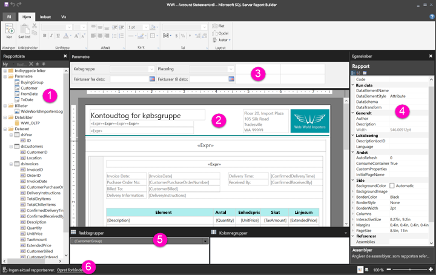

# Navigering i visningen Rapportdesign for sideinddelte rapporter (eksempelvisning)

Rapportdesign i Power BI Report Builder er området design til oprettelse af sideinddelte rapporter, som du kan publicere til Power BI-tjenesten. Designområdet er placeret centralt i Report Builder, og båndet og ruderne er placeret rundt om det. Designområdet er, hvor du tilføjer og organiserer dine rapportelementer. I denne artikel forklares de ruder, du bruger til at tilføje, vælge og organisere dine rapportressourcer og ændre egenskaber for rapportelementer.  

1. [Ruden Rapportdata](#1-report-data-pane) 
2. [Rapportdesignområde](#2-report-design-surface)  
3. [Ruden Parametre](#3-parameters-pane) 
4. [Ruden Egenskaber](#4-properties-pane) 
5. [Ruden Gruppering](#5-grouping-pane) 
6. [Statuslinje for aktuel rapport](#6-current-report-status-bar)  
  
## 1 Ruden Rapportdata  
 I ruden Rapportdata kan du definere de rapportdata og rapportressourcer, du skal bruge til en rapport, inden du designer dit rapportlayout. Du kan f.eks. føje datakilder, datasæt, beregnede felter, rapportparametre og billeder til ruden Rapportdata.  
  
 Når du har føjet elementer til ruden Rapportdata, skal du trække felter til rapportelementer i designområdet for at styre, hvor data vises i rapporten.  
  
> [!TIP]  
>  Hvis du trækker et felt fra ruden Rapportdata direkte til rapportdesignområdet i stedet for at placere det i et dataområde som f.eks. en tabel eller et diagram, er det kun den første værdi fra dataene i det pågældende felt, der vises, når du kører rapporten.  
  
 Du kan også trække indbyggede felter fra ruden Rapportdata til rapportdesignområdet. Når disse felter gengives, indeholder de oplysninger om rapporten, f.eks. rapportnavnet, det samlede antal sider i rapporten og det aktuelle sidenummer.  
  
 Nogle ting føjes automatisk til ruden Rapportdata, når du føjer noget til rapportdesignområdet. Hvis du f.eks. integrerer et billede i rapporten, føjes det til mappen Billeder i ruden Rapportdata.  
  
> [!NOTE]  
>  Du kan bruge knappen **Ny** til at føje et nyt element til ruden Rapportdata. Du kan føje flere datasæt fra samme datakilde eller fra andre datakilder til rapporten. Hvis du vil tilføje et nyt datasæt fra samme datakilde, skal du højreklikke på en datakilde > **Tilføj datasæt**.  
  
## 2 Rapportdesignområde  
 Rapportdesignområdet i Report Builder er det primære arbejdsområde til design af dine rapporter. Hvis du vil placere rapportelementer, f.eks. dataområder, underrapporter, tekstfelter, billeder, rektangler og linjer i din rapport, skal du føje dem til designområdet vha. båndet eller Rapportdelsgalleri. Der kan du føje grupper, udtryk, parametre, filtre, handlinger, synlighed og formatering til dine rapportelementer.  
  
 Du kan også ændre følgende:  
  
-   Egenskaberne for rapportbrødtekst, f.eks. kant og udfyldningsfarve, ved at højreklikke på det hvide område i designområdet uden for alle rapportelementer og vælge **Egenskaber for brødtekst**.  
  
-   Egenskaberne for sidehoved og sidefod, f.eks. kant og udfyldningsfarve, ved at højreklikke på det hvide område i sidehoveds- eller sidefodsområdet uden for alle rapportelementer og vælge **Egenskaber for sidehoved** eller **Egenskaber for sidefod**.  
  
-   Egenskaberne for selve rapporten, f.eks. sideopsætning, ved at højreklikke på det grå område omkring designområdet og vælge **Egenskaber for rapport**.  
  
-   Egenskaberne for rapportelementer ved at højreklikke på dem og vælge **Egenskaber**.  
  
### Designområdestørrelse og udskriftsområde  
Designområdestørrelsen kan være anderledes end det udskriftsområde, du angive for sidestørrelsen, når du vil udskrive rapporten. Ændring af størrelsen på designområdet vil ikke ændre udskriftsområdet for din rapport. Uanset hvilken størrelse du angiver for udskriftsområdet for rapporten, ændrer det ikke størrelsen af det komplette designområde. Du kan finde flere oplysninger under Funktionsmåder for gengivelse. 
  
- Hvis du vil vise linealen, skal du på fanen **Visning** markere afkrydsningsfeltet **Lineal**.  
  
## 3 Ruden Parametre  
 Ved hjælp af rapportparametre kan du styre rapportdata, oprette forbindelse mellem relaterede rapporter og variere præsentationen af rapporter. I ruden Parametre får du et fleksibelt layout til rapportparametrene.  
  
 Læs mere om rapportparametre   
  
## 4 Ruden Egenskaber
 Alle elementer i en rapport, herunder dataområder, billeder, tekstfelter og selve rapportens brødtekst, har tilknyttede egenskaber. Egenskaben BorderColor for et tekstfelt viser f.eks. farveværdien for tekstfeltets kant, og egenskaben PageSize for rapporten viser sidestørrelsen for rapporten.  
  
 Disse egenskaber vises i ruden Egenskaber. Egenskaberne i ruden ændres, afhængigt af det valgte rapportelement.  
  
- Se ruden Egenskaber på fanen **Visning** under **Vis/skjul** gruppe > **Egenskaber**.  
  
### Ændring af egenskabsværdier  
 I Report Builder kan du ændre egenskaberne for rapportelementer på flere måder:  
  
-   Ved at vælge knapper og lister på båndet.  
  
-   Ved at ændre indstillinger i dialogbokse.  
  
-   Ved at ændre egenskabsværdier i ruden Egenskaber.  
  
 De mest anvendte egenskaber er tilgængelige i dialogboksene og på båndet.  
  
 Afhængigt af egenskaben kan du angive en værdi for egenskaben via en rulleliste, angive værdien eller vælge `<Expression>` for at oprette et udtryk.  
  
### Ændring af visningen af ruden Egenskaber  
 Som standard er egenskaber, der vises i ruden Egenskaber, organiseret i brede kategorier, f.eks. Handling, Kant, Udfyldning, Skrifttype og Generelt. Hver enkelt kategori har et sæt tilknyttede egenskaber. Følgende egenskaber vises f.eks. i kategorien Skrifttype: Color, FontFamily, FontSize, FontStyle, FontWeight, LineHeight og TextDecoration. Hvis du foretrækker det, kan du alfabetisere alle de egenskaber, der vises i ruden. Dette fjerner kategorierne og viser alle egenskaberne i alfabetisk rækkefølge, uanset kategori.  
  
 Ruden Egenskaber indeholder tre knapper øverst i ruden: **Kategori**, **Alfabetiser** og **Egenskabsside**. Vælg knapperne Kategori og Alfabetiser for at skifte mellem visning af egenskabsruderne. Vælg knappen **Egenskabssider** for at åbne dialogboksen Egenskaber for et valgt rapportelement.  
  
  
## 5 Ruden Gruppering

 Grupper bruges til at organisere dine rapportdata i et visuelt hierarki og til at beregne totaler. Du kan få vist række- og kolonnegrupperne i et dataområde i designområdet samt i ruden Gruppering. Ruden Gruppering har to ruder: Rækkegrupper og Kolonnegrupper. Når du vælger et dataområde, vises alle grupperne i det pågældende dataområde i ruden Gruppering som en hierarkiske liste: Underordnede grupper vises indrykket under deres overordnede grupper.  
  
 Du kan oprette grupper ved at trække felter fra ruden Rapportdata og slippe dem i designområdet eller i ruden Gruppering. I ruden Gruppering kan du tilføje overordnede, tilstødende og underordnede grupper, ændre gruppeegenskaber og slette grupper.  
  
 Ruden Gruppering vises som standard, men du kan lukke den ved at fjerne markeringen i afkrydsningsfeltet Ruden Gruppering under fanen Visning. Ruden Gruppering er ikke tilgængelig for dataområderne Diagram eller Måler.  
  
 Du kan finde flere oplysninger under Ruden Gruppering og Om Grupper.  
  
## 6 Statuslinje for aktuel rapport

På statuslinjen for den aktuelle rapport vises navnet på den server, rapporten er tilknyttet, eller meddelelsen "Ingen aktuel rapportserver". Du kan vælge **Opret forbindelse** for at oprette forbindelse til en server.

## Næste trin

[Hvad er sideinddelte rapporter i Power BI Premium? (prøveversion)](paginated-reports-report-builder-power-bi.md) 

  
  
