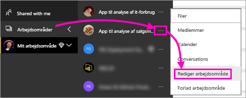
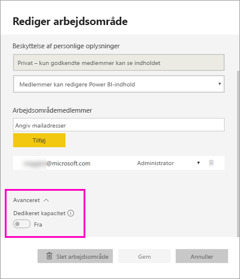
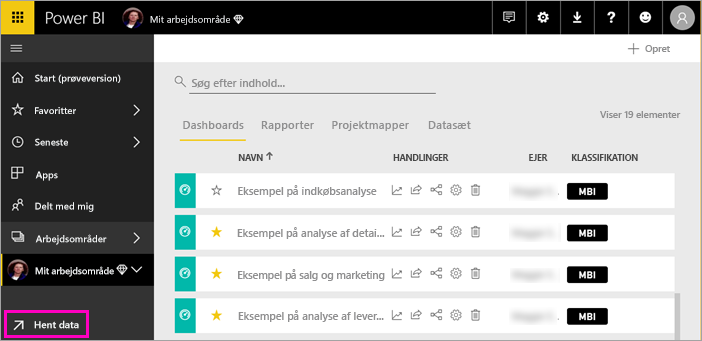
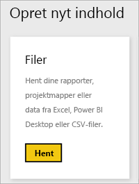
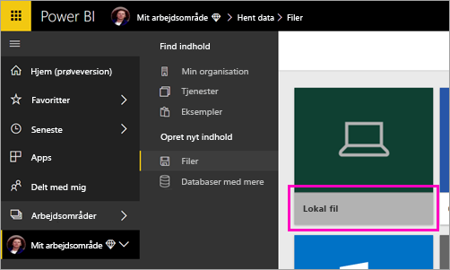
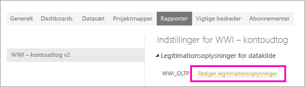
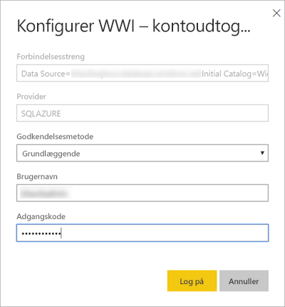
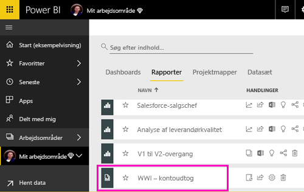
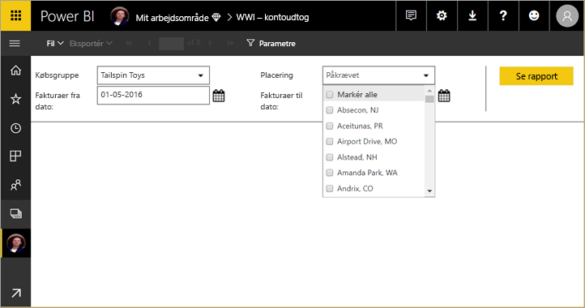

# Publicer en sideinddelt rapport i Power BI-tjenesten

I denne artikel lærer du om publicering af en sideinddelt rapport i Power BI-tjenesten ved at uploade den fra din lokale computer. Du kan uploade sideinddelte rapporter til Mit arbejdsområde eller andre arbejdsområder, så længe arbejdsområdet er i en Premium-kapacitet. Se efter rombeikonet  ud for navnet på arbejdsområdet. 

Hvis din datakilde til rapporten er i det lokale miljø, skal du [oprette en gateway](#create-a-gateway), når du har uploadet rapporten.

## Føj et arbejdsområde til en Premium-kapacitet

Hvis arbejdsområdet ikke har rombeikonet  ud for navnet, skal du føje arbejdsområdet til en Premium-kapacitet. 

1. Vælg **Arbejdsområder**, vælg ellipsen ( **...** ) ud for navnet på arbejdsområdet, og vælg derefter **Rediger arbejdsområde**.

    

1. I dialogboksen **Rediger arbejdsområde** skal du udvide **Avanceret** og derefter sørge for, at indstillingen **Dedikeret kapacitet** er angivet til **Til**.

    

   Du kan muligvis ikke kan ændre den. Hvis ikke, skal du kontakte administratoren af Power BI Premium-kapacitet for at får tildelt rettigheder, så du kan føje dit arbejdsområde til en Premium-kapacitet.

## Upload en sideinddelt rapport

1. Opret din sideinddelte rapport i Report Builder, og gem den på din lokale computer.

1. Åbn Power BI-tjenesten i en browser, og gå til arbejdsområdet Premium, hvor du vil publicere rapporten. Se efter rombeikonet  ud for navnet. 

1. Vælg **Hent data**.

    

1. Vælg **Hent** i feltet **Filer**.

    

1. Vælg **Lokal fil** > gå til den sideinddelte rapport > **Åbn**.

    

1. Vælg **Fortsæt** > **Rediger legitimationsoplysninger**.

    

1. Konfigurer dine legitimationsoplysninger > **Log på**.

    

   Du kan se din rapport på listen over rapporter.

    

1. Vælg den for at åbne den i Power BI-tjenesten. Hvis den indeholder parametre, skal du vælge dem, før du kan få vist rapporten.
 
    

## Opret en gateway

Ligesom alle andre Power BI-rapporter skal du oprette eller oprette forbindelse til en gateway til at få adgang til dataene, hvis datakilden for rapporten er i det lokale miljø.

1. Ud for navnet på rapporten, skal du vælge **Administrer**.

   

1. Du kan se yderligere oplysninger og næste trin i artiklen [Hvad er en datagateway i det lokale miljø](service-gateway-onprem.md) til Power BI-tjenesten.

### Gateway-begrænsninger

I øjeblikket understøtter gateways ikke parametre med flere værdier.

## Næste trin

- [Publicer en sideinddelt rapport i Power BI-tjenesten](paginated-reports-view-power-bi-service.md)
- [Hvad er sideinddelte rapporter i Power BI Premium?](paginated-reports-report-builder-power-bi.md)

