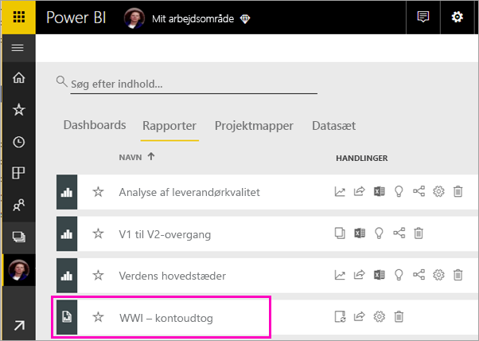
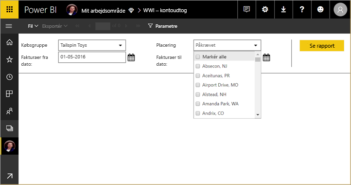
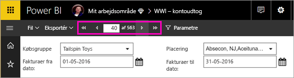
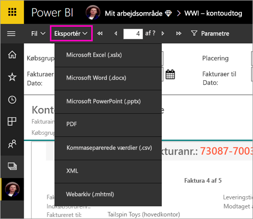

# Få vist en sideinddelt rapport i Power BI-tjenesten (eksempelvisning)

I denne artikel kan du få mere at vide om visning af en sideinddelt rapport i Power BI-tjenesten. Sideinddelte rapporter er rapporter, der oprettes i Report Builder og overføres til et hvilket som helst arbejdsområde i en Premium-kapacitet. Se efter rombeikonet  ud for navnet på arbejdsområdet. 

Sideinddelte rapporter har deres eget ikon, .

Du kan også eksportere sideinddelte rapporter til en række formater: 

- Microsoft Excel
- Microsoft Word
- Microsoft PowerApps
- PDF
- Kommaseparerede værdier
- XML
- Webarkiv (.mhtml)

## Se en sideinddelt rapport

1. Vælg den sideinddelte rapport i arbejdsområdet.

    

2. Hvis rapporten indeholder parametre, som denne her gør, kan du muligvis ikke se rapporten, når du åbner den første gang. Vælg parametre, og vælg derefter **Vis rapport**. 

     

    Du kan også ændre parametrene når som helst.

1. Bladr igennem rapporten ved at vælge pilene øverst på siden eller ved at skrive et sidetal i feltet.
    
   

4. Vælg **Eksportér** for at finde et format, du vil bruge til at eksportere dine sideinddelte rapporter.

    

## Næste trin

[Hvad er sideinddelte rapporter i Power BI Premium? (prøveversion)](paginated-reports-report-builder-power-bi.md)
