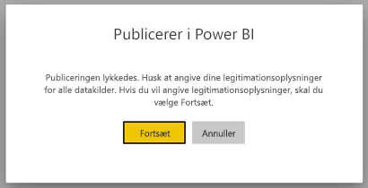
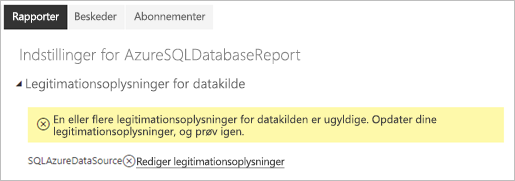
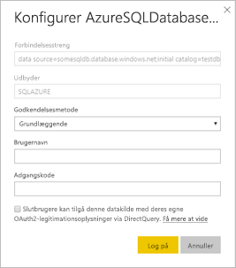

# Understøttede datakilder for sideinddelte rapporter i Power BI

I denne artikel præsenteres understøttede datakilder for sideinddelte rapporter i Power BI-tjenesten, og hvordan du opretter forbindelse til datakilder i Azure SQL Database. Nogle datakilder understøttes i det oprindelige miljø. Du kan oprette forbindelse til andre vha. datagateways.

## Datakilder, der understøttes i det oprindelige miljø

Følgende liste over datakilder understøttes i det oprindelige miljø i sideinddelte rapporter:

| Datakilde | Godkendelse | Noter |
| --- | --- | --- |
| Azure SQL Database  Azure SQL Data Warehouse | Basic, enkeltlogon (SSO), OAuth2 | Du kan bruge en virksomhedsgateway med Azure SQL DB. Du kan dog ikke bruge SSO eller oAuth2 til at godkende i disse scenarier.   |
| Administreret forekomst af Azure SQL | Grundlæggende | via et offentligt eller privat slutpunkt (det private slutpunkt skal routes via Enterprise-gateway)  |
| Azure Analysis Services | SSO, OAuth2 | AAS-firewallen skal være deaktiveret eller konfigureret til at tillade alle IP-områder.|
| Power BI-datasæt | SSO | Power BI Premium-datasæt og datasæt, der ikke er Premium. Kræver læserettigheder |
| Power BI Premium-datasæt (XMLA) | SSO | Power BI-datasæt understøttes ikke som en datakilde til integrerede sideinddelte rapporter.  |
| Angiv data | I/T | Data er integreret i rapporten. |

Med undtagelse af Azure SQL Database er alle datakilder klar til brug, når du har uploadet rapporten til Power BI-tjenesten. Datakilderne bruges som standard til enkeltlogon (SSO), hvor det er relevant. Du kan ændre godkendelsestypen til OAuth2 for Azure Analysis Services. Men når godkendelsestypen for en given datakilde ændres til OAuth2, kan den ikke vende tilbage til at bruge SSO.  Denne ændring gælder desuden alle de rapporter, der bruger den pågældende datakilde på tværs af alle arbejdsområder for en given lejer.  Sikkerhed på rækkeniveau i sideinddelte rapporter fungerer ikke, medmindre brugerne vælger SSO som godkendelsestype.

Du skal angive flere oplysninger for Azure SQL Database-datakilder, som beskrevet i afsnittet [Godkendelse i Azure SQL Database](#azure-sql-database-authentication).

## Andre datakilder

Foruden ovenstående datakilder, der understøttes i det oprindelige miljø, kan følgende datakilder tilgås via en [Power BI-datagateway](../connect-data/service-gateway-onprem.md):

- SQL Server
- SQL Server Analysis Services
- Oracle
- Teradata

Du kan ikke få adgang til Azure SQL Database og Azure Analysis Services via en Power BI-datagateway i forbindelse med sideinddelte rapporter.

## Godkendelse i Azure SQL Database

Du skal angive en godkendelsestype, før du kører rapporten, i forbindelse med Azure SQL Database-datakilder. Dette gælder kun, første gang du bruger en datakilde i et arbejdsområde. Ved denne første gang får du vist følgende meddelelse:

Hvis du ikke angiver nogen legitimationsoplysninger, opstår der en fejl, når du kører rapporten. Vælg **Fortsæt** for at gå til siden **Legitimationsoplysninger for datakilde** for den rapport, du netop har uploadet:

Vælg linket **Rediger legitimationsoplysninger** for en given datakilde for at få vist dialogboksen **Konfigurer**:

Her er de understøttede godkendelsestyper for Azure SQL Database-datakilder:

- Basic (brugernavn og adgangskode)
- SSO (enkeltlogon)
- OAuth2 (gemt AAD-token)

[Understøttelse af AAD-godkendelse](https://docs.microsoft.com/azure/sql-database/sql-database-aad-authentication-configure) skal være aktiveret for den Azure SQL Database-server, som datakilden opretter forbindelse til, for at SSO og OAuth2 fungerer korrekt. Til OAuth2-godkendelsesmetoden opretter AAD et token og gemmer det til fremtidig adgang til datakilderne. Hvis du i stedet vil bruge [SSO-godkendelsesmetoden](https://docs.microsoft.com/power-bi/service-azure-sql-database-with-direct-connect#single-sign-on), skal du vælge SSO-muligheden lige under den, **Slutbrugere bruger deres egne OAuth2-legitimationsoplysninger til at få adgang til denne datakilde via DirectQuery**.
  
## Næste trin

[Publicer en sideinddelt rapport i Power BI-tjenesten](../consumer/paginated-reports-view-power-bi-service.md)

Har du flere spørgsmål? [Prøv at spørge Power BI-community'et](https://community.powerbi.com/)

