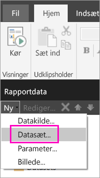
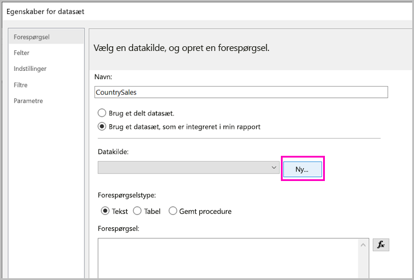
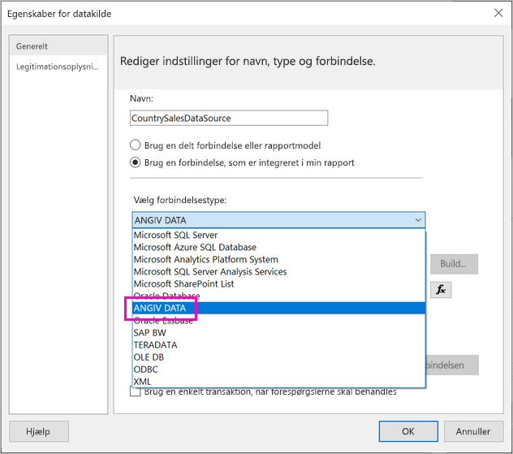
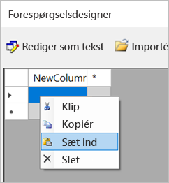
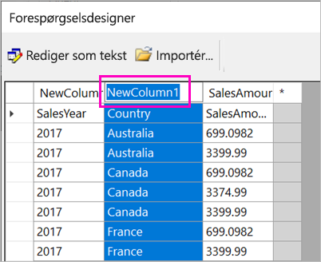
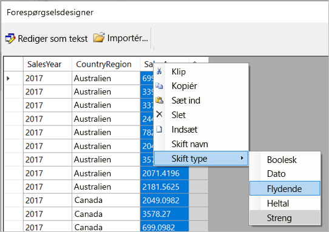
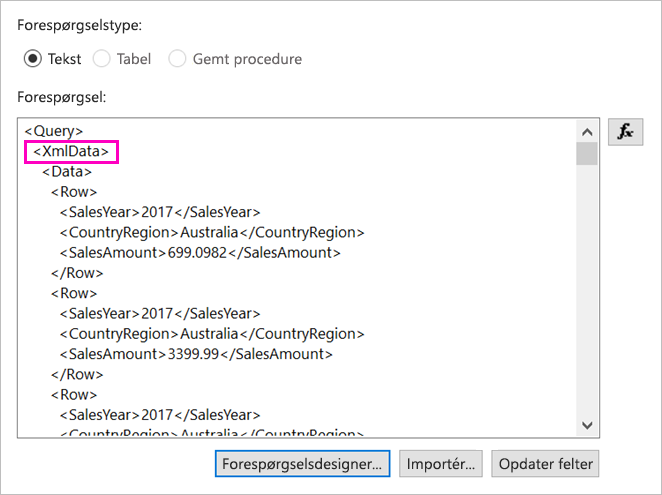
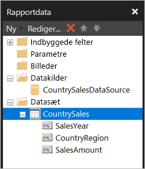

# <a name="enter-data-directly-in-a-paginated-report-in-report-builder---power-bi"></a>Angiv data direkte i en sideinddelt rapport i Report Builder – Power BI

I denne artikel kan du få mere at vide om en funktion i den nye version af SQL Server 2016 Report Builder, som gør det muligt at indtaste data direkte i en RDL-rapport som et integreret datasæt.  Denne funktion er magen til Power BI Desktop. Du kan skrive data direkte i et datasæt i din rapport eller indsætte dem vha. et andet program, f.eks. Microsoft Excel. Når du har oprettet et datasæt ved at angive data, kan du bruge det på præcis samme måde, som du ville bruge alle andre integrerede datasæt, du har oprettet. Du kan desuden tilføje mere end én tabel og bruge én som et filter for den anden. Denne funktion er især nyttig til små, statiske datasæt, som du evt. vil bruge i din rapport, f.eks. rapportparametre.
 
## <a name="prerequisites"></a>Forudsætninger

- Hvis du vil angive data direkte i en sideinddelt rapport, skal du installere den nye version af [Report Builder fra Microsoft Download Center](https://www.microsoft.com/download/details.aspx?id=53613). 
- Hvis du vil gemme din sideinddelte rapport i Power BI-tjenesten, skal du bruge en [Power BI Pro-konto](../service-self-service-signup-for-power-bi.md) og have skriveadgang til et arbejdsområde i en [Power BI Premium-kapacitet](../service-premium-what-is.md).
- Hvis du vil gemme din sideinddelte rapport på en rapportserver, skal du have tilladelse til at [redigere filen RsReportServer.config](#upload-the-paginated-report-to-a-report-server).

## <a name="get-started"></a>Kom godt i gang

Når du har downloadet og installeret Report Builder, skal du benytte samme arbejdsproces, som du bruger til at føje en integreret datakilde og et datasæt til din rapport. I følgende procedure kan du under **Datakilder** se en ny indstilling: **Angiv data**.  Du behøver kun at konfigurere denne datakilde én gang i en rapport. Derefter kan du oprette flere tabeller med angivne data som separate datasæt, der alle anvender denne enkelte datakilde.

1. I ruden **Rapportdata** skal du vælge **Nyt** > **datasæt**.

    

1. I dialogboksen **Egenskaber for datasæt** skal du vælge **Brug et datasæt, der er integreret i min rapport**.

1. Ud for **Datakilde** skal du vælge **Ny**.

    

1. I dialogboksen **Egenskaber for datakilde** skal du vælge **Brug en forbindelse, der er integreret i min rapport**.
2. I dialogboksen **Vælg forbindelsestype** skal du vælge **ANGIV DATA** > **OK**.

    

1. Tilbage i dialogboksen **Egenskaber for datasæt** skal du vælge **Forespørgselsdesigner**.
2. I ruden **Forespørgselsdesigner** skal du højreklikke og indsætte dataene i tabellen.

    

1. Hvis du vil angive kolonnenavnene, skal du dobbeltklikke på hver **NewColumn** og angive kolonnenavnet.

    

1. Hvis den første række indeholder kolonneoverskrifter fra de oprindelige data, skal du højreklikke og slette dem.
    
9. Datatypen for hver kolonne er som standard Streng. Hvis du vil ændre datatypen, skal du højreklikke på kolonneoverskriften > **Ændringstype** og angive den til en anden datatype, f.eks Dato eller Flydende.

    

1. Når du er færdig med at oprette tabellen, skal du vælge **OK**.  

    Den forespørgsel, der oprettes, er den samme, som du vil se med en XML-datakilde. Under overfladen bruger vi XML som dataprovider.  Vi har ændret den for også at muliggøre dette scenarie.

    

12. I dialogboksen **Egenskaber for datasæt** skal du vælge **OK**.

13. Du kan se din datakilde og dit datasæt i ruden **Rapportdata**.

    

Du kan bruge dit datasæt som grundlag for datavisualiseringer i din rapport. Du kan også tilføje et andet datasæt og bruge den samme datakilde til det.

## <a name="upload-the-paginated-report-to-the-power-bi-service"></a>Upload den sideinddelte rapport i Power BI-tjenesten

Nu, hvor sideinddelte rapporter understøttes i Power BI-tjenesten, kan du uploade din sideinddelte rapport til en Premium-kapacitet. Se flere detaljer under [Upload en sideinddelt rapport](paginated-reports-save-to-power-bi-service.md).

## <a name="upload-the-paginated-report-to-a-report-server"></a>Upload den sideinddelte rapport til en rapportserver

Du kan også uploade din sideinddelte rapport til en Power BI-rapportserver eller SQL Server Reporting Services 2016- eller 2017-rapportserver. Inden du gør det, skal du føje følgende element til din RsReportServer.config som en ekstra dataudvidelse. Sikkerhedskopiér din RsReportServer.config-fil, inden du foretager ændringen, i tilfælde af, at støder på problemer.

```xml
<Extension Name="ENTERDATA" Type="Microsoft.ReportingServices.DataExtensions.XmlDPConnection,Microsoft.ReportingServices.DataExtensions">
    <Configuration>
        <ConfigName>ENTERDATA</ConfigName>
    </Configuration>
</Extension>
```

Når du har redigeret den, bør listen over dataudbydere se ud som følger i config-filen:


Det var det. Du kan nu publicere rapporter, der bruger denne nye funktionalitet til rapportserveren.

## <a name="next-steps"></a>De næste trin

- [Hvad er sideinddelte rapporter i Power BI Premium?](paginated-reports-report-builder-power-bi.md)
- [Hvad er Power BI-rapportserveren?](../report-server/get-started.md)
