# Selvstudium: Opret en sideinddelt rapport, og upload den til Power BI-tjenesten

I dette selvstudium kan du oprette forbindelse til et eksempel på en Azure SQL-database. Brug derefter en guide i Power BI Report Builder til at oprette en sideinddelt rapport med en tabel, der ombrydes på flere sider. Derefter uploader du den sideinddelte rapport til et arbejdsområde i en Premium-kapacitet i Power BI-tjenesten.

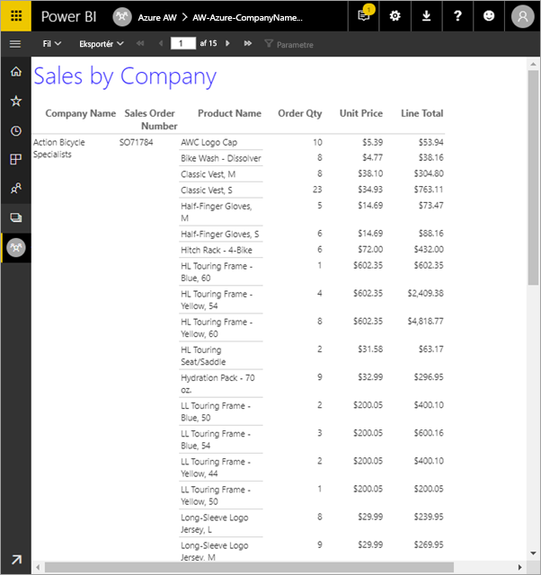

Her er de trin, du har fuldført i dette selvstudium:

> [!div class="checklist"]
> * Oprette et eksempel på en Azure-database.
> * Oprette en matrix i Power BI Report Builder ved hjælp af en guide.
> * Formatere rapporten med titel, sidetal og kolonneoverskrifter på hver side.
> * Formatere valutaen.
> * Uploade rapporten til Power BI-tjenesten.

Hvis du ikke har et Azure-abonnement, skal du oprette en [gratis konto](https://azure.microsoft.com/free/?WT.mc_id=A261C142F), før du begynder.
 
## Forudsætninger  

Her er forudsætningerne for oprettelse af den sideinddelte rapport:

- Installér [Power BI Report Builder fra Microsoft Download Center](https://go.microsoft.com/fwlink/?linkid=2086513). 

- Følg den hurtige introduktion [Opret en Azure SQL-databaseprøve på Azure-portalen](https://docs.microsoft.com/azure/sql-database/sql-database-get-started-portal). Kopiér og gem værdien i feltet **Servernavn** på fanen **Oversigt**. Husk det brugernavn og den adgangskode, du oprettede i Azure.

Her er forudsætningerne for at overføre din sideinddelte rapport til Power BI-tjenesten:

- Du skal bruge en [licens til Power BI Pro](../admin/service-admin-licensing-organization.md).
- Du skal bruge et arbejdsområde i tjenesten i en [Power BI Premium-kapacitet](../admin/service-premium-what-is.md). Den har rombeikonet  ved siden af navnet på arbejdsområdet.

## Opret matrixen ved hjælp af en guide
  
1.  Start Power BI Report Builder fra din computer.  
  
     Dialogboksen **Kom i gang** åbnes.  
  
     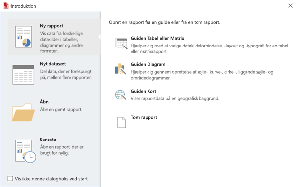
  
1.  Kontrollér, at **Ny rapport** er valgt i ruden til venstre, og vælg **Guiden Tabel eller Matrix** i ruden til højre.  
  
4.  På siden **Vælg et datasæt** skal du vælge **Opret et datasæt** > **Næste**.  

    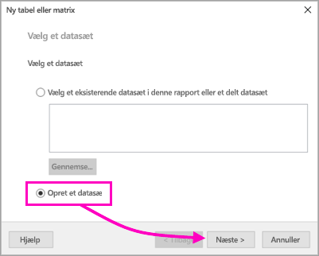
  
5.  På siden **Vælg en forbindelse til en datakilde** skal du vælge **Ny**. 

    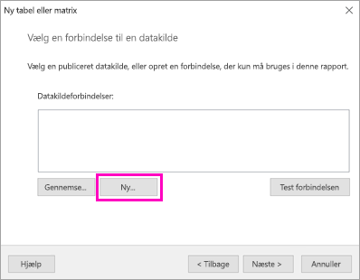
  
     Dialogboksen **Egenskaber for datakilde** åbnes.  
  
6.  Du kan navngive en datakilde, som du vil, ved hjælp af tegn og understregningstegn. I dette selvstudium skal du i feltet **Navn** skrive **MyAzureDataSource**.  
  
7.  I feltet **Vælg forbindelsestype** skal du vælge **Microsoft Azure SQL Database**.  
  
8.  Vælg **Build** ud for feltet **Forbindelsesstreng**. 

    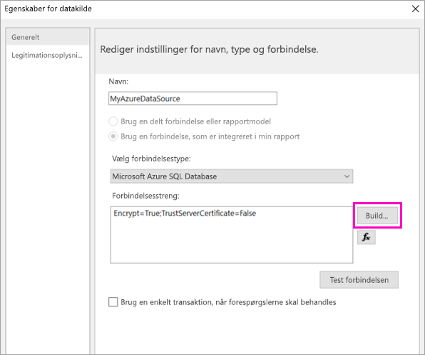

9. **I Azure:** Gå tilbage til Azure-portalen, og vælg **SQL-databaser**.

1. Vælg den Azure SQL-database, du oprettede i den hurtige introduktion "Opret en Azure SQL-databaseprøve på Azure-portalen" i afsnittet **Forudsætninger** i denne artikel.

1. På fanen **Oversigt** skal du kopiere værdien i feltet **Servernavn**.

2. **I Report Builder**: I dialogboksen **Egenskaber for forbindelse** under **Servernavn** skal du indsætte det servernavn, du kopierede. 

1. Under **Log på serveren** skal du kontrollere, at **Brug SQL Server-godkendelse** er valgt, og derefter indtaste det brugernavn og den adgangskode, du oprettede i Azure til eksempeldatabasen.

1. Under **Opret forbindelse til en database** skal du vælge rullemenupilen og vælge det databasenavn, du oprettede i Azure.
 
    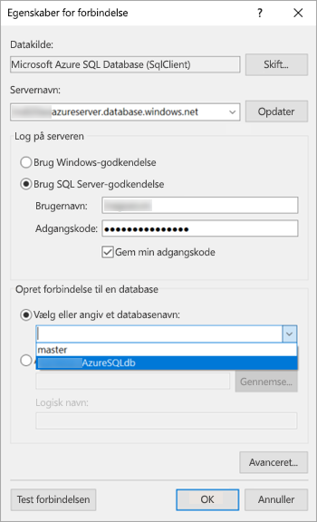

1. Vælg **Test forbindelse**. Under **Testresultater** kan du se meddelelsen **Testforbindelsen blev oprettet**.

1. Vælg **OK** > **OK**. 

   Nu viser Report Builder den forbindelsesstreng, som du lige har oprettet, i feltet **Forbindelsesstreng**. 

    

1. Vælg **OK**.
  
9. På siden **Vælg en forbindelse til en datakilde** vises "(i denne rapport)" under den datakildeforbndelse, du lige har oprettet. Vælg denne datakilde  > **Næste**.  

    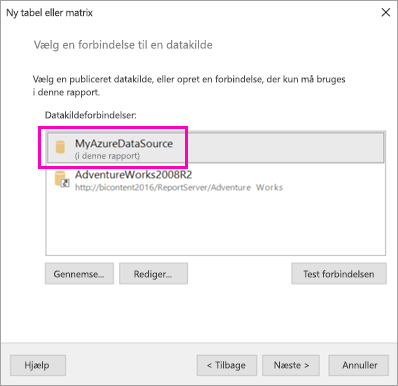

10. Indtast samme brugernavn og adgangskode i feltet. 
  
10. På siden **Design en forespørgsel** skal du udvide SalesLT, udvide Tables og derefter vælge følgende tabeller:

    - Adresse
    - Kunde
    - Produkt
    - Produktkategori
    - SalesOrderDetail
    - SalesOrderHeader

     Da **Relationer** > **Automatisk registrering** er valgt, registrerer Report Builder relationerne mellem disse tabeller. 
    
    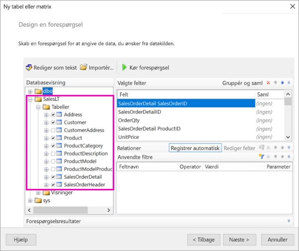
 
1.  Vælg **Kør forespørgsel**. Report Builder viser **Forespørgselsresultater**. 
 
     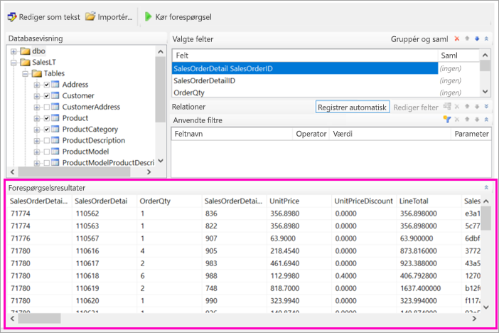

18. Vælg **Næste**. 

19. Vælg det dataset, du lige har oprettet, på siden **Vælg et datasæt** > **Næste**.

    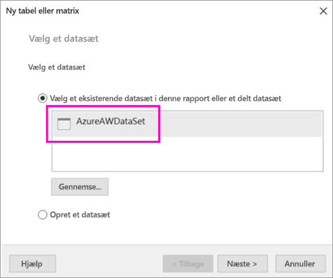

1. På siden **Arranger felter** trækker du følgende felter fra feltet **Tilgængelige felter** til feltet **Rækkegrupper**:

    - CompanyName
    - SalesOrderNumber
    - Product_Name

1. Træk følgende felter fra feltet **Tilgængelige felter** til feltet **Værdier**:

    - OrderQty
    - UnitPrice
    - Linjesum

    Report Builder oprettede automatisk summerne af felterne **Værdier**.

    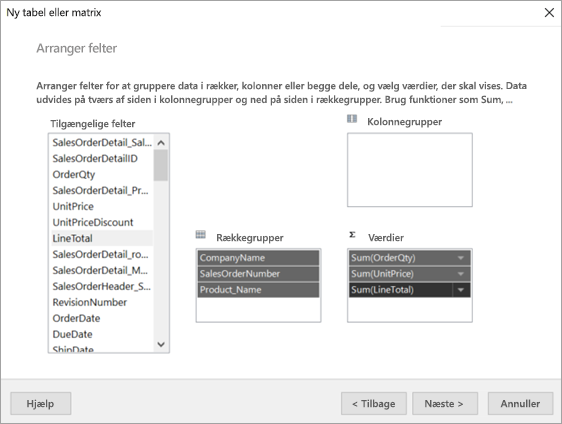

24. På siden **Vælg layout** skal du beholde alle standardindstillingerne, men rydde **Vis/skjul grupper**. Funktionen Udvid/skjul grupper er normalt fremragende, men her skal tabellen ombrydes til flere sider.

1. Vælg **Næste** > **Afslut**. Tabellen vises i designområdet.
 
## Det, du har oprettet

Lad os kigge på resultaterne af guiden et øjeblik.

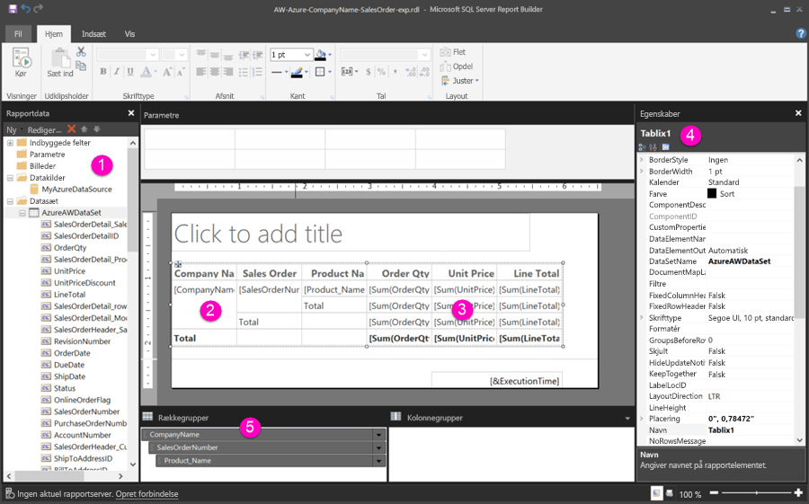

1. I rapportdataruden kan du se både den integrerede Azure-datakilde og det integrerede datasæt, der er baseret på den, som du oprettede. 

2. Designområdet er ca. 6 tommer bredt. I designområdet kan du se matrixen, der viser kolonneoverskrifterne og pladsholderværdierne. Matrixen har seks kolonner og er kun fem rækker i højden. 

3. Ordreantal, Enhedspris og Linjesum er alle beløb, og hver rækkegruppe har en subtotal. 

    Du kan stadig ikke se de faktiske dataværdier. For at se dem skal du køre rapporten.

4. Den markerede matrix i ruden Egenskaber kaldes Tablix1. En *tablix* i Report Builder er et dataområde, der viser data i rækker og kolonner. Det kan være enten en tabel eller en matrix.

5. I ruden Gruppering kan du se de tre rækkegrupper, du oprettede i guiden: 

    - Firmanavn
    - Salgsordre
    - Produktnavn

    Denne matrix har ikke nogen kolonnegrupper.

### Kør rapporten

Hvis du vil se de faktiske værdier, skal du køre rapporten.

1. Vælg **Kørsel** i værktøjslinjen **Hjem**.

   Nu kan du se værdierne. Matrixen har mange flere rækker, end du så i Designvisning! Bemærk, at Report Builder angiver, at det er side **1** af **2?** . Report Builder indlæser rapporten så hurtigt som muligt, så den henter kun data til et par sider ad gangen. Spørgsmålstegnet angiver, at Report Builder endnu ikke har indlæst alle dataene.

   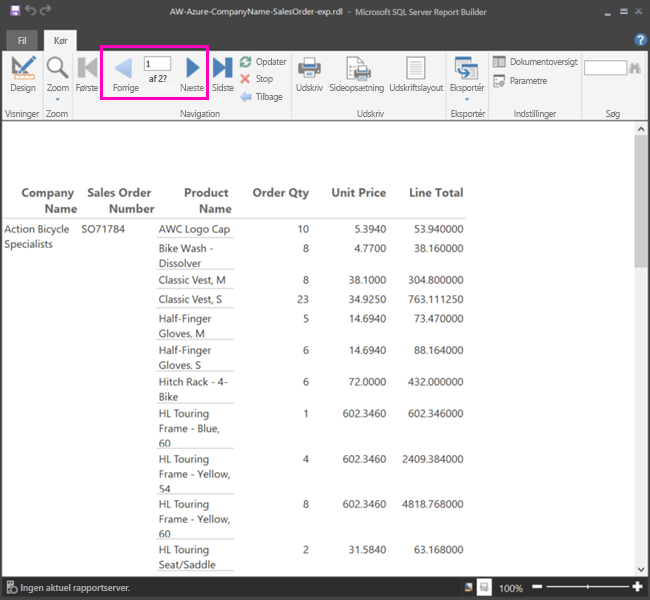

2. Vælg **Udskriftslayout**. Rapporten vil være i dette format, når du udskriver den. Report Builder ved nu, at rapporten indeholder 33 sider, og har automatisk tilføjet et dato- og tidsstempel i sidefoden.

## Formatér rapporten

Nu har du en rapport med en matrix, der ombrydes til 33 sider. Lad os tilføje nogle flere funktioner og få det til at se bedre ud. Hvis du vil se, hvordan det ser ud, kan du køre rapporten efter hvert trin.

- På fanen **Kørsel** på båndet vælger du **Design**, så du kan fortsætte med at redigere den.  

### Angiv sidebredde

Typisk er en sideinddelt rapport formateret til udskrivning, og en typisk side er på 8 1/2 x 11 tommer. 

1. Træk i linealen for at gøre designområdet 7 tommer bredt. Standardmargenerne er 1 tomme på hver side, så sidemargenerne skal være smallere.

1. Klik på det grå område omkring designområdet for at få vist egenskaberne **Rapport**.

    Hvis ruden Egenskaber ikke vises, skal du klikke på fanen **Vis** > **Egenskaber**.

2. Udvid **Margener**, og skift **Venstre** og **Højre** fra 1 til 0,75 tomme. 

    
  
### Tilføj en rapporttitel  

1. Vælg teksten **Klik for at tilføje en titel** øverst på siden, og indtast **Salg efter virksomhed**.  

2. Vælg titelteksten. Derefter skal du i ruden Egenskaber under **Skrifttype** ændre **Farve** til **Blå**.
  
### Tilføj et sidetal

Du har bemærket, at rapporten indeholder et dato- og tidsstempel i sidefoden. Du kan også tilføje et sidetal til sidefoden.

1. Nederst i designområdet står der [&ExecutionTime] til højre i sidefoden. 

2. Udvid mappen Indbyggede felter i rapportdataruden. Træk **Sidetal** til venstre side af sidefoden i samme højde som [&ExecutionTime].

3. Træk i højre side af boksen [&PageNumber] for at gøre den kvadratisk.

4. På fanen **Indsæt** skal du vælge **Tekstfelt**.

5. Klik til højre for [&PageNumber], indtast "af", og gør derefter tekstfeltet kvadratisk.

6. Træk **Samlede antal sider** til sidefoden til højre for "af", og træk derefter i dens højre side for også at gøre den kvadratisk.

    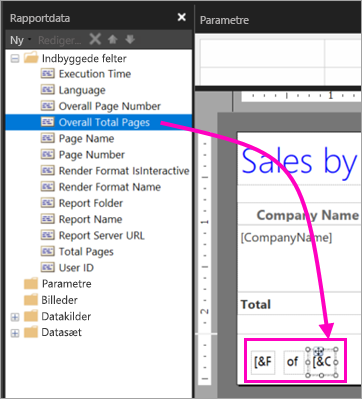

### Gør tabellen bredere  

Du kan nu gøre matrixen bred nok til at fylde hele sidebredden og gøre tekstkolonnerne bredere, så navnene ikke ruller så meget. 
 
1. Vælg matrixen, og vælg derefter kolonnen Virksomhedsnavn.

3. Peg på den grå linje øverst i matrixen på højre kant af kolonnen Virksomhedsnavn. Træk til højre, indtil kolonnen har en bredde på 1 3/8 tommer. 

    

4. Træk i højre kant af Produktnavn, indtil kolonnen ender på 3 3/4 tommer.   

Nu er matrixen næsten lige så bred som udskriftsområdet.

### Formatér valutaen

Som du måske bemærkede, da du kørte rapporten, er dollarbeløbene ikke formateret som valuta endnu.

1. Markér cellen [Sum(OrderQty)] øverst til venstre, hold Skift-tasten nede, og vælg cellen [Sum(LineTotal)] nederst til højre.

    

2. På fanen **Hjem** skal du vælge valutasymbolet dollartegn ( **$** ) og derefter vælge pilen ud for **Pladsholdertypografier** > **Eksempelværdier**.
 
    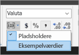

    Nu kan du se, at værdierne er formateret som valuta.

    

### Tilføj kolonneoverskrifter på hver side

Yderligere en forbedring af formateringen, inden du publicerer rapporten til Power BI-tjenesten: få vist kolonneoverskrifterne på hver side i rapporten.

1. Vælg rullelistepilen > **Avanceret tilstand** længst til højre i den øverste bjælke i ruden Gruppering.

    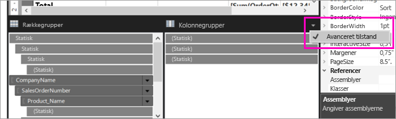

2. Vælg den øverste rude **Statisk** i **Rækkegrupper**. Du kan se, at cellen Virksomhedsnavn i matrixen er valgt.

   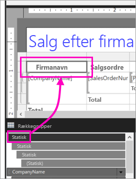

3. I ruden **Egenskaber** kan du se egenskaberne for **Tablix-medlem**. Angiv **KeepWithGroup** til **Efter** og **RepeatOnNewPage** til **Sand**.

    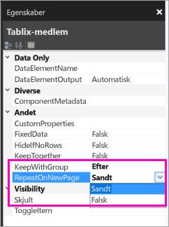

    Det er tid til at køre rapporten og se, hvordan den ser ud nu.

5. Vælg **Kørsel** på fanen **Hjem**.

6. Vælg **Udskriftslayout**, hvis det ikke allerede er valgt. Rapporten indeholder nu 29 sider. Rul gennem nogle få sider. Du kan se at valutaen er formateret, kolonnerne har overskrifter på alle sider, og rapporten har en sidefod med sidetal samt dato- og tidsstempel på alle sider.
 
    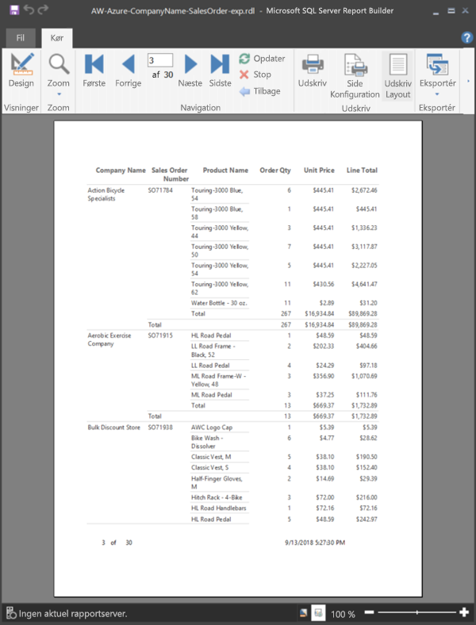

7. Gem rapporten på din computer.
 
##  Upload rapporten til tjenesten

Nu, hvor du har oprettet denne sideinddelte rapport, er det tid til at uploade den til Power BI-tjenesten.

1. Vælg **Arbejdsområder** > **Opret arbejdsområde** i navigationsruden i Power BI-tjenesten (`https://app.powerbi.com`).

2. Navngiv dit arbejdsområde **Azure AW** eller et andet entydigt navn. Du er indtil videre det eneste medlem. 

3. Vælg pilen ud for **Avanceret**, og slå **Dedikeret kapacitet** til. 

    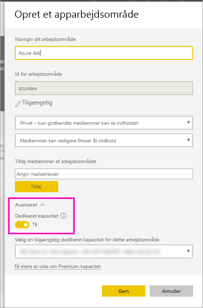

    Hvis du ikke kan slå det til, skal du bede din Power BI-administrator om at give dig tilladelse til at føje arbejdsområdet til den dedikerede Premium-kapacitet.

4. Vælg om nødvendigt en **tilgængelig dedikeret kapacitet for dette arbejdsområde** > **Gem**.
    
    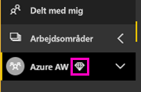

    Hvis arbejdsområdet ikke er i en Premium-kapacitet, når du forsøger at uploade rapporten, vises meddelelsen "Det var ikke muligt at overføre sideinddelt rapport." Kontakt din Power BI-administrator for at flytte arbejdsområdet.

1. Vælg **Hent data** i det nye arbejdsområde.

2. I feltet **Filer** > **Hent**.

3. Vælg **Lokal fil**, naviger til det sted, hvor du gemte filen > **Åbn**.

   Power BI importerer din fil, og du kan se den under **Rapporter** på siden med applisten.

    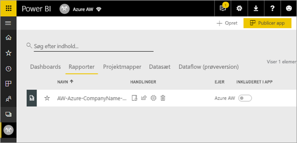

4. Vælg rapporten for at se den.

5. Hvis du får en fejl, skal du muligvis angive dine legitimationsoplysninger igen. Vælg ikonet **Administrer**.

    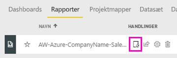

6. Vælg **Rediger legitimationsoplysninger**, og indtast de legitimationsoplysninger, du brugte i Azure, da du oprettede Azure-databasen.

    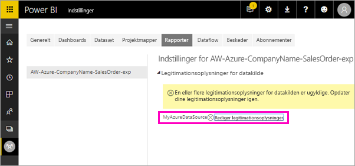

7. Nu kan du se din sideinddelte rapport i Power BI-tjenesten.

    

## Næste trin

[Hvad er sideinddelte rapporter i Power BI Premium?](paginated-reports-report-builder-power-bi.md)
