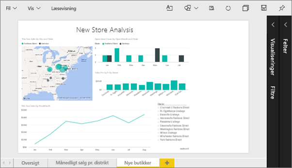
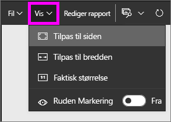
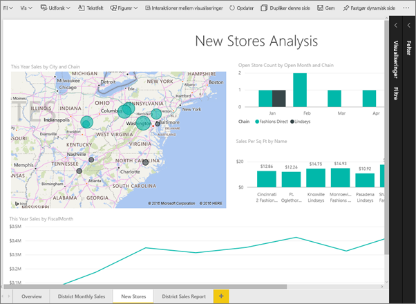
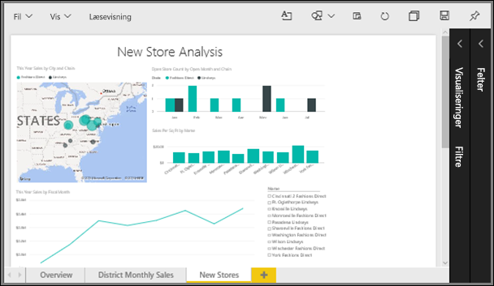
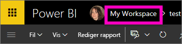
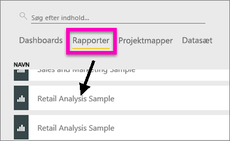
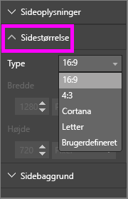
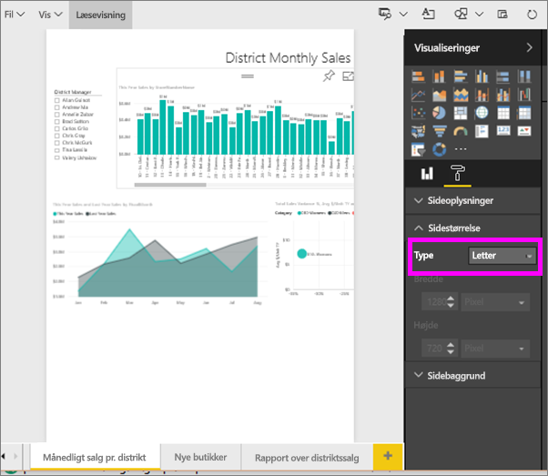
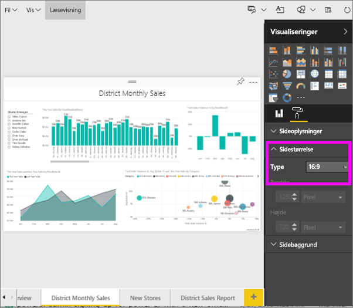
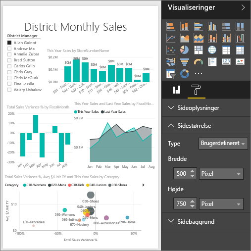

# Skift størrelsen på en rapportside (selvstudium)
I den [tidligere artikel og video](power-bi-report-display-settings.md) lærte du to forskellige måder at styre sidevisning i Power BI-rapporter: **Vis** og **Sidestørrelse**. Nu skal du prøve selv.

## Først skal vi ændre sidens Visningsindstilling
1. Åbn en rapport i Læsevisning eller Redigeringsvisning. Dette eksempel bruger siden "New Stores" fra [Eksempel med detailhandelsanalyse](sample-retail-analysis.md).  Siden vises vha. indstillingen **Tilpas til siden**.  I dette tilfælde viser Tilpas til siden rapportsiden uden rullepaneler, men nogle af oplysningerne og titlerne er for små til at læse.
   
   
2. Sørg for, at der ikke er valgt nogen visuelle effekter på lærredet. Vælg **Vis** og gennemse visningsindstillingerne.

* I Læsetilstand ser du dette.
  
     
* I Redigeringstilstand ser du dette.
  
    

1. Lad os se, hvordan siden ser ud til, vha. indstillingen **Faktisk størrelse**.
   
   
   
   Ikke fantastisk. Dashboardet har nu dobbelte rullepaneler.
2. Skift til **Tilpas til bredde**.
   
   
   
   Det ser bedre ud. Nu har vi rullepaneler, men det er nemmere at læse oplysningerne.

## Skift standardvisningen for en rapportside
Alle Power BI-rapporter har som standard visningen **Tilpas til siden**. Men hvad nu, hvis du vil have, at denne rapportside altid åbner i visningen **Faktisk størrelse**?

1. På siden **New stores** i rapporten, kan du skifte tilbage til visningen **Faktisk størrelse**.
   
   
2. Gem rapporten med et andet navn ved at vælge **Filer > Gem som**. Du har nu 2 kopier af rapporten. I den oprindelige rapport åbnes **New stores** stadig i standardvisningen, men i den nye rapport åbnes den i visningen **Faktisk størrelse**. Lad os se.
   
   
3. Vælg navnet på arbejdsområdet i den øverste navigationslinje for at vende tilbage til det arbejdsområde.  
   
   
4. Vælg fanen **Rapporter**, og vælg den nye rapport, du lige har oprettet (den har en gul stjerne).
   
    
5. Rapporten åbner i visningen **Faktisk størrelse**!
   
   

## Nu skal vi kigge nærmere på indstillingen *Sidestørrelse*
Indstillingerne for størrelse er kun tilgængelige i [Redigeringsvisning](service-interact-with-a-report-in-editing-view.md). Du skal have ejerrettigheder til rapporten for at åbne den i Redigeringsvisning. Hvis du har oprettet forbindelse til nogle af vores [eksempler](sample-datasets.md), har du ejerrettigheder til disse rapporter.

1. Åbn siden "District monthly sales" for [Eksempel på analyse af detailhandel](sample-retail-analysis.md) i Redigeringsvisning.
2. Sørg for, at der ikke er valgt nogen visuelle effekter på lærredet.  Vælg malerrulleikonet i ruden **Visuelle effekter**.
3. Vælg **Sidestørrelse** &gt; **Type** for at få vist indstillinger for sidestørrelse.
   
   
4. Vælg **Letter**.  På lærredet forbliver kun indholdet, der passer til 816 x 1056 pixel (Letter) på den hvide del af lærredet.
   
   
5. Hvis vi ændrer **Vis** til "Tilpas til bredde," viser vores lærred nu kun sideindhold, der passer til bogstavstørrelsen.
   
   
6. Vælg **Sidestørrelse** **16:9**-højde-bredde-forhold.
   
   
   
   Siden i rapporten vises med et højde-bredde-forhold på 16 bred og 9 høj. Se den faktiske pixelstørrelse, der bruges, ved at se på de gråtonede Bredde- og Højde-felter (1280 x 720). Der er meget tom plads rundt om rapportlærredet. Dette skyldes, at vi tidligere angav **Vis** til "Tilpas til bredde".
7. Fortsæt med at udforske indstillingerne **Sidestørrelse**.

## Brug siden Visning og Sidestørrelse sammen
Brug siden Visning og Sidestørrelse sammen for at oprette en rapport, der ser bedst ud, når den er integreret i et andet program.

I denne opgave skal du oprette en rapportside, der vises i et program, som har plads til 500 pixel i bredden og 750 pixel i højden.

Husk, at vi i det forrige trin så, at vores rapportside i øjeblikket vises med 1280 pixel i bredden og 720 pixel i højden. Så vi ved, at vi skal udføre meget tilpasning af størrelse og omarrangering, hvis alle vores visuelle effekter skal passe.

1. Tilpas og flyt de visuelle effekter, så de passer på mindre end halvdelen af det aktuelle lærredsområde.
   
    
2. Vælg **Sidestørrelse** &gt; **Brugerdefineret**.
3. Angiv Bredde til 500, og angiv Højde til 750.
   
    
4. Skift rapportsiden, så den ser bedst ud. Skift mellem **Vis > Faktisk størrelse** og **Vis > Tilpas til siden** for at foretage ændringer.
   
    

## Næste trin
[Opret rapporter for Cortana](service-cortana-answer-cards.md)

Tilbage til [Indstillinger for sidevisning i en Power BI-rapport](power-bi-report-display-settings.md)

Læs mere om [rapporter i Power BI](service-reports.md)

Har du flere spørgsmål? [Prøv Power BI-community'et](http://community.powerbi.com/)

