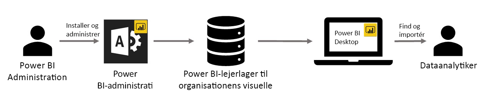

# Brug brugerdefinerede visuals til virksomheder i Power BI

Du kan bruge brugerdefinerede visualiseringer i Power BI til at oprette unikke visualiseringer, som er skræddersyet til dig eller de dataindsigter, du forsøger at gengive. Denne type brugerdefineret visualisering oprettes ofte af udviklere, og de oprettes ofte, når mængden af visualiseringer, der er inkluderet i Power BI, ikke opfylder deres behov. 

I nogle virksomheder er brugerdefinerede visualiseringer endnu vigtigere: De kan være nødvendige for at gengive bestemte data eller indsigter, der er unikke for virksomheden; de kan have særlige datakrav; eller de kan fremhæve private forretningsmetoder. Sådanne virksomheder har brug for at udvikle brugerdefinerede visualiseringer, dele dem i hele virksomheden og sikre, at de bliver vedligeholdt korrekt. Med brugerdefinerede visualiseringer i Power BI kan virksomheder gøre lige præcis det.

På følgende billede vises processen for, hvordan de brugerdefinerede visuals til virksomheden i Power BI kommer fra administratoren, fortsætter via udvikling og vedligeholdelse og ender hos dataanalytikeren.

Visualiseringer til virksomheder udrulles og administreres af Power BI-administratoren via Administrationsportalen. Når visualiseringerne er udrullet i virksomhedens lager, kan brugerne nemt finde dem og importere de brugerdefinerede visualiseringer til virksomheder i deres rapporter direkte fra Power BI Desktop.

Du kan få mere at vide om, hvordan du bruger brugerdefinerede visualiseringer til virksomheder i de rapporter, du har oprettet, i følgende artikel: [Få mere at vide om, hvordan du importerer visualiseringer til virksomheder i dine rapporter](power-bi-custom-visuals.md).

## Administrer brugerdefinerede visuals til virksomheder

Du kan få mere at vide om, hvordan du administrerer og udruller brugerdefinerede visualiseringer til virksomheder i din virksomhed i følgende artikel: [Få mere at vide om udrulning og administration af brugerdefinerede visualiseringer til virksomheder](https://go.microsoft.com/fwlink/?linkid=866790).

> [!WARNING]
> En brugerdefineret visualisering kan indeholde kode, der kan udgøre en risiko for sikkerheden eller beskyttelse af personlige oplysninger. Sørg for, at du har tillid til forfatteren af og kilden til en brugerdefineret visualisering, før du udruller den i virksomhedens lager.

## Overvejelser og begrænsninger

Der er adskillige overvejelser og begrænsninger, som du skal være opmærksom på.

Administrator:

* Ældre brugerdefinerede visualiseringer (f.eks. brugerdefinerede visualiseringer, som ikke er bygget oven på de nye versionerede API'er) understøttes ikke.

* Hvis en brugerdefineret visualisering slettes fra lageret, gengives alle eksisterende rapporter, som bruger den slettede visualisering, ikke. Du kan ikke fortryde en sletning. Brug funktionen "Deaktiver" til at deaktivere en brugerdefineret visualisering midlertidigt.

Slutbruger:

* Brugerdefinerede visuals er private visuals, der er importeret fra virksomhedens lager. På samme måde som andre private visuals kan de ikke [eksporteres til PowerPoint](https://docs.microsoft.com/power-bi/consumer/end-user-powerpoint) eller vises i mails, der modtages, når en bruger [abonnerer på rapportsider](https://docs.microsoft.com/power-bi/consumer/end-user-subscribe). Det er kun [certificerede brugerdefinerede visuals](https://docs.microsoft.com/power-bi/power-bi-custom-visuals-certified), der er importeret direkte fra markedspladsen, som understøtter disse funktioner.

* Visio-visuals, PowerApps-visuals, Map Box-visuals og GlobeMap-visuals fra AppSource-markedspladsen gengives ikke, hvis de udrulles via virksomhedens lager.

Du kan finde flere oplysninger og få svar på spørgsmål ved at gå til [ofte stillede spørgsmål](power-bi-custom-visuals-faq.md#organizational-custom-visuals).