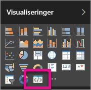

# Foretag fejlfinding af visualiseringer i Power BI

## Fejlfinding

**Pbivi-kommando blev ikke fundet (eller tilsvarende fejl)**

Når du kører `pbiviz` i terminalens kommandolinje, bør du få vist hjælpeskærmen. Hvis det ikke er tilfældet, er den ikke installeret korrekt. Sørg for, at du har mindst 4.0-versionen af NodeJS installeret.

**Hvis du ikke kan finde visualiseringen til fejlfinding på fanen Visualiseringer**

Visualiseringen for fejlfinding ligner et prompt-ikon på fanen **Visualiseringer**.

Hvis du ikke kan se det, skal du sørge for, at det er aktiveret i Power BI-indstillingerne.

> [!NOTE]
> Visualiseringen for fejlfinding findes kun i Power BI-tjenesten og ikke i Power BI Desktop eller mobilappen. Den pakkede visualisering fungerer stadig overalt.

**Det var ikke muligt at kontakte serveren med din visualisering**

Kør visualiseringsserveren med kommandoen `pbiviz start` i terminalens kommandoline fra roden afvisualiseringsprojektet. Hvis serveren ikke kører, er det sandsynligt, at SSL-certifikaterne ikke er installeret korrekt.

Du er meget velkommen til at kontakte supportteamet til Power BI-visualiseringer: *pbicvsupport@microsoft.com*  , hvis du har spørgsmål, kommentarer eller problemer.

## Næste trin

Du kan finde flere oplysninger under [Ofte stillede spørgsmål om Power BI-visualiseringer](power-bi-custom-visuals-faq.md#organizational-visuals).