# Brugerdefinerede visualiseringer i Power BI

Når du opretter eller redigerer en Power BI-rapport, er der mange forskellige tilgængelige visualiseringstyper, du kan bruge. Disse visualiseringer vises i ruden **Visualiseringer**. Når du downloader Power BI Desktop eller åbner Power BI-tjenesten (app.powerbi.com), får du dette sæt "forudpakkede" visualiseringer med.

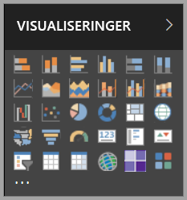

Du er dog ikke begrænset til dette sæt visualiseringer. Når du vælger ellipsen, åbnes en anden kilde af rapportvisualiseringer: *brugerdefinerede visualiseringer*.

Brugerdefinerede visualiseringer oprettes af udviklere ved hjælp af SDK'et til brugerdefinerede visualiseringer, så virksomhedsbrugere kan se deres data på en måde, som passer bedst til virksomheden. Forfattere af rapporter kan derefter importere de brugerdefinerede visualiseringsfiler til deres rapporter og bruge dem som en hvilken som helst anden Power BI-visualisering. Brugerdefinerede visualiseringer er førsteklasses komponenter i Power BI, og de kan filtreres, fremhæves, redigeres, deles osv.

Brugerdefinerede visualiseringer findes i tre udrulningskanaler:
* Brugerdefinerede visualiseringsfiler
* Visualiseringer til virksomheder
* Visualiseringer på markedspladser

## Brugerdefinerede visualiseringsfiler

Brugerdefinerede visualiseringer er pakker, der indeholder kode til at gengive de data, de fodres med. Alle kan oprette en brugerdefineret visualisering og pakke den som en enkelt `.pbiviz`-fil, som kan importeres i en Power BI-rapport.

> [!WARNING]
> En brugerdefineret visualisering kan indeholde kode, der udgør en risiko for sikkerheden eller personlige oplysninger. Sørg for at have tillid til forfatteren af og kilden til den brugerdefinerede visualisering, før du importerer den i din rapport.

## Organisationens visuelle elementer

Power BI-administratorer kan udrulle brugerdefinerede visualiseringer i deres virksomheder, så forfattere af rapporter nemt kan finde og bruge den brugerdefinerede visualisering, som administratoren har godkendt til brug i virksomheden. Dette giver administratoren mulighed for at vælge, hvilke specifikke brugerdefinerede visualiseringer der kan udrulles i virksomheden, og giver dem en nem måde at administrere (dvs. opdatere version, deaktivere/aktivere) disse visualiseringer på. For forfatteren af rapporten er dette en nem måde at finde virksomhedsspecifikke visualiseringer på, og det er også en problemfri måde at opdatere disse visualiseringer på.

Hvis du vil have flere oplysninger om brugerdefinerede visualiseringer til virksomheder, kan du [læse mere om visualiseringer til virksomheder](power-bi-custom-visuals-organization.md).

## Visualiseringer på markedspladser

Medlemmer af community'et og Microsoft har bidraget med deres brugerdefinerede visualiseringer til offentlig brug og udgivet dem på [AppSource](https://appsource.microsoft.com/en-us/marketplace/apps?product=power-bi-visuals)-markedspladsen. Disse visualiseringer kan downloades og føjes til Power BI-rapporter. Alle disse brugerdefinerede visualiseringer er blevet testet og godkendt af Microsoft ift. funktionalitet og kvalitet.

Hvad er AppSource? Helt enkelt er det det sted, hvor du finder apps, tilføjelsesprogrammer og udvidelser til din Microsoft-software. [AppSource](https://appsource.microsoft.com/en-us/) forbinder millioner af brugere af produkter som Office 365, Azure, Dynamics 365, Cortana og Power BI med løsninger, der kan hjælpe dem med at arbejde mere effektivt, med større indsigt eller smukkere end før.

### Certificerede visualiseringer

Certificerede Power BI-visualiseringer er visualiseringer på markedspladser, der har bestået yderligere strenge test ift. kvalitet, og understøttes i yderligere scenarier, f.eks. [mailabonnementer](https://docs.microsoft.com/power-bi/service-report-subscribe) og [eksport til PowerPoint](https://docs.microsoft.com/power-bi/service-publish-to-powerpoint).
Hvis du vil have vist en liste over certificerede brugerdefinerede visualiseringer eller indsende dine egne, skal du se under [Certificerede brugerdefinerede visualiseringer](https://docs.microsoft.com/power-bi/power-bi-custom-visuals-certified).

Er du webudvikler og interesseret i at oprette dine egne visualiseringer og føje dem til AppSource? Se under [Introduktion til Udviklerværktøj](https://docs.microsoft.com/power-bi/service-custom-visuals-getting-started-with-developer-tools), og få mere at vide om, hvordan du [publicerer brugerdefinerede visualiseringer på AppSource](https://appsource.microsoft.com/en-us/marketplace/apps?product=power-bi-visuals).

### Importér en brugerdefineret visualisering fra en fil

1. Vælg ellipsen i bunden af ruden Visualiseringer.

    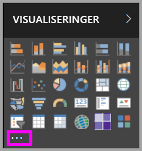

2. Vælg **Importér fra fil** på rullelisten.

    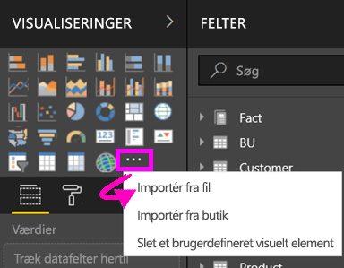

3. Vælg den `.pbiviz`-fil, du vil importere, i menuen Åbn fil, og vælg Åbn. Ikonet for den brugerdefinerede visualisering tilføjes nederst i ruden Visualiseringer og kan nu bruges i din rapport.

    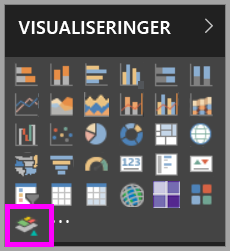

### Importér visualiseringer til virksomheder

1. Vælg ellipsen i bunden af ruden Visualiseringer.

    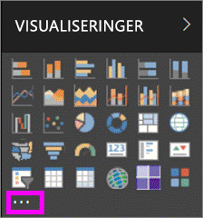

2. Vælg Importér fra markedsplads på rullelisten.

    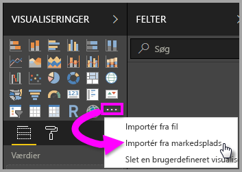

3. Vælg **MIN ORGANISATION** i øverste fanemenu.

    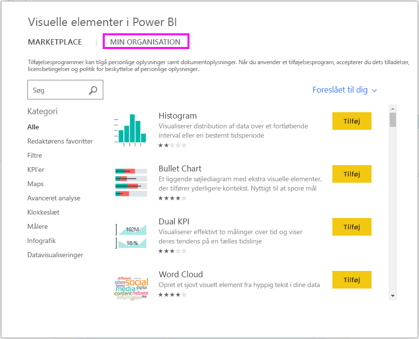

4. Rul gennem listen for at finde den visualisering, du vil importere.
    
    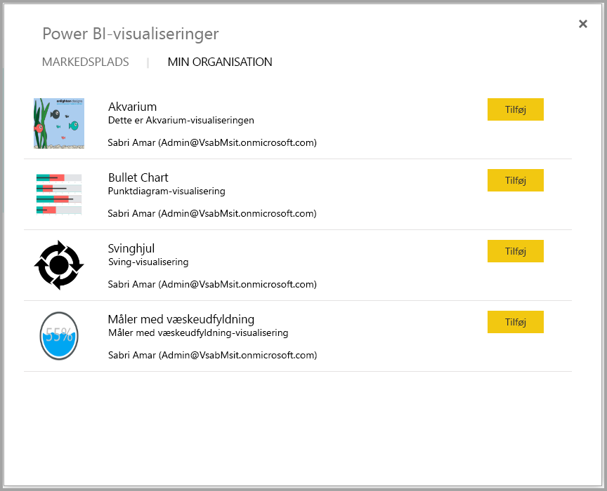

5. Importér visualiseringen ved at vælge **Tilføj**. Ikonet for den brugerdefinerede visualisering tilføjes nederst i ruden Visualiseringer og kan nu bruges i din rapport.

    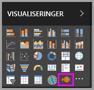

## Download eller importér brugerdefinerede visualiseringer fra Microsoft AppSource

Du har to valgmuligheder for download og import af brugerdefinerede visualiseringer – fra Power BI og fra AppSource-webstedet.

### Importér brugerdefinerede visualiseringer fra Power BI

1. Vælg ellipsen i bunden af ruden Visualiseringer.

    

2. Vælg **Importér fra markedsplads** på rullelisten.

    

3. Rul gennem listen for at finde den visualisering, du vil importere.

    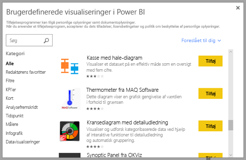

4. Du kan få mere at vide om en af visualiseringerne, hvis du fremhæver og vælger den.

    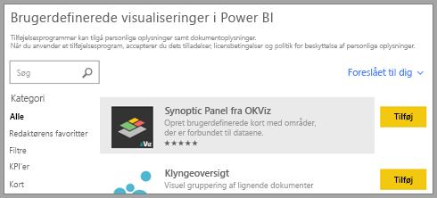

5. På siden med detaljer kan du få vist skærmbilleder, videoer, detaljeret beskrivelser med mere.

    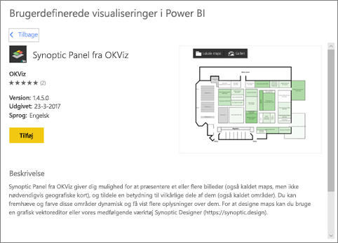

6. Rul ned til bunden for at se anmeldelser.

    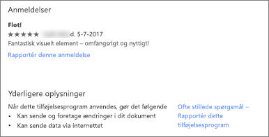

7. Importér den brugerdefinerede visualisering ved at vælge Tilføj. Ikonet for den brugerdefinerede visualisering tilføjes nederst i ruden Visualiseringer og kan nu bruges i din rapport.

    

### Download og importér brugerdefinerede visualiseringer fra Microsoft AppSource

1. Start med [Microsoft AppSource](https://appsource.microsoft.com), og vælg fanen for **Apps**. 

    

2. Dette fører dig til [siden med appresultater](https://appsource.microsoft.com/en-us/marketplace/apps), hvor du kan få vist de mest populære apps i hver kategori, herunder *Power BI-apps*. Men vi leder efter brugerdefinerede visualiseringer, så lad os indskrænke resultaterne ved at vælge **Power BI-visualiseringer** på listen i navigationsruden til venstre.

    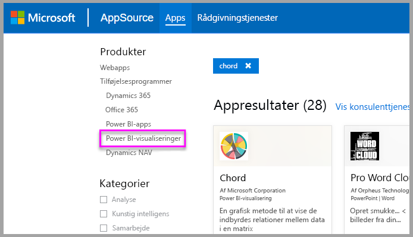

3. AppSource viser et felt for hver brugerdefinerede visualisering.  Hvert felt har et snapshot af den brugerdefinerede visualisering og indeholder en kort beskrivelse og et downloadlink. Vælg feltet for at få vist flere detaljer.

    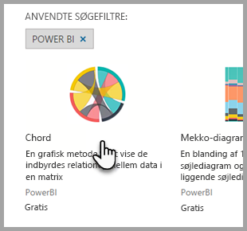

4. På siden med oplysninger kan du se skærmbilleder, videoer, en detaljeret beskrivelse med mere. Download den brugerdefinerede visualisering ved at vælge **Hent nu** og derefter acceptere Vilkår for anvendelse.

    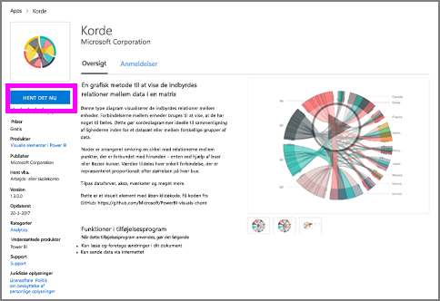

5. Vælg linket for at downloade den brugerdefinerede visualisering.

    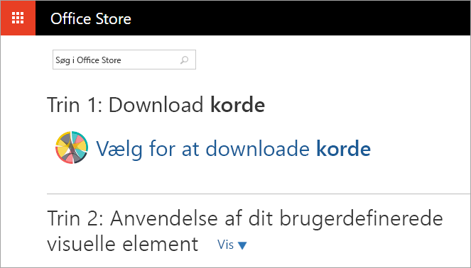

    Downloadsiden indeholder også instruktioner til, hvordan du importerer den brugerdefinerede visualisering i Power BI Desktop og Power BI-tjenesten.

    Du kan også downloade et eksempel på en rapport, der indeholder den brugerdefinerede visual og viser dets egenskaber.

    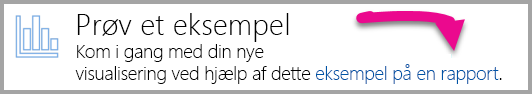

6. Gem '.pbiviz'-filen, og åbn derefter Power BI.

7. Importér '.pbiviz'-filen i rapporten (se afsnittet [Importér en brugerdefineret visualisering fra en fil](#import-a-custom-visuals-from-a-file) ovenfor)

## Overvejelser og fejlfinding

- En brugerdefineret visualisering føjes til en bestemt rapport, når den importeres. Hvis du vil bruge visualiseringen i en anden rapport, skal du også importere den i denne rapport. Når du gemmer en rapport med en brugerdefineret visualisering vha. indstillingen **Gem som**, gemmes der en kopi af den brugerdefinerede visualisering sammen med den nye rapport.

- Hvis du ikke kan se ruden **Visualiseringer**, betyder det, at du ikke har redigeringstilladelser til rapporten.  Du kan kun tilføje brugerdefinerede visualiseringer til rapporter, som du kan redigere, og ikke til rapporter, der er blevet delt med dig.

Har du flere spørgsmål? [Prøv at spørge Power BI-community'et](http://community.powerbi.com/)
