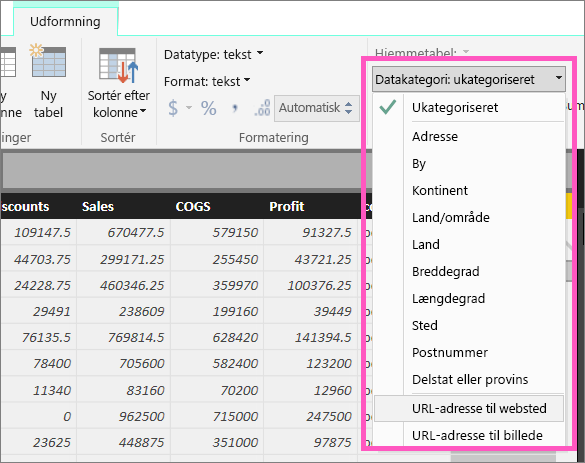
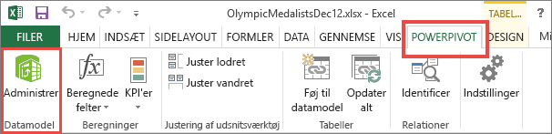

# Føj links (URL-adresser) til en tabel
I dette emne lærer du, hvordan du føjer links (URL-adresser) til en tabel. Du kan bruge Power BI Desktop til at føje links (URL-adresser) til en tabel eller matrix. Derefter kan du bruge enten Power BI Desktop eller Power BI-tjenesten til at føje disse links til tabeller og matrixer i din rapport. 

> [!NOTE]
> Du kan oprette links i [felter på dashboards](service-dashboard-edit-tile.md) og [tekstfelter på dashboards](service-dashboard-add-widget.md) på farten i Power BI-tjenesten. Du kan oprette links i [tekstfelter i rapporter](service-add-hyperlink-to-text-box.md) på farten i Power BI-tjenesten og Power BI Desktop.
> 

## Sådan opretter du et link i en tabel eller en matrix ved hjælp af Power BI Desktop
Du kan oprette links i tabeller og matricer i Power BI Desktop, men ikke i Power BI-tjenesten. Du kan også oprette links i Excel Power Pivot, før projektmappen importeres i Power BI. Begge metoder er beskrevet nedenfor.

## Opret et tabel- eller matrixlink i Power BI Desktop
Proceduren for at tilføje et link afhænger af, om du har importeret dataene eller har oprettet forbindelse til dem ved hjælp af DirectQuery. Begge scenarier er beskrevet nedenfor.

### For data, der er importeret til Power BI
1. Hvis linket ikke allerede findes som et felt i dit datasæt, kan du bruge Power BI Desktop til at tilføje det som en [brugerdefineret kolonne](desktop-common-query-tasks.md).
2. I datavisningen skal du vælge kolonnen, og på fanen **Udformning** skal du vælge rullelisten for **Datakategori**.
   
    
3. Vælg **Web URL**.
4. Skift til rapportvisningen, og opret en tabel eller en matrix ved hjælp af det felt, der er kategoriseret som en Webadresse (Web URL). Links bliver blå og understreget.

    

    > [!NOTE]
    > URL-adresserne skal starte med **http:// , https://** eller **www**.
    >
   
1. Hvis du ikke vil vise en lang URL-adresse i en tabel, kan du vise et hyperlinkikon   i stedet. Bemærk, at du ikke kan vise ikoner i matricer.
   
    Markér diagrammet for at aktivere det.

    Vælg ikonet Formatér  for at åbne fanen Formatér.

    Udvid **Værdier**, find **URL-ikonet**, og slå indstillingen **til.**

    

1. (Valgfrit) [Publicer rapporten fra Power BI Desktop til Power BI-tjenesten](guided-learning/publishingandsharing.yml?tutorial-step=2), og åbn rapporten i Power BI-tjenesten. Linkene fungerer også der.

### For data, der oprettes forbindelse til via DirectQuery
Du kan ikke oprette en ny kolonne i DirectQuery-tilstand.  Men hvis dine data allerede indeholder URL-adresser, kan du lave dem til links.

1. I rapportvisningen skal du oprette en tabel med et felt, der indeholder URL-adresser.
2. Vælg kolonnen, og på fanen **Udformning** skal du vælge rullelisten for **Datakategori**.
3. Vælg **Web URL**. Links bliver blå og understreget.
4. (Valgfrit) [Publicer rapporten fra Power BI Desktop til Power BI-tjenesten](guided-learning/publishingandsharing.yml?tutorial-step=2), og åbn rapporten i Power BI-tjenesten. Linkene fungerer også der.

## Opret et tabel- eller matrixlink i Excel Power Pivot
En anden metode til at tilføje links i dine Power BI-tabeller og -matricer er at oprette links i datasættet, før du importerer/opretter forbindelse til datasættet fra Power BI. I dette eksempel bruges der en Excel-projektmappe.

1. Åbn projektmappen i Excel.
2. Vælg fanen **PowerPivot**, og vælg derefter **Administrer**.
   
   
1. Når PowerPivot åbnes, skal du vælge fanen **Avanceret**.
   
   
4. Placer markøren i den kolonne, der indeholder de URL-adresser, du vil lave til links i Power BI-tabellerne.
   
   > [!NOTE]
   > URL-adresserne skal starte med **http:// , https://** eller **www**.
   > 
5. I gruppen **Egenskaber for rapportering** skal du vælge rullemenuen **Datakategori** og vælge **Web URL / Webadresse**. 
   
   

6. Opret forbindelse til eller importér denne projektmappe fra Power BI-tjenesten eller Power BI Desktop.
7. Opret en tabelvisualisering, der indeholder URL-feltet.
   
   

## Overvejelser og fejlfinding
Spørgsmål: Kan jeg bruge en brugerdefineret URL-adresse som et hyperlink i en tabel eller en matrix?    
Svar: Nej. Du kan bruge et linkikon. Hvis du har brug for brugerdefineret tekst til dine hyperlinks, og din liste over URL-adresser er kort, bør du overveje at bruge et tekstfelt i stedet for.

## Næste trin
[Visualiseringer i Power BI-rapporter](visuals/power-bi-report-visualizations.md)

[Grundlæggende begreber for designere i Power BI-tjenesten](service-basic-concepts.md)

Har du flere spørgsmål? [Prøv at spørge Power BI-community'et](http://community.powerbi.com/)

