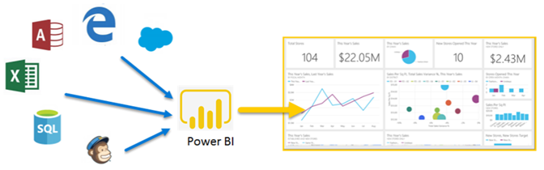
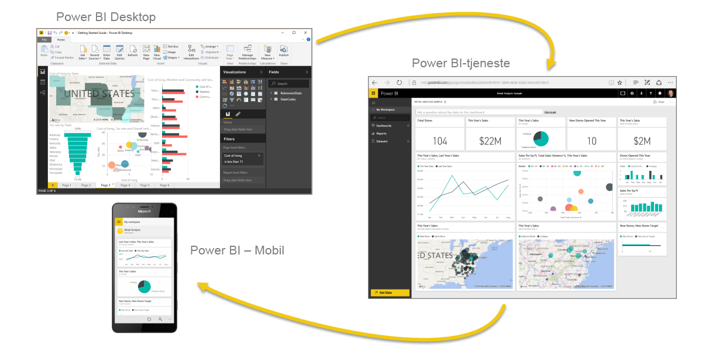
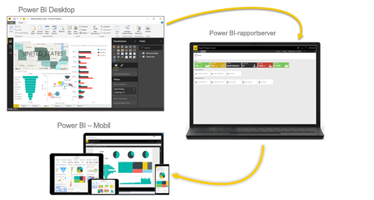

# Hvad er Power BI?
**Power BI** er en samling af softwaretjenester, apps og forbindelser, der arbejder sammen for at forvandle usammenhængende data til faste, visuelt fordybende og interaktive indsigter. Dine data kan være et Excel-regneark eller en samling cloudbaserede hybride data warehouses og hybride data warehouses i det lokale miljø. Powerbi kan du nemt oprette forbindelse til dine datakilder, visualisere og se, hvad der er vigtigt og dele indholdet med alle ønskede.

Powerbi kan være en enkel og hurtig, stand til at oprette hurtige Indsigter fra et Excel-regneark eller en lokal database. Men Power BI er også robust og professionel, klar til omfattende udformning og realtidsanalyser samt tilpasset opbygning. Det kan være din personligt rapporterings- og visualiseringsværktøj, og du kan også fungere som et analyser og beslutningstagning til gruppeprojekter, divisioner eller hele selskaber.

## Delene i Power BI
Powerbi består af: 
- Et desktopprogram i Windows kaldet **Power BI Desktop**
- En online SaaS (*Software som en Service*) tjenesten, kaldes den **Power BI-tjenesten** 
- Power BI **mobilapps** til Windows, iOS og Android-enheder

Disse tre elementer&mdash;Power BI Desktop, tjenesten og mobilapperne&mdash;er designet til at give adgang til at oprette, dele og forbruge forretningsindsigter på den måde, der leverer, eller rolle mest effektivt.

Med det fjerde element **Power BI-rapportserver** kan du publicere Power BI-rapporter til en server i det lokale miljø, når du har oprettet dem i Power BI Desktop. Læs mere om [Power BI-rapportserver](#on-premises-reporting-with-power-bi-report-server).

## Sådan passer Power BI til din rolle
Din brug af Power BI kan afhænge af din rolle i et projekt eller på et team. Andre, kan andre bruge Power BI på en anden måde.

Du bruger f.eks. primært **Power BI-tjenesten**. Men en talfokuseret kollega med ansvar for oprettelse af forretningsrapporter bruger måske overvejende **Power BI Desktop** til oprettelse af rapporter og udgiver derefter de pågældende rapporter til Power BI-tjenesten, hvor du derefter kan se dem. En anden kollega arbejder måske med salg, hovedsageligt bruger deres **Power BI-telefonappen** at holde styr på deres salgskvoter og at analysere nye salgsemners oplysninger.

Hvis du er udvikler, bruger du måske Power BI-API'er til at pushe data til datasæt eller til at integrere dashboards og rapporter i dine egne brugerdefinerede programmer. Har du en ide til et nyt visuelt element? Skab det selv, og del det med andre.  

Du kan også bruge hvert element i Power BI på forskellige tidspunkter, afhængigt af hvad du gerne vil opnå eller din rolle for et givent projekt.

Den måde, du bruger Power BI på, kan være baseret på, hvilken funktion eller tjeneste i Power BI der er det bedste værktøj i din situation. F.eks, du kan bruge Power BI Desktop til at oprette rapporter til dit eget team statistikker over kundeengagement, og du kan få vist lager- og produktionsgangen i et realtidsdashboard i Power BI-tjenesten. Alle dele af Power BI er tilgængelige for dig, og derfor er det fleksibelt og overbevisende.

Udforsk dokumenter, der er relevante for din rolle:
- Power BI for [***designere***](desktop-what-is-desktop.md)
- Power BI for [***forbrugere***](consumer/end-user-consumer.md)
- Power BI for [***udviklere***](developer/what-can-you-do.md)
- Power BI for [***administratorer***](service-admin-administering-power-bi-in-your-organization.md)

## Arbejdsgangen i Power BI
En almindelige arbejdsflow i Power BI starter med at oprette forbindelse til datakilder og oprette en rapport i Power BI Desktop. Du kan derefter udgive rapporten fra Power BI Desktop til Power BI-tjenesten, og del den, så slutbrugere i Power BI-tjenesten og mobile enheder kan få vist og interagere med rapporten.
Denne arbejdsproces er almindelig og viser, hvordan de tre hovedelementer i Power BI komplementerer hinanden.

Her er en detaljeret [sammenligning af Power BI Desktop og Power BI-tjenesten](service-service-vs-desktop.md).

Men hvad hvis du ikke er klar til at flytte til clouden og vil beholde dine rapporter bag en firmafirewall?  Læs videre.

## Rapportering i det lokale miljø med Power BI-rapportserveren
Opret, Udrul og administrer Power BI mobile og sideinddelte rapporter i det lokale miljø med udvalget af klar til brug værktøjer og tjenester, leverer Power BI Report Server.

Power BI-rapportserveren er en løsning, som du udruller bag firewallen, og som derefter leverer dine rapporter til de rette brugere på forskellige måder, uanset om de skal vises i en webbrowser, på en mobilenhed eller som en mail. Og da Power BI-rapportserveren er kompatibel med Power BI i clouden, kan du flytte til clouden, når du er klar. 

Læs mere om [Power BI-rapportserver](report-server/get-started.md).

## Næste trin
- [Hurtig introduktion: Få mere at navigere rundt i Power BI-tjenesten](service-the-new-power-bi-experience.md)   
- [Selvstudium: Kom i gang med Power BI-tjenesten](service-get-started.md)
- [Hurtig introduktion: Opret forbindelse til data i Power BI Desktop](desktop-quickstart-connect-to-data.md)
