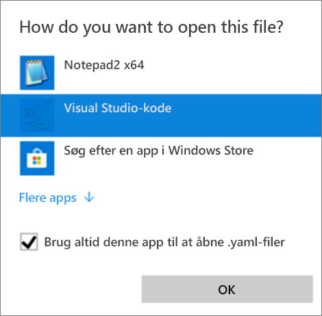
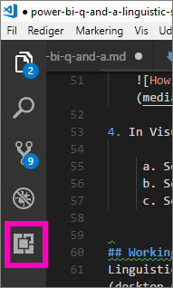
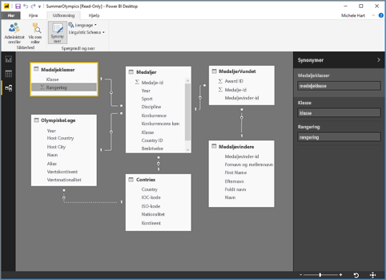
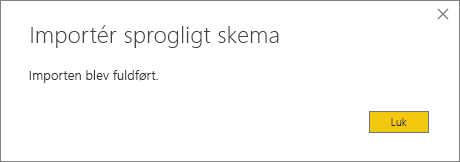

# <a name="edit-qa-linguistic-schema-and-add-phrasings-in-power-bi-desktop"></a>Rediger sprogligt skema for Spørgsmål og svar, og tilføj udtryk i Power BI Desktop 
Det er effektivt, når du bruger almindelige udtryk og naturligt sprog til dataforespørgsler. Det er endnu mere effektiv, når dataene svarer, hvilket er, hvad der sker i Spørgsmål og svar i Power BI. Når du stiller et spørgsmål i Spørgsmål og svar i Power BI, forsøger den så vidt muligt at finde det rette svar. 

Men for at opnå endnu bedre interaktioner med Spørgsmål og svar, kan svarene altid forbedres på flere måder – du kan f.eks. redigere det sproglige skema. 

Det hele starter med dine virksomhedsdata.  Jo bedre datamodellen er, jo nemmere er det for brugere at få gode svar. Du kan f.eks. forbedre modellen ved at tilføje et sprogligt skema, der definerer og kategoriserer terminologi og relationer mellem tabel- og kolonnenavne i dit datasæt. Power BI Desktop er det sted, hvor du administrerer dine sproglige skemaer. 

## <a name="what-is-a-linguistic-schema"></a>Hvad er et sprogligt skema
Et sprogligt skema beskriver begreber og udtryk, som Spørgsmål og svar forstår, for objekter i et datasæt, herunder talemåder, synonymer og udtryk, der er relateret til det pågældende datasæt. Når du importerer eller opretter forbindelse til et datasæt, opretter Power BI et sprogligt skema ud fra strukturen af datasættet. Når du stiller et spørgsmål i Spørgsmål og svar, søges der efter resultater og relationer i dataene for at finde hensigten med dit spørgsmål. Der søges f.eks. efter navneord, verber, adjektiver, udtryk og andre elementer. Og der søges efter relationer, f.eks. hvilke kolonner der er objekter for et verbum. 

Du kender sikkert talemåder (hvis ikke, kan du se nedenfor), men udtryk er måske et nyt begreb for dig.  Et udtryk er den måde, du taler om (eller "udtrykker") relationerne mellem ting. Hvis du vil beskrive relationen mellem kunder og produkter, kan du f.eks. sige "kunder køber produkter". Eller du kan beskrive relationen mellem kunder og alder ved at sige "alder angiver, hvor gamle kunder er". Eller du kan beskrive relationen mellem kunder og telefonnumre ved bare at sige "kunder har telefonnumre".

Disse udtryk findes i mange former og størrelser. Nogle svarer direkte til relationer i datamodellen. Nogle er relateret til kolonner med de tabeller, der indeholder dem. Andre relaterer flere tabeller og kolonner sammen i komplekse relationer. Under alle omstændigheder beskriver de, hvordan ting er relateret til hinanden, i almindelige vendinger.

Sproglige skemaer gemmes i YAML-format. Dette format er relateret til det populære JSON-format, men giver en mere fleksibel og læsevenlig syntaks. Sproglige skemaer kan redigeres, eksporteres og importeres til Power BI Desktop.

## <a name="prerequisites"></a>Forudsætninger
- Hvis du ikke allerede har læst artiklen om, [hvordan du forbedrer din datamodel for Spørgsmål og svar](desktop-qna-in-reports.md), er det måske en god ide at læse den først. Den indeholder flere tip til, hvordan du designer og forbedrer din datamodel, og et vigtigt afsnit om tilføjelse af synonymer.  

- Udarbejdelse af Spørgsmål og svar består af to dele.  For det første er der forberedelsen, eller "udformningen".  For det andet skal der stilles spørgsmål, og dataene skal udforskes, eller "forbruges". I nogle firmaer kan medarbejdere, der kaldes dataudviklere eller it-administratorer, være dem, der samler datasættene, opretter datamodellerne og publicerer datasættene i Power BI.  Samtidig kan en anden gruppe medarbejdere være dem, der "forbruger" dataene online.  I andre firmaer kan disse roller være kombineret. 

    Dette emne henvender sig til dataudviklere. De medarbejdere, der tager et datasæt og optimerer det, så det giver de bedst mulige resultater for Spørgsmål og svar. 

- [.yaml- og .pbix-eksempelfiler](https://go.microsoft.com/fwlink/?linkid=871858)    
- Den YAML-fileditor, vi anbefaler, er [Visual Studio Code](https://code.visualstudio.com/)


### <a name="set-up-an-editor-for-yaml-files"></a>Konfigurer en editor til YAML-filer
Det anbefales, at du bruger Visual Studio Code til at redigere YAML-filer med sproglige skemaer. Visual Studio Code indeholder som standard understøttelse af YAML-filer og kan udvides til specifikt at validere det sproglige Power BI-skemaformat.
1. Installér [Visual Studio Code](https://code.visualstudio.com/).    

2. Vælg det eksempel på et sprogligt skema, du tidligere har gemt: [YAML-fil](https://go.microsoft.com/fwlink/?linkid=871858) (SummerOlympics.lsdl.yaml).    
4. Vælg **Visual Studio Code** og **Brug altid denne app til at åbne .yaml-filer**.

    

4. I Visual Studio Code skal du installere udvidelsen YAML Support by Red Hat.    
    a. Vælg fanen **Udvidelser** (den sidste til venstre) eller Ctrl + Skift + X.    
        
    b. Søg efter "yaml", og vælg **YAML Support by Red Hat** på listen.    
    c. Vælg **Installér > Genindlæs**.


## <a name="working-with-linguistic-schemas"></a>Arbejd med sproglige skemaer
Sproglige skemaer kan redigeres, importeres og eksporteres i [relationsvisningen](desktop-relationship-view.md) i Power BI Desktop. Du kan f.eks. redigere et sprogligt skema ved at [tilføje synonymer i ruden **Synonymer**](desktop-qna-in-reports.md). Du behøver ikke at åbne YAML-filen.




 Du kan også redigere et sprogligt skema ved at eksportere og redigere YAML-filen direkte.  Når du redigerer en YAML-fil med et sprogligt skema, koder du kolonner i tabellen som forskellige grammatiske elementer og definerer ord, som en kollega måske ville bruge til at stille et spørgsmål. Du kan for eksempel angive de kolonner, der er emnet og objektet for verbet. Du kan tilføje alternative ord, som kolleger kan bruge til at referere til tabeller, kolonner og målinger i din model. 


Før du kan redigere et sprogligt skema, skal du åbne (eksportere) det fra Power BI Desktop. Når du gemmer YAML-filen på den samme placering igen, opfattes det som en import.  Men du kan også importere andre YAML-filer i stedet.  Hvis du f.eks. har et lignende datasæt, og du allerede har lagt en masse arbejde i at tilføje talemåder, identificere relationer, oprette udtryk og oprette synonymer. 

I Spørgsmål og svar bruges alle disse oplysninger sammen med de udvidelser, du opretter, for at give bedre svar, automatisk fuldførelse og en oversigt over spørgsmålene.


## <a name="edit-a-linguistic-schema"></a>Rediger et sprogligt skema
Når du eksporterer dit sproglige skema fra Power BI Desktop første gang, oprettes det meste af eller alt indholdet i filen automatisk af Spørgsmål og svar-programmet. Disse genererede enheder, ord (synonymer), relationer og vendinger er angivet med mærket **Tilstand: Genereret** og er hovedsageligt inkluderet i filen til orientering, men kan være et nyttigt startpunkt for dine egne ændringer. 

> [!NOTE]
> YAML-eksempelfilen, der er inkluderet i dette selvstudium, indeholder ikke koderne **Tilstand: genereret** eller **Tilstand: slettet**, da den er oprettet specielt til dette selvstudium. Hvis du vil se disse koder, skal du åbne en uredigeret .pbix-fil i relationsvisningen og eksportere det sproglige skema.


Når du importerer din sproglige skemafil tilbage til Power BI Desktop, ignoreres alt, der er markeret med mærket **Tilstand: Genereret** (og gendannes senere), så hvis du vil foretage en ændring af noget genereret indhold, skal du sørge for at fjerne den tilsvarende **Tilstand: Genereret** også. Hvis du ligeledes vil fjerne genereret indhold, skal du ændre mærket **Tilstand: Genereret** til **Tilstand: Slettet**, så det ikke gendannes, når du importerer din sproglige skema-fil.

1. Åbn datasættet i *relationsvisningen* i Power BI Desktop. 
2. Vælg fanen **Udformning**, og vælg **Eksportér sprogligt skema**.
3. Vælg Visual Code (eller en anden editor).
4. Foretag dine ændringer, og gem YAML-filen.
5. Fra Power BI Desktop skal du vælge **Relationsvisning > fanen Udformning > Sprogligt skema > Importér sprogligt skema**.
6. Gå til den placering, hvor du har gemt den redigerede YAML-fil, og vælg den. Du får en meddelelse om, at YAML-filen med det sproglige skema er importeret.

    

### <a name="add-phrasings-to-the-linguistic-schema"></a>Føj udtryk til det sproglige skema
Et udtryk er den måde, du taler om (eller "udtrykker") relationerne mellem ting. Hvis du vil beskrive relationen mellem kunder og produkter, kan du f.eks. sige "kunder køber produkter". Eller du kan beskrive relationen mellem kunder og alder ved at sige "alder angiver, hvor gamle kunder er". Eller du kan beskrive relationen mellem sportsudøvere og medaljer ved at sige "sportsudøvere vinder medaljer".

Disse udtryk findes i mange former og størrelser. Nogle svarer direkte til relationer i den semantiske model. Nogle relaterer kolonner til de tabeller, der indeholder dem. Andre relaterer flere tabeller og kolonner sammen i komplekse relationer. Under alle omstændigheder beskriver de, hvordan ting er relateret til hinanden, i almindelige vendinger.

## <a name="where-do-phrasings-come-from"></a>Hvor stammer udtryk fra?
Power BI føjer automatisk mange simple udtryk til det sproglige skema baseret på modellens struktur og visse gæt ud fra kolonnenavne. Eksempel:
- De fleste kolonner er relateret til den tabel, der indeholder dem, med et enkelt udtryk, f.eks. "produkter har beskrivelser".
- Modelrelationer resulterer i udtryk for begge retninger i relationen, f.eks. "ordrer har produkter" og "produkter har ordrer".
- Nogle modelrelationer kan ud fra deres kolonnenavne få et mere komplekst standardudtryk, f.eks. "ordrer leveres til byer".

Dine brugere vil dog tale om ting på mange forskellige måder, som Spørgsmål og svar ikke kan gætte. Du kan tilføje dine egne udtryk manuelt til disse udtryk.


## <a name="why-should-i-add-phrasings"></a>Hvorfor skal jeg tilføje udtryk?
Den første grund til, at du skal tilføje et udtryk er, at du skal definere et nyt begreb. Hvis du f.eks. vil kunne sige "vis de ældste kunder", skal du først lære Spørgsmål og svar, hvad du mener med "gamle". Det kan du gøre ved at tilføje udtrykket "alder angiver, hvor gamle kunder er".

Den anden årsag til, at du skal tilføje et udtryk er, at du skal undgå tvetydigheder. Det bliver først et problem for søgning efter grundlæggende nøgleord, når ord har mere end én betydning. "Flyafgange til Chicago" betyder f.eks. ikke det samme som "flyafgange fra Chicago". Men Spørgsmål og svar ved ikke, hvilket udtryk du mener, medmindre du tilføjer udtrykkene "flyrejser er fra afgangsbyer" og "flyrejser er til ankomstbyer". På samme måde kan forskellen mellem "biler, som John har solgt til Mary" og "biler, som John har købt fra Mary" kun forstås, når du har tilføjet udtrykkene "kunder køber biler fra medarbejdere" og "medarbejdere sælger biler til kunder".

Den sidste grund til, at du skal tilføje et udtryk, er for at forbedre tilpasninger. I stedet for at Spørgsmål og svar skal gentage dit udtryk "Vis kunderne og deres produkter", ville det være mere tydeligt, hvis der blev sagt "Vis kunderne og de produkter, de har købt" eller "Vis kunderne og de produkter, de har gennemset", afhængigt af hvordan spørgsmålet blev forstået. Hvis der tilføjes brugerdefinerede udtryk, kan tilpasningerne være mere eksplicitte og entydige.


## <a name="what-kinds-of-phrasings-are-there"></a>Hvilke former for udtryk findes der?
For at forstå de forskellige former for udtryk skal du først huske et par helt grundlæggende grammatiske begreber:
- Et *navneord* er en person, et sted eller en ting. 
    - Eksempler: bil, teenager, Martin, kondensator
- Et *verbum* er en handling eller en tilstandsbeskrivelse. 
    - Eksempler: ruge, sprænge, sluge og skubbe
- Et *adjektiv* er et beskrivende ord, der lægger sig til et navneord. 
    - Eksempler: stærk, magisk, gylden, stjålet
- Et *forholdsord* er et ord, der bruges før et navneord og knytter det til det forrige navneord, verbum eller adjektiv 
    - Eksempler: af, for, under, fra
-  En *attribut* er en kvalitet eller funktion for noget.
-  Et *navn* er et ord eller flere ord, som en person, et dyr, et sted eller en ting kaldes eller refereres til.   


## <a name="attribute-phrasings"></a>Attributudtryk
Attributudtryk er arbejdshesten i forbindelse med Spørgsmål og svar, og de bruges, når én ting fungerer som attribut for en anden ting. De er simple, enkle og udfører det hårde arbejde, når du ikke har defineret et mere detaljeret udtryk. Attributudtryk beskrives ved hjælp af det grundlæggende verbum "har" ("produkter har kategorier" og "værtslande har værtsbyer"). De tillader også automatisk spørgsmål med forholdsordene "af" og "på" ("kategorier for produkter", "ordrer på produkter") og possessive ("Mine ordrer"). Attributudtryk bruges i spørgsmål som:
- Hvilke kunder har ordrer?
- Vis værtsbyer efter land i stigende rækkefølge
- Vis ordrer, der har chai
- Vis kunder med ordrer
- Hvad er kategorien for de enkelte produkter?
- Tæl Robert Kings ordrer    

Power BI opretter de fleste af de attributudtryk, der skal bruges i din model, afhængigt af indhold i tabel/kolonne og modelrelationer. Du behøver normalt ikke at oprette dem selv.
Her er et eksempel på, hvordan et attributudtryk ser ud i det sproglige skema:

```json
product_has_category:
  Binding: {Table: Products}
  Phrasings:
  - Attribute: {Subject: product, Object: product.category}
```
 
## <a name="name-phrasings"></a>Navneudtryk
Navneudtryk er praktiske, hvis din datamodel har en tabel, der indeholder navngivne objekter – f.eks. sportsudøveres navne og kunders navne. Udtrykket "produktnavne er navne på produkter" er f.eks. nødvendigt for at kunne bruge produktnavne i spørgsmål. Navneudtryk muliggør også "hedder" som et verbum (f.eks. "Oplist kunder, der hedder John Smith"). Det er dog vigtigt, at en navneværdi henviser til en bestemt tabelrække, når udtrykket bruges sammen med andre udtryk. I "Kunder, der har købt chai" kan Spørgsmål og svar f.eks. se, at værdien "chai" henviser til hele rækken i produkttabellen og ikke kun til en værdi i kolonnen med produktnavn. Navneudtryk bruges i spørgsmål som:    
- Hvilke medarbejdere hedder Robert King
- Hvem hedder Ernst Handel
- Fernand De Montignys sport
- Antal sportsudøvere kaldet Mary
- Hvad købte Robert King?

Hvis du har brugt en fornuftig navngivningskonvention for kolonnerne i din model (f.eks. "Navn" eller "Produktnavn" i stedet for "Prdna"), opretter Power BI automatisk de fleste af de navneudtryk, der skal bruges i din model, så du normalt ikke behøver at oprette dem selv.

Her er et eksempel på, hvordan et navneudtryk ser ud i det sproglige skema:

```json
employee_has_name:
  Binding: {Table: Employees}
  Phrasings:
  - Name:
      Subject: employee
      Name: employee.name
```

 
## <a name="adjective-phrasings"></a>Adjektivudtryk
Adjektivudtryk definerer nye adjektiver, der bruges til at beskrive ting i modellen. Udtrykket "Tilfredse kunder er kunder, der giver en bedømmelse over 6" er nødvendigt for at stille spørgsmål som "Vis tilfredse kunder i Des Moines". Der er flere former for adjektivudtryk, som kan bruges i forskellige situationer.

*Simple adjektivudtryk* definerer et nyt adjektiv på baggrund af en betingelse, f.eks. "udgåede produkter er produkter, hvor status = U". Simple adjektivudtryk bruges i spørgsmål som:
- Hvilke produkter er udgået?
- Liste over udgåede produkter
- Vis vindere af guldmedaljer
- Produkter, der er i restordre

Dette er et eksempel på, hvordan et simpelt adjektivudtryk ser ud i det sproglige skema: product_is_discontinued:

```json
Binding: {Table: Products}
  Conditions:
  - Target: product.discontinued
    Operator: Equals
    Value: true
  Phrasings:
  - Adjective:
      Subject: product
      Adjectives: [discontinued]
```

*Adjektivudtryk til måling* definerer et nyt adjektiv på baggrund af en numerisk værdi, der angiver det omfang, som adjektivet gælder for, f.eks. "længder angiver, hvor lange floder er" og "små lande har små landområder". Adjektivudtryk til måling bruges i spørgsmål som:
- Vis lange floder
- Hvilke floder er de længste?
- Vis det mindste land, der har vundet guld i basketball
- Hvor lang er Rio Grande?

Her er et eksempel på, hvordan et adjektivudtryk til måling ser ud i det sproglige skema: river_has_length:

 ```json
Binding: {Table: Rivers}
  Phrasings:
  - Adjective:
      Subject: river
      Adjectives: [long]
      Antonyms: [short]
      Measurement: river.length
```

*Dynamiske adjektivudtryk* definerer et sæt nye adjektiver på baggrund af værdier i en kolonne i modellen, f.eks. "farver beskriver produkter" og "begivenheder har begivenheder for mænd/kvinder". Dynamiske adjektivudtryk bruges i spørgsmål som:
- Vis de røde produkter
- Hvilke produkter er grønne?
- Vis skatingbegivenheder for kvinder
- Antal problemer, der er aktive

Her er et eksempel på, hvordan et dynamisk adjektivudtryk ser ud i det sproglige skema: product_has_color:
```json
Binding: {Table: Products}
  Phrasings:
  - DynamicAdjective:
      Subject: product
      Adjective: product.color
```

 
## <a name="noun-phrasings"></a>Navneordsudtryk
Navneordsudtryk definerer nye navneord, der beskriver undersæt af ting i modellen. De indeholder ofte en form for modelspecifik måling eller betingelse. Til vores model for de Olympiske Lege kan vi f.eks. tilføje udtryk, der adskiller mestre fra medaljemodtagere, boldsport fra vandsport, holdsport fra enkeltmandssport, alderskategorier for sportsudøvere (teenagere, voksne, ældre) osv. Til vores filmdatabase kan vi tilføje navneordsudtryk for "fiaskoer er film, hvor nettofortjenesten er under 0", så vi kan stille spørgsmål som "antal fiaskoer pr. år". Der er to former for navneordsudtryk, som kan bruges i forskellige situationer.

*Simple navneordsudtryk* definerer et nyt navneord på baggrund af en betingelse, f.eks. "kontraktansatte er medarbejdere, hvor fuld tid = falsk" og "mester er en sportsudøver, hvor antallet af medaljer er større end 5". Simple navneordsudtryk bruges i spørgsmål som:

- Hvilke medarbejdere er kontraktansatte?
- Antal kontraktansatte i Portland
- Hvor mange mestre 2016

Her er et eksempel på, hvordan et simpelt navneordsudtryk ser ud i det sproglige skema: employee_is_contractor:

```json
Binding: {Table: Employees}
  Conditions:
  - Target: employee.full_time
    Operator: Equals
    Value: false
  Phrasings:
  - Noun:
      Subject: employee
      Nouns: [contractor]
```

*Dynamiske navneordsudtryk* definerer et sæt nye navneord på baggrund af værdier i en kolonne i modellen, f.eks. "job definerer undersæt af medarbejdere". Dynamiske navneordsudtryk bruges i spørgsmål som:

- Vis kassererne i Chicago
- Hvilke medarbejdere er kaffesælgere?
- Vis dommerne i 1992

Her er et eksempel på, hvordan et dynamisk navneordsudtryk ser ud i det sproglige skema: employee_has_job:

 ```json
Binding: {Table: Employees}
  Phrasings:
  - DynamicNoun:
      Subject: employee
      Noun: employee.job
```

## <a name="preposition-phrasings"></a>Forholdsordsudtryk
Forholdsordsudtryk bruges til at beskrive, hvordan ting i din model er relateret via forholdsord. Udtrykket "byer er i lande" giver f.eks. en bedre forståelse af spørgsmål som "antal byer i Washington". Nogle forholdsordsudtryk oprettes automatisk, når en kolonne genkendes som en geografisk enhed. Forholdsordsudtryk bruges i spørgsmål som:

- Tæl kunderne i New York
- Vis bøgerne om sprogvidenskab
- I hvilken by bor John Galt?
- Hvor mange bøger er skrevet af Stephen Pinker?
 
Her er et eksempel på, hvordan et forholdsordsudtryk ser ud i det sproglige skema: customers_are_in_cities:

 ```json
Binding: {Table: Customers}
  Phrasings:
  - Preposition:
      Subject: customer
      Prepositions: [in]
      Object: customer.city
```

 
## <a name="verb-phrasings"></a>Verbale udtryk
Verbale udtryk bruges til at beskrive, hvordan ting i din model er relateret via verber. Udtrykket "kunder køber produkter" giver f.eks. en bedre forståelse af spørgsmål som "hvem har købt ost?" og "hvad har John købt?" Verbale udtryk er den mest fleksible af alle former for udtryk og relaterer ofte mere end to ting til hinanden som i "medarbejdere sælger produkter til kunder". Verbale udtryk bruges i disse typer spørgsmål:

- Hvem har solgt hvad til hvem?
- Hvilken medarbejder har solgt chai til John?
- Til hvor mange kunder er der solgt chai af Mary?
- Vis de produkter, som Mary har solgt til John.
- Hvilke udgåede produkter blev solgt til Chicago-kunder af Boston-medarbejdere?

Verbale udtryk kan også indeholde forholdsordsudtryk, så fleksibiliteten bliver endnu større, som i "sportsudøvere vinder medaljer i konkurrencer" eller "kunder får refusioner for produkter". Verbale udtryk med forholdsordsudtryk bruges i spørgsmål som f.eks.:

- Hvor mange sportsudøvere har vundet en guldmedalje til mesterskaberne for gymnaster?
- Hvilke kunder modtog en refusion for ost?
- I hvilken konkurrence vandt Danell Leyva en bronzemedalje?

Nogle verbale udtryk oprettes automatisk, når en kolonne genkendes som en kolonne, der både indeholder et verbum og et forholdsord.

Dette er et eksempel på, hvordan et verbalt udtryk ser ud i det sproglige skema: customers_buy_products_from_salespeople:

```json
Binding: {Table: Orders}
  Phrasings:
  - Verb:
      Subject: customer
      Verbs: [buy, purchase]
      Object: product
      PrepositionalPhrases:
      - Prepositions: [from]
        Object: salesperson
```

## <a name="relationships-with-multiple-phrasings"></a>Relationer med flere udtryk
Ofte kan en enkelt relation beskrives på mere end én måde. En enkelt relation kan i så fald have mere end ét udtryk. Ofte har relationen mellem en tabelenhed og en kolonneenhed både et attributudtryk og et andet udtryk. I relationen mellem kunde og kundenavn skal du f.eks. både have et attributudtryk (f.eks. "kunder har navne") og et navneudtryk (f.eks. "kundenavne er navne på kunder"), så du kan stille begge typer spørgsmål.

Dette er et eksempel på, hvordan en relation mellem to udtryk ser ud i det sproglige skema: customer_has_name:

  ```json
Binding: {Table: Customers}
  Phrasings:
    - Attribute: {Subject: customer, Object: customer.name}
    - Name:
        Subject: customer
        Object: customer.name
```

Et andet eksempel ville være at føje de alternative udtryk "medarbejdere sælger produkter til kunder" til relationen "kunder køber produkter fra medarbejdere". Bemærk, at du ikke behøver at tilføje variationer som "medarbejdere sælger produkter **til kunder**" eller "produkter sælges til kunder **af medarbejdere**", da "af"- og "til"-variationerne af subjektet og det indirekte objekt automatisk kan udledes af Spørgsmål og svar.

## <a name="considerations-and-troubleshooting"></a>Overvejelser og fejlfinding
Hvis du har foretaget en ændring af en. lsdl.yaml-fil, der ikke stemmer overens med formatet i det sproglige skema, kan du nu se følgende fejl i valideringer, der angiver problemer: 


Har du flere spørgsmål? [Prøv at spørge Power BI-community'et](http://community.powerbi.com/)
