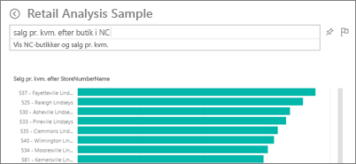
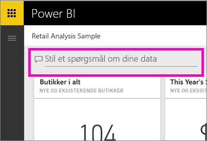
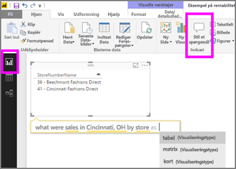

# Spørgsmål og svar i Power BI-tjenesten og Power BI Desktop
## Hvad er Spørgsmål og svar?
Den hurtigste måde at få svar ud af dine data på er nogle gange at stille et spørgsmål på et naturligt sprog. For eksempel "Hvad var den samlede omsætning sidste år".  Brug Spørgsmål og svar til at udforske dine data ved hjælp af intuitive funktioner på et naturligt sprog, og få svar i form af diagrammer og grafer. Spørgsmål og svar adskiller sig fra en søgemaskine – Spørgsmål og svar giver kun resultater om dataene i Power BI.

Denne artikel er udgangspunktet for alt, der har med Spørgsmål og svar at gøre. Vælg et link nedenfor for at få mere at vide om, hvordan Spørgsmål og svar fungerer i Power BI-tjenesten (dashboards og rapporter), Power BI Desktop (rapporter), Power BI Embedded og Power BI – Mobil.  

At stille spørgsmålet er kun begyndelsen.  Nyd det, mens du suser gennem dine data og tilpasser eller udvider dit spørgsmål, opdager pålidelige nye oplysninger, fokuserer på detaljer og zoomer ud for at få et større overblik. Du bliver henrykt over de nye indblik og opdagelser, du gør.

Oplevelsen er virkelig interaktiv ... og hurtig! Med lager i hukommelsen som drivkraft får du næsten øjeblikkeligt svar.

##  Spørgsmål og svar for *forbrugere*
Når en kollega deler et dashboard med dig, kan du finde spørgsmålsfeltet Spørgsmål og svar på dashboardet i Power BI-tjenesten (app.powerbi.com) nederst på dashboardet i Power BI – Mobil og oven over visualiseringen i Power BI Embedded. Medmindre ejeren har givet dig redigeringstilladelser kan du bruge Spørgsmål og svar til at udforske data, men ikke gemme visualiseringer oprettet med Spørgsmål og svar.

## Spørgsmål og svar for *forfattere*
Hvis du er *forfatter* til Power BI-rapporter eller har redigeringsrettigheder til et datasæt, så finder du spørgsmålsfeltet Spørgsmål og svar på dashboardet i Power BI-tjenesten og på hver rapportside i Power BI-tjenesten og Power BI Desktop. Alle visualiseringer, du opretter ved hjælp af Spørgsmål og svar, kan gemmes i et dashboard og i en rapport.

Udover at bruge Spørgsmål og svar til at udforske deres data, kan forfattere og ejere af datasæt forbedre Spørgsmål og svar-oplevelsen for forbrugere ved at [ændre deres datasæt](service-prepare-data-for-q-and-a.md), tilføje [udvalgte spørgsmål](service-q-and-a-create-featured-questions.md) og [aktivere og deaktivere Spørgsmål og svar ](service-q-and-a-direct-query.md) for datasæt til direkte forbindelser i det lokale miljø. I [integrerede scenarier](developer/qanda.md) kan udviklere vælge mellem to tilstande: **interaktiv** og **kun resultat**.

## Hvordan ved Spørgsmål og svar, hvordan der skal svares på spørgsmål?
### Hvilke datasæt bruger Spørgsmål og svar?
Hvordan ved Spørgsmål og svar, hvordan der skal svares på dataspecifikke spørgsmål? Funktionen er afhængig af navnene på tabellerne, kolonnerne og de beregnede felter i det underliggende datasæt. Så hvad du (eller datasættets ejer) kalder ting er vigtigt!

Antag for eksempel, at du havde en Excel-tabel med navnet "Salg", med kolonner med titlerne "Produkt", "Måned", "Solgte enheder", "Bruttosalg" og "Fortjeneste". Du kan stille spørgsmål om enhver af disse enheder.  Du kan spørge "vis *salg*, "samlet *fortjeneste* efter *måned*", "sortér *produkter* efter *solgte enheder*" og meget mere.

Spørgsmål og svar kan besvare spørgsmål, der er baseret på, hvordan dit datasæt er organiseret. Hvordan vil dette fungerer for dataene i Salesforce? Når du opretter forbindelse til din konto på salesforce.com, opretter Power BI automatisk et dashboard.  Før du begynder at stille spørgsmål med Spørgsmål og svar, skal du se på de data, der vises i dashboardets visualiseringer, og også de data, der vises på rullelisten Spørgsmål og svar.

* Hvis visualiseringernes akseetiketter og værdier omfatter "salg", "kunde", "måned" og "salgsmuligheder", kan du med sikkerhed stille spørgsmål som: "Hvilken *kunde* har den højeste *salgsmulighed* eller vis *salg* pr. måned som et søjlediagram".
* Hvis rullelisten indeholder "sælger", "delstat" og "år", kan du med sikkerhed stille spørgsmål som: "hvilken *sælger* havde det laveste *salg* i *Florida* i *2013*".

Hvis du har data om et websteds ydeevne i Google Analytics, kan du bede Spørgsmål og svar om den tid, der blev brugt på en webside, antallet af entydige sidebesøg og brugerengagement. Eller hvis du forespørger på demografiske data, kan du stille spørgsmål om alder og indkomst i husholdningen efter placering.

### Hvilken visualisering bruger Spørgsmål og svar?
Spørgsmål og svar vælger den bedste visualisering baseret på de data, der bliver vist. Nogle gange er data i det eller de underliggende datasæt defineret som en bestemt type eller kategori, og det hjælper Spørgsmål og svar med at vide, hvordan de skal vises. Hvis data f.eks. er defineret som en datotype, er det mere sandsynligt, at de vises som et kurvediagram. For data, der er kategoriseret som en by, er det mere sandsynligt, at de vises som et kort.

Du kan også fortælle Spørgsmål og svar, hvilken visualisering der skal bruges, ved at føje den til dit spørgsmål. Men husk, at det ikke altid er muligt for Spørgsmål og svar at vise dataene i den ønskede visualiseringstype.

Du kan finde oplysninger om nøgleord, som Spørgsmål og svar genkender, i [Tip til at stille spørgsmål](service-q-and-a-tips.md).

## Her kan du få mere at vide om Spørgsmål og svar i Power BI
[Overblik: Sådan bruger du Spørgsmål og svar i Power BI-dashboards og -rapporter](power-bi-tutorial-q-and-a.md): Trinvis vejledning i at bruge Spørgsmål og svar og en oversigt over, hvordan det hele fungerer.

[Microsoft Power BI-mobilapp](mobile-apps-ios-qna.md) Til iOS på iPads, iPhones og iPod Touch-enheder.

[Microsoft Power BI Embedded](developer/qanda.md) Inkorporering af Spørgsmål og svar i et program.

[Tip til at stille spørgsmål i Spørgsmål og svar](service-q-and-a-tips.md): Se, hvordan du skal tale til Spørgsmål og svar for at få de bedst mulige resultater.

[Føj udvalgte spørgsmål til dit datasæt](service-q-and-a-create-featured-questions.md), så foreslår Spørgsmål og svar disse spørgsmål til dine kollegaer.

[Aktivér Spørgsmål og svar for datasæt i det lokale miljø](service-q-and-a-direct-query.md) Hvis du har brug for en gateway til at oprette forbindelse til datasættet, kan du bruge Power BI-indstillinger til at slå Spørgsmål og svar til og fra.

[Selvstudium: Brug Spørgsmål og svar i Power BI-tjenesten med eksemplet på detailhandelssalg](power-bi-visualization-introduction-to-q-and-a.md): Brug Spørgsmål og svar i et realistisk brancheselvstudium.

[Få dine data til at fungere godt med Spørgsmål og svar](service-prepare-data-for-q-and-a.md): Er du den person, der opretter datasæt og datamodeller?  Så er dette emne til dig.

Har du flere spørgsmål? [Prøv at spørge Power BI-community'et](http://community.powerbi.com/)
