# Føj et filter til en rapport i Power Bi-tjenesten (i redigeringsvisning)
> [!TIP]
> Det anbefales, at du først læser [Om filtre og markering i Power BI-rapporter](power-bi-reports-filters-and-highlighting.md).

Eksemplerne i denne artikel er baseret på Power BI-tjenesten. Trinnene er dog stort set de samme i Power BI Desktop.
> 
> 

## Hvad er forskellen mellem rapportfiltrene i redigeringsvisning i forhold til læsevisning?
Du kan interagere med rapporter i to forskellige tilstande: [Læsevisning](consumer/end-user-reading-view.md) og [Redigeringsvisning](service-interact-with-a-report-in-editing-view.md).  Og de filterfunktioner, der er tilgængelige, afhænger af hvilken tilstand du arbejder i.

* Du kan tilføje rapport- og sidefiltre samt visualiseringsfiltre i redigeringsvisning. Når du gemmer rapporten, gemmes filtrene sammen med den. Personer, der åbner rapporten i Læsevisning, kan arbejde med de filtre, du har tilføjet.
* I Læsevisning kan du arbejde med alle de filtre for rapporter, detaljeadgang, sider og visualiseringer, der allerede findes i rapporten, men du kan ikke tilføje nye filtre. De ændringer, du foretager i ruden Filtre, gemmes med rapporten. Det sker også, selvom du får vist rapporten i en mobilapp, eller hvis du forlader rapporten og vender tilbage til den på et senere tidspunkt.  

> [!NOTE]
> I denne artikel beskrives det, hvordan du opretter filtre i **redigeringsvisning**  til rapporter.  Du kan finde flere oplysninger om filtre i Læsevisning i afsnittet om [brug af filtre i læsevisning](consumer/end-user-reading-view.md).

## Tilgængelige filtre i ruden *Filtre* i Power BI
Uanset om du bruger Desktop-versionen eller Power BI-tjenesten, vises ruden Filtre i højre side af rapportcanvasset. Hvis ruden Filtre ikke er vist, skal du vælge ikonet ">"øverst til højre for at udvide den.

Der findes fire typer filtre.

- **Sidefilter** gælder for alle visuelle elementer på rapportsiden.     
- **Visuelt filter** gælder for et enkelt visuelt element på rapportsiden.    
- **Detaljeadgangsfilter** gælder for en bestemt enhed i en rapport.    
- **Rapportfilter** gælder for alle sider i rapporten.    

    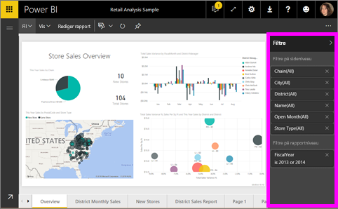

Da filtre *bevares*, når du navigerer væk fra rapporten, vil Power BI bevare de ændringer, som du foretager i filtre, udsnit og andre datavisninger. Du kan derfor fortsætte, hvor du slap, når du vender tilbage til rapporten. Hvis du ikke vil bevare dine filterændringer, skal du vælge **Nulstil til standard** på den øverste menulinje.

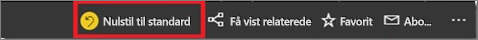

## Føj et filter til en bestemt visualisering (også kaldet visuelt filter)
Der er to måder, du kan gøre dette på: 

* Ved at filtrere et felt, der allerede bruges i visualiseringen
* ved at identificere et felt, der ikke allerede bruges i visualiseringen, og føje dette felt direkte til bucket'en **Filtre på visualiseringsniveau**.

### Ved at filtrere felterne der allerede findes i visualiseringen
1. Åbn din [rapport i redigeringsvisning](consumer/end-user-reading-view.md).
   
   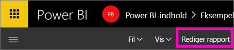
2. Åbn ruden Visualizations and Filters (Visualiseringer og filtre) og ruden Felter (hvis de ikke allerede er åbne).
   
   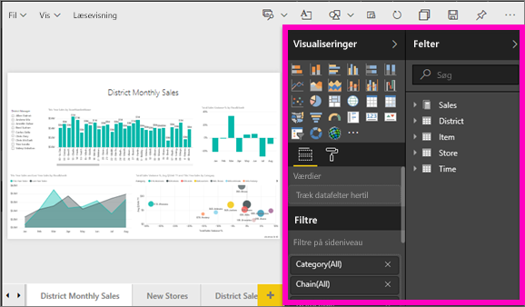
3. Vælg først en visualisering for at aktivere den. Alle felter, der bruges af det visuelle element, er identificeret i ruden **Felter** og også angivet i ruden **Filtre** under overskriften **Filtre på visualiseringsniveau**.
   
   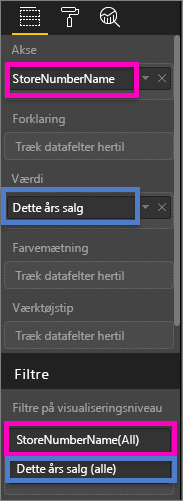
4. Herefter skal du føje et filter til et felt, der er allerede bruges i visualiseringen. 
   
   * Rul ned til området **Filtre på visualiseringsniveau**, og brug pilen til at udvide det felt, du vil filtrere efter. I dette eksempel skal vi filtrere **StoreNumberName**
     
       
   * Angiv et af kontrolelementerne **Basic**, **Advanced** eller **Top N** (se [Sådan bruger du rapportfiltre](consumer/end-user-report-filter.md)). I dette eksempel vælger vi filtreringen Basic og markerer tallene 10, 11, 15 og 18.
     
      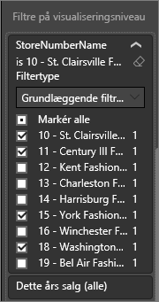 
   * Visualiseringen ændres for at afspejle det nye filter. Hvis du gemmer din rapport med filteret, kan rapportlæsere interagere med filteret i læsevisning og markere eller fjerne markering af værdier.
     
      
5. Nu skal vi føje et helt nyt felt som et filter på visualiseringsniveau til vores visualisering.
   
   * Vælg i ruden Felter det felt, du vil tilføje som et nyt filter på visualiseringsniveau, og træk det til **området Filtre på visualiseringsniveau**.  I dette eksempel skal vi trække **District Manager** (Distriktchef) til bucket'en **Filtre på visualiseringsniveau** og kun vælge Andrew Ma. 
     
      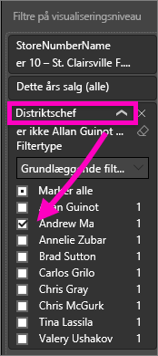
   * Bemærk, at **District Manager** *ikke* føjes til selve visualiseringen. Visualiseringen består stadig af **StoreNumberName** som akse og **This Year Sales** som værdi.  
     
      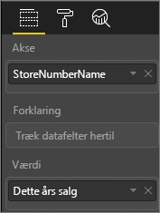
   * Og selve visualiseringen filtreres nu, så kun Andrew's salg for året for de angivne butikker vises.
     
     

## Føj et filter til en hel side (også kaldet sidevisningsfilter)
1. Åbn din [rapport i redigeringsvisning](consumer/end-user-reading-view.md).
2. Åbn ruden Visualizations and Filters (Visualiseringer og filtre) og ruden Felter (hvis de ikke allerede er åbne).
3. Vælg i ruden Felter det felt, du vil tilføje som et nyt filter på sideniveau, og træk det til **området Filtre på sideniveau**.  
4. Vælg de værdier, du vil filtrere efter, og angiv enten kontrolelementet **Basic** eller **Advanced** (se [Sådan bruger du rapportfiltre](consumer/end-user-report-filter.md)).
   
   Al visualisering på siden, der er påvirket af dette filter, tegnes igen, så ændringen afspejles. 
   
   

Hvis du gemmer din rapport med filteret, kan rapportlæsere interagere med filteret i læsevisning og markere eller fjerne markering af værdier.

## Tilføj et filter til detaljeadgang
Med detaljeadgang i Power BI-tjenesten og Power BI Desktop kan du oprette en *destination* på en rapportside, som fokuserer på en bestemt enhed – f.eks. en leverandør, en kunde eller en producent. Nu kan brugere via andre rapportsider højreklikke på et datapunkt for denne enhed og opnå detaljeadgang til den fokuserede side.

### Opret et filter til detaljeadgang
Følg med ved at åbne eksemplet på kunderentabilitet i redigeringsvisning. Antag, at du vil have en side med fokus på overordnede forretningsområder.   

1. Føj en ny side til rapporten, og kald den **Team Executive**. Dette bliver siden med *destinationen*, der er detaljeadgang til.
2. Tilføj visualiseringer, der sporer vigtige målepunkter for teamets overordnede forretningsområder.    
3. Føj desuden **Executive > Executive Name** til filtrene til detaljeadgang.    
   
    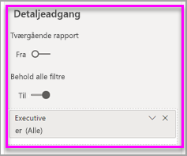
   
    Bemærk, at Power BI føjer en tilbage-pil til rapportsiden.  Når tilbage-pilen vælges, returneres brugere til den *oprindelige* rapportside – den side, de var placeret på, da de valgte detaljeadgang. Tilbage-pil fungerer kun i læsevisning.
   
     

### Brug filteret til detaljeadgang
Lad os se, hvordan filteret til detaljeadgang fungerer.

1. Start på rapportsiden **Team Scorecard**.    
2. Antag, at du er Andrew Ma, og at du vil have vist rapportsiden Team Executive filtreret udelukkende efter dine data.  Højreklik i områdediagrammet øverst til venstre på et vilkårligt grønt datapunkt for at åbne menupunktet Detaljeadgang.
   
    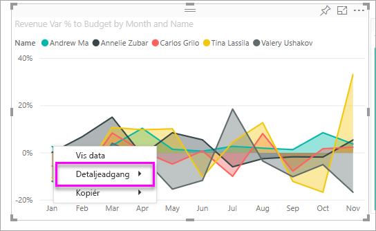
3. Vælg **Detaljeadgang > Team Executive** for at få detaljeadgang til rapportsiden med navnet **Team Executive**. Siden filtreres, så den viser oplysninger om det datapunkt, du har højreklikket fra, i dette tilfælde Andrew Ma. Det er kun det felt, der er i Detaljeadgang-filtrene, der sendes videre til rapportsiden med detaljeadgang.  
   
    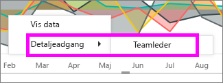

## Føj et filter til hele rapporten (også kaldet rapportfilter)
1. Åbn din [rapport i redigeringsvisning](consumer/end-user-reading-view.md).
2. Åbn ruden Visualizations and Filters (Visualiseringer og filtre) og ruden Felter (hvis de ikke allerede er åbne).
3. Vælg i ruden Felter det felt, du vil tilføje som et nyt filter på rapporteringsniveau, og træk det til området **Filtre på rapporteringsniveau**.  
4. Vælg de værdier, du vil filtrere efter (se [Sådan bruger du rapportfiltre](consumer/end-user-report-filter.md)).

    De visuelle elementer på den aktive side og på alle sider i rapporten ændres for at afspejle det nye filter. Hvis du gemmer din rapport med filteret, kan rapportlæsere interagere med filteret i læsevisning og markere eller fjerne markering af værdier.

1. Vælg tilbage-pilen for at vende tilbage til den forrige rapportside.

## Overvejelser og fejlfinding

- Der er situationer, hvor dit filter på visualiseringsniveau og dit filter på sideniveau kan returnere forskellige resultater.  Hvis du f.eks. tilføjer et filter på visualiseringsniveau, vil Power BI filtrere de samlede resultater.  Standardsammenlægningen er Sum, men du kan [ændre sammenlægningstypen](service-aggregates.md).  

    Hvis du derefter tilføjer et filter på sideniveau, vil Power BI filtrere uden sammenlægning.  Grunden til dette er, at en side kan have mange visuelle elementer, som hver især kan gøre brug af forskellige sammenlægningstyper.  Filteret anvendes derfor til hver enkelt datarække.

- Hvis du ikke får vist ruden Felter, skal du sikre dig, at du er i [Redigeringsvisning](service-interact-with-a-report-in-editing-view.md) for rapporten    
- Hvis du har foretaget mange ændringer af filtrene, og du vil vende tilbage til de indstillinger, som rapportens forfatter har angivet, skal du vælge **Nulstil til standard** på den øverste menulinje.

## Næste trin
 [Sådan bruger du rapportfiltre](consumer/end-user-report-filter.md)

  [Filtre og fremhævning i rapporter](power-bi-reports-filters-and-highlighting.md)

[Arbejd med filtre og fremhævning i læsevisning for en rapport](consumer/end-user-reading-view.md)

[Rediger, hvordan visualiseringer i rapporter krydsfiltrerer og krydsfremhæver hinanden](consumer/end-user-interactions.md)

Har du flere spørgsmål? [Prøv at spørge Power BI-community'et](http://community.powerbi.com/)

