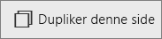

# Føj en side til en Power BI-rapport i Power BI-tjenesten og Power BI Desktop
Der er ingen grund til at overfylde en rapportside – du kan nemt tilføje en ny tom side. 

Tilføjelse og kopiering af rapportsider kræver redigeringsrettigheder til rapporten. I Power BI-tjenesten betyder det, at rapporten skal åbnes i [Redigeringsvisning](service-reading-view-and-editing-view.md). 

## Tilføj en ny tom side
Vælg det gule plusikon, og skriv et nyt navn på siden.  

## Dupliker en side
Vælg ikonet **Dupliker denne side** på den øverste kontrollinje i [Redigeringsvisning](service-interact-with-a-report-in-editing-view.md).

Din nye side oprettes og bliver den aktive side. Hvis du vil omdøbe den, skal du dobbeltklikke på navnet på fanen for at fremhæve den og skrive et nyt navn.  Du kan finde flere oplysninger under [Omdøbning i Power BI-tjenesten](service-rename.md)

## Næste trin
Få mere at vide om [rapporter i Power BI](service-reports.md)

[Power BI – Grundlæggende begreber](service-basic-concepts.md)

Har du flere spørgsmål? [Prøv at spørge Power BI-community'et](http://community.powerbi.com/)

