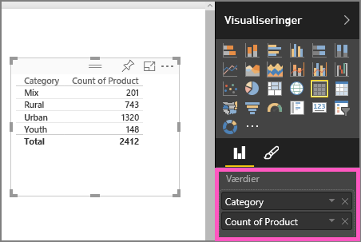
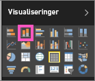

# Del 1, Føj visualiseringer til en rapport i Power BI (selvstudium)
I denne artikel får du en hurtig introduktion til at oprette en visualisering i en rapport.  Hvis du vil læse om mere avanceret indhold, skal du [se Del II](power-bi-report-add-visualizations-ii.md). Se Amanda demonstrere nogle få metoder til at oprette, redigere og formatere visualiseringer på et rapportcanvas. Prøv det derefter selv ved hjælp af [Sales and Marketing-eksemplet](sample-datasets.md) for at oprette din egen rapport.

<iframe width="560" height="315" src="https://www.youtube.com/embed/IkJda4O7oGs" frameborder="0" allowfullscreen></iframe>

## Åbn en rapport, og tilføj en ny side
1. Åbn en [rapport i redigeringsvisning](service-reading-view-and-editing-view.md). Dette selvstudium er baseret på [Sales and Marketing-eksemplet](sample-datasets.md).
2. Hvis ruden Felter ikke vises, skal du vælge pilikonet for at åbne den. 
   
   
3. [Tilføj en tom side i rapporten](power-bi-report-add-page.md).

## Tilføj visualiseringer i rapporten
1. Opret en visualisering ved at vælge et felt i ruden **Felter**.  
   
   **Start med et numerisk felt** som Sales > Sales $: Power BI opretter et søjlediagram med en enkelt søjle.
   
   
   
   **Start med et kategorifelt**, for eksempel Name eller Product: Power BI opretter en tabel og tilføjer feltet under **Værdier**.
   
   
   
   **Start med et geografisk felt** , for eksempel Geo > City. Power BI og Bing Maps opretter en kortvisualisering.
   
   
2. Opret en visualisering, og ret derefter typen. Vælg **Product > Count of Product** og **Product > Category** for at tilføje dem under **Values**.
   
   
3. Ret visualiseringen til et søjlediagram ved at vælge ikonet for søjlediagrammer.
   
   
4. Når du opretter visualiseringer i din rapport, kan du [fastgøre dem til dit dashboard](service-dashboard-pin-tile-from-report.md). Vælg ikonet med tavlenålen  for at fastgøre visualiseringen.
   
   
5. Nu kan du:
   
   Fortsætte til [Del 2: Føj visualiseringer til en Power BI-rapport](power-bi-report-add-visualizations-ii.md)
   
   [Interagere med visualiseringerne](service-reading-view-and-editing-view.md) i rapporten.
   
   [Gøre endnu mere med dine visualiseringer](power-bi-report-visualizations.md).
   
   [Gemme din rapport](service-report-save.md).

## Næste trin
Få mere at vide om [Visualiseringer i Power BI-rapporter](power-bi-report-visualizations.md).

[Rapporter i Power BI](service-reports.md)

Har du flere spørgsmål? [Prøv at spørge Power BI-community'et](http://community.powerbi.com/)

