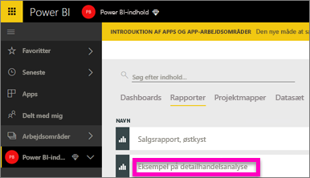
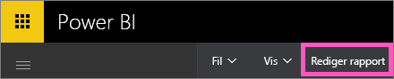
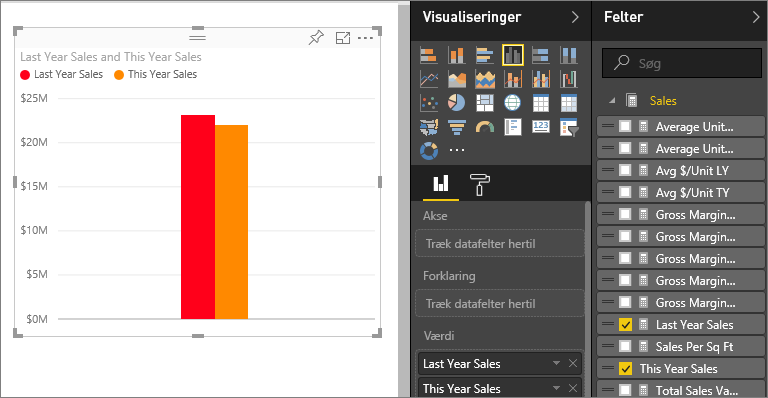
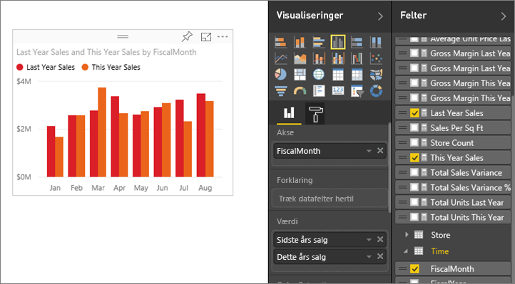
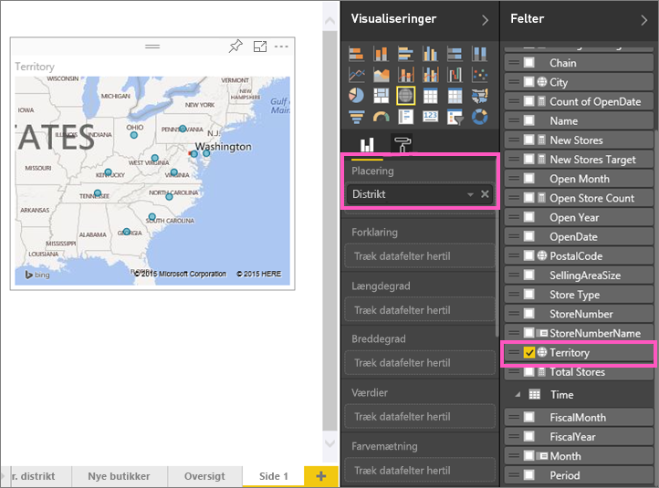
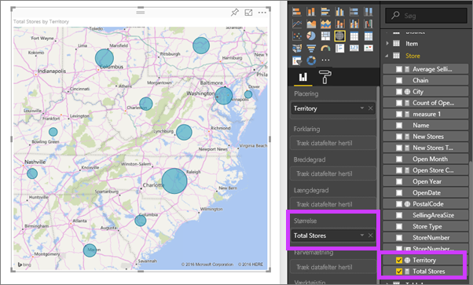

# Del 2 – Føj visualiseringer til en Power BI-rapport (selvstudium)
I [Del 1](power-bi-report-add-visualizations-ii.md) oprettede du en grundlæggende visualisering ved at markere afkrydsningsfelter ud for feltnavne.  I Del 2 lærer du, hvordan du bruger træk og slip samt benytter ruderne **Felter** og **Visualiseringer** til at oprette og redigere visualiseringer.

### Forudsætninger
- [Del 1](power-bi-report-add-visualizations-ii.md)
- Power BI-tjenesten – visualiseringer kan føjes til rapporter ved hjælp af Power BI-tjenesten eller Power BI Desktop. I dette selvstudium bruges Power BI-tjenesten. 
- Retail Analysis Sample

## Opret en ny visualisering
I dette selvstudium gennemgår vi vores Retail Analysis-datasæt og opretter nogle få vigtige visualiseringer.

### Åbn en rapport, og tilføj en ny tom side.
1. Åbn det arbejdsområde, hvor du gemte filen Retail Analysis Sample. Vælg **Retail Analysis Sample** for at åbne rapporten i Læsevisning.
   
   
2. Vælg **Rediger rapporten** for at åbne rapporten i Redigeringsvisning.
   
   
3. [Tilføj en ny side](power-bi-report-add-page.md) ved at vælge det gule plusikon nederst på canvasset.
   
   

### Tilføj en visualisering, som indeholder en oversigt over dette års salg sammenlignet med sidste år.
1. I tabellen **Sales** skal du vælge **This Year Sales** > **Value** og **Last Year Sales**. Power BI opretter et søjlediagram.  Dette er lidt interessant, og du vil gerne se mere. Hvordan ser salget ud pr. måned?  
   
   
2. I tabellen Time skal du trække **Måned** ind i området **Akse**.  
   
3. [Ret visualiseringen](power-bi-report-change-visualization-type.md) til et områdediagram.  Der er mange visualiseringstyper at vælge imellem. Se [beskrivelser af hver, tips til bedste praksis og selvstudier](power-bi-visualization-types-for-reports-and-q-and-a.md) for at få hjælp til at vælge, hvilken type du vil bruge. Vælg ikonet Områdediagram i ruden Visualiseringer.
4. Sortér visualiseringen ved at vælge ellipsen og vælge **Sortér efter måned**.
5. [Tilpas størrelsen af visualiseringen](power-bi-visualization-move-and-resize.md) ved at vælge visualiseringen, tage fat i en af konturcirklerne og trække. Gør den bred nok, så rullepanelet fjernes, men lille nok, så der er plads nok til at tilføje endnu en visualisering.
   
   
6. [Gem rapporten](service-report-save.md).

### Tilføj en kortvisualisering med salg efter placering
1. I tabellen **Store** skal du vælge **Område**. Power BI genkender, at Område er en placering, og opretter en visualisering med et kort.  
   
2. Træk **Total Stores** ind i området Størrelse.  
   
3. Tilføj en forklaring.  Hvis du vil se dataene efter butiksnavn, skal du trække **Chain** ind i området Forklaring.  
   

## Næste trin
* Du kan finde flere oplysninger om ruden Felter under [Rapporteditoren... få en præsentation](service-the-report-editor-take-a-tour.md).   
* Hvis du vil vide, hvordan du filtrerer og fremhæver dine visualiseringer, skal du se [Filtre og fremhævning i Power BI-rapporter](power-bi-reports-filters-and-highlighting.md).  
* Få mere at vide om [Visualiseringer i Power BI-rapporter](power-bi-report-visualizations.md).  
* Har du flere spørgsmål? [Prøv at spørge Power BI-community'et](http://community.powerbi.com/)

