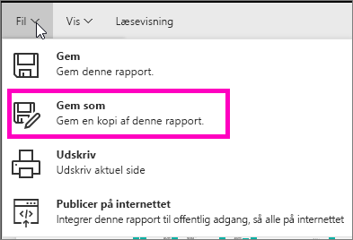
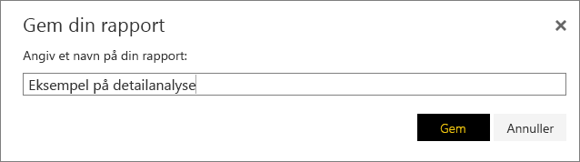
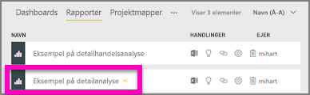

# Opret en ny rapport ud fra en eksisterende rapport (kopiér en rapport)
Du har måske en rapport, der allerede har forbindelse til dit datasæt, og har nogle visuelle elementer, som du gerne vil bruge igen eller redigere.  Hvorfor ikke blot kopiere denne rapport som udgangspunkt for en ny rapport?  Fremgangsmåden er som følger:

1. [Åbn en rapport](consumer/end-user-report-open.md).
2. Fra menuen **Filer** skal du vælge **Gem som**.
   
   
3. Indtast et navn til den nye rapport, og vælg **Gem**.
   
   
   
   En meddelelse om fuldførelse fortæller dig, at den nye rapport er blevet gemt på dit aktuelle arbejdsområde i Power BI.
   
   
4. Åbn fanen **Rapporter** i dit arbejdsområde, og vælg den nye rapport for at åbne den. Du kan også slette de visuelle elementer, du ikke vil beholde, redigere andre illustrationer og tilføje nye.
   
   
5. God fornøjelse med at opdatere og redigere den nye rapport.

## Næste trin:
[Opret nye visualiseringer](visuals/power-bi-report-add-visualizations-ii.md)

[Slet visualiseringer](consumer/end-user-delete.md), du ikke har brug for

[Opret en rapport i Power BI Desktop](desktop-report-view.md)
