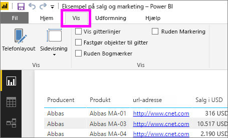
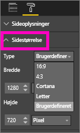

# Indstillinger for sidevisning i en Power BI-rapport
Vi forstår, at det er af afgørende betydning at holde dit rapportlayout helt perfekt. Sommetider kan det være udfordrende, fordi du og dine kollegaer får vist disse rapporter på skærme med forskellige højde-bredde-forhold og størrelser. 

Standardskærmvisningen er **Tilpas til siden**, og standardskærmstørrelsen er **16:9**. Hvis du vil fastlåse i et andet højde-bredde-forhold eller tilpasse rapporten på anden vis, er der to værktøjer til at hjælpe dig: indstillinger for ***Sidevisning*** og ***Sidestørrelse***.

<iframe width="560" height="315" src="https://www.youtube.com/embed/5tg-OXzxe2g" frameborder="0" allowfullscreen></iframe>

## Her kan du finde indstillinger for sidelayout i Power BI-tjenesten og Power BI Desktop
Indstillinger for sidelayout fås både i Power BI-tjenesten og Power BI Desktop, men grænsefladen er lidt forskellig. Afsnittene nedenfor beskriver, hvor du kan finde visningsindstillinger i hvert Power BI-værktøj.

### I Power BI Desktop
Vælg fanen **Vis** i Rapportvisning for at åbne indstillingerne for Sidevisning samt indstillingerne for Telefonlayout.

  

### I Power BI-tjenesten (app.powerbi.com)
I Power BI-tjenesten skal du åbne en rapport og vælge **Vis** fra den øverste menulinje til venstre.

Indstillinger for Sidevisning er tilgængelige i både [Læsevisning og Redigeringsvisning](service-reading-view-and-editing-view.md). I Redigeringsvisning kan ejeren af en rapport tildele indstillinger for sidevisning til individuelle rapportsider, så disse indstillinger gemmes sammen med rapporten. Når en kollega åbner den pågældende rapport i Læsevisning, får vedkommende vist rapportsiderne ved hjælp af ejerens indstillinger.  I Læsevisning kan kolleger ændre *nogle* af indstillingerne for sidevisning, men ændringerne gemmes ikke, når rapporten afsluttes.

##    Indstillinger for Sidelayout
Det første sæt indstillinger for *Sidelayout* styrer visningen af din rapportside i forhold til browservinduet.  Vælg mellem:

* **Tilpas til siden** (standard): Indholdet skaleres, så det passer bedst muligt til siden
* **Tilpas til bredden**: Indholdet skaleres, så det passer til sidens bredde
* **Faktisk størrelse**: Indholdet vises i fuld størrelse

Det andet sæt indstillinger for *Sidelayout* styrer placeringen af objekterne på rapportcanvasset.

* **Vis gitterlinjer**: Aktivér gitterlinjer, så du får hjælp til at placere objekter på rapportcanvasset.
* **Fastgør til gitter**: Brug indstillingen sammen med **Vis gitterlinjer** for at placere og justere objekter præcist på rapportcanvasset. 
* **Lås objekter**: Lås alle objekter på canvasset, så de ikke kan flyttes eller tilpasses i størrelsen.
* **Valgrude**: I Valgrude vises alle objekter på canvasset, og du kan afgøre, hvilke objekter, der skal vises og skjules.

    

## Indstillinger for Sidestørrelse

Indstillinger for *Sidestørrelse* er kun tilgængelige for rapportejere. I Power BI-tjenesten (app.powerbi.com) betyder det, at rapporten skal åbnes i [Redigeringsvisning](service-reading-view-and-editing-view.md). Disse indstillinger styrer visningens højde-bredde-forhold og den faktiske størrelse (i pixel) på rapportcanvasset.   

* 4:3-format
* 16:9-format (standard)
* Cortana
* Letter
* Brugerdefineret (højde og bredde i pixels)

## Næste trin
[Se, hvordan du kan bruge indstillinger for Sidevisning og Sidestørrelse i dine egne Power BI-rapporter](power-bi-change-report-display-settings.md).

Læs mere om [rapporter i Power BI](service-reports.md)

[Power BI – Grundlæggende begreber](service-basic-concepts.md)

Har du flere spørgsmål? [Prøv at spørge Power BI-community'et](http://community.powerbi.com/)

