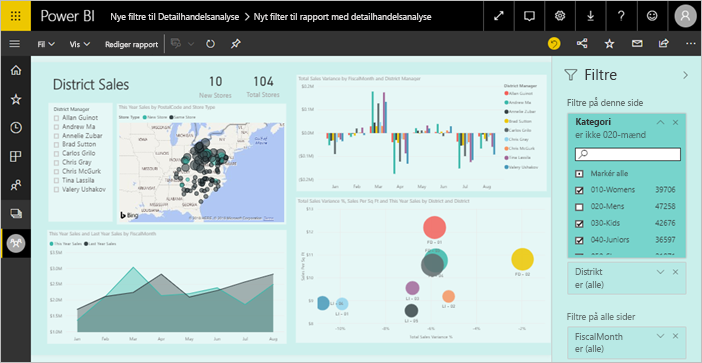
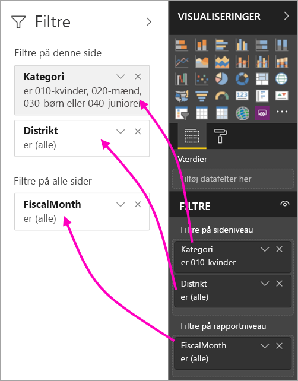
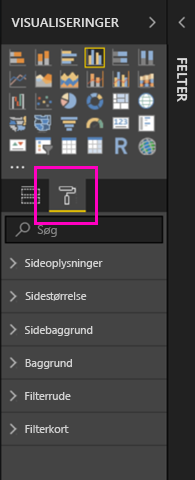
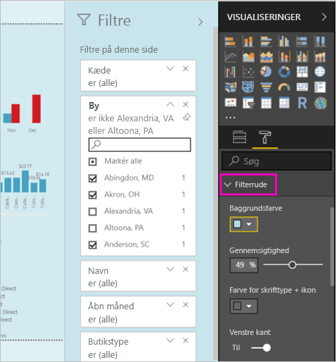
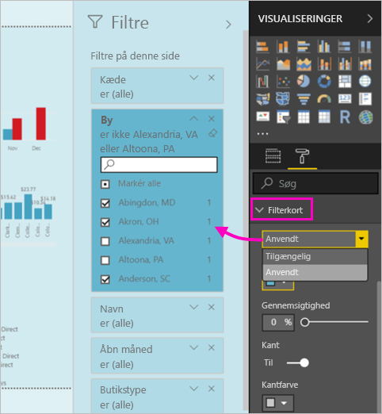
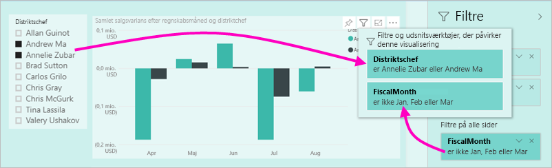

# Den nye filteroplevelse i Power BI-rapporter (prøveversion)

I denne artikel forklares den nye filteroplevelse: Filtrene i Power BI får ny funktionalitet og et nyt design. Når du designer rapporter i Power BI Desktop eller i Power BI-tjenesten, kan du få ruden Filtre til at se ud som og interagere med hele rapporten. I den nye oplevelse fungerer den gamle Filtre-rude som en rude til redigering af filtre, og den nye Filtreringsrude er den eneste, forbrugerne af din rapport ser. 
 

Her kan du se, hvad du som rapportdesigner kan gøre med de nye filtre:

- Vis en skrivebeskyttet visning af filtre i visualiseringens overskrift, så forbrugerne ved præcist, hvilke filtre eller udsnitsværktøjer der påvirker en bestemt visualisering.
- Formatér og tilpas filtreringsruden, så den føles som en del af rapporten.
- Definer, om ruden Filtre skal være åben eller skjult som standard, når en forbruger åbner rapporten.
- Skjul hele filtreringsruden eller specifikke filtre, som forbrugerne af rapporten ikke skal se.
- Kontrollér og angiv tilmed bogmærke for tilstanden Synlighed, Åben og Skjult for den nye filtreringsrude.
- Lås filtre, som forbrugerne ikke må redigere.

## Slå den nye filteroplevelse til 

Du kan aktivere den nye oplevelse i Power BI Desktop. Du kan derefter redigere filtre deri eller i Power BI-tjenesten (https://app.powerbi.com). Da denne nye filteroplevelse er en prøveversion, skal du først aktivere den i Power BI Desktop. 

### Slå nye filtre til for alle nye rapporter

1. Vælg **Filer** > **Indstillinger** > **Indstillinger** > **Prøveversionsfunktioner**, og markér derefter afkrydsningsfeltet **Ny filteroplevelse**. 
2. Genstart Power BI Desktop for at se den nye filteroplevelse i alle nye rapporter.

Efter du har genstartet Power BI Desktop, er oplevelsen som standard aktiveret for alle nye rapporter, du opretter.  

### Slå nye filtre til for en eksisterende rapport

Du kan også aktivere de nye filtre for eksisterende rapporter.

1. I en eksisterende rapport skal du vælge **Filer** > **Indstillinger** > **Indstillinger**
2. Under **Rapportindstillinger** skal du vælge **Aktivér den opdaterede filtreringsrude, og vis filtre i visualiseringens overskrift for denne rapport**.

## Byg den nye filtreringsrude

Efter du har aktiveret den nye filtreringsrude, kan du se den til højre for den rapportside, der er formateret som standard på baggrund af de aktuelle rapportindstillinger. Den gamle filtreringsrude fungerer som ruden til redigering af filtre. Den nye filtreringsrude viser dig, hvad forbrugerne af din rapport kan se, når du publicerer rapporten. Du kan opdatere eksisterende filtre i den nye rude, men du kan bruge den gamle filtreringsrude til at konfigurere, hvilke filtre der skal inkluderes.

1. Start med at beslutte, om forbrugerne af rapporten skal kunne se filtreringsruden. Hvis de skal kunne se den, skal du vælge ikonet med øjet  ud for Filtre.

2. Du begynder at bygge din nye filtreringsrude ved at trække de ønskede felter til ruden til redigering af filtre enten som en visualisering, en side eller som filtre på rapporteringsniveau. Du ser dem i den nye Filtre-rude.

    

Når du føjer en visualisering til et rapportlærred, tilføjer Power BI automatisk et filter for hvert felt i visualiseringen. Power BI føjer ikke automatisk disse filtre til den skrivebeskyttede filtreringsrude. Du skal vælge ikonet med øjet for at tilføje dem specifikt.

 
## Lås eller skjul filtre

Du kan låse eller skjule de enkelte filterkort. Hvis du låser et filter, kan forbrugerne af rapporten se, men ikke ændre det. Hvis du skjuler det, kan de slet ikke se det. Det er typisk nyttigt at skjule filterkort, hvis du har brug for at skjule filtre til dataoprydning, der udelukker Null-værdier eller uventede værdier. 

- I ruden til redigering af filtre skal du vælge eller rydde ikonerne **Lås filter** eller **Skjul filter** på et filterkort.

   

I takt med at du slår disse indstillinger til og fra i ruden til redigering af filtre, kan du se ændringerne blive afspejlet i den nye filtreringsrude. Skjulte filtre vises ikke i pop op-vinduet for filtret for en visualisering.

Du kan også konfigurere tilstanden for filtreringsruden, så den følger dine bogmærker i rapporten. Der kan angives bogmærke for tilstandene Åben, Lukket og Synlighed for ruden.
 
## Formatér den nye Filtre-rude

En stor del af denne nye oplevelse er, at du nu kan formatere filtreringsruden, så den matcher udseendet af din rapport. Du kan formatere filtreringsruden forskelligt for hver side i rapporten. Her er de elementer, du kan formatere: 

- Baggrundsfarve
- Baggrundsgennemsigtighed
- Slå kanter på filtreringsruden til og fra
- Kantfarve på filtreringsruden

Du kan også formatere disse elementer for filterkort, afhængigt af om de er anvendt (indstillet til noget) eller tilgængelige (ryddet): 

- Baggrundsfarve
- Baggrundsgennemsigtighed
- Kant: til eller fra
- Kantfarve

### Angiv formatet for ruden Filtre og kort

1. I rapporten skal du klikke på selve rapporten eller baggrunden (*tapetet*), og derefter skal du i ruden **Visualiseringer** vælge **Formatér**. 
    Du kan se formateringsindstillinger for rapportsiden, tapetet samt filtreringsruden og filterkort.

        

1. Udvid **Filtreringsruden** for at angive farven på baggrunden, skrifttypen, ikonet og den venstre kant, som skal komplementere rapportsiden.

    

1. Udvid **Filterkort** for at angive farve og kant for **Tilgængelig** og **Anvendt**. Hvis du angiver forskellige farver for kortene Tilgængelig og Anvendt, er det oplagt, hvilke filtre der anvendes. 
  
    

## Vis filtre for en visualisering i Læsetilstand

I Læsetilstand kan du holde over en visualisering og se et pop op-vindue med alle de filtre, udsnitsværktøjer m.m., der påvirker denne visualisering. Formateringen af pop op-vinduet er den samme som formateringen af filtreringsruden. 

Her er de filtertyper, der vises i denne visning: 
- Grundlæggende filtre
- Udsnitsværktøjer
- Tværgående fremhævning 
- Tværgående filtrering
- Avancerede filtre
- Top N-filtre
- Filtre for Relativ dato
- Udsnitsværktøjer til synkronisering
- Filtre for Inkluder/Ekskluder
- Filtre sendt via en URL-adresse

## Kommer snart

I de kommende måneder planlægger vi at inkorporere følgende forbedringer:
- Mulighed for at ændre rækkefølgen af filterkortene
- En enkelt filtreringsrude til oprettere af rapporter 
- Flere formateringsindstillinger

Prøv den nye filteroplevelse. Giv os din feedback til denne funktion, og hvordan vi fortsat kan forbedre denne oplevelse. 

## Næste trin
[Sådan bruger du rapportfiltre](consumer/end-user-report-filter.md)

[Filtre og fremhævning i rapporter](power-bi-reports-filters-and-highlighting.md)

[Arbejd med filtre og fremhævning i Læsevisning for en rapport](consumer/end-user-reading-view.md)

[Rediger, hvordan visualiseringer i rapporter krydsfiltrerer og krydsfremhæver hinanden](consumer/end-user-interactions.md)

Har du flere spørgsmål? [Prøv at spørge Power BI-community'et](http://community.powerbi.com/)

