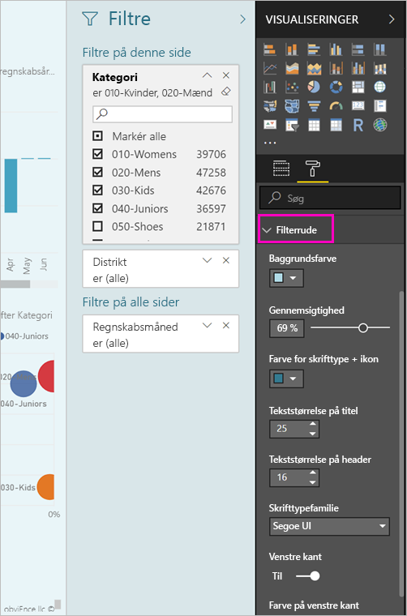
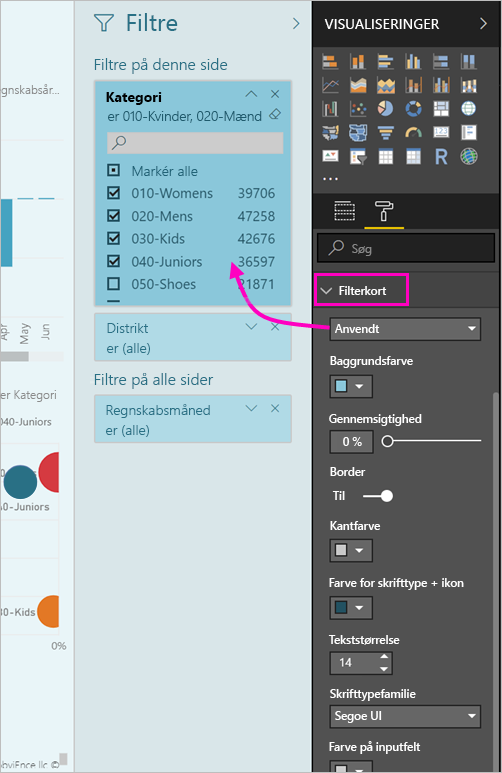

# <a name="the-new-filter-experience-in-power-bi-reports-preview"></a>Den nye filteroplevelse i Power BI-rapporter (prøveversion)

Filtre i Power BI har nye funktioner og et nyt design. Når du vælger i den nye oplevelse med filteret, kan du formatere ruden filtre for at se ud som i resten af rapporten. Du kan låse og endda Skjul filtre. Når du designer din rapport, kan du ikke længere se den tidligere ruden filtre på alle i ruden visualiseringer. Du kan gøre dit filter redigering og formatering i en enkelt filterruden. 


> [!NOTE]
> Den nye filtreringsoplevelse findes som en prøveversion. Nye builds kan tilsidesætte formatering, du allerede har angivet.

Som en Rapportdesigner er her det, du kan gøre i den nye enkelt ruden filtre:

- Tilføje og fjerne felter til at filtrere på. 
- Rediger filtertilstand.
- Formatér og tilpasse ruden filtre, så den position, hvor en del af din rapport.
- Definer, om ruden Filtre skal være åben eller skjult som standard, når en forbruger åbner rapporten.
- Skjul hele filterruden eller de specifikke filtre, du ikke vil rapportforbrugeren se.
- Kontrol og endda bogmærke synligheden, åbne og skjult tilstand af ruden filtre i nye.
- Lås filtre, som forbrugerne ikke må redigere.

Med den nye oplevelse med filteret, kan rapportforbrugeren også peg på et visuelt element for at se en skrivebeskyttet liste over alle de filtre eller udsnit påvirker dette visuelle element.


## <a name="turn-on-the-new-filter-experience"></a>Slå den nye filteroplevelse til 

Du kan aktivere den nye oplevelse i Power BI Desktop. Du kan derefter redigere filtre deri eller i Power BI-tjenesten (https://app.powerbi.com). Da denne nye filteroplevelse er en prøveversion, skal du først aktivere den i Power BI Desktop. Hvis du starter med at oprette en rapport i Power BI-tjenesten, kan den kan ikke have de nye filtre.

### <a name="turn-on-new-filters-for-all-new-reports"></a>Slå nye filtre til for alle nye rapporter

1. Vælg **Filer** > **Indstillinger** > **Indstillinger** > **Prøveversionsfunktioner** i Power BI Desktop, og markér derefter afkrydsningsfeltet **Ny filteroplevelse**. 
2. Genstart Power BI Desktop for at se den nye filteroplevelse i alle nye rapporter.

Efter du har genstartet Power BI Desktop, er oplevelsen som standard aktiveret for alle nye rapporter, du opretter.  

### <a name="turn-on-new-filters-for-an-existing-report"></a>Slå nye filtre til for en eksisterende rapport

Du kan også aktivere de nye filtre for eksisterende rapporter.

1. I en eksisterende rapport i Power BI Desktop skal du vælge **Filer** > **Indstillinger** > **Indstillinger**
2. I den venstre navigationslinje, under **aktuelle fil**, skal du vælge **rapportere indstillinger**.
3. Under **filtrering oplevelse**, skal du vælge **aktivere opdaterede filterruden, og få vist filtre i overskriften for denne rapport**.

## <a name="view-filters-for-a-visual-in-reading-mode"></a>Vis filtre for en visualisering i Læsetilstand

I Læsetilstand kan du holde markøren over filterikonet for en visualisering og se et pop op-vindue med alle de filtre, udsnitsværktøjer m.m., der påvirker denne visualisering. Formateringen af pop op-vinduet, er det samme som den filtre ruden formatering. 


Her er de filtertyper, der vises i denne visning: 
- Grundlæggende filtre
- Udsnit
- Tværgående fremhævning 
- Tværgående filtrering
- Avancerede filtre
- Top N-filtre
- Filtre for Relativ dato
- Udsnitsværktøjer til synkronisering
- Filtre for Inkluder/Ekskluder
- Filtre sendt via en URL-adresse

## <a name="build-the-new-filters-pane"></a>Byg nye filterruden

Når du aktiverer den nye ruden filtre, kan du se det til højre for den rapportside, der er formateret som standard, der er baseret på de aktuelle rapportindstillinger. Du kan bruge den nye ruden filtre til at konfigurere hvilke filtre, der skal medtages, og at opdatere eksisterende filtre i den nye rude. Ruden filtre i nye viser, hvilke dine rapportforbrugere vises, når du udgiver din rapport. 

1. Som standard kan din rapportforbrugeren se ruden filtre. Hvis du ikke vil dem til at se det, skal du vælge ikonet med øjet ud for **filtre**.

    

2. For at begynde at bygge din nye ruden filtre, trække felter af renter i ruden filtre i nye enten som visual, side eller på rapporteringsniveau.

Når du tilføjer et visuelt element til en rapportlærred, føjer Power BI automatisk et filter til ruden filtre for hvert felt i det visuelle element. 

## <a name="lock-or-hide-filters"></a>Lås eller skjul filtre

Du kan låse eller skjule de enkelte filterkort. Hvis du låser et filter, kan forbrugerne af rapporten se, men ikke ændre det. Hvis du skjuler det, kan de slet ikke se det. Det er typisk nyttigt at skjule filterkort, hvis du har brug for at skjule filtre til dataoprydning, der udelukker Null-værdier eller uventede værdier. 

- I ruden nye filtre skal du markere eller fjerne markeringen af **Zamknout Filtr** eller **Skjul filter** ikonerne i et filterkort.

   

Når du aktiverer disse indstillinger til og fra i ruden filtre i nye, kan du se ændringerne afspejles i rapporten. Skjulte filtre vises ikke i pop op-vinduet for filtret for en visualisering.

Du kan også konfigurere nye filtre ruden tilstand for at flow med dine bogmærker i rapporten. Der kan angives bogmærke for tilstandene Åben, Lukket og Synlighed for ruden.
 
## <a name="format-the-new-filters-pane"></a>Formatér den nye Filtre-rude

En stor del af denne nye oplevelse er, at du kan formatere ruden filtre for at matche udseendet af din rapport. Du kan formatere ruden filtre anderledes for hver side i rapporten. Her er de elementer, du kan formatere: 

- Baggrundsfarve
- Baggrundsgennemsigtighed
- Kant til eller fra
- Kantfarve
- Titel og header skrifttype, farve og størrelse

Du kan også formatere disse elementer for filterkort, afhængigt af om de er anvendt (indstillet til noget) eller tilgængelige (ryddet): 

- Baggrundsfarve
- Baggrundsgennemsigtighed
- Kant: til eller fra
- Kantfarve
- Skrifttype, farve og tekststørrelse
- Farve på inputfelt

### <a name="format-the-filters-pane-and-cards"></a>Format ruden filtre og kort

1. I rapporten skal du klikke på selve rapporten eller baggrunden (*tapetet*), og derefter skal du i ruden **Visualiseringer** vælge **Formatér**. 
    Du kan se indstillinger til formatering af siden i rapporten, tapetet, og også ruden filtre og Filter kort.

        

1. Udvid **Filtreringsruden** for at angive farven på baggrunden, ikonet og den venstre kant, som skal komplementere rapportsiden.

    

1. Udvid **Filterkort** for at angive farve og kant for **Tilgængelig** og **Anvendt**. Hvis du angiver forskellige farver for kortene Tilgængelig og Anvendt, er det oplagt, hvilke filtre der anvendes. 
  
    

## <a name="theming-for-filter-pane"></a>Temaer for filterruden
Du kan nu ændre standardindstillingerne for filterruden med temafilen. Her er et eksempel på tema kodestykke for at komme i gang:

 
```
"outspacePane": [{ 

"backgroundColor": {"solid": {"color": "#0000ff"}}, 

"foregroundColor": {"solid": {"color": "#00ff00"}}, 

"transparency": 50, 

"titleSize": 35, 

"headerSize": 8, 

"fontFamily": "Georgia", 

"border": true, 

"borderColor": {"solid": {"color": "#ff0000"}} 

}], 

"filterCard": [ 

{ 

"$id": "Applied", 

"transparency": 0, 

"backgroundColor": {"solid": {"color": "#ff0000"}}, 

"foregroundColor": {"solid": {"color": "#45f442"}}, 

"textSize": 30, 

"fontFamily": "Arial", 

"border": true, 

"borderColor": {"solid": {"color": "#ffffff"}}, 

"inputBoxColor": {"solid": {"color": "#C8C8C8"}} 

}, 

{ 

"$id": "Available", 

"transparency": 40, 

"backgroundColor": {"solid": {"color": "#00ff00"}}, 

"foregroundColor": {"solid": {"color": "#ffffff"}}, 

"textSize": 10, 

"fontFamily": "Times New Roman", 

"border": true, 

"borderColor": {"solid": {"color": "#123456"}}, 

"inputBoxColor": {"solid": {"color": "#777777"}} 

}] 
```

## <a name="sort-the-filter-pane"></a>Sortér filterruden

Brugerdefineret sortering funktionalitet er en del af den nye oplevelse med filter rude. Oprettere af rapporten kan trække og slippe filtre til at flytte rundt på dem i den rækkefølge, de ønsker.


Standardsorteringsrækkefølgen er alfabetisk for filtre. For at starte brugerdefineret sortering tilstand, blot trække et filter til en ny placering. Du kan kun sortere filtre inden for det niveau, som de gælder for – f.eks, et visualiseringsniveau, sideniveau eller rapportniveau filter.

## <a name="filters-pane-scaling"></a>Filtrerer ruden skalering

Ruden filtre i nye skalerer med rapportside og visualiseringer, så rapportsiden og filtrerer ruden forbliver i andel med hinanden.

## <a name="improved-filters-pane-accessibility"></a>Forbedret filtre ruden tilgængelighed

Vi har forbedret navigationen tastatur for nye filterruden. Du kan bevæger sig gennem alle dele af ruden filtre og bruge nøglen kontekst på tastaturet eller Skift + F10 for at åbne kontekstmenuen.


## <a name="rename-filters"></a>Omdøb filtre
Når du redigerer ruden filtre, kan du dobbeltklikke på titlen for at redigere den. Omdøbning er nyttigt, hvis du vil opdatere filterkortet for at gøre mere mening for dine slutbrugere. Husk omdøbe filterkortet stemmer *ikke* omdøbe det viste navn for feltet på feltlisten. Det ændrer blot det viste navn, der bruges i filterkortet.


## <a name="restrict-changes-to-filter-type"></a>Begræns ændringer for at filtrere type

Oplev afsnit af rapportindstillingerne, du har mulighed for at styre, om brugerne kan ændre filtertypen under filtrering.


## <a name="next-steps"></a>Næste trin

Prøv den nye filteroplevelse. Giv os din feedback til denne funktion, og hvordan vi kan fortsætte med at forbedre den, på den [Power BI Ideas websted](https://ideas.powerbi.com/forums/265200-power-bi). 

- [Sådan bruger du rapportfiltre](consumer/end-user-report-filter.md)
- [Filtre og fremhævning i rapporter](power-bi-reports-filters-and-highlighting.md)

Har du flere spørgsmål? [Prøv at spørge Power BI-community'et](http://community.powerbi.com/)

