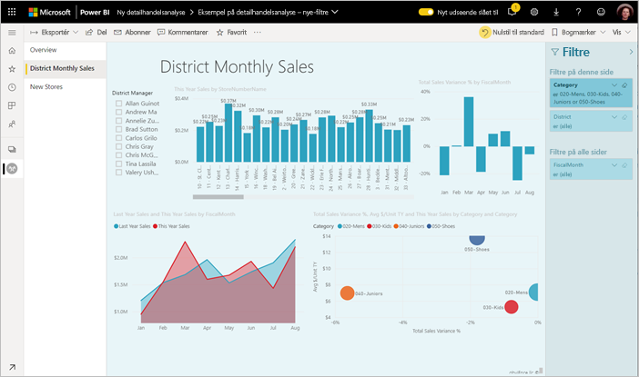
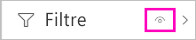
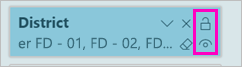
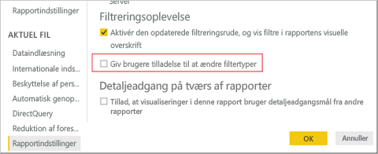

# <a name="the-new-filter-experience-in-power-bi-reports"></a>Den nye filtreringsoplevelse i Power BI-rapporter

Filtrene i Power BI har fået ny funktionalitet og et nyt design. Når du vælger den nye filteroplevelse, kan du formatere filtreringsruden, så den ser ud som i resten af rapporten. Du kan låse og endda skjule filtre. Når du designer din rapport, kan du slet ikke længere se den gamle filtreringsrude i ruden Visualiseringer. Du kan udføre al redigering og formatering af dine filtre i en enkelt filtreringsrude. 



Her er nogle af de opgaver, som du som rapportdesigner kan udføre i den nye Filterrude:

- Tilføj og fjern felter, der kan filtreres efter. 
- Rediger filtertilstanden.
- Formatér og tilpas filtreringsruden, så den føles som en del af rapporten.
- Definer, om ruden Filtre skal være åben eller skjult som standard, når en forbruger åbner rapporten.
- Skjul hele filtreringsruden eller specifikke filtre, som forbrugerne af rapporten ikke skal se.
- Kontrollér og angiv også bogmærke for tilstanden Synlighed, Åben og Skjult for den nye filtreringsrude.
- Lås filtre, som forbrugerne ikke må redigere.

Med den nye filtreringsoplevelse kan rapportforbrugere også pege på en hvilken som helst visualisering for at se en skrivebeskyttet liste over alle de filtre eller udsnit, der påvirker den pågældende visualisering.


## <a name="turn-on-the-new-filter-experience"></a>Slå den nye filteroplevelse til 

Den nye filtreringsoplevelse er som standard slået til for nye rapporter. Du kan aktivere den nye oplevelse for eksisterende rapporter i Power BI Desktop eller i Power BI-tjenesten.

### <a name="turn-on-new-filters-for-an-existing-report-in-power-bi-desktop"></a>Slå nye filtre til for en eksisterende rapport i Power BI Desktop

1. I en eksisterende rapport i Power BI Desktop skal du vælge **Filer** > **Indstillinger** > **Indstillinger**
2. Under **Aktuel fil** skal du vælge **Rapportindstillinger**.
3. Under **Filtreringsoplevelse** skal du vælge **Aktivér den opdaterede filtreringsrude, og vis filtre i rapportens visuelle overskrift**.

### <a name="turn-on-new-filters-for-an-existing-report-in-the-service"></a>Slå nye filtre til for en eksisterende rapport i tjenesten

Hvis du har aktiveret **det nye udseende** i Power BI-tjenesten , aktiveres den nye filtreringsoplevelse automatisk. Læs mere om [det nye udseende i Power BI-tjenesten](service-new-look.md).

Hvis du ikke har aktiveret det nye udseende, kan du alligevel få vist den nye filtreringsoplevelse ved at benytte denne fremgangsmåde.

1. Vælg fanen **Rapporter** på indholdslisten for et arbejdsområde i Power BI-tjenesten.
2. Find den rapport, du vil aktivere, og vælg ikonet **Indstillinger** for den pågældende rapport.
3. Under **Filtreringsoplevelse** skal du vælge **Aktivér den opdaterede filtreringsrude, og vis filtre i rapportens visuelle overskrift**.

    

## <a name="view-filters-for-a-visual-in-reading-mode"></a>Vis filtre for en visualisering i Læsetilstand

I Læsetilstand kan du holde markøren over filterikonet for en visualisering og se en pop op-filterliste med alle de filtre, udsnitsværktøjer m.m., der påvirker denne visualisering. Formateringen af pop op-filterlisten er den samme som formateringen af filtreringsruden. 


Her er de filtertyper, der vises i denne visning: 
- Grundlæggende filtre
- Udsnit
- Tværgående fremhævning 
- Tværgående filtrering
- Avancerede filtre
- Top N-filtre
- Filtre for Relativ dato
- Udsnitsværktøjer til synkronisering
- Filtre for Inkluder/Ekskluder
- Filtre sendt via en URL-adresse

## <a name="build-the-new-filters-pane"></a>Byg den nye filtreringsrude

Efter du har aktiveret den nye filtreringsrude, kan du se den til højre for den rapportside, der som standard er formateret på baggrund af de aktuelle rapportindstillinger. Du kan bruge den nye filtreringsrude til at konfigurere, hvilke filtre der skal inkluderes, og til at opdatere eksisterende filtre i den nye rude. Den nye filtreringsrude viser dig, hvad forbrugerne af din rapport kan se, når du publicerer rapporten. 

1. Dine rapportforbrugere kan som standard se filtreringsruden. Hvis de ikke skal kunne se den, skal du vælge ikonet med øjet ud for **Filtre**.

    

2. Du begynder at bygge din nye filtreringsrude ved at trække de ønskede felter til den nye filtreringsrude enten som en visualisering, en side eller som filtre på rapporteringsniveau.

Når du føjer en visualisering til et rapportlærred, tilføjer Power BI automatisk et filter i filtreringsruden for hvert felt i visualiseringen. 

## <a name="lock-or-hide-filters"></a>Lås eller skjul filtre

Du kan låse eller skjule de enkelte filterkort. Hvis du låser et filter, kan forbrugerne af rapporten se, men ikke ændre det. Hvis du skjuler det, kan de slet ikke se det. Det er typisk nyttigt at skjule filterkort, hvis du har brug for at skjule filtre til dataoprydning, der udelukker Null-værdier eller uventede værdier. 

- I den nye filtreringsrude skal du markere eller fjerne markeringen i ikonerne **Lås filter** eller **Skjul filter** på et filterkort.

   

I takt med at du slår disse indstillinger til og fra i den nye filtreringsrude, kan du se ændringerne blive afspejlet i rapporten. Skjulte filtre vises ikke på pop op-filterlisten for en visualisering.

Du kan også konfigurere tilstanden for den nye filtreringsrude, så den følger dine bogmærker i rapporten. Der kan angives bogmærke for tilstandene Åben, Lukket og Synlighed for ruden.
 
## <a name="format-the-new-filters-pane"></a>Formatér den nye Filtre-rude

En stor del af denne nye oplevelse er, at du kan formatere filtreringsruden, så den matcher udseendet af din rapport. Du kan formatere filtreringsruden forskelligt for hver side i rapporten. Her er de elementer, du kan formatere: 

- Baggrundsfarve
- Baggrundsgennemsigtighed
- Kant slået til eller fra
- Kantfarve
- Skrifttype, farve og tekststørrelse for titel og overskrift

Du kan også formatere disse elementer for filterkort, afhængigt af om de er anvendt (indstillet til noget) eller tilgængelige (ryddet): 

- Baggrundsfarve
- Baggrundsgennemsigtighed
- Kant: til eller fra
- Kantfarve
- Skrifttype, farve og tekststørrelse
- Farve på inputfelt

### <a name="format-the-filters-pane-and-cards"></a>Formatér filtreringsruden og kortene

1. I rapporten skal du klikke på selve rapporten eller baggrunden (*tapetet*), og derefter skal du i ruden **Visualiseringer** vælge **Formatér**. 
    Du kan se formateringsindstillinger for rapportsiden, tapetet samt filtreringsruden og filterkort.

1. Udvid **Filtreringsruden** for at angive farven på baggrunden, ikonet og den venstre kant, som skal komplementere rapportsiden.

    

1. Udvid **Filterkort** for at angive farve og kant for **Tilgængelig** og **Anvendt**. Hvis du angiver forskellige farver for kortene Tilgængelig og Anvendt, er det oplagt, hvilke filtre der anvendes. 
  
    

## <a name="theming-for-filter-pane"></a>Temaer for filtreringsruden
Du kan nu ændre standardindstillingerne for filtreringsruden med temafilen. Her er et eksempel på kodestykke for et tema, der kan hjælpe dig i gang:

 
```
"outspacePane": [{ 

"backgroundColor": {"solid": {"color": "#0000ff"}}, 

"foregroundColor": {"solid": {"color": "#00ff00"}}, 

"transparency": 50, 

"titleSize": 35, 

"headerSize": 8, 

"fontFamily": "Georgia", 

"border": true, 

"borderColor": {"solid": {"color": "#ff0000"}} 

}], 

"filterCard": [ 

{ 

"$id": "Applied", 

"transparency": 0, 

"backgroundColor": {"solid": {"color": "#ff0000"}}, 

"foregroundColor": {"solid": {"color": "#45f442"}}, 

"textSize": 30, 

"fontFamily": "Arial", 

"border": true, 

"borderColor": {"solid": {"color": "#ffffff"}}, 

"inputBoxColor": {"solid": {"color": "#C8C8C8"}} 

}, 

{ 

"$id": "Available", 

"transparency": 40, 

"backgroundColor": {"solid": {"color": "#00ff00"}}, 

"foregroundColor": {"solid": {"color": "#ffffff"}}, 

"textSize": 10, 

"fontFamily": "Times New Roman", 

"border": true, 

"borderColor": {"solid": {"color": "#123456"}}, 

"inputBoxColor": {"solid": {"color": "#777777"}} 

}] 
```

## <a name="sort-the-filter-pane"></a>Sortér filtreringsruden

Brugerdefineret sorteringsfunktionalitet er en del af den nye oplevelse med filtreringsruden. Oprettere af rapporter kan trække og slippe filtre for at omarrangere dem i en hvilken som helst rækkefølge.


Standardsorteringsrækkefølgen er alfabetisk for filtre. Hvis du vil starte en brugerdefineret sorteringstilstand, skal du bare trække et filter til en ny placering. Du kan kun sortere filtre inden for det niveau, som de gælder for – f.eks. et filter på visualiseringsniveau, sideniveau eller rapportniveau.

## <a name="improved-filters-pane-accessibility"></a>Forbedret tilgængelighed i filtreringsruden

Vi har forbedret navigation via tastaturet for den nye filtreringsrude. Du kan bruge tabulator til at bevæge dig gennem alle dele af filtreringsruden og bruge genvejstasten på tastaturet eller Skift + F10 til at åbne genvejsmenuen.


## <a name="rename-filters"></a>Omdøb filtre
Når du redigerer filtreringsruden, kan du dobbeltklikke på titlen for at redigere den. Det er nyttigt at kunne omdøbe filtre, hvis du vil opdatere filterkortet, så det giver mere mening for dine slutbrugere. Husk, at når du omdøber filterkortet, omdøbes det viste navn på feltet på feltlisten *ikke*. Det ændrer blot det viste navn, der bruges i filterkortet.


## <a name="restrict-changes-to-filter-type"></a>Begræns ændringer af filtertype

Under sektionen Filtreringsoplevelse i rapportindstillingerne kan du styre, om brugere kan ændre filtertypen.



## <a name="next-steps"></a>Næste trin

Prøv den nye filteroplevelse. Giv os din feedback på denne funktion, og hvordan vi fortsat kan forbedre den, på [webstedet med Power BI-ideer](https://ideas.powerbi.com/forums/265200-power-bi). 

- [Sådan bruger du rapportfiltre](consumer/end-user-report-filter.md)
- [Filtre og fremhævning i rapporter](power-bi-reports-filters-and-highlighting.md)
- [Forskellige typer af filtre i Power BI](power-bi-report-filter-types.md)

Har du flere spørgsmål? [Prøv at spørge Power BI-community'et](https://community.powerbi.com/)

