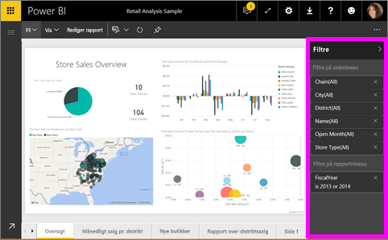
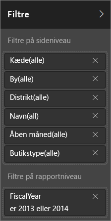
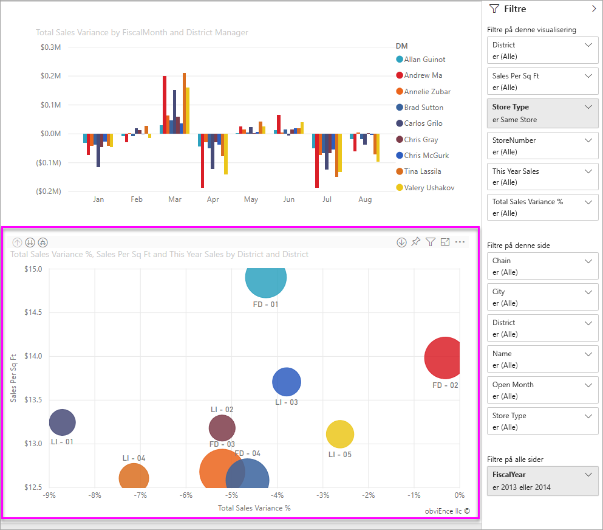
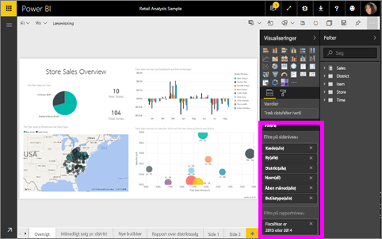

# Om filtre og fremhævning i Power BI-rapporter
***Filtre*** fjerner alt andet end de data, du vil fokusere på.  ***Fremhævning*** er ikke filtrering, da det ikke fjerner data, men i stedet fremhæver et undersæt af de synlige data – ikke fremhævede data forbliver synlige, men nedtonede.

Du kan filtrere og fremhæve rapporter i Power BI på mange forskellige måder. Hvis vi havde inkluderet alle oplysningerne i én artikel, ville det være forvirrende, så vi har opdelt dem som følger:

* Introduktion til filtre og fremhævning (artiklen, du er ved at læse nu)
* De måder, hvorpå du kan [oprette og bruge filtre og fremhævning i redigeringsvisning/rapporter, som du ejer](power-bi-report-add-filter.md). Når du har redigeringsrettigheder til en rapport, kan du oprette, ændre og slette filtre og fremhævning i rapporter.
* De måder, hvorpå du kan [oprette filtre og fremhævning i en rapport, der deles med dig eller i redigeringsvisning for rapporter](service-interact-with-a-report-in-reading-view.md). Her har du færre valgmuligheder, men Power BI giver dig stadig en lang række muligheder for filtrering og fremhævning.  
* [En detaljeret præsentation af de filter- og fremhævningsmuligheder, der er tilgængelige i redigeringsvisning](power-bi-how-to-report-filter.md), herunder et detaljeret indblik i filtertyperne (f.eks. dato og klokkeslæt, numerisk og tekst) og forskellen mellem grundlæggende og avancerede indstillinger.
* Nu hvor du ved, hvordan filtre og fremhævning fungerer som standard, [kan du lære, hvordan du ændrer, hvordan visuelle elementer på en side filtrerer og fremhæver hinanden](service-reports-visual-interactions.md)

> [!TIP]
> Hvordan ved Power BI, hvordan data er knyttet til hinanden?  Programmet bruger relationerne imellem de forskellige tabeller og felter i den underliggende [datamodel](https://support.office.com/article/Create-a-Data-Model-in-Excel-87e7a54c-87dc-488e-9410-5c75dbcb0f7b?ui=en-US&rs=en-US&ad=US) til at få elementer på en rapportside til at interagere med hinanden.
> 
> 

## Introduktion til filtre og fremhævning i rapporter ved hjælp af ruden Filtre

Filtre og fremhævning kan anvendes ved hjælp af ruden **Filtre** eller ved at lave fremhævninger direkte på selve rapporten (ad hoc, se nederst på siden). Ruden Filtre viser de tabeller og felter, der bruges i rapporten, og eventuelle filtre, der anvendes. Filtrene er opdelt i **Filtre på sideniveau**, **Filtre på rapportniveau** og **Filtre på visualiseringsniveau**.  Du kan kun se filtre på visualiseringsniveau, hvis du har valgt et visuelt element på rapportlærredet.

> [!TIP]
> Hvis der står **Alle** ud for filteret, betyder det, at hele feltet inkluderes som et filter.  **Kæde(Alle)** på skærmbilledet nedenfor viser f.eks., at denne rapportside inkluderer data om alle butikskæderne.  På den anden side viser filteret på rapportniveau for **Regnskabsåret er 2013 eller 2014**, at rapporten kun indeholder data for regnskabsårene 2013 og 2014.
> 
> 

## Filtre i læsevisning i forhold til redigeringsvisning
Du kan interagere med rapporter i to forskellige tilstande: [Læsevisning](service-interact-with-a-report-in-reading-view.md) og [Redigeringsvisning](service-interact-with-a-report-in-editing-view.md).  Og de filterfunktioner, der er tilgængelige, afhænger af, hvilken tilstand du er i.

* Du kan tilføje rapport- og sidefiltre samt visualiseringsfiltre i redigeringsvisning. Når du gemmer rapporten, gemmes filtrene sammen med den. Personer, der ser på rapporten i læsevisning, kan arbejde med de filtre, som du har tilføjet, men ikke gemme deres ændringer.
* I læsevisning kan du arbejde med alle side- og visualiseringsfiltre, der allerede findes i rapporten, men du kan ikke gemme dine filterændringer.

### Ruden Filtre i læsevisning
Hvis du kun har adgang til en rapport i læsevisning, ser ruden Filtre cirka sådan ud:

Denne side i rapporten har 6 filtre på sideniveau og 1 filter på rapportniveau.

Vælg et visuelt element for at se, om der eksisterer filtre på visualiseringsniveau. På billedet nedenfor anvendes der 6 filtre på boblediagrammet.

Udforsk data ved at ændre eksisterende filtre i læsevisning. Få mere at vide i artiklen [Interager med filtre i læsevisning](service-interact-with-a-report-in-reading-view.md)

### Ruden Filtre i redigeringsvisning
Når du har ejerrettigheder til en rapport og åbner den i redigeringsvisning, kan du se, at **Filtre** bare er ét ud af flere felter, du kan bruge til redigering.

Som i læsevisning (ovenfor) kan vi se, at denne side i rapporten har 6 filtre på sideniveau og 1 filter på rapportniveau. Og ved at vælge boblediagrammet ser vi, at der anvendes 6 filtre på visualiseringsniveau.

Men i redigeringsvisning kan vi gøre meget mere med filtre og fremhævning. Den vigtigste forskel er, at vi kan tilføje nye filtre. Få mere at vide om, hvordan du gør dette og meget andet i artiklen [Føj et filter til en rapport](power-bi-report-add-filter.md)

## Ad hoc-filtre og -fremhævning
Vælg et felt på rapportlærredet for at filtrere og fremhæve resten af siden. Vælg et tomt område i den samme visualisering for at fjerne det. Denne type filtrering og fremhævning gemmes ikke sammen med rapporten, men det er en sjov, hurtig måde at udforske dataeffekter på. Hvis du vil finjustere, hvordan denne type krydsfiltrering og krydsfremhævning fungerer, kan du se mere under [Visuelle interaktioner](service-reports-visual-interactions.md)

## Næste trin
[Arbejde med filtre og fremhævning (i læsevisning)](service-interact-with-a-report-in-reading-view.md)

[Føj et filter til en rapport (i redigeringsvisning)](power-bi-report-add-filter.md)

[Få en præsentation af rapportfiltre](power-bi-how-to-report-filter.md)

[Rediger, hvordan visuelle elementer i rapporter krydsfiltrerer og krydsfremhæver hinanden](service-reports-visual-interactions.md)

Få mere at vide om [rapporter i Power BI](service-reports.md)

Har du flere spørgsmål? [Prøv Power BI-community'et](http://community.powerbi.com/)

