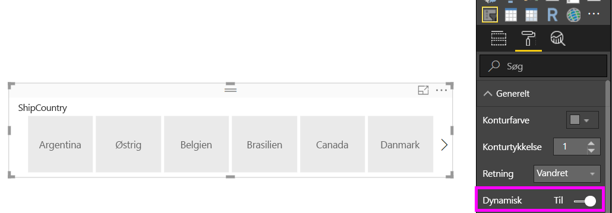

# Opret et dynamisk udsnitsværktøj, som du kan ændre størrelsen på i Power BI

Dynamiske udsnitsværktøjer kan ændres i størrelsen, så de passer til at vilkårligt område i rapporten. Du kan ændre udsnitsværktøjets størrelse og form, fra vandret til firkantet til lodret, og værdierne i udsnitsværktøjet omarrangerer sig selv iht. dine ønsker. I Power BI Desktop og i Power BI-tjenesten kan du oprette vandrette udsnitsværktøjer og gøre udsnitsværktøjer til dato/område dynamiske. Udsnitsværktøjer til dato/område har også forbedrede berøringsområder, så det er lettere at ændre dem med en fingerspids. Du kan gøre dynamiske udsnitsværktøjer så små eller store, som du vil; de ændres også automatisk i størrelsen for at passe godt i rapporter i Power BI-tjenesten og også i Power BI-mobilapps. 

## Opret et udsnit

Det første trin i at oprette et dynamisk udsnitsværktøj er at oprette et grundlæggende udsnitsværktøj. 

1. Vælg  **Udsnitsværktøj** i ruden **Visualiseringer**.
2. Træk feltet, du vil filtrere, hen på **Felt**.

    

## Konvertér til et vandret udsnitsværktøj

1. Med udsnitsværktøjet valgt skal du i ruden **Visualiseringer** vælge fanen **Format**.
2. Udvid sektionen **Generelt**, og vælg derefter **Retning** til at være **Vandret**.

     

1.  Du skal muligvis gøre det større, så det viser flere værdier.

     

## Gør det dynamisk og eksperimenter med det

Dette trin er let. 

1. Direkte under **Retning** i sektionen **Generelt** på fanen **Format** skal du skyde**Dynamisk** over på **Til**.  

    

1. Nu kan du lege med det. Træk i hjørnet for at gøre det kort, højt, bredt og smalt. Du kan gøre det så lille, at det blot bliver et filterikon.

    

## Føj det til en rapport med telefonlayout

I Power BI Desktop kan du oprette et telefonlayout for hver side i en rapport. Hvis en side har et telefonlayout, så vises den på en mobiltelefon i stående visning. Ellers er du nødt til at benytte den liggende visning. 

1. Vælg **Telefonlayout** på menuen **Vis**.

     
    
1. Træk alle de visuelle elementer, der skal være i telefonrapporten, hen til gitteret. Når du trækker det dynamiske udsnitsværktøj, kan du ændre det til den ønskede størrelse – i dette tilfælde blot et filterikon.

    

Læs mere om, hvordan du opretter [rapporter, der er optimeret til Power BI-mobilapps](desktop-create-phone-report.md).

## Gør et udsnitsværktøj til tid eller område dynamisk

Du kan benytte den samme fremgangsmåde til at gøre et udsnitsværktøj til tid eller område dynamisk. Når du har slået **Dynamisk** **Til**, så vil du lægge mærke til et par ting:

- Visuelle elementer optimerer rækkefølgen af inputfelter afhængigt af, hvilken størrelse der er tilladt på lærredet. 
- Dataelementvisningen er optimeret for at gøre udsnitsværktøjet så praktisk anvendeligt som muligt, baseret på størrelsen der er tilladt på lærredet. 
- Nye runde håndtag på udsnitsværktøjerne afhjælper berøringsbevægelser. 
- Når et visuelt element bliver for lille til at være praktisk anvendeligt, så ændres det til et ikon, der repræsenterer den visuelle type. For at interagere med det skal du blot dobbeltklikke for at åbne det i fokustilstand. Det sparer værdifuld plads på rapportsiden, uden at funktionaliteten går tabt.

## Næste trin

- [Udsnitsværktøjer i Power BI-tjenesten](power-bi-visualization-slicers.md)
- Har du flere spørgsmål? [Prøv at spørge Power BI-community'et](http://community.powerbi.com/)