# Bedste praksis for design af rapporter og visuals
<!-- Shared newnav Include -->
[!INCLUDE [newnavbydefault](./includes/newnavbydefault.md)]

## Introduktion
Dette whitepaper indeholder de bedste praksisser for design af rapporter i Power BI. Den begynder med planlægning og diskuterer de designprincipper, du kan anvende på dine rapporter samt på de sider og visualiseringer, der udgør rapporten.  Mange af disse bedste praksisser gælder også for dashboarddesign.

Vi håber, at du kan bruge dette whitepaper som udgangspunkt, og du vil anvende det, du lærer, på dine egne rapporter og visuals, samt at du vil fortsætte samtalen på community.powerbi.com. BI-rapportdesign og brug af visualisering er et varmt emne i øjeblikket, og der er mange meningsdannere, bloggere og websteder der virkelig går i dybden med dette emne (vi har angivet nogle stykker i slutningen).   

> [!NOTE]
> De anbefalinger, der gives i dette whitepaper, er retningslinjer, du kan anvende, når og hvor det giver mening. For hvert af de principper, vi beskriver nedenfor, er der som regel gyldige grunde til at "bryde reglen".
> 
> 

*Vi bliver overvældet med oplysninger – ikke fordi der er for mange, men fordi vi ikke ved, hvordan vi skal holde styr på dem.*
-- Stephen Few

## Kast et blik på landskabet og terminologien
I Power BI kan en rapport have en eller flere rapportsider, og alle siderne tilsammen kaldes for rapporten. Rapportens grundlæggende elementer er visuals (også kaldet visualiseringer), enkeltstående billeder og tekstfelter. Det er et utal af formateringsmuligheder – fra de enkelte datapunkter over elementerne i rapporten til selve rapportsiden.

Vi starter med planlægningen af rapporten og fortsætter med grundlæggende principper for rapportdesign. Derefter drøfter vi principper for design af visuals og slutter af med en diskussion af bedste praksisser for de enkelte typer af visuals.

Du kan finde dybdegående vejledning og instruktioner til oprettelse og brug af Power BI-rapporter på **powerbi.com > Lær**.

## Før du opretter din første visualisering, skal du fokusere på kravene
Oprettelsen af en rapport begynder, før du opretter din første visual, fordi en god rapport kræver planlægning.  Vær klar over, hvilke data du har at arbejde med, og skriv kravene til rapporten ned. Spørg dig selv "Hvad er de forretningsmæssige behov, hvordan skal disse data bruges og af hvem?" Et afgørende spørgsmål er "hvilke beslutninger vil læseren gerne være i stand til at træffe på baggrund af denne rapport?"

Svaret på disse spørgsmål driver dit design. Alle rapporter fortæller en historie. Sørg for, at denne historie stemmer overens med de forretningsmæssige behov. Det kan være fristende at tilføje visuals, der viser dramatisk indsigt, men hvis denne indsigt ikke stemmer overens med de forretningsmæssige behov, så er rapporten ikke nyttig – og faktisk kan disse visuals ende med at være distraherende for brugerne. Du kan også komme ud for, at de oplysninger, der skal bruges for at træffe denne beslutning, ikke kan aflæses ud fra disse data. Kan denne rapport bruges til at måle, hvad der er behov for?

Rapporter kan bruges til at overvåge, afdække, spore, forudsige, måle, administrere, teste og meget mere. Hvis det forretningsmæssige behov f.eks. er en salgsrapport, der måler resultater, kan du oprette en rapport, der ser på det aktuelle salg, sammenligner det med tidligere salg, sammenligner med konkurrenter og medtager nogle KPI'er, der udløser beskeder.  Måske lan læseren dykke ned i salgstallene for at undersøge store aftaler eller problemer med forsyningskæden, der kan have indflydelse på salget.  En anden detailudledning er at se salg efter butik, område, produkt, sæson og meget mere.

Kend kunderne til rapporten, og design en rapport, det benytter velkendt terminologi og leverer data med et detalje- og kompleksitetsniveau, som passer til kundernes vidensniveau. Har du mere end én type kunde? Én størrelse passer ikke altid alle. Design separate rapportsider baseret på ekspertise, og sørg for at navngive alle sider tydeligt, så kunderne kan selv kan finde rundt. En anden mulighed er at bruge udsnitsværktøjer, så kunderne selv kan skræddersy siden til dem selv. Involver kunden i planlægningsfasen for at undgå at komme til at lave det, du tror, kunden har brug for.  Vær forberedt på at starte forfra og gentage.

Når du har identificeret de forretningsmæssige behov, de kunder og de metrikværdier, du vil medtage, er det næste trin at vælge de rette visuals til at fortælle historien og præsentere disse visuals på den mest virkningsfulde måde. Det er et stort emne, og vi starter med nogle grundlæggende principper for rapportdesign.

## Principper for rapportdesign
En rapportside har begrænset plads, og en af de sværeste ting er at finde plads til alle de ønskede elementer – og at sørge for, at disse oplysninger er nemme at forstå. Undervurder ikke værdien af "flot". Nøglen er at finde balancen mellem flot og nyttig.

Lad os kaste et blik på layout, tydelighed og æstetik.

### Layout – rapportens lærred
Rapportens lærred har en begrænset mængde plads.  Hvis du ikke kan få plads til alle elementerne på en enkelt rapportside, kan du opdele rapporten i sider.  En rapportside kan tilpasses til en bestemt målgruppe (f.eks. HR, it, salg, SLT) eller til et bestemt forretningsspørgsmål (f.eks.: Hvordan påvirker defekter vores nedetid?, Hvordan påvirker vores marketingkampagne stemningen?) eller som en fortløbende historie (f.eks. hvor første side er en oversigt eller noget, der fanger læserens opmærksomhed, anden side fortsætter datahistorien, og tredje side dykker dybere ned i historien osv.).  Hvis hele din rapport kan være på en enkelt side, er det bare fint. Hvis den ikke kan være der, kan du oprette separate rapportsider, der på logisk vis grupperer indholdet.  Og glem ikke at give siderne meningsfulde og nyttige navne.

Tænk på det som at indrette et kunstmuseum. Du ville ikke hænge 50 kunstværker i et lille lokale, fylde det med stole og male hver væg i forskellige farver. Som museumsinspektør ville du kun vælge de kunstværker, der har et fælles tema, anbringe dem spredt i lokalet med god plads til, at de besøgende kan bevæge sig og tænke, og sætte kort op med oplysninger, som beskriver det, de ser på. Og der er en grund til, at de fleste moderne kunstmuseer har neutrale vægge!
I denne artikel starter vi med et eksempel på en rapport, der kræver en masse arbejde.  I takt med at vi anvender vores bedste praksisser og designprincipper, bliver vores rapport bedre.

**Figur 1:    Denne grimme rapportside kræver meget arbejde**

Ovenstående eksempel har mange pladsrelaterede (layoutmæssige) designproblemer, som vi diskuterer nedenfor:

* justering, orden og brug af nærhed
* dårlig brug af plads og sortering
* rod

### Justering, orden og nærhed
Layoutet for dine rapportelementer påvirker forståelsen og guider læseren gennem rapportsiden. Måden hvorpå du anbringer og positionerer elementer, fortæller en historie.  Historien kunne være "start her, og se derefter her" eller "disse 3 elementer er relateret til hinanden".

* I de fleste kulturer scanner folk fra venstre mod højre og oppefra og ned. Placer det vigtigste element i øverste venstre hjørne af rapporten. Og organiser resten af de visuelle elementer på en måde, der fører til en logisk navigation og forståelse af oplysningerne.
* Anbring elementer, der kræver, at læseren træffer et valg, til venstre for de visualiseringer, valget påvirker: f.eks. udsnit.
* Anbring relaterede elementer tæt på hinanden. Nærhed antyder, at elementerne er relaterede.
* En anden måde at udtrykke en relation på er at tilføje en kant eller en farvebaggrund omkring relaterede elementer. Omvendt kan du tilføje en delelinje for at skelne mellem forskellige afsnit af en rapport.
* Brug blanktegn til visuelt at adskille sektioner på rapportsiden.
* Udfyld rapportsiden. Hvis der er områder med tom plads, kan du gøre dine visualiseringer større eller gøre lærredet mindre.
* Vær bevidst om størrelsen af dine rapportelementer. Lad ikke den tilgængelige plads bestemme størrelsen på en visualisering.
* Gør vigtige elementer større end de øvrige, eller tilføj et visuelt element som f.eks en pil for at tiltrække opmærksomhed.
* Juster elementerne på rapportsiden enten symmetrisk eller bevidst asymmetrisk.

Lad os se nærmere på justering.

#### Justering
Justering betyder ikke, at de forskellige komponenter skal have den samme størrelse, eller at du skal have det samme antal komponenter på hver række i rapporten. Det betyder bare, at der er en struktur på siden, der hjælper med navigation og læsning.

Vi kan se i vores opdaterede rapport nedenfor, at rapportens komponenter nu er justeret i venstre og højre kant, og hver række i rapporten er justeret vandret og lodret. Vores udsnitsværktøjer er til venstre for de visuals, de påvirker.

**Figur 2:    Vores grimme rapporteksempel forbedret med redigeringer i layoutet**

Power BI indeholder værktøjer, der hjælper dig med at justere dine visuals. I Power BI Desktop kan du, når flere visuals er markeret, bruge indstillingen **Juster eller distribuer** på båndfanen **Visuelle elementer** for at matche placeringen af visuals.

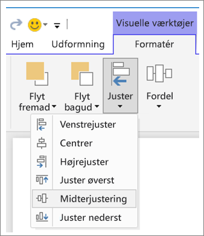

**Figur 3:    Juster visuals i Power BI Desktop**

I Power BI Online og Power BI Desktop har du også nøjagtig kontrol over størrelsen og placeringen af visuals via fanen **Generelt** i formateringsruden for alle visuals:

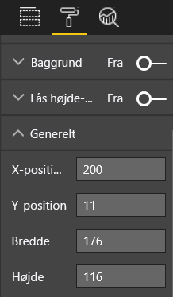

**Figur 4:    Angiv den nøjagtige placering af din visual**

På vores eksempelrapportside (Figur 2) er de to kort og en stor kant justeret på **X-positionen** ved 200.

#### Tilpas til pladsen
Få mest muligt ud af den plads, du har.  Hvis du ved, hvordan rapporten bliver set/vist, skal du tage højde for det i dit design. Reducer tom plads for at udfylde lærredet.  Gør alt, hvad du kan for at fjerne behovet for rullepaneler på individuelle visuals.  Udfyld pladsen uden at få din visual til at se indeklemt ud.

##### Tilpas størrelsen på siden
Når du reducerer sidestørrelsen, blive de enkelte elementer større i forhold til siden som helhed. Gør dette ved at fjerne markeringen af visuals på siden og ved at bruge fanen **Sidestørrelse** i formateringsruden.  

Her er en rapportside med sidestørrelsen 4:3 og derefter med 16:9. Bemærk, hvordan layoutet passer meget bedre til 16:9. Der er endda plads nok til at fjerne rullepanelet fra den anden visual.

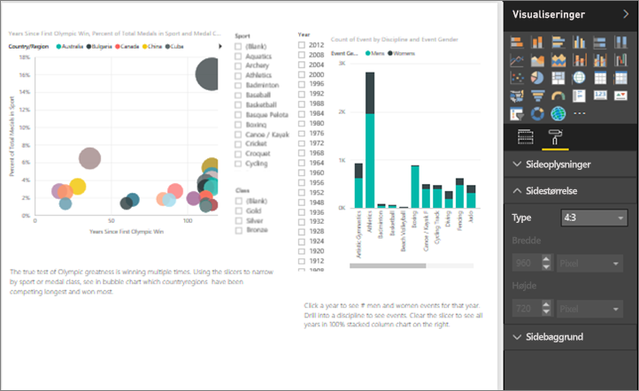

**Figur 5a:    Rapporten med sidestørrelse 4:3**

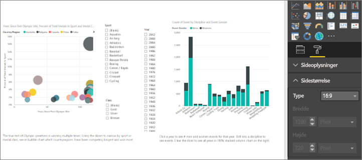

**Figur 5b:    Rapporten med sidestørrelse 16:9**

Bliver rapporten vist i 4:3, 16:9 eller et andet højde-bredde-forhold? På små skærme eller store skærme? Eller i alle mulige skærmforhold og -størrelser?  Lav dit design med dette i tankerne.

Vores eksempelrapportside ser lidt indeklemt ud. Åbn formateringsruden, mens der ikke er markeret nogen visual, ved at vælge ikonet med malerullen. Udvid **Sidestørrelse**, og skift **Højde** til 900.

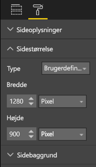

**Figur 6:    Forøg sidehøjde**

#### Reducer rod
En rodet rapportside vil være svær at forstå med et hurtigt øjekast og kan virke så overvældende, at læserne ikke engang forsøger.  Fjern alle unødvendige elementer i rapporten. Tilføj ikke dikkedarer, der ikke bidrager til forståelsen eller navigationen. Din rapportside skal udtrykke oplysningerne så klart og hurtigt og sammenhængende som muligt.

Edward Tufte kalder det for "data-ink ratio" (data til blæk-forhold) i sin bog *The Visual Display of Quantitative Information*.  Grundlæggende drejer det sig om at fjerne alle elementer, der ikke er vigtige.

Det rod, du fjerner, giver mere tom plads på rapportsiden og giver dig mere plads til at anvende de bedste praksisser, vi har lært om ovenfor i afsnittet "Justering, orden og nærhed".

Her ser vores eksempel allerede bedre ud. Vi har fjernet en masse rod og tilføjet figurer for at gruppere elementer sammen.  Baggrundsbilledet er væk, den unødvendige pilefigur og tekstfeltet er væk, én visual er blevet flyttet til en anden side i rapporten osv. Vi har også forlænget sidestørrelsen for at øge mængden af tom, hvid (gul?) plads.

**Figur 7:    Vores grimme rapporteksempel uden rod**

### Fortæl en historie ved første øjekast
Den overordnede test bør være, at nogen uden forudgående kendskab hurtigt skal kunne forstå rapporten uden nogen forklaring fra nogen. Med et hurtigt øjekast skal læseren hurtigt kunne se, hvad siden drejer sig om, og hvad hvert diagram eller hver tabel drejer sig om.   

Når læseren ser på din rapport, skal deres øjne blive tiltrukket af det element, du vil have dem til at se på først, og derefter vil deres øjne fortsætte fra venstre mod højre og oppefra og nedad.  Du kan lave om på dette ved at tilføje visuelle effekter som navne på tekstfelter, figurer, kanter, størrelse og farve.  

#### Tekstfelter
Nogle gange er titlerne på visualiseringerne ikke nok til at fortæller historien.  Tilføj tekstfelter for at kommunikere med de personer, der ser dine rapporter.  Tekstfelter kan beskrive rapportsiden, en gruppering af visuals eller beskrive en enkelt visual. De kan forklare resultaterne eller på bedre vis definere en visual, komponenter i en visual eller relationer mellem visuals. Tekstfelter kan bruges til at tiltrække opmærksomhed baseret på forskellige kriterier, der defineres i tekstfeltet.

Vælg **Tekstfelt** i den øverste menulinje i Power BI-tjenesten. (I Power BI Desktop skal du vælge **Tekstfelt** i området **Indsæt** på båndet).

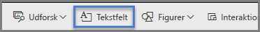

**Figur 8:    Tilføj et tekstfelt**

Skriv i det tomme felt, og brug derefter kontrolelementerne nederst til at angive skrifttype, størrelse, justering og meget mere. Brug håndtag til at tilpasse størrelsen på feltet.

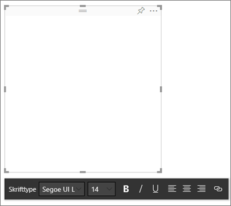

**Figur 9:    Formatér tekstfeltet**

Men lad være med at overdrive! For meget tekst på en rapport er distraherende og fjerner opmærksomheden fra dine visuals. Hvis din rapportside kræver en hel masse tekst for at gøre den forståelig, skal du starte forfra.  Kan du vælge en anden visual, der i sig selv kan fortælle en bedre historie? Kan du ændre din visuals oprindelige titel for at gøre den mere forståelig?   

#### Tekst
Opret en vejledning til teksttypografi, og anvend den på alle sider i rapporten. Vælg kun nogle få skrifttyper, tekststørrelser og farver.  Du skal ikke kun anvende denne vejledning på tekstelementer, men på de skrifttypevalg, du foretager i dine visuals (se Titler og navne, der er en del af visualiseringerne, nedenfor). Angiv regler for, hvornår du skal bruge fed, kursiv, større skriftstørrelse, bestemte farver og meget mere.  Prøv at undgå kun at bruge store bogstaver eller understregning.

#### Figurer
Figurer kan bidrage til navigationen og forståelsen. Brug figurer til at gruppere relaterede oplysninger sammen og fremhæve vigtige data, og brug pile til at styre læserens øjne. Figurer hjælper læserne med forstå, hvor de skal starte, og hvordan de skal tolke din rapport. Når vi taler om design, kaldes det ofte for *kontrast*.

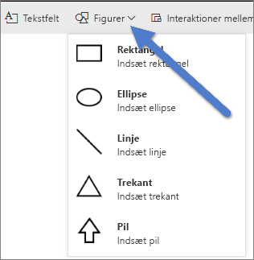

**Figur 10a:    Figurer i Power BI-tjenesten**

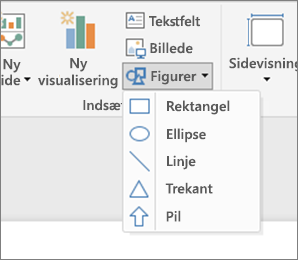

**Figur 10b:    Figurer i Power BI Desktop**

Hvordan ser vores eksempelside ud nu?  Figur 11 viser en renere, mindre rodet side med en konsekvent brug af tekstflader, skrifttyper og farver.  Vores titel i øverste venstre hjørne fortæller os, hvad siden drejer sig om.

**Figur 11:    Vores rapporteksempel med retningslinjer for tekst anvendt og titel tilføjet**

I vores eksempel er der blevet tilføjet en sidetitel i det øverste venstre hjørne, som er det første sted, læserne kigger. Skriftstørrelsen er 28, og skrifttypen er Segoe Bold, så den skiller sig ud fra resten af siden.  Vores vejledning til teksttypografi dikterer ingen baggrunde, sorte titler, forklaringer og navne, og den er blevet anvendt på alle visuals på siden, hvor det var muligt (kombinationsfeltets diagramakser og navne kan ikke redigeres).  Derudover:

* Kort: **Kategorietiket** indstillet til Fra, **Titel** Til og angivet til 12 pkt. sort centreret.
* Titler på visuals (hvis aktiveret): indstillet til 12 pkt. og venstrejusteret.
* Udsnitsværktøjer: **Sidehoved** slået Fra, **Titel** slået Til. Lad **Elementer** > **Tekst** være grå og 10 pkt.
* Punktdiagrammer og søjlediagrammer: sort skrifttype for X- og Y-akserne og X- og Y-aksetitlerne, hvis de bruges.

#### Farve
Brug farve for ensartethed.  Vi taler mere om farve i Principper for design af visuals nedenfor. Men her henviser vi til, at du skal træffe bevidste farvevalg, så det ikke er med til at hindre læserne i hurtigt at kunne forstå din rapport.  For mange strålende farver bombarderer sanserne. Dette afsnit handler mere om, hvad man ikke skal gøre med farver.

#### Baggrunde
Når du angiver baggrunde til rapportsider, skal du vælge farver, som ikke overskygger rapporten, passer dårligt sammen med andre farver på siden eller generelt bare gør ondt i øjnene. Vær bevidst om, at nogle farver har en indbygget betydning.  I USA tolkes rød i en rapport f.eks. som "dårligt".

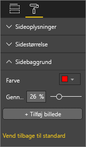

**Figur 12: Angiv rapportens baggrund**

Du er ikke ved at lave et kunstværk, men en funktionel rapport. Vælg en farve, der øger elementernes læselighed og får dem til at træde frem i rapporten.  

Ifølge en undersøgelse af brugen af farve og visualiseringer på websider øger større kontraster mellem farver forståelseshastigheden (The effect of text and background colour on visual search of Web pages og **Determining Users’ Perception of Web Page Visual Complexity and Aesthetic Characteristics**).

Vi har anvendt nogle af disse bedste praksisser for farvevalg i vores eksempelrapport (Figur 20 og 21) nedenfor. Det mest bemærkelsesværdige er, at vi har ændret baggrundsfarven til sort.  Gul blev for lyst og var anstrengende for øjnene.  Og i diagrammet "Count of athlete name by year and medal class" gik den gule del af søjlerne i et med den gule baggrund.  Ved hjælp af en sort (eller hvid) baggrund får vi maksimal kontrast, og vores visuals bliver vores fokuspunkt.

Her er de ekstra ting, vi har gjort for at forbedre eksempelrapporten:

**Sidetitel**

Da vi ændrede baggrunden til sort, forsvandt vores titel, fordi tekstfelt kun tillader sort skrifttype.   Dette problem kan løses ved at tilføje en tekstfelttitel i stedet for.  Med tekstfeltet markeret skal du slette teksten på fanen Visualiseringer, vælge **Titel** og slå den Til. Vælg pilen for at udvide indstillingerne for **Titel**, skriv **Summer Olympic Games** i feltet **Titeltekst**, og vælg hvid **Skriftfarve**.

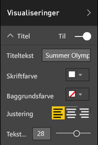

**Figur 13: Tilføj en sidetitel**

**Kort**

For kortvisuals skal du åbne formateringsruden (ikonet med malerullen) og slå **Baggrund** Til. Vælg hvid med en gennemsigtighed på 0 %. Slå derefter **Titel** Til, Vælg **Skriftfarve** hvid og **Baggrundsfarve** sort.

**Udsnitsværktøjer**

Indtil nu havde to udsnitsværktøjer forskellig formatering, hvilket ikke giver mening rent designmæssigt. Skift baggrundsfarven til akvamarin for begge udsnitsværktøjer.  Akvamarin er et godt valg, fordi den er en del af sidens farvepalet – du kan se den i det udfyldte kort, trækortet og søjlediagrammet.

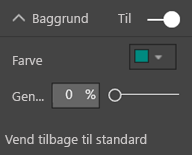

**Figur 14: Skift udsnitsværktøjets baggrundsfarve**

Tilføj en tynd hvid kant.

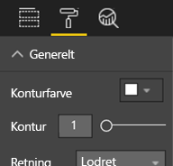

**Figur 15: Føj en kant til udsnitsværktøjet**

Den grå skrifttype er svær at se op mod akvamarin, så du skal ændre farven for **Elementer** til hvid.

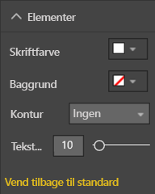

**Figur 16: Skift skriftfarven for udsnitsværktøjet**

Og til sidst skal du under **Titel** ændre **Skriftfarve** til hvid og tilføje sort som **Baggrundsfarve**.

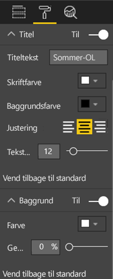

**Figur 17: Formatér titel på udsnitsværktøj**

**Rektangulær figur**

Rektanglet er også forsvundet i den sorte baggrund.  For at løse dette kan du markere figuren og slå **Baggrund** til i ruden **Formatér figur**.

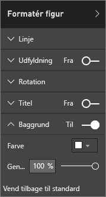

**Figur 18: Formatér figuren**

**Søjlediagrammer, boblediagram, udfyldt kort og trækort**

Tilføj en hvid baggrund på de resterende visuals på rapportsiden. På formateringssiden skal du udvide indstillingen **Streg** og angive **Stregfarve** til hvid og **Tykkelse** til 3.

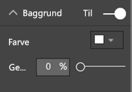

**Figur 19: Føj en hvid baggrund til de resterende visualiseringer**

**Figur 20: Rapporteksempel med bedste praksisser for farver anvendt (sort baggrund)**

**Figure 21:    Rapporteksempel med bedste praksisser for farver anvendt (hvid baggrund)**
 

### Æstetik
Meget af det, vi forstår ved æstetik, er allerede blevet diskuteret ovenfor: ting som justering, farve, skrifttypevalg, rod.  Men der er nogle få andre bedste praksisser for rapportdesign, som er værd at nævne, og disse drejer sig om rapportens overordnede udseende.  

Husk, at formålet med rapporten er at opfylde et forretningsmæssigt behov – ikke at være flot.  Men lidt flot bør den dog være, især når det drejer sig om førstehåndsindtryk. Markedsføringskonsulenten Tony Bodoh forklarer "Vores følelser vækkes et halvt sekund, før logikken kan nå at virke".  Læserne vil først reagere på din rapportside ud fra deres følelser, før de tager sig bedre tid til at gå i dybden. Hvis siden virker rodet, forvirrende, uprofessionel ... så opdager læseren måske aldrig den stærke historie, den fortæller.

TDI-blogger og brancheanalytiker hos TechTarget, Wayne Eckerson, har en glimrende analogi.  At designe en rapport er som at indrette et værelse.  Man kan med tiden købe en vase, en sofa, et bord, et maleri.  Hver for sig kan du godt lide alle disse ting. Men selvom hvert enkelt valg giver mening, passer alle objekterne ikke sammen eller de konkurrerer om opmærksomheden.

Koncentrer dig om:

* At skabe et fælles tema eller udseende for rapporten, og anvend det på alle sider i rapporten
* At bruge enkeltstående billeder og andre grafikelementer til at understøtte og ikke fjerne opmærksomheden fra den egentlige historie
* Og at anvende alle de bedste praksisser, der er blevet omtalt i artiklen indtil nu.

## Principper for design af visuals
Vi har set på principper for rapportdesign: hvordan man organiserer rapportens elementer på en måde, som gør det nemt hurtigt at forstå rapporten.  Nu skal vi se på designprincipper for visuals i sig selv.  Og i det næste afsnit går vi i dybden med enkeltstående visuals og drøfter bedste praksisser for nogle af de mere almindeligt anvendte typer.

I dette afsnit lader vi vores eksempelrapportside ligge i et stykke tid og ser på andre eksempler.  Når vi har gennemgået principperne for design af visuals, vender vi tilbage til vores eksempelside og anvender det, vi har lært (med en trinvis vejledning).  

### Planlægning – vælg den rette visual
Ligesom det er vigtigt at planlægge din rapport, før du går i gang med oprettelsen, kræver hver enkelt visual også planlægning.  Spørg dig selv: "Hvilken historie forsøger jeg at fortælle med denne visual?" Og find derefter ud af, hvilken type visual, der bedst fortæller historien. Du kan vise fremskridt gennem en salgscyklus i form af et liggende søjlediagram, men ville et vandfaldsdiagram eller et tragtformet diagram ikke fortælle det bedre? Hvis du vil have hjælp til dette, skal du læse det sidste afsnit i dette whitepaper "Typer af visuals og bedste praksisser", som beskriver de bedste praksisser for nogle af de mere almindelige typer.  Bliv ikke overrasket, hvis den første type visual, du vælger, ikke ender med at være det bedste valg.  Prøv med mere end én type visual for at se, hvilken en der bedst leverer din pointe.

Forstå forskellen mellem kategoriske og kvantitative data, og forstå, hvilke visualtyper der fungerer bedst med de forskellige datatyper. Kvantitative data kaldes ofte for målinger, og det er typisk numeriske data. Kategoriske data kaldes ofte for dimensioner og kan klassificeres. Dette går vi i dybden med i "Vælg den rette måling" nedenfor.

Modstå den fristelse, det er, at bruge smarte eller mere komplekse typer visuals bare for at få rapporten til at se mere imponerende ud. Du skal gå efter den mest enkle måde at formidle din historie på. Vandrette liggende søjlediagrammer og simple kurvediagrammer kan hurtigt formidle oplysninger.  De er velkendte og praktiske, og de fleste læsere kan nemt fortolke dem.  Endnu en fordel er, at de fleste personer læser fra venstre mod højre og oppefra og nedad, og disse to diagramtyper kan derfor hurtigt skimmes og forstås.

Skal der rulles i din visual, for at den fortæller historien? Undgå behovet for rulning, hvis det er muligt.  Prøv at anvende filtre og hierarkier/detailudledning, og hvis dette ikke fjerner behovet for rullepanelet, bør du overveje at vælge en anden type visual. Hvis du ikke kan undgå rulning, er vandret rulning bedre end lodret rulning.

Selv når du vælger den absolut bedste visual for historien, kan du stadig have brug for hjælp til at fortælle historien.  Det er her, navne, titler, menuer, farve og størrelse kommer ind i billedet. Vi diskuterer disse designelementer senere i afsnittet "Designelementer".

### Vælg den rette måling
Fortæller din visual en overbevisende historie? Betyder det noget?  Du skal ikke oprette visuals bare for at oprette visuals. Måske har du tænkt, at dataene ville fortælle en interessant historie, men det gør de ikke. Du skal ikke være bange for at starte forfra og prøve at finde en mere interessant historie. Eller måske er historien der, men den skal måles på en anden måde.

Det kan f.eks. være, at du vil måle dine salgschefers resultater. Hvilken måling ville du bruge til at gøre dette?  Vil du bedst kunne måle det ved at kigge på det samlede salg, den samlede fortjeneste, vækst i løbet af det seneste år eller resultat i forhold til en målsætning? Sælgeren Sally skaber måske den bedste fortjeneste, og hvis du viser den samlede fortjeneste efter de enkelte sælgere i et liggende søjlediagram, ville hun fremstå som en rockstjerne sammenlignet med de andre sælgere.  Men hvis Sally har høje salgsomkostninger (rejseudgifter, leveringsomkostninger, produktionsomkostninger osv.), får vi ikke hele historien med ved kun at kigge på salget.

#### Afspejl virkeligheden / undgå at forvrænge virkeligheden
Det er muligt at oprette en visual, der fordrejer sandheden. Der findes et websted, hvor dataentusiaster deler "dårlige" visuals. Og det gennemgående tema i kommentarerne er skuffelse over den virksomhed, der har oprettet og distribueret den pågældende visual.  Den sender et budskab, man ikke kan stole på.

Så sørg for at oprette visuals, der ikke bevidst fordrejer virkeligheden, og som ikke er manipuleret til at fortælle den historie, du vil have dem til at fortælle.  Her er et eksempel:

**Figur 22:    Diagram, der fordrejer virkeligheden**

Det ser ud som om, der er stor forskel på de fire virksomheder, og at CorpB har meget større succes end de tre andre i dette eksempel.  Men bemærk, at X-aksen ikke starter på nul, og at forskellen mellem virksomhederne sandsynligvis ligger inden for fejlmargenen.  Her er de samme data med en X-akse, der starter ved nul.

**Figur 23:    Realistisk diagram**

Læserne forventer og antager ofte, at X-aksen starter ved nul. Hvis du beslutter ikke at starte ved nul, skal du gøre det på en måde, som ikke fordrejer resultaterne, og overveje at tilføje et visuel tip eller et tekstfelt for at gøre opmærksom på denne afvigelse fra normen.  

### Designelementer
Når du har valgt en type og en måling og oprettet en visual, er tiden kommet til at finjustere visningen for at opnå den største effekt.  Dette afsnit omhandler følgende:

* Layout, mellemrum og størrelse
* Tekstelementer: navne, anmærkninger, menuer, titler
* Sortering
* Visuel interaktion
* Farve

#### Tilpasning af visuals for at udnytte pladsen optimalt
Hvis du forsøger at få plads til flere diagrammer i en rapport, kan det hjælpe med at få historien til at træde frem, hvis du maksimerer dit data til blæk-forhold. Som nævnt ovenfor har Edward Tufte opfundet udtrykket "data-ink ratio" (data til blæk-forhold): Formålet er at fjerne så mange mærker fra et diagram som muligt, uden at det hæmmer læserens evne til at fortolke dataene.

I den første række diagrammer nedenfor er der overflødige aksenavne (Jan 2014, Apr 2014 osv.) og titler ("by Date"). Titlerne på hvert diagram kræver også dedikeret vandret plads på tværs af hvert diagram. Ved at fjerne diagramtitlerne og aktivere individuelle aksenavne fjerner vi noget blæk og udnytter den samlede mængde plads bedre. Vi kan fjerne aksenavnene på de øverste to diagrammer for yderligere at reducere blækmængden og bruge mere plads til data.

Hvis der er bestemte tidsperioder, du vil fremhæve, kan du tegne streger eller rektangler bag alle diagrammerne for at hjælpe med at trække læserens blik op og ned for at lave sammenligninger.

**Figur 24:    Før**

**Figur 25:    Efter**

**Sådan slår du aksetitler til eller fra**

Markér en visual for at aktivere den, og åbn ruden Formatering. Udvid indstillingerne for **X-aksen** eller **Y-aksen**, og træk skyderen for **Titel** til eller fra.

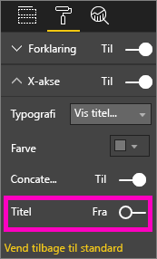

**Figur 26:    Sådan slår du aksetitler til og fra**

**Sådan slår du aksenavne til og fra**

Markér en visual for at aktivere den, og åbn ruden Formatering. Der er skydere ud for **X-aksen** og **Y-aksen**.  Træk i skyderen for at slå aksenavne til eller fra.

**Figur 27: Sådan slår du aksenavne til og fra**

> [!TIP]
> Et scenarie, hvor måske vil slå Y-aksenavne fra, kunne være, hvis du har haft **Datanavne** slået til.
> 
> 

**Sådan fjernes titler på visuals**

Markér en visual for at aktivere den, og åbn ruden Formatering. Indstil skyderen for **Titel** til Fra.

**Figur 28:    Fjern titler fra visuals**

Overvej, hvordan læserne vil få vist rapporten, og sørg for, at visuals og tekst er store nok og mørke nok til at være læselige. Hvis du har en forholdsmæssigt stor visual på siden, kan læserne antage, at den er det vigtigste. Sørg for nok plads mellem de enkelte visuals, så rapporten ikke virker rodet og forvirrende.  Juster dine visuals, så du kan styre læserens øjne.

**Sådan tilpasser du størrelsen på en visual**

Markér den pågældende visual for at aktivere den. Træk i et af håndtagene for at justere størrelsen.

**Figur 29: Tilpas størrelsen på en visual**

**Sådan flytter du en visual**

Markér den pågældende visual for at aktivere den. Vælg og hold museknappen nede på gribelinjen øverst i midten af din visual, og træk den til den nye placering.

**Figur 30: Flyt en visual**

#### Titler og navne, som er en del af visualiseringerne
Sørg for, at titler og etiketter er læselig og ikke kræver nogen forklaring. Tekst i titler og navne skal have en optimal størrelse med farver, som træder frem (f.eks. sort i stedet for grå, som er standard). Husker du vores vejledning til typografi (se "Tekst" ovenfor)? Begræns antallet af farver og størrelser – for mange forskellige skriftstørrelser og farver får siden til at virke overfyldt og forvirrende.  Overvej at bruge samme skriftfarve og -størrelse i titlerne på alle visuals på en rapportside, og vælg den samme justering for alle titler på en rapportside.  

**Formateringsruden**

For hver af de formateringsjusteringer, der er anført nedenfor, skal du vælge ikonet med malerullen for at åbne ruden Formatering.

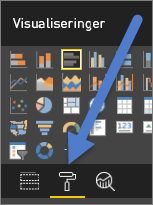

**Figur 31: Åbn ruden Formatering**

Vælg det visuelle element, der skal justeres, og sørg for, at det er indstillet til Til. Eksempler på visuelle elementer er: **X-aksen**, **Y-aksen**, **Titel**, **Datanavne** og **Forklaring**. I eksemplet nedenfor vises elementet **Titel**.

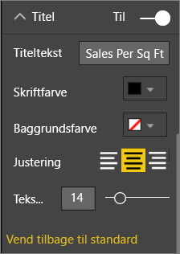

**Figur 32: Formatér en visualtitel**

**Angiv tekststørrelsen**

Tekststørrelsen kan tilpasses for titler og datanavne, men ikke for X- eller Y-akserne eller forklaringer.  Specifikt for datanavne skal du prøve at lege med **Vis enheder** og antallet af **Decimaler**, indtil du finder det optimale detaljeniveau til visningen af din rapport.   

**Angiv tekstjusteringen**

Valgmulighederne for justering af titel er venstrejusteret, højrejusteret og centreret.  Vælg en, og anvend den samme indstilling på alle visuals på siden.  

**Angiv tekstplaceringen**

Placering af tekst kan tilpasses for nogle Y-akser og for forklaringen.   Uanset hvad du vælger, skal du gøre det samme for de andre Y-akser og andre forklaringer på siden.

**Angiv længde på titel og navn**

Juster længden på titler, aksetitler, datanavne og forklaringer. Hvis du vælger at vise nogen af disse elementer, kan du ved at justere længden (sammen med tekststørrelsen) sikre, at intet er blevet afkortet. For **Titel** og **Forklaring** er indstillingen **Titeltekst**, og det er her, du angiver selve titlen, der vises på din visual. For **X-aksen** og **X-aksen** er indstillingen **Typografi**, og du vælger fra en rulleliste. For **Datanavne** er indstillingerne **Vis** og **Decimal**. Brug rullelisten **Vis** til at vælge måleenheden: millioner, tusinder, ingen, automatisk osv. Brug feltet **Decimal** til at fortælle Power BI, hvor mange decimaler der skal vises.

**Angiv tekstfarven**

Tekstfarven kan justeres for titler, akser og datanavne.  

#### Titler og navne, som ikke er en del af visualiseringerne
Tidligere i dette whitepaper diskuterede vi tilføjelse af tekstfelter på rapportsider. Nogle gange er titlerne på visualiseringerne ikke nok til at fortælle historien.  Tilføj tekstfelter for at kommunikere yderligere oplysninger til rapportens læsere.  
For at undgå at rapportsiden ser forvirrende eller overfyldt ud, skal du være konsekvent med din brug af tekstfelttypografier, størrelser, farver og justering. Hvis du vil foretage justeringer af teksten i et tekstfelt, skal du markere tekstfeltet for at få vist formateringsmenuen.

**Figur 33: Formatér den skrifttype, der bruges i et tekstfelt**

#### Sortering
En virkelig enkel mulighed for at give hurtigere indsigt er at angive sortering af visuals. Hvis du f.eks. sorterer liggende søjlediagrammer i faldende eller stigende rækkefølge baseret på værdien i søjlerne, er det muligt hurtigt at vise oplysninger om betydelige stigninger uden at bruge mere plads.

Vælg ellipsen (…) øverst til højre i diagrammet, vælg **Sortér**, og vælg det felt, du vil sortere efter, samt retningen. Du kan få mere at vide i [Rediger, hvordan en visual sorteres](power-bi-report-change-sort.md).

#### Diagraminteraktion og -samspil
En af de mest overbevisende funktioner i Power BI er muligheden for at redigere den måde, hvorpå diagrammer interagerer med hinanden.  Som standard laves fremhævninger på tværs af diagrammer: Når du vælger et datapunkt, lyser de relaterede data fra andre diagrammer op, og de ikke-relaterede data nedtones. Du kan tilsidesætte denne funktionsmåde for at bruge et hvilket som helst diagram som et egentligt filter, hvilket sparer plads på siden. Hvis du vil gøre dette, skal du vælge **Visuelle interaktioner** i menulinjen.

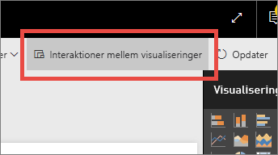

**Figur 34: Visuelle interaktioner**

Derefter skal du for hver visual på siden overveje, om du vil have den pågældende visual til at filtrere, fremhæve eller gøre ingenting. Ikke alle visuals kan fremhæves, og for dem, der ikke kan, er kontrolelementet til fremhævning ikke tilgængeligt. Du kan få mere at vide i [Visuelle interaktioner i Power BI](service-reports-visual-interactions.md).

> [!TIP]
> For læsere, der ikke har forhåndskendskab til Power BI, vil denne mulighed for at klikke og interagere med rapporter måske ikke være umiddelbart indlysende. Tilføj tekstfelter for at hjælpe dem med at forstå, hvad de kan klikke på for at få yderligere indsigt.
> 
> 

#### Brugen af farver i visuals
Tidligere i dette whitepaper talte vi om betydningen af at have en plan for, hvordan du vil bruge farver på tværs af en rapport. I dette afsnit er der lidt overlapning, men vi beskæftiger os primært med, hvordan du bruger farve i enkeltstående visuals. Og de samme principper gælder: Brug farve til at binde rapporten sammen, fremhæve vigtige data og til at forbedre læserens forståelse af den pågældende visual. For mange forskellige farver er forstyrrende og gør det vanskeligt for læseren at vide, hvor pågældende skal kigge. Gå ikke på kompromis med forståelsen for skønhedens skyld. Tilføj kun farve, hvis det forbedrer forståelsen.

> [!TIP]
> Kend din målgruppe og eventuelle iboende farveregler.  Eksempelvis betyder grøn normalt "godt" i USA, og rød betyder normalt "ikke godt".
> 
> 

Dette emne er opdelt for at dække:

1. Farven på data
2. Farven på datanavn
3. Farven på kategoriske værdier
4. Farven på numeriske værdier

**Brug farver til at fremhæve interessante data**

Den mest enkle måde at bruge farve på er ved at ændre farven på et eller flere datapunkter for at tiltrække opmærksomhed. I dette eksempel ændres farven, når de olympiske lege skifter fra en cyklus på 4 år til en cyklus på 2 år med skiftevis sommer- og vinter-OL.

**Figur 35:    Brug farve til at fortælle en historie**

Du kan ændre farverne på datapunkter i fanen **Datafarver** i formateringsruden. Hvis du vil tilpasse hvert datapunkt individuelt, skal du sikre dig, at **Vis alt** er indstillet til Til.

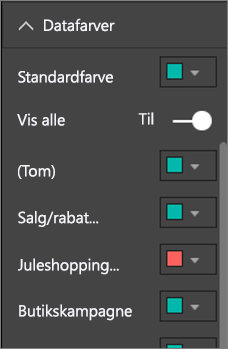

**Figur 36: Angiv farver for datapunkter**

> [!NOTE]
> Power BI anvender et standardtema på visuals i dine rapporter.  Temafarverne er valgt for at skabe variation og kontrast. Hvis du vil afvige fra paletten med standardtemaer, skal du vælge **Brugerdefineret farve**.
> 
> 

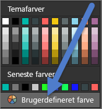

**Figur 37: Vælg en brugerdefineret farve**

I Power BI Desktop kan du endda fremhæve udenforliggende værdier eller en del af en linje ved hjælp af en anden serie:

**Figur 38:    Brug af Desktop til at afbilde udenforliggende værdier**

Her findes værdier i serien 'Outliers' (udenforliggende værdier) kun, hvor gennemsnitstemperaturen for august er faldet til under 60. Dette er blevet gjort ved at oprette en DAX-beregnet kolonne ved hjælp af denne formel:

Udenforliggende værdier = if(Editions[Temp]<60, Editions[Temp], BLANK())

I vores eksempel er der tre udenforliggende værdier: 1952, 1956 og 2000.

**Farver på navne og titler**

Når du udforsker alle de tilgængelige formateringsindstillinger, kan du finde mange forskellige steder, hvor du kan føje farve til titler og forklaringer. Du kan f.eks. ændre farven på datanavne og aksenavne. Vær forsigtig.  Generelt er det at foretrække at bruge en enkelt farve til alle visualtitler.  Ligesom med alle retningslinjerne i dette whitepaper kan der altid være situationer og årsager til at "bryde reglerne", men hvis du beslutter at bryde reglerne, skal du have en god grund til at gøre det.

**Farver på kategoriske værdier**

Diagrammer med en serie har normalt en kategorisk værdi i forklaringen. Eksempelvis repræsenterer hver farve i forklaringen nedenfor en anden kategori for Land/område.

**Figur 39: Standardfarver anvendt**

De farver, der bruges som standard i Power BI, er valgt for at give en god kontrast mellem farver for kategoriske værdier, så de er nemme at skelne fra hinanden. Nogle gange ændrer folk disse farver, så de passer til virksomhedens temaer, men dette kan medføre problemer.

**Figur 40: Farve anvendt som nuancer af en enkelt farve**

Ved kun at bruge en enkelt nuance og forskellig farveintensitet giver denne visual en falsk opfattelse af en rangorden mellem kategorierne. Det antyder, at de mørkere bobler ligger højere eller lavere på en eller anden skala i forhold til de lyse nuancer. Bortset fra alfabetisk er der normalt ikke nogen iboende rækkefølge i denne type kategoriske værdi.
Hvis du vil ændre standardfarverne, skal du åbne ruden Formatering og vælge **Datafarver**.

**Farver på numeriske værdier**

For felter, der har en iboende rækkefølge og numerisk værdi, kan du også farvelægge datapunkter efter værdi. Det kan være en hjælp at vise spredningen af værdier på tværs af dataene og samtidig give mulighed for, at der kan vises to variabler i et enkelt diagram. Eksempelvis gør dette diagram det klart, at selvom Kina har det højeste antal medaljer, så har Japan og Thailand deltaget i flere olympiske lege.

**Figur 41: Farvelæg datapunkter ud fra værdien**

Hvis du vil oprette dette diagram, skal du tilføje en værdi i feltet Farvemætning og derefter justere disse farver i ruden Formatering.

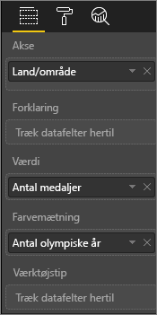

**Figur 42: Tilføj et felt til farvemætning**

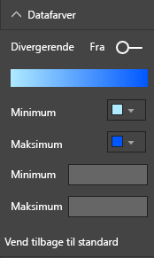

**Figur 43: Juster de farver, der bruges til mætning**

Du kan også bruge farve til at fremhæve variansen omkring en central værdi. For eksempel kan positive værdier gøres grønne, og negative værdier kan gøres røde. Vær opmærksom på kulturelle forskelle, når du giver farver til positive eller negative værdier. Ikke alle kulturer bruger rød som noget dårligt og grøn som noget godt!

**Figur 44:    Brug farver til at fremhæve variansen omkring en central værdi**
 

### Principper for design af visuals – anvendt på eksempelrapportsiden
Lad os nu tage de visuelle principper, vi diskuterede ovenfor, og anvende dem på vores eksempelrapport.

Før

**Figur 45:    Vores eksempelrapport (før)**

Efter

**Figur 46: Vores eksempelrapport (efter)**

#### Hvad har vi gjort?
1. Udsnitsværktøj: Vi har fjernet tomme værdier fra udsnitsværktøjet ved at tilføje et sideniveaufilter og kun anvende guld, sølv, bronze. Vi har ændret **Kontrolelementer til markering** til Fra for **Vælg én** og **Markér alle**.
2. Boble: Der er så mange elementer i forklaringen, at de ruller ud over skærmen.  Vi har fjernet forklaringen og aktiveret **Kategorietiketter** i stedet for. Kunder kan holde musemarkøren over boblerne for at få vist detaljer. Vi har afkortet titlen og fjernet "efter land/område", da det synes indlysende. Vi har slået aksenavne Til for begge for at gøre det lettere at forstå diagrammet.
3. Udfyldt kort: Vi har ændret **Datafarver** for at få det til at skille sig ud. Vi har slået **Divergerende** til og angivet **Minimum** til pink og **Maksimum** til rød.
4. Trækort: Vi har fjernet filteret, som var indstillet kun til USA. Angiv **Datanavne** til 1 decimal. Vores visual anvendte feltet for medaljeklasse, som ikke er særligt nyttigt, da det næsten altid vil være 33% (guld/sølv/bronze).  Vi har valgt et andet mere interessante felt, køn. Vi har ændret "Aquatics" (vandsport) til blå og "Athletics" (atletik) til grå af designhensyn.
5. Øverste søjlediagram: Vi har afkortet titlen, fjernet datanavne og slået titel på forklaring fra. Vi har ændret ordrækkefølgen i titlen, så den stemmer overens med det nedenstående diagram.
6. Nederste søjlediagram: Sorteret efter år stigende for at stemme overens med det ovenstående diagram. Vi har ændret farverne, så de stemmer overens med medaljeklassen. Vi har ændret titlen. Vi har deaktiveret forklaringen for at få mere plads til data. Vi har slået datanavne til, som ikke vises i rapporten (fordi vores visual er for lille til, at navnet er læseligt), men det vises, når vores visual åbnes i Fokustilstand. [Få mere at vide om Fokustilstand](service-focus-mode.md). Vi har føjet "Count of Event (Distinct)" (antal begivenheder (særskilte)) til **Værktøjstip**, så når man holder markøren over en stablet søjle, viser værktøjstippet også, hvor mange begivenheder der blev konkurreret om det pågældende år.
7. Visuelle interaktioner: Vi har deaktiveret interaktioner for begge kort, da jeg altid vil have dem vist for de samlede lege og sportsgrene.

## Typer af visuals og bedste praksis
Der er indbygget mange typer visuals i Power BI.  Hertil kan du tilføje de brugerdefinerede visuals, der er tilgængelige fra Microsoft og fra Power BI-community'et, hvorefter det samlede antal valgmuligheder for visuals vil være for omfattende at dokumentere her. Men lad os se på nogle af de mest anvendte indbyggede typer af visuals.  

### Kurvediagrammer

Kurvediagrammer er en effektiv metode til at kigge på data over tid.  Når man kigger på data i tabeller, identificerer ens øje ikke så hurtigt stigninger, fald, cyklusser og mønstre.  
Nedenstående eksempel viser tendenser i antallet af medaljer og antallet af deltagere, der vinder disse medaljer.  

**Figur 47:    Kurvediagrammer**

#### Bedste praksis
* Når folk ser på kurvediagrammer, er det første, de ser, kurvens form.  Det betyder, at du skal have en x-akse, som giver kurven mening, f.eks. kategorier som tid eller fordeling.  Hvis du lægger kategorifelter som produktet eller geografi på x-aksen, bliver kurvediagrammet ikke interessant, fordi kurvens form ikke kommer til at give nogen meningsfulde oplysninger.
* Hvis du vælger at anbringe flere diagrammer over og under hinanden på denne måde for at gøre det nemmere at sammenligne på tværs af serier, skal du justere x-aksen. Brug filtre til at sikre, at det samme interval af værdier vises.  Hvis f.eks. du ser på datointervaller, skal du sikre, at de er de samme datointervaller.  For eksempel 1896-2012 i begge diagrammer.
* Udnyt pladsen optimalt.  Hvis det giver mening for dine data, skal du angive start- og slutpunkterne for Y-aksen for at fjerne tom plads i toppen og bunden af diagrammet og for at fokusere på selve datapunkterne. For at gøre dette skal du vælge ikonet med malerullen for at åbne ruden Formatering. Udvid området for **Y-aksen**, og angiv **Start**- og **Slut**punkterne.
  
  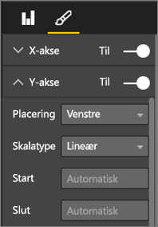
  
  **Figur 48: Angiv start- og slutpunkterne**
* En anden årsag til udtrykkeligt at angive start- og slutpunkterne er, hvis du sammenligner to eller flere diagrammer på den samme side ved hjælp af det samme Y-aksefelt.  Hvis du f.eks. ser på akkumulerede antal begivenheder, og Storbritannien har antal fra 1 til 70, og Australien har antal fra 1 til 12, så viser de to kurvediagrammer meget forskellige Y-akser (Figur x). Det gør det svært at sammenligne dem ved et hurtigt øjekast. Indstil i stedet diagrammerne til at bruge det samme Y-akseområde (Figur x).
  
  
  
  **Figur 49: Kurvediagrammer med forskellige Y-akser**
  
  
  
  **Figur 50: Kurvediagrammer med matchende Y-akser**

Her finder du flere oplysninger:

* [Tilpas X- og Y-akserne](power-bi-visualization-customize-x-axis-and-y-axis.md)
* [Kurvediagrammer og uregelmæssige intervaller](http://www.perceptualedge.com/articles/visual_business_intelligence/line_graphs_and_irregular_intervals.pdf)
* [Kurvediagrammer 101](http://www.columnfivemedia.com/data-visualization-101-line-charts)

### Søjlediagrammer/liggende søjlediagrammer

Hvis kurvediagrammer er standarden for at se på data over tid, er liggende søjlediagrammer standard for at se på en bestemt værdi på tværs af forskellige kategorier.  Hvis du sorterer søjler ud fra antal, vil du straks kunne se de største værdier og fordelingen.  Vandrette liggende søjlediagrammer fungerer godt sammen med længere navne.  

**Figur 51: Vandret liggende søjlediagram**

#### Bedste praksis
* Vis datanavne for værdier.  Det gør det lettere at identificere bestemte værdier. For at gøre dette skal du åbne ruden Formatering og indstille **Datanavne** til Til.
  
  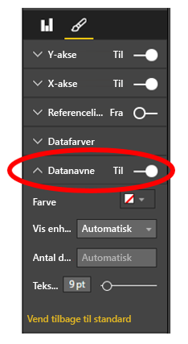
  
  **Figur 52: Slå datanavne til**
* Det liggende søjlediagram er meget praktisk at sammenligne én måling med mange **på en enkelt tidspunkt**.  Mens kurvediagrammet ovenfor viste os tendenser over tid, viser det liggende søjlediagram os tendensen for en enkelt kategori på et bestemt tidspunkt.  Med et hurtigt øjekast kan vi se på vores liggende søjlediagram, at Spanien har en af verdens højeste arbejdsløshedsprocenter – 25 %.
* Når et helt søjlediagram/liggende søjlediagram ikke passer ind på den tildelte plads, tilføjer Power BI rullepaneler. Når det er muligt, og hvis det giver mening, kan du strukturere din visual for at vise hele diagrammet, så læseren får en oversigt over hele fordelingen.  Dette er desværre ikke muligt i vores eksempel på grund af det store antal lande verden over.
  
  Én måde at begrænse de medtagne værdier på er at bruge et filter. Du kan f.eks. tilføje et filter på visualiseringsniveau, der kun viser landet, hvis arbejdsløsheden er over 20 %.
* Søjlediagrammer/liggende søjlediagrammer kan bruges til detailudledning (begge veje).  Dette er en glimrende metode til at få flere oplysninger ind i en visual på uden at optage mere plads.  Nedenstående eksempel har et hierarki for Områder > Lande.  Hvis du dobbeltklikker på en områdesøjle, vises en detailudledning af de lande, der udgør det pågældende område.  Du kan få mere at vide om detailudledning i [Detailudledning i en visualisering](power-bi-visualization-drill-down.md).
  
  
  
  **Figur 53: Detailudledning**

Her finder du flere oplysninger om søjlediagrammer og liggende søjlediagrammer:

* [Liggende søjlediagrammer 101](http://blog.newscred.com/article/data-visualization-101-bar-charts)
* [Datavisualiseringskatalog: Liggende søjlediagram](http://www.datavizcatalogue.com/methods/bar_chart.html#.VYV-hY3bLJw)
* [Datavisualiseringskatalog: Multisæt af liggende søjlediagrammer](http://www.datavizcatalogue.com/methods/multiset_barchart.html#.VYV_gI3bLJw)

### Stablede søjlediagrammer/liggende søjlediagrammer

Tilføj endnu en dimension i dine søjlediagrammer/liggende søjlediagrammer ved at stable forskellige kategorier inden for søjlen.  Nu gengiver diagrammet oplysninger om én overordnet tendens (baseret på højde/længde), men det viser også kategoriernes indflydelse på denne tendens. Nedenstående diagram viser den samlede vækst i de største fodboldholds indtægter over 6 milliarder i 2014.

**Figur 54: Stablet søjlediagram**

Dette stablede søjlediagram viser os, at den samlede indtjening stiger over tid, og at kategorierne Commercial og Broadcasting er støt stigende over tid – hvilket bidrager til en stigning i den samlede indtjening.  Men dette diagram gør det ikke nemt at sammenligne den påvirkning, hver af de 3 kategorier har på hinanden. Hvordan udvikler væksten inden for Commercial sig eksempelvis i forhold til Broadcasting eller Match Day?  Et bedre valg til disse data eller en supplerende visual til disse data ville være et kurvediagram.  

**Figur 55: Konvertér til et kurvediagram**

I dette kurvediagram er det nemmere at se, hvordan de kommercielle indtægter (Commercial) er steget mest efterfulgt af TV-indtægter (Broadcast) og indtægter på kampdagen (Match Day).

#### Bedste praksis
* Ligesom med søjlediagrammer/liggende søjlediagrammer kan du vælge mellem vandret eller lodret visning.   Vandret er bedst, hvis du har lange navne, og lodret er bedst, hvis du har tidsbestemte data.  
* Undgå stablede søjlediagrammer/liggende søjlediagrammer, hvis du vil vise tendenser og andre ændringsmønstre over tid.  Andre diagrammer, f.eks. kurvediagrammer, er meget bedre til dette.
* Du kan også få fordelingen baseret på den samlede mængde eller som en procentdel af totalen.  
* Som Stephen Few bemærkede, *er det svært at sammenligne segmenter i et stablet liggende søjlediagram. Hvis segmenterne var arrangeret side om side og alle voksede opad fra den samme grundlinje, ville det være nemt at sammenligne deres højde, men når de er stablet oven på hinanden, bliver det svært. Og selvom det er relativt nemt at se, hvordan (indtægter) ændres fra måned til måned, er det ret svært at se, hvordan (indtægter) i andre (kategorier) har ændret sig*.  
* 100 % stablede diagrammer er et godt valg, når du bruger procenter, der tilsammen giver 100.  I nedenstående eksempel kan vi se en kategorifordeling efter hold.  Procenterne er relative og vi kan bruge dem til at se mønstre med et hurtigt øjekast. Eksempelvis er Evertons indtægter primært TV-indtægter ("Broadcasting") (mere end 70 %), mens PSG kun får 20 % af deres indtægter fra denne kategori.  Valget af en vandret visning gør det nemmere at indpasse holdnavnene og at se effekten af indtægtstype.
  
  
  
  **Figur 56: Vandret stablet diagram**

Her kan du finde flere oplysninger om stablede diagrammer:

* [Datavisualiseringskatalog: Stablede liggende søjlediagrammer](http://www.datavizcatalogue.com/methods/stacked_bar_graph.html#top)
* [Hvornår er 100 % stablede liggende søjlediagrammer nyttige?](http://www.perceptualedge.com/blog/?p=2239)

### Kombinationsdiagram/liggende søjlediagrammer

I Power BI kan du kombinere søjle- og kurvediagrammer i et kombinationsdiagram. Valgmulighederne er: Kurvediagram og Stablet søjlediagram og Kurvediagram og Grupperet søjlediagram. Spar på den værdifulde lærredsplads ved at kombinere to separate visuals i én.

De to skærmbilleder nedenfor viser før og efter.  På første side er der to separate visuals: et søjlediagram, der viser befolkningstallet over tid, og et kurvediagram, der viser BNP over tid. Disse diagrammer er velegnede til et kombinationsdiagram, fordi de har den samme x-akse (år) og værdier (2002 til 2012).  Hvorfor ikke kombinere dem for at sammenligne disse to tendenser i én samlet visual?  Ved at kombinere disse to diagrammer kan du lave en hurtigere sammenligning af dataene.

Den nye rapportside har en enkelt visual: et kurvediagram og et stablet søjlediagram. Vi kunne lige så nemt have oprettet et kurvediagram og et grupperet søjlediagram.  Det er nu nemmere at kigge efter en relation mellem de to tendenser.   Vi kan se, at indtil 2008 fulgte befolkningstal og BNP den samme tendens. Men fra 2009 blev BNP mere ustabilt, i takt med at befolkningstilvæksten stagnerede.  

 **Figur 57: Som to separate diagrammer**

 **Figur 58: Som et enkelt kombinationsdiagram**

#### Bedste praksis
Kombinationsdiagrammer fungerer bedst, når begge visuals har mindst én akse til fælles.

Hold øje med dine akser! Er det nemt at læse og fortolke dit kombinationsdiagram?  Eller anvender det uensartede intervaller og værdier? Hvis f.eks. skalaen på søjlediagrammets Y-akse er meget mindre end skalaen på kurvediagrammets Y-akse, kommer dit kombinationsdiagram ikke til at give mening.  Bemærk eksempelvis den tredje kurve (akvamarin) helt nede nederst.

   

   **Figur 59: Et mislykket kurvediagram**

Så kombinationsdiagrammet vil ikke give mening, hvis dit søjlediagram og dit kurvediagram anvender to forskellige målinger, og du ikke opretter dobbeltakser.  For eksempel dollars i forhold til procent. Sørg for medtage begge akser, så læseren forstår diagrammet, og overvej også at tilføje aksenavne.

Hvis du vil gøre dette, skal du åbne ruden Formatering, udvide **Y-aksen** og indstille **Vis sekundær** til Til (hvis den ikke allerede er indstillet til det). Denne indstilling kan nogle gange være svær at finde: Udvid **Y-akse (kolonne)**, og rul ned, indtil du ser **Vis sekundær**. Du skal også indstille **Titel** for Y-akse (kolonne) til Til og indstille **Titel** for Y-akse (linje) til Til.

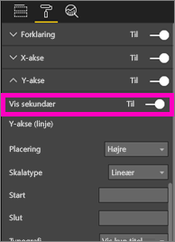

**Figur 60: Vis sekundær akse**

**Figur 61: Oprette et kombinationsdiagram i stedet for**

* Drag fordel af dobbeltakser. Det er nemt at sammenligne flere målinger med forskellige værdiintervaller. Og det er en glimrende metode til at illustrere sammenhængen mellem to målinger i én visual.

Her finder du flere oplysninger:

* [Selvstudium: Kombinationsdiagram i Power BI](power-bi-visualization-combo-chart.md)
* [Faren ved dobbeltskalerede akser i visuals](http://www.perceptualedge.com/articles/visual_business_intelligence/dual-scaled_axes.pdf)

### Punktdiagram

Nogle gange har vi mange variabler, som vi vil have vist sammen, og her kan et punktdiagram være meget nyttigt til at danne sig et overblik.  Punktdiagrammer viser relationer mellem to (punkt) eller tre (boble) kvantitative målinger.  Et punktdiagram har altid to værdiakser for at vise ét sæt numeriske data langs en vandret akse og et andet sæt numeriske værdier langs en lodret akse. Diagrammet viser punkter ved skæringspunktet for en numerisk x- og y-værdi og kombinerer disse værdier i enkelte datapunkter. Disse datapunkter kan være fordelt jævnt eller ujævnt på tværs af den vandrette akse afhængigt af dataene.

Et boblediagram erstatter datapunkterne med bobler, hvor boblestørrelsen repræsenterer en yderligere dimension af dataene.

Det nedenstående boblediagram ser på Sydamerika og sammenligner BNP pr. indbygger (Y-aksen), summen af BNP (X-aksen) befolkningstallet efter lande i Sydamerika.  Størrelsen på boblerne repræsenterer det samlede befolkningstal i det pågældende land. Brasilien har det største befolkningstal (boblestørrelse) og den største andel af Sydamerikas BNP (den ligger længst henne på X-aksen).  Men bemærk, at BNP pr. indbygger for Uruguay, Chile og Argentina er højere end Brasilien (længere oppe på Y-aksen).

**Figur 62: Sydamerikas BNP og befolkningstal som et boblediagram**

Hvis du tilføjer en afspilningsakse, kan du lade som om, du er Hans Rosling og fortælle historien over tid (https://www.youtube.com/watch?v=PbaDBJWCeD4). Hvis du vil tilføje en afspilningsakse, skal du trække et dato/klokkeslæt-felt ind på **Afspilningsakse**.

#### Bedste praksis
* Punkt- og boblediagrammer er fantastiske historiefortællere. Men de er ikke så nyttige, når du vil udforske data.  Dette er det, Stephen Few påpeger i afsnittet nedenfor *Styrken ved denne tilgang er, når den bruges til at fortælle en historie. Når Rosling fortæller, hvad der sker i diagrammet, når boblerne flytter rundt og ændrer værdi, og påpeger, hvad han vil have os til at se, så vækkes oplysningerne til live. Animerede boblediagrammer er dog meget mindre effektive til at udforske og udlede betydningen af data på egen hånd. Jeg tvivler på, at Rosling bruger denne metode til at opdage historierne, men kun til at fortælle dem, når de er kendt. Vi kan ikke følge mere end én boble ad gangen, når de flytter rundt, så vi er nødt til at køre animationen igen og igen for at forsøge at få en ide om, hvad der sker. Vi kan føje spor til valgte bobler, hvilket gør det muligt at følge hele den sti, disse bobler har flyttet sig, men hvis der bruges spor til mere end nogle få bobler, kan diagrammet hurtigt blive for rodet. I bund og grund forsøger jeg at pointere, at dette ikke er den bedste metode til at vise oplysninger til udforskning og analyse.*
* Føj navne til X- og Y-aksen for at hjælpe med at fortælle historien.  Især med boblediagrammer er der mange komponenter i spil, og navne gør det lettere for læserne at forstå en visual.
* Tilføj datanavne for at gøre det lettere at fortolke en visual.  Især med boblediagrammer kan det være svært at skelne mellem ensartede farver, når du har mange elementer i forklaringen.  I den ovenstående visual er forklaringsfarverne for Surinam, Columbia og Ecuador meget ensartede.
* Har du oprettet et punktdiagram og kan kun se ét datapunkt, der lægger alle værdierne på X- og Y-aksen sammen? Eller sammenlægger dit diagram alle værdierne langs en enkelt vandret eller lodret linje?  For at løse dette problem skal du tilføje et felt i området **Oplysninger** for at fortælle Power BI, hvordan værdierne skal grupperes. Feltet skal være entydigt for hvert punkt, der skal afbildes. Hvis du har brug for hjælp, kan du se [selvstudiet om punktdiagrammer og boblediagrammer i Power BI](power-bi-visualization-scatter.md).

### Trækortdiagrammer

Trækort kan være praktiske til at give et godt overblik over den relative størrelse af forskellige komponenter, der udgør en helhed – især når du kan gruppere dem efter kategorier.  Hver gang jeg forsøger at forstå en ny virksomhed, kan det være en god hjælp at have et trækort over hovedkomponenterne for at lære den overordnede fordeling at kende.

I det første diagram nedenfor kan du med det samme se, at Brasilien tegner sig for cirka halvdelen af Sydamerikas BNP, og at Venezuela og Argentina har cirka same størrelse.

Hvis du vil have mere kontekst og stadig have en ide om de lande, der bidrager mest, kan du oprette visuelle hierarkier med kategorimedlemmer (lande), der er indlejret i områder. Det andet trækort giver os først og fremmest en ide om den forholdsmæssige størrelse af områderne, og dernæst kan vi inden for hvert område se, hvilke enkelte lande der bidrager mest. Vi kan se, at der er tre store områder (Europa, Asien og Nordamerika), og inden for disse kan vi nemt se de største lande/områder.

Den primære begrænsning ved et trækort er den begrænsede mulighed for at sammenligne de forskellige rektangler foruden de største af dem.  Det er et godt diagram til at danne sig et overblik, men søjlediagrammer og liggende søjlediagrammer er nok et bedre valg, hvis man vil have en mere nøjagtig ide om den forholdsmæssige størrelse af forskellige komponenter.
 For eksempel giver det første trækort en stor indikation af rækkefølgen af størrelsen af BNP, men det er svært at identificere specifikke forskelle mellem lande, især de mindre felter uden navne. Til disse data, hvor en enkelt gruppering sammenlignes, kan et søjlediagram eller liggende søjlediagram være et bedre valg.

**Figur 63: Sammenligning af BNP i Sydamerika som et trækort**

Her har vi tilføjet endnu et niveau af data, område, og vi kan se det samlede bidrag til BNP efter område samt den forholdsmæssige påvirkningen inden for områderne. Vær opmærksom på, at hvis du gør dette med ikke-summative målinger (f.eks. gennemsnit), så repræsenterer summen af oplysningerne muligvis ikke den faktiske værdi samlet set.

**Figur 64: BNP efter område og land som et trækort**

Hvis du vil have mere at vide om trækort, kan du følge nedenstående links.

* [Oversigt over trækort](http://www.perceptualedge.com/articles/b-eye/treemaps.pdf)
* [Datavisualiseringskatalog: Trækort](http://www.datavizcatalogue.com/methods/treemap.html#.VYhylI3bL7Y)

### Andre diagrammer
#### Cirkel- eller kransediagrammer

Grundlæggende egner søjlediagrammer/liggende søjlediagrammer/kurvediagrammer sig til det meste. Der er bred enighed om, at mennesker kan have svært ved at tolke cirkel- og kransediagrammer korrekt, og faktisk kan de ofte forvrænge data. Undgå dem, hvor det er muligt. Stephen Few har skrevet en glimrende tekst om historierne og farerne i [Save the Pies for Dessert] ([www.percetualedge.com/articles/08-21-07.pdf](http://www.perceptualedge.com/articles/08-21-07.pdf)

Han forklarer det ene tilfælde, hvor cirkeldiagrammer kan være nyttige, nemlig når du vil sammenligne del-helhed-relationer. Men selv her er dette sjældent væsentligt bedre end f.eks. et 100 % stablet liggende søjlediagram.

En anden sjov artikel (og animation) om cirkeldiagrammer kan findes på [Darkhorse Analytics-webstedet](http://www.darkhorseanalytics.com/blog/salvaging-the-pie).

Eller du kan læse et modstridende synspunkt i [Why Tufte is flat-out wrong about pie charts](http://speakingppt.com/2013/03/18/why-tufte-is-flat-out-wrong-about-pie-charts/)

#### Radiale målere og KPI'er

Radiale målere synes at fungere godt som visuals til gengivelse af resultater i forhold til en målsætning, og de er meget populære i forretningsdashboards. De er dog mangelfulde på to primære punkter. Ligesom med cirkeldiagrammer er det svært at fortolke vinklen på det skraverede område i forhold til 180-graderstregen eller stregen for målsætningen. Der bruges også meget plads på at vise en enkelt metrikværdi.

Et godt alternativ er en enkel KPI-visual

KPI'er viser værdi, status, mål, afvigelse fra mål og tendens på den samme mængde plads. Den grønne farvelægning bliver rød, hvis målet ikke bliver opfyldt, og den kan være gul, hvis et mellemliggende mål er nået. Det er meget enklere at læse og fortolke end måleren.

Her finder du flere oplysninger:

* [Selvstudium: Radiale målerdiagrammer i Power BI](power-bi-visualization-radial-gauge-charts.md)
* [Selvstudium: KPI'er i Power BI](power-bi-visualization-kpi.md)

## Konklusion
Nu er det blevet tid til, at du skal prøve disse bedste praksisser af i praksis.  Bevar forbindelsen, og del dine egne bedste praksisser. Er du uenig i vores anbefalinger, eller har du fundet en enestående årsag til at "bryde reglerne?"  Det vil vi også meget gerne høre om.  

### Boganbefalinger
Der findes mange god bøger, som teams kan bruge til at læse op på visuelle designteknikker. Stephen Fews bog *Information Dashboard Design* kommer man ikke udenom. Han går yderligere i detaljer i de to andre bøger *Show Me the Numbers* og *Now You See It*. Few og andre har fået inspiration fra Edward R. Tufte, hvis bog *The Visual Display of Quantitative Information* betragtes som en klassiker inden for emnet. Tufte har også skrevet *Visual Explanations*, *Envisioning Information* og *Beautiful Evidence*. Andy Kirks nye bog *Data Visualization: A Handbook for Data Driven Design* er et andet glimrende forslag. Andre forfattere, som kan anbefales, er: Lachlan James, William McKnight og Boris Evelson (Forrester), Darkhorse Analytics.

Har du flere spørgsmål? [Prøv at spørge Power BI-community'et](http://community.powerbi.com/)

