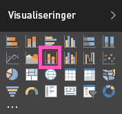

# Kombinationsdiagram i Power  (selvstudium)
I Power BI er et kombinationsdiagram en enkelt visualisering, der kombinerer et kurvediagram og et søjlediagram. Ved at kombinere disse to diagrammer kan du hurtigere sammenligne dine data.

Kombinationsdiagrammer kan have en eller to Y-akser.

## Hvornår er et kombinationsdiagram nyttigt?
Kombinationsdiagrammer er et fantastisk valg i følgende tilfælde:

* Når du har et kurvediagram og et søjlediagram med den samme X-akse.
* Til at sammenligne flere målinger med forskellige værdiintervaller.
* Til at illustrere sammenhængen mellem to målinger i én visualisering.
* Til at kontrollere, om en måling opfylder målet, der er defineret af en anden måling
* Til at spare plads på lærredet.

## Opret et grundlæggende kombinationsdiagram med én akse
Se, hvordan Will opretter et kombinationsdiagram ved hjælp af salgs- og marketingeksemplet.

<iframe width="560" height="315" src="https://www.youtube.com/embed/lnv66cTZ5ho?list=PL1N57mwBHtN0JFoKSR0n-tBkUJHeMP2cP" frameborder="0" allowfullscreen></iframe>

Log på Power BI for at oprette dit eget kombinationsdiagram, og vælg **Hent data\> Eksempler \> Eksempel på detailhandelsanalyse**. 

1. Fra dashboardet "Eksempel på detailhandelsanalyse" skal du vælge feltet **Butikker i alt** for at åbne rapporten "Eksempel på detailhandelsanalyse".
2. Vælg **Rediger rapport** for at åbne rapporten i redigeringsvisning.
3. [Tilføj en ny rapportside](power-bi-report-add-page.md).
4. Opret et søjlediagram, der viser dette års salg og bruttomargen pr. måned.
   
    a.  I ruden Fields skal du vælge **Sales**\> **This Year Sales** > **Value**.
   
    b.  Træk **Sales** \> **Gross Margin This Year** til beholderen **Value**.
   
    c.  Vælg **Time**\>**FiscalMonth** for at føje det til beholderen **Axis**. 
   
    
5. Vælg ellipsen (...) i øverste højre hjørne af visualiseringen, og vælg **Sort by FiscalMonth**.
6. Konvertér søjlediagrammet til et kombinationsdiagram. Vælg søjlediagrammet, og vælg derefter **Line and clustered column chart** fra fanen **Visualizations**.
   
    
7. Fra ruden **Fields** kan du derefter trække **Sales** \> **Last Year Sales** til beholderen **Line Values**.
   
   
   
   Dit kombinationsdiagram bør ligne dette:
   
   

## Opret et kombinationsdiagram med to akser
I denne opgave skal vi sammenligne bruttomargen og salg.

1. Opret et nyt kurvediagram, der sporer bruttomargenprocenten for sidste år efter måned.  I januar var BM% på 35 %, den steg til 45 % i april, faldt i juli og steg igen i august. Kan vi se et tilsvarende mønster for salget i dette og sidste år?
   
   
2. Tilføj **This Year Sales > Value** og **Last Year Sales** i kurvediagrammet. Skalaen for **GM% Last Year** er meget mindre end skalaen for **Sales**, hvilket gør det svært at sammenligne.      
   
   
3. Hvis du vil gøre det nemmere at læse og fortolke en visual, skal du konvertere kurvediagrammet til et Kurve- og stablet søjlediagram.
   
   
4. Træk **Gross Margin% Last Year** fra **Column Values** til **Line Values**. Der oprettes to akser i Power BI, og datasættene kan derfor skaleres forskelligt. Det kan ses ved, at den venstre akse måles i dollar, mens den højre akse måles i procent.
   
       

## Føj titler til akserne
1. Vælg ikonet med malerullen  for at åbne fanen Formatering.
2. Udvid indstillingerne for **Y-axis** ved at vælge den nedadvendte pil.
3. For **Y-Axis (Column)** skal du angive **Position** til **Left**, indstille **Title** til **On**, **Style** til **Show title only** og **Display** som **Millions**.
   
   
4. Under **Y-Axis (Column** skal du også sikre dig, at **Show Secondary** er indstillet til **On**. Dette viser indstillingerne for formatering af kurvediagramdelen af kombinationsdiagrammet.
   
   
5. For **Y-Axis (Line)** skal du lade **Position** forblive **Right**, aktivere **Title** til **On** og indstille **Style** til **Show title only**.
   
   Dit kombinationsdiagram viser nu to akser, som begge har en titel.
   
   

Nu kan du f.eks.:

* [Tilføje kombinationsdiagrammet som et dashboardfelt](service-dashboard-tiles.md).
* [Gemme rapporten](service-report-save.md).

## Fremhævning og krydsfiltrering
Du kan få mere at vide om brug af ruden Filters under [Føj et filter til en rapport](power-bi-report-add-filter.md).

Fremhævning af en kolonne eller kurve i kombinationsdiagrammet krydsfiltrerer andre visualiseringer på rapportsiden ... og omvendt.

## Næste trin
[Føj en visualisering til en rapport](power-bi-report-add-visualizations-i.md)

[Visualiseringer i Power BI-rapporter](power-bi-report-visualizations.md)

[Typer af visualiseringer i Power BI](power-bi-visualization-types-for-reports-and-q-and-a.md)

[Power BI – Grundlæggende begreber](service-basic-concepts.md)

[Prøv det – det er gratis!](https://powerbi.com/)

Har du flere spørgsmål? [Prøv Power BI-community'et](http://community.powerbi.com/)

