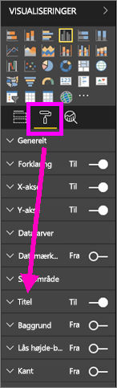
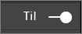
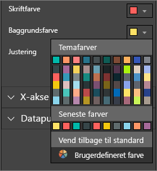
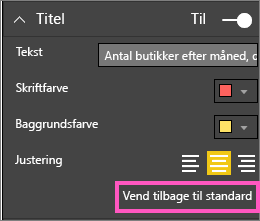
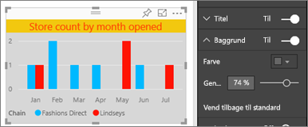
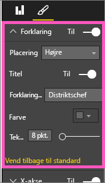
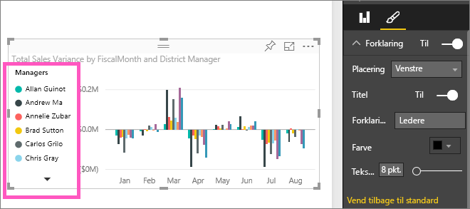

# Tilpas visualiseringstitler, -forklaringer og baggrunde (selvstudium)
I dette selvstudium lærer du et par forskellige måder, hvorpå du kan tilpasse dine visualiseringer.   Der findes mange muligheder for at tilpasse dine visualiseringer. Den bedste måde at lære dem at kende på, er ved at prøve sig frem med indstillingerne under fanen Formatering (vælg ikonet med malerullen).  I denne artikel kan du se, hvordan du tilpasser en visualiserings titel, forklaring og baggrund.  

Det er ikke alle visualiseringer, der kan tilpasses. [Se en komplet oversigt](#list).  

Se Amanda tilpasse visualiseringerne i hendes rapport (spol frem til 4:50 i videoen). Følg derefter instruktionerne nedenfor for selv at prøve det med dine egne data.

<iframe width="560" height="315" src="https://www.youtube.com/embed/IkJda4O7oGs" frameborder="0" allowfullscreen></iframe>

## Tilpas titler på visualiseringer i rapporter
Hvis du vil følge med, skal du logge på app.powerbi og [åbne rapporten Retail Analysis Sample](sample-datasets.md) i [redigeringsvisning](service-interact-with-a-report-in-editing-view.md).

> [!NOTE]
> Når du fastgør en visualisering på et dashboard, bliver den til et dashboardfelt.  Selve felterne kan også tilpasses med [nye titler og undertitler, links og tilpasning af størrelsen](service-dashboard-edit-tile.md).
> 
> 

1. Gå til siden "New Stores" i rapporten, og vælg søjlediagrammet "Open Store Count by Open Month".
2. I ruden Visualiseringer kan du vælge ikonet med malerullen for at få vist formateringsindstillingerne.  og vælg **Titel** for at udvide den sektion.  
   
   
3. Slå **Titel** til eller fra ved at vælge skyderen Til (eller Fra). Lad den stå på **Til**.  
   
   
4. Jeg retter **Titeltekst** ved at skrive **Store count by month opened** i tekstfeltet.  
5. Ret **Skriftfarve** til orange og **Baggrundsfarve** til gul.
   
   * Vælg rullelisten, og vælg en farve fra **Temafarver**, **Seneste farver** eller **Brugerdefineret farve**.
   * Vælg rullelisten for at lukke farvevinduet.  
     
   
   Du kan til enhver tid gendanne de oprindelige farver ved at vælge **Vend tilbage til standard** i farvevinduet.
6. Øg tekststørrelsen til 12.
7. Den sidste tilpasning af diagramtitlen er at justere placeringen, så den står midt i visualiseringen. Som standard er titlen venstrejusteret.  
   
   
    På dette punkt i selvstudiet skulle **titlen** i dit søjlediagram se nogenlunde sådan ud:  
    
   
    Hvis du vil fjerne alle tilpasningerne af titlen, skal du vælge **Vend tilbage til standard** nederst i ruden **Titel**.  
    

## Tilpas baggrunden i en visualisering
Udvid indstillingerne under Baggrund i det samme søjlediagram.

1. Du kan slå baggrunden til og fra ved at angive skyderen til Til (eller Fra). Lad den stå på **Til**.
2. Skift baggrundsfarve til 74 % grå.
   
   * Vælg rullelisten, og vælg en grå farve fra **Temafarver**, **Seneste farver** eller **Brugerdefineret farve**.
   * Ret Gennemsigtighed til 74 %.   
     
   
   Hvis du vil fjerne alle tilpasningerne af baggrunden, skal du vælge **Vend tilbage til standard** nederst i ruden **Baggrund**.

## Tilpas forklaringer i en visualisering
1. Åbn rapportsiden **Overview**, og vælg diagrammet "Total Sales Variance by FiscalMonth and District Manager".
2. Under fanen Visualiseringer skal du vælge ikonet med malerullen for at åbne ruden Formatering.  
3. Udvid indstillingerne under **Forklaring**.
   
      
4. Du kan slå forklaringen til og fra ved at angive skyderen til Til (eller Fra). Lad den stå på **Til**.
5. Flyt forklaringen til venstre side af visualiseringen.    
6. Føj en titel til forklaringen ved at slå **Titel** **Til**, og skriv **Chefer** i feltet **Navn på forklaring**.
   
   
   Hvis du vil fjerne alle tilpasningerne af forklaringen, skal du vælge **Vend tilbage til standard** nederst i ruden **Forklaring**.

## Visualiseringstyper, der kan tilpasses
| Visualisering | Titel | Baggrund | Forklaring |
|:--- |:--- |:--- |:--- |
| Områdediagram |ja |ja |ja |
| Liggende søjlediagram |ja |ja |ja |
| Kort |ja |ja |i/t |
| Kort med flere rækker |ja |ja |i/t |
| Søjlediagram |ja |ja |ja |
| Kombinationsdiagram |ja |ja |ja |
| Kransediagram |ja |ja |ja |
| Kartogram |ja |ja |ja |
| Tragt |ja |ja |i/t |
| Måler |ja |ja |i/t |
| KPI |ja |ja |i/t |
| Kurvediagram |ja |ja |ja |
| Kort |ja |ja |ja |
| Matrix |ja |ja |i/t |
| Cirkeldiagram |ja |ja |ja |
| Punktdiagram |ja |ja |ja |
| Udsnit |ja |ja |i/t |
| Tabel |ja |ja |i/t |
| Tekstfelt |nej |ja |i/t |
| Træstruktur |ja |ja |ja |
| Vandfaldsdiagram |ja |ja |ja |

## Næste trin
Få mere at vide om [Visualiseringer i Power BI-rapporter](power-bi-report-visualizations.md)  
[Tilpas X- og Y-aksen](power-bi-visualization-customize-x-axis-and-y-axis.md)  
[Tilpas farver og akseegenskaber](service-getting-started-with-color-formatting-and-axis-properties.md)  
[Power BI – Grundlæggende begreber](service-basic-concepts.md)  
Har du flere spørgsmål? [Prøv Power BI-community'et](http://community.powerbi.com/)

