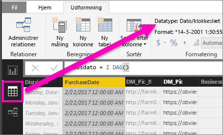

# Detailudledning i en visualisering i Power BI
## Detailudledning kræver et hierarki
Når et visuelt element har et hierarki, kan du foretage detailudledning for at finde flere detaljer. Du har f.eks. en visualisering, der kigger på optælling af olympiske medaljer ud fra et hierarki udgjort af sport, disciplin og begivenhed. Som standard viser visualiseringen medaljeoptælling ud fra sportsgren – gymnastik, skiløb, vandsport osv. Men eftersom den har et hierarki, vises et stadigt mere detaljeret billede, når der vælges visuelle elementer (f.eks. søjle, linje eller boble). Vælg elementet **vandsport** for at få vist data for svømning, udspring og vandpolo.  Vælg elementet **udspring** for at få vist detaljer for vippe, platform og discipliner med synkronudspring.

Du kan føje hierarkier til rapporter, som du ejer, men ikke til rapporter, der deles med dig.
Hvilke Power BI-visualiseringer indeholder et hierarki?  Hold musen over en visualisering, og hvis du får vist disse kontrolknapper for detailudledning i de øverste hjørner, har din visualisering et hierarki.

    
   

Datoer er en entydig type i hierarkiet. Når du føjer et datofelt til en visualisering, tilføjer Power BI automatisk et tidshierarki, der indholder år, kvartal, måned og dag. Du kan finde flere oplysninger under [Funktionsmåde for visuelle hierarkier og detailudledning](guided-learning/visualizations.yml#step-18) eller se videoen herunder.

  <iframe width="560" height="315" src="https://www.youtube.com/embed/MNAaHw4PxzE?list=PL1N57mwBHtN0JFoKSR0n-tBkUJHeMP2cP" frameborder="0" allowfullscreen></iframe>

> [!NOTE]
> Hvis du vil vide mere om at oprette hierarkier ved hjælp af Power BI Desktop, kan du se videoen [Sådan oprettes og tilføjes hierarkier](https://youtu.be/q8WDUAiTGeU)
> 
> 

## To metoder til detailudledning
Der findes to forskellige måder til at analysere ned (og op) i din visualisering.  Begge er beskrevet i denne artikel. Begge metoder resulterer det samme, så brug den metode, du bedst kan lide.

> [!NOTE]
> For at komme videre skal du [åbne eksemplet med detailanalyse](sample-datasets.md) i Power BI-tjenesten og oprette en træstruktur, der kigger på **Samlet antal enheder dette år** (værdier) efter **Område**, **By**, **Postnummer** og **Navn** (gruppe).  
> 
> 

## Metode 1 til detailudledning
Denne metode bruger ikonerne for detailudledning, der vises i de øverste hjørner af selve visualiseringen.

1. I Power BI skal du åbne en rapport i [Læsevisning eller Redigeringsvisning](service-reading-view-and-editing-view.md). Detailudledning kræver en visualisering med et hierarki. 
   
   I animationen herunder er vist et hierarki.  Visualiseringen har et hierarki bestående af område, by, postnummer og bynavn. Hvert område har en eller flere byer, hver by har et eller flere postnumre osv. Som standard viser visualiseringen kun områdedata, fordi *Område* vises først på listen.
   
   
2. For at aktivere detailudledning skal du vælge pilikonet i øverste højre hjørne af visualiseringen. Når ikonet er mørkt, er detailudledning aktiveret. Hvis du ikke aktiverer detailudledning, sker der krydsfiltrering af de andre diagrammer på rapportsiden, når der vælges et visuelt element (f.eks en søjle eller boble).    
   
   
3. For at analysere ***ét felt ned ad gangen*** skal du klikke på et af elementerne i din visualisering, i et liggende søjlediagram (det betyder, at du skal klikke på en af søjlerne) og i en træstruktur (det betyder, at du skal klikke på et af *bladene*). Bemærk, at titlen ændres, når du foretager detailudledning eller fjerner detaljerne igen. I denne animation ændres navnet fra "Samlet antal enheder dette år efter område" til "Samlet antal enheder dette år efter område og by" til "Samlet antal enheder dette år efter område, by og postnummer" til "Samlet antal enheder dette år efter område, by, postnummer og navn". Og for at fjerne detaljerne igen skal du vælge ikonet for **Fjern detaljer**   i øverste venstre hjørne af visualiseringen som vist nedenfor.
   
   
4. For at analysere ***alle felterne ned på én gang*** skal du vælge dobbeltpilen i øverste venstre hjørne af visualiseringen.
   
   
5. For at fjerne detaljerne igen skal du vælge pil op i øverste venstre hjørne af visualiseringen.
   
   

## Metode 2 til detailudledning
Denne metode bruger **Explore**-rullelisten fra den øverste menulinje i Power BI.

1. I Power BI skal du åbne en rapport i [Læsevisning eller Redigeringsvisning](service-reading-view-and-editing-view.md). Detailudledning kræver en visualisering med et hierarki. 
   
   I billedet herunder er vist et hierarki.  Visualiseringen har et hierarki bestående af område, by, postnummer og bynavn. Hvert område har en eller flere byer, hver by har et eller flere postnumre osv. Som standard viser visualiseringen kun områdedata, fordi *Område* vises først på listen.
   
   
2. For at aktivere detailudledning skal du vælge en visualisering og fra den øverste menulinje i Power BI vælge **Udforsk** > **Detailudledning**. Ikonet for detailudledning i øverste højre hjørne af visualiseringen ændres til sort baggrund.   
   
   
3. Når indstillingen er aktiveret, skal du analysere ét felt ned ad gangen ved at vælge et af bladene i træstrukturen. I dette eksempel har jeg valgt området med navnet **NC** for at se det samlede antal enheder, der er solgt i år i North Carolina ud fra by.
   
   
4. For at analysere alle felterne ned på én gang skal du vælge **Udforsk** > **Vis næste niveau**.
   
   
5. For at fjerne detaljerne igen skal du vælge **Udforsk** > **Fjern dig fra detaljerne**.
   
   
6. Hvis du vil se de data, der bruges til at oprette det visuelle element, skal du vælge **Se data**. Dataene vises i en rude under det visuelle element. Denne rude vises fortsat, efterhånden som du fortsætter med at foretage detailudledning via det visuelle element. Du kan finde flere oplysninger under [Vis data, der bruges til at oprette det visuelle element](service-reports-show-data.md).

## Overvejelser og begrænsninger
* Hvis du ikke kan oprette et hierarki ved at føje et datofelt til en visualisering, kan det skyldes, at "datofeltet" slet ikke er gemt som en dato. Hvis du ejer datasættet, kan du åbne det i *Data*-visningen i Power BI Desktop, vælge den kolonne, der indeholder datoen og under fanen Modellering ændre **Datatypen** til **Dato** eller  **Dato/klokkeslæt**. Hvis rapporten er blevet delt med dig, kan du kontakte ejeren for at anmode om ændringen.  
  
  

## Næste trin
[Visualiseringer i Power BI-rapporter](power-bi-report-visualizations.md)

[Power BI-rapporter](service-reports.md)

[Power BI – Grundlæggende begreber](service-basic-concepts.md)

Har du flere spørgsmål? [Prøv at spørge Power BI-community'et](http://community.powerbi.com/)

