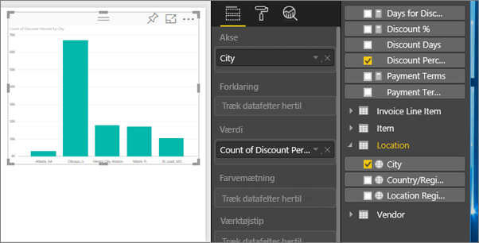
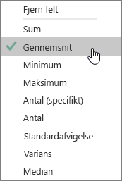
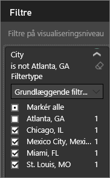
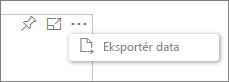
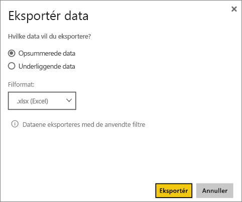

# Eksportér data fra visualiseringer
Hvis du gerne vil se de data, der bruges til at oprette en visualisering, kan du [få vist de pågældende data i Power BI](service-reports-show-data.md) eller eksportere dataene til Excel som en .xlsx- eller .csv-fil.   

Se med, når Will eksporterer dataene fra en af visualiseringerne i hans rapport, gemmer den som en .xlsx-fil og åbner den i Excel. Følg derefter den trinvise vejledning under videoen for at prøve det selv.

<iframe width="560" height="315" src="https://www.youtube.com/embed/KjheMTGjDXw" frameborder="0" allowfullscreen></iframe>

## Fra en anden visualisering på et Power BI-dashboard
1. Vælg ellipsen i visualiseringens øverste højre hjørne.
   
    
2. Vælg ikonet **Eksportér data**.
   
    
3. Dataene eksporteres til en .csv-fil. Hvis visualiseringen er filtreret, filtreres de downloadede data også.
4. Via browseren bliver du bedt om at gemme filen.  Når du har gemt den, kan du åbne .csv-filen i Excel.
   
    

## Fra en visualisering i en rapport
Hvis du vil følge med, skal du åbne [eksempelrapporten med en indkøbsanalyse](sample-procurement.md) i [Redigeringsvisning](service-reading-view-and-editing-view.md). [Tilføj en ny tom rapportside](power-bi-report-add-page.md). Følg derefter nedenstående trin for at tilføje en aggregering og et filter på visualiseringsniveau.

1. Opret et nyt søjlediagram.  I ruden Felter, skal du vælge **Placering > By** og **Faktura > Rabatprocent**.   
   
    
2. Skift aggregering for **Rabatprocent** fra **Antal** til **Gennemsnit**. I værdibrønden skal du vælge pilen til højre for **Rabatprocent** (der kan f.eks. stå **Antal rabatprocenter**), og vælg **Gennemsnit**.
   
    
3. Føj et filter til **By** for at fjerne **Atlanta**.
   
   
   
   Vi er nu klar til at prøve begge muligheder for eksport af data.
4. Vælg ellipsen i visualiseringens øverste højre hjørne. Vælg **Eksportér data**.
   
   
5. Hvis visualiseringen har et aggregat (f.eks. hvis du har ændret **Antal** til *Gennemsnit*, **sum** eller *Minimum*), har du to valgmuligheder: **Opsummerede data** og **Underliggende data**. Hvis du vil have hjælp til at forstå sammenlægninger, kan du se under [Aggregater i Power BI](service-aggregates.md).
   
    
6. Vælg **Opsummerede data** > **Eksportér**, og vælg .xlsx eller .csv. Dataene eksporteres i Power BI.  Hvis du har anvendt filtre for visualiseringen, vil de eksporterede data være filtreret. Når du vælger **Eksportér**, bliver du i browseren bedt om at gemme filen. Når du har gemt den, skal du åbne filen i Excel.
   
   **Opsummerede data**: Vælg denne indstilling, hvis du ikke har et aggregat, eller hvis du har et aggregat, men du ikke vil have vist den fuldstændige detaljerede opdeling. Hvis du f.eks. har et søjlediagram med fire søjler, vises der fire rækker med data. Opsummerede data er tilgængelige som .xlsx og .csv.
   
   I dette eksempel vises én total for hver by i Excel-eksporten. Da vi har filtreret Atlanta fra, er denne by ikke inkluderet i resultaterne.  I den første række i regnearket vises de filtre, der blev brugt under udtrækningen af data fra Power BI.
   
   
7. Prøv at vælge **Underliggende data** > **Eksportér**, og vælg .xlsx. Dataene eksporteres i Power BI. Hvis du anvendte filtre for visualiseringen, vil de eksporterede data være filtreret. Når du vælger **Eksportér**, bliver du i browseren bedt om at gemme filen. Når du har gemt den, skal du åbne filen i Excel.
   
   >[!WARNING]
   >Eksport af underliggende data giver brugerne mulighed at se alle de detaljerede data – for alle kolonner i dataene. Administratorer af Power BI-tjenesten kan slå denne funktion fra for deres organisation. Hvis du ejer datasættet, kan du angive, at beskyttede kolonner skal være "skjult", så de ikke vises på listen Felt i Desktop- eller Power BI-tjenesten.
   > 
   > 
   
   **Underliggende data**: Vælg denne indstilling, hvis der er et aggregat i visualiseringen, og du gerne vil se alle underliggende detaljer. Generelt fjernes aggregeringen, hvis du vælger *Underliggende data*. Når du vælger **Eksportér**, eksporteres data til en .xlsx-fil, og du bliver i browseren bedt om at gemme filen. Når du har gemt den, skal du åbne filen i Excel.
   
   I dette eksempel vises der kun én række for hver enkelt By-række i Excel-eksporten samt rabatprocenten for den pågældende post. Det vil sige, at dataene er flade og ikke aggregeres. I den første række i regnearket vises de filtre, der blev brugt under udtrækningen af data fra Power BI.  
   
   

## Begrænsninger og overvejelser
* Det maksimale antal rækker, der kan eksporteres fra **Power BI Desktop** til .csv er 30.000.
* Det maksimale antal rækker, der kan eksporteres til .xlsx i **Power BI-tjenesten** er 150.000 for Pro-brugere og 30.000 for Gratis-brugere.
* Når du bruger DirectQuery, er den maksimale datamængde, som kan eksporteres, 16 MB. Det kan medføre, at der eksporteres færre rækker end det maksimale antal, især hvis der er mange kolonner, hvis der er data, det er vanskeligt at komprimere, samt andre faktorer, der øger filstørrelsen og reducerer antallet af eksporterede rækker.
* I Power BI understøttes kun eksport i visualiseringer, som anvender grundlæggende aggregater. Eksportér er ikke tilgængelig for visualiseringer, der anvender model- eller rapportmålinger.
* Brugerdefinerede visualiseringer og R-visualiseringer understøttes ikke i øjeblikket.
* Eksportér data er ikke tilgængelig for brugere uden for organisationen, som bruger et dashboard, der er blevet delt med dem. 
* Hvis der er Unicode-tegn i .csv-filen, vises teksten muligvis ikke korrekt i Excel. Det fungerer dog fint, hvis du åbner den i Notesblok. Valutasymboler og fremmedord er eksempler på Unicode-tegn. En midlertidig løsning på dette er at importere csv-filen i Excel i stedet for at åbne filen direkte. Hvis du vil dette, skal du gøre som følger:
  
  1. Åbn Excel
  2. Under fanen **Data** skal du vælge **Hent eksterne data** > **Fra tekst**.
* Power BI-administratorer har mulighed for at deaktivere dataeksporten.

## Næste trin
[Dashboards i Power BI](service-dashboards.md)  
[Rapporter i Power BI](service-reports.md)  
[Power BI – Grundlæggende begreber](service-basic-concepts.md)

Har du flere spørgsmål? [Prøv at spørge Power BI-community'et](http://community.powerbi.com/)

