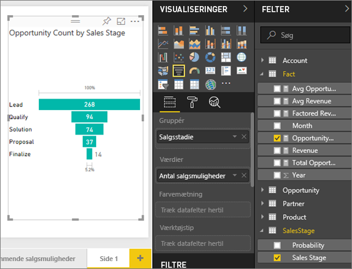
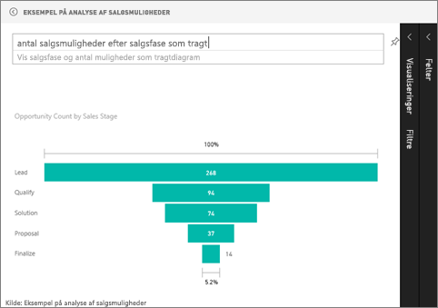

# Tragtformede diagrammer
Et tragtformet diagram hjælper dig med at visualisere en lineær proces, der har fortløbende forbundne faser. Et eksempel: Et tragtformet salgsdiagram, hvor der holdes øje med kunder gennem forskellige faser: Potentielt kundeemne \> Kvalificeret kundeemne \> Kundeemne \> Kontrakt \> Lukket.  I korte træk afspejler tragtens form tilstanden af den proces, du holder øje med.

De enkelte faser i tragten repræsenterer en procentdel af det samlede antal. Så i de fleste tilfælde vil et tragtformet diagram være formet som en tragt – hvor det første trin er det største, og hvor hvert efterfølgende trin bliver mindre end det foregående.  En pæreformet tragt er også nyttig – det kan bruges til at identificere et problem i processen.  Det første trin i fasen, "indgangsfasen", er dog typisk det største.

## Hvornår skal man bruge et tragtformet diagram?
Tragtformede diagrammer er et fantastisk valg i følgende tilfælde:

* Når dataene er fortløbende og dækker over mindst fire faser.
* Når antallet af "elementer" i den første fase forventes at være større end antallet i den sidste fase.
* Til at beregne potentiale (omsætning/salg/handler/osv.) efter fase.
* Til at beregne og holde øje med gennemførelsesfrekvens og fastholdelsesrate.
* Til at vise flaskehalse i en lineær proces.
* Til at holde øje med arbejdsprocessen i forbindelse med indkøbskurv.
* Til at holde øje med statussen på og succesen af reklame-/marketingkampagner vha. klikfrekvensen.

## Sådan arbejder du med tragtformede diagrammer
Tragtformede diagrammer:

* kan fastgøres fra rapporter og fra spørgsmål og svar.
* kan sorteres.
* understøtter multipla.
* kan fremhæves og krydsfiltreres af andre visualiseringer på samme rapportside.
* kan bruges til at fremhæve og krydsfiltrere andre visualiseringer på samme rapportside.

## Opret et tragtformet basisdiagram
I denne video kan du se, hvordan Will opretter et tragtformet diagram ved hjælp af salgs- og marketingeksemplet.

<iframe width="560" height="315" src="https://www.youtube.com/embed/qKRZPBnaUXM" frameborder="0" allow="autoplay; encrypted-media" allowfullscreen></iframe>

Nu kan du oprette dit eget tragtformede diagram, der viser antallet af salgsmuligheder i hvert salgstrin.

I denne vejledning bruges Opportunity Analysis Sample. Du skal [downloade eksemplet](sample-datasets.md) til Power BI-tjenesten (app.powerbi.com) eller Power BI Desktop, så du kan følge med.   

1. Start på en [tom rapportside](power-bi-report-add-page.md), og vælg feltet **SalesStage** \> **Sales Stage**. Hvis du bruger Power BI-tjenesten, skal du åbne rapporten i [Redigeringsvisning](service-interact-with-a-report-in-editing-view.md).
   
    
2. [Konvertér diagrammet](power-bi-report-change-visualization-type.md) til en tragt. Bemærk, at **Sales Stage** også er under **Group**. 
3. I ruden **Fields** skal du vælge **Fact** \> **Opportunity Count**.
   
    
4. Når du holder over en søjle, vises en masse oplysninger.
   
   * Navnet på fasen
   * Antallet af salgsmuligheder, der i øjeblikket findes i denne fase
   * Samlet gennemførelsesfrekvens (% af kundeemner) 
   * Fase-til-fase (dvs. nedgangsfrekvens), som % af den forrige fase (i dette tilfælde Proposal Stage/Solution Stage)
     
     
5. [Tilføj tragten som et dashboardfelt](service-dashboard-tiles.md). 
6. [Gem rapporten](service-report-save.md).

## Fremhævning og krydsfiltrering
Du kan få mere at vide om brug af ruden Filtre under [Føj et filter til en rapport](power-bi-report-add-filter.md).

Fremhævning af en søjle i et tragtformet diagram krydsfiltrerer andre visualiseringer på rapportsiden ... og omvendt. For at kunne følge med skal du føje nogle flere visualiseringer til den rapportside, der indeholder det tragtformede diagram.

1. Vælg søjlen **Proposal** i det tragtformede diagram. Dette krydsfremhæver de andre visualiseringer på siden. Du kan bruge Ctrl til at vælge flere objekter.
   
   
2. Under [Interaktion med visualiseringer i Power BI](service-reports-visual-interactions.md) kan du se, hvordan du angiver indstillinger for krydsfremhævning og krydsfiltrering af visualiseringer.

## Opret et tragtformet diagram i Spørgsmål og svar
Åbn dashboardet Opportunity Analysis Sample (Eksempel med analyse af salgsmuligheder), der har mindst én visualisering fastgjort fra datasættet Opportunity Analysis Sample.  Når du skriver et spørgsmål i Spørgsmål og svar, søges der i Power BI efter svar i alle de datasæt, der er knyttet til det valgte dashboard (dvs. hvor felter er fastgjort til dashboardet). Du kan finde flere oplysninger under [Power BI – Grundlæggende begreber](service-basic-concepts.md).

1. I dashboardet Opportunity Analysis Sample skal du begynde at skrive dit spørgsmål i feltet til spørgsmål og svar.
   
   
   
2. Sørg for at tilføje "som tragtformet", så Power BI ved, hvilken visualiseringstype du foretrækker.

## Næste trin
[Visualiseringstyper i Power BI](power-bi-visualization-types-for-reports-and-q-and-a.md)

[Fastgør en visualisering til et dashboard](service-dashboard-pin-tile-from-report.md)

[Power BI – Grundlæggende begreber](service-basic-concepts.md)

Har du flere spørgsmål? [Prøv at spørge Power BI-community'et](http://community.powerbi.com/)

