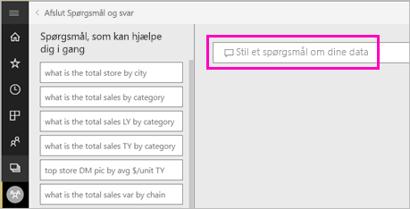

# Opret en visualisering med Spørgsmål og svar i Power BI

Den hurtigste måde at få svar ud af dine data på er nogle gange at stille et spørgsmål på et naturligt sprog.  I denne artikel ser vi på to forskellige måder at oprette den samme visualisering på: først ved at stille et spørgsmål i Spørgsmål og svar og derefter ved at bygge den i en rapport. Vi bruger Power BI-tjenesten til at bygge visual'et i rapporten, men processen er næsten identisk ved brug af Power BI Desktop.

For at følge med skal du bruge en rapport, som du kan redigere, så vi vil bruge et eksempel, der fås med Power BI.

## Opret en visualisering med spørgsmål og svar

Hvordan oprettes dette kurvediagram ved hjælp af Spørgsmål og svar?

1. Fra dit Power BI-arbejdsområde skal du vælge **Hent data** \> **Eksempler** \> **Eksempel på detailhandelsanalyse** > **Forbind**.

1. Åbn dashboardet Eksempel på detailhandelsanalyse, og placer markøren i feltet Spørgsmål og svar, og **stil et spørgsmål om dine data**.

    

2. Skriv noget i stil med følgende spørgsmål i feltet Spørgsmål og svar:
   
    **dette års salg og sidste års salg efter måned som områdediagram**
   
    Imens du skriver dette spørgsmål, vælger Spørgsmål og svar den bedste visualisering til at vise dit svar, og visualiseringen ændres automatisk, når du ændrer spørgsmålet. Desuden hjælper Spørgsmål og svar dig med at formulere dit spørgsmål med forslag, automatisk færdiggørelse og rettelse af stavefejl. Spørgsmål og svar anbefaler en mindre ændring af formuleringen: "dette års salg og sidste års salg efter *gange om måneden* som områdediagram".  

    

4. Vælg den sætning, der skal acceptere forslaget. 
   
   Når du er færdig med at skrive dit spørgsmål, er resultatet det samme diagram, som du ser i rapporten.
   
   

4. Hvis du vil fastgøre diagrammet til dit dashboard, skal du vælge tegnestiftikonet  i øverste højre hjørne.

## Opret en visualisering i rapporteditoren

1. Naviger tilbage til dashboardet med eksemplet på detailhandelsanalyse.
   
2. Dashboardet indeholder det samme områdediagramfelt, der hedder "Sidste års salg og dette års salg".  Vælg dette felt. Vælg ikke det felt, du oprettede med Spørgsmål og svar. Hvis du vælger det, åbnes Spørgsmål og svar. Det oprindelige områdediagram blev oprettet i en rapport, så rapporten åbnes på den side, der indeholder denne visualisering.

    

1. Vælg **Rediger rapport** for at åbne rapporten i Redigeringsvisning.  Hvis du ikke er ejer af en rapport, har du ikke mulighed for at åbne rapporten i Redigeringsvisning.
   
    
4. Vælg områdediagrammet, og gennemse indstillingerne i ruden **Felter**.  Rapportopretteren byggede dette diagram ved at vælge disse tre værdier (**Sidste års salg** og **Dette års salg > Værdi** i tabellen **Salg** og **FiscalMonth** i tabellen **Tid**) og organisere dem i beholderne **Akse** og **Værdier**.
   
    

    Du kan se, at de sluttede med det samme visual. Hvis du opretter den på denne måde, er det ikke for kompliceret. Men det var nemmere at oprette den med Spørgsmål og svar!

## Næste trin

- [Brug Spørgsmål og svar på dashboards og i rapporter](power-bi-tutorial-q-and-a.md)  
- [Spørgsmål og svar til forbrugere](consumer/end-user-q-and-a.md)
- [Få dine data til at fungere godt med Spørgsmål og svar i Power BI](service-prepare-data-for-q-and-a.md)

Har du flere spørgsmål? [Prøv at spørge Power BI-community'et](https://community.powerbi.com/)

