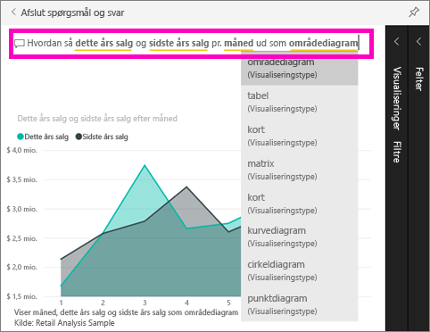

# Kom i gang vha. spørgsmål og svar om Power BI
## Brug Spørgsmål og svar i Power BI sammen med eksemplet på detailhandelsanalyse
Den hurtigste måde at få svar ud af dine data på er nogle gange at stille et spørgsmål på et naturligt sprog.  I denne hurtige introduktion ser vi på to forskellige måder at lave den samme visualisering på: 1, ved at integrere den i en rapport og 2, ved at stille et spørgsmål med Spørgsmål og svar. Vi vil bruge Power BI-tjenesten, men processen er næsten identisk med Power BI Desktop.

For at følge med skal du bruge en rapport, som du kan redigere, så vi vil bruge et eksempel, der fås med Power BI.

## Metode 1: Brug af Report Editor
1. Fra dit Power BI-arbejdsområde skal du vælge **Hent data** \> **Eksempler** \> **Eksempel på detailhandelsanalyse** > **Tilslut**.
   
    
2. Dashboardet har et områdediagramfelt, der hedder "Sidste års salg og dette års salg."  Vælg dette felt. 
   
   * Hvis dette felt blev oprettet med Spørgsmål og svar, åbnes Spørgsmål og svar, hvis du vælger feltet. 
   * Men dette felt blev oprettet i en rapport, så rapporten åbnes til siden, der indeholder denne visualisering.
3. Vælg **Rediger rapport** for at åbne rapporten i Redigeringsvisning.  Hvis du ikke er ejer af en rapport, vil du ikke have mulighed for at åbne rapporten i Redigeringsvisning.
   
    
4. Vælg områdediagrammet, og gennemse indstillingerne i ruden **Felter**.  Report Creator byggede dette diagram ved at vælge disse 3 værdier (**Tid > Regnskabsmåned**, **Salg > Dette års salg**, **Salg >Sidste års salg >Værdi**) og placere dem i beholderne **Akse** og **Værdier**.
   
    

## Metode 2: Brug af Spørgsmål og svar
Hvordan kunne vi oprette dette samme kurvediagram ved hjælp af Spørgsmål og svar?

1. Naviger tilbage til dashboardet med eksemplet på detailhandelsanalyse.
2. Skriv noget med naturligt sprog i spørgsmålsfeltet, som f.eks.:
   
   **Hvordan så dette års salg og sidste års salg per måned ud som områdediagram**
   
   Imens du skriver dette spørgsmål, vælger Spørgsmål og svar den bedste visualisering til at vise dit svar, og visualiseringen ændres automatisk, når du ændrer spørgsmålet. Desuden hjælper Spørgsmål og svar dig med at formulere dit spørgsmål med forslag, automatisk færdiggørelse og rettelse af stavefejl.
   
   Når du er færdig med at skrive dit spørgsmål, er resultatet præcis det samme diagram, som vi så i rapporten.  Men det er meget hurtigere at lave det sådan her!
   
   
3. Ligesom når du arbejder med rapporter, har du i Spørgsmål og svar adgang til ruderne Visualiseringer, Filtre og Felter.  Åbn disse ruder for at finde ud af mere og ændre din visual.
4. Du kan sætte diagrammet fast på dit dashboard ved at vælge tegnestiftikonet .

## Næste trin
[Spørgsmål og svar i Power BI](power-bi-q-and-a.md)

[Få dine data til at fungere godt med Spørgsmål og svar i Power BI](service-prepare-data-for-q-and-a.md)

Har du flere spørgsmål? [Prøv at spørge Power BI-community'et](http://community.powerbi.com/)

