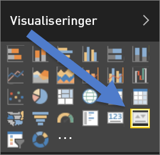
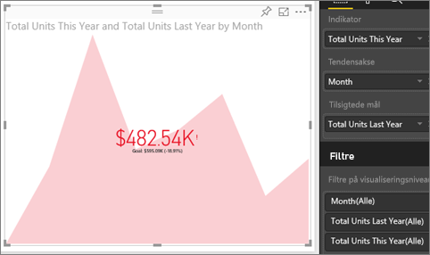

# KPI-visualiseringer (selvstudium)
Et nøgletal (KPI) er en visuel ledetråd, der viser fremgangen mod et målbart mål. Du kan finde flere oplysninger om KPI'er ved at se [Microsoft Developer Network](https://msdn.microsoft.com/library/hh272050).

## Hvornår bruger man et KPI
KPI'er er et godt valg:

* til at måle fremgang (hvad er jeg foran eller bagefter med?)
* til at måle afstanden til et mål (hvor langt foran eller bagefter er jeg?)   

## Krav til KPI-visualiseringer
Et nøgletal (KPI) er baseret på et bestemt mål og er designet til at hjælpe dig med at evaluere den aktuelle værdi og status for en metrik i henhold til et angivet mål. KPI-visualiseringer kræver derfor en *basismåling*, som evalueres til en værdi, og en *mål*-måling eller -værdi, og en tærskel eller et mål.

> [!NOTE]
> I øjeblikket skal et KPI-datasæt indeholde målværdier for et KPI. Hvis dit datasæt ikke indeholder et mål, kan du oprette dem ved at føje et Excel-ark med mål til din datamodel eller PBIX-fil.
> 
> 

## Sådan opretter du et KPI
Hvis du selv vil følge med, skal du logge på Power BI-tjenesten og vælge **Hent data > Eksempler > Retail Analysis Sample (Eksempel på detailhandelsanalyse)**. Vi opretter et KPI, der måler vores fremgang mod et salgsmål.

Eller du kan se med, når Will viser, hvordan du opretter visualiseringer med en enkelt måling: målere, kort og KPI'er.

<iframe width="560" height="315" src="https://www.youtube.com/embed/xmja6EpqaO0?list=PL1N57mwBHtN0JFoKSR0n-tBkUJHeMP2cP" frameborder="0" allowfullscreen></iframe>

1. Åbn rapporten i [Redigeringstilstand](service-reading-view-and-editing-view.md), og [tilføj en ny side](power-bi-report-add-page.md).    
2. Vælg **Sales > Total Units This Year**.  Dette er indikatoren.
3. Tilføj **Time > Month**.  Dette repræsenterer tendensen.
4. VIGTIGT: Sorter diagrammet efter **Month**. Når du konverterer visualiseringen til et KPI, er der ikke muligt at sortere.

    
5. Konverter visualiseringen til et KPI ved at vælge ikonet KPI i visualiseringsruden.
   
    
6. Tilføj et mål. Tilføj sidste års salg som målet. Træk **Total Units Last Year** til feltet **Target goals**.
   
    
7. Du kan eventuelt formatere KPI'et ved at vælge malerrulleikonet for at åbne ruden Formatering.
   
   * **Indicator** – -styrer indikatorens visningsenheder og decimalpladser.
   * **Trend axis** – når den er slået **Til**, vises tendensaksen som baggrund i KPI-visualiseringen.  
   * **Goals** – når det er slået **Til**, viser visualiseringen målet og afstanden til målet som en procentdel.
   * **Farvekodning > Retning** – nogle KPI'er anses som *bedre* for højere værdier, og nogle anses som *bedre* for lavere værdier. For eksempel indtægter i forhold til ventetid. En højere værdi for indtjening er typisk bedre i forhold til en højere værdi for ventetid. Vælg **høj er bedre**, og rediger eventuelt farveindstillingerne.

1. Når du har KPI'et, som du vil have det, skal du [fastgøre det til et dashboard](service-dashboard-pin-tile-from-report.md).

KPI'er er også tilgængelige på dine mobilenheder, så du altid har fingeren på virksomhedens puls.

## Overvejelser og fejlfinding
* Hvis KPI'et ikke ligner det ovenfor, kan det skyldes, at du skal sortere efter måned. Da KPI'er ikke har en sorteringsindstilling, skal du sorterer efter måned, *før* du konverterer din visualisering til et KPI.

## Næste trin
[Rapporter i Power BI](service-reports.md)

[Visualiseringer i Power BI-rapporter](power-bi-report-visualizations.md)

[Power BI – grundlæggende begreber](service-basic-concepts.md)

Har du flere spørgsmål? [Prøv at spørge Power BI-community'et](http://community.powerbi.com/)

