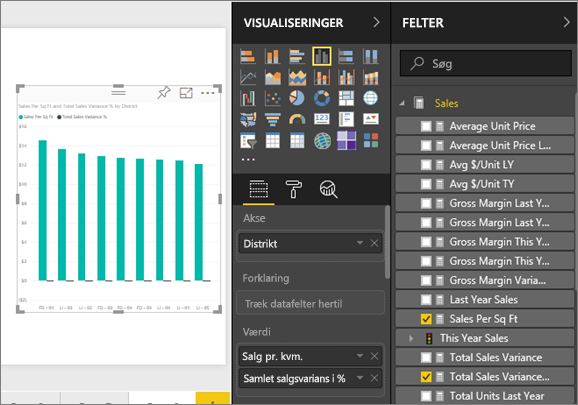
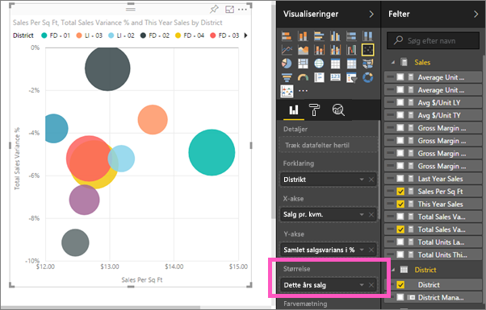
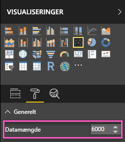
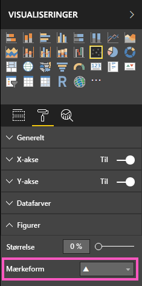
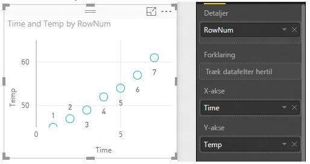
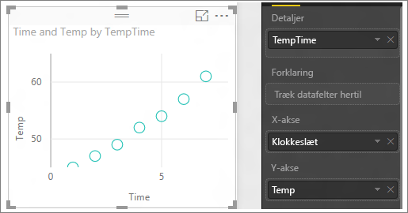

# Punktdiagrammer og boblediagrammer i Power BI
Et punktdiagram har altid to værdiakser for at vise ét sæt numeriske data langs en vandret akse og et andet sæt numeriske værdier langs en lodret akse. Diagrammet viser punkter ved skæringspunktet for en numerisk x- og y-værdi og kombinerer disse værdier i enkelte datapunkter. Disse datapunkter kan være fordelt jævnt eller ujævnt på tværs af den vandrette akse afhængigt af dataene.

Et boblediagram erstatter datapunkterne med bobler, hvor boble*størrelsen* repræsenterer en yderligere dimension af dataene.

Du kan fastsætte antallet af datapunkter  

## Hvornår skal man bruge et punktdiagram eller boblediagram?
### Punktdiagrammer er praktiske til følgende situationer:
* Vis relationer mellem 2 (punktdiagram) eller 3 (boblediagram) **numeriske** værdier.
* Afbild to grupper af tal som en serie af x- og y-koordinater.
* I stedet for et kurvediagram, når du vil ændre skalaen for den vandrette akse.    
* Hvis du vil ændre den vandrette akse til en logaritmisk skala.
* Hvis du vil vise projektmappedata, der inkluderer par eller grupperede værdisæt. I et punktdiagram kan du tilpasse akseskalaerne uafhængigt af hinanden for at afsløre flere oplysninger om grupperede værdier.
* Til at vise mønstre i store datasæt, for eksempel ved at vise lineære eller ikke-lineære tendenser, klynger og udenforliggende værdier.
* Til at sammenligne store antal datapunkter uden hensyntagen til tiden.  Jo flere data, du medtager i et punktdiagram, jo bedre er sammenligningerne, du kan udføre.

### Boblediagrammer er praktiske til følgende situationer:
* Hvis dine data har 3 dataserier, som hver indeholder et sæt af værdier.
* Til præsentation af finansielle data.  Forskellige boblestørrelser er praktiske til visuel fremhævning af specifikke værdier.
* Til brug med kvadranter.

## Opret et punktdiagram
Se denne video for at se Will oprette et punktdiagram, og følg derefter nedenstående trin for at oprette et selv.

<iframe width="560" height="315" src="https://www.youtube.com/embed/PVcfPoVE3Ys?list=PL1N57mwBHtN0JFoKSR0n-tBkUJHeMP2cP" frameborder="0" allowfullscreen></iframe>

I denne vejledning bruges Retail Analysis Sample (Eksempel på detailhandelsanalyse). Du skal [downloade eksemplet](sample-datasets.md) til Power BI-tjenesten (app.powerbi.com) eller Power BI Desktop, så du kan følge med.   

1. Vælg det gule plus-ikon for at oprette en [tom rapportside](power-bi-report-add-page.md).
 
2. I ruden Felter skal du vælge følgende felter:
   - **Salg** > **Salg pr. kvm.**
   - **Salg** > **Samlet salgsvarians i %**
   - **Distrikt** > **Distrikt**

     

     Hvis du bruger Power BI-tjenesten, skal du åbne rapporten i [Redigeringsvisning](service-interact-with-a-report-in-editing-view.md).

3. Konvertér til et punktdiagram. Vælg ikonet Punktdiagram i ruden Visualiseringer.

   .

4. Træk **District** fra **Detaljer** til **Forklaring**. Nu ses et punktdiagram, der viser **Samlet salgsvarians i %** langs Y-aksen og **Salg pr. kvm.** langs X-aksen. Datapunkternes farver repræsenterer distrikter:

    

Nu tilføjer jeg en tredje dimension.

## Opret et boblediagram

1. I ruden **Felter** skal du trække **Salg** > **Dette års salgs** > **værdi** til området **Størrelse**. Datapunkterne udvides til mængder, der er proportionale med salgsværdien.
   
   

2. Peg på en boble. Boblens størrelse afspejler værdien af **This Year Sales**.
   
    

3. Hvis du vil indstille antallet af datapunkter, der skal vises i dit boblediagram, skal du i afsnittet **Format** på ruden **Visualiseringer** udvide kortet **Generelt** og justere **Datamængde**. Du kan angive, at den maksimale datamængde skal være et vilkårligt tal op til 10.000. Når du når til højere tal, anbefaler vi, at du tester det først for at sikre, at der bibeholdes en brugbar ydeevne. 

     

   > [!NOTE]
   > Da flere datapunkter kan føre til en længere indlæsningstid, hvis du vælger at publicere rapporter med grænser i den højere ende af skalaen, skal du sørge for at afprøve dine rapporter på tværs af internettet og mobilnettet samt sørge for, at ydeevnen opfylder dine brugeres forventninger. Bemærk, at for et højere antal datapunkter skal du teste resultaterne på forskellige formfaktorer for at sikre en god ydeevne.

4. Du kan [formatere farver, navne, titler, baggrund og mere i dine visualiseringer](service-getting-started-with-color-formatting-and-axis-properties.md). Hvis du vil [forbedre tilgængeligheden](desktop-accessibility.md), bør du overveje at føje mærkeformer til hver enkelt linje. Hvis du bruger en anden mærkeform for hver enkelt linje, kan brugere af rapporter nemmere adskille linjer (eller områder) fra hinanden. Hvis du vil vælge mærkeformen, skal du udvide kortet **Figurer** og derefter vælge en mærkeform.

      

   Du kan også ændre mærkeformen til diamant, trekant eller firkant:

   

## Overvejelser og fejlfinding

### **Dit punktdiagram har kun ét datapunkt**
Har dit punktdiagram kun ét datapunkt, der aggregerer alle værdierne på X- og Y-aksen?  Eller aggregeres alle værdierne langs en enkelt vandret eller lodret linje?

Tilføj et felt i området **Detaljer** for at angive, hvordan værdierne skal grupperes i Power BI. Feltet skal være entydigt for hver punkt, der skal afbildes.  
Som et enkelt rækkenummer eller et id-felt:

Hvis det ikke findes i dine data, kan du oprette et felt, der sammensætter X- og Y-værdierne til noget entydigt pr. punkt:

Du kan oprette et nyt felt ved at [bruge Forespørgselseditor i Power BI Desktop til at tilføje en indekskolonne](desktop-add-custom-column.md) i dit datasæt.  Tilføj derefter denne kolonne i området **Detaljer** for din visualisering.

## Næste trin
[Visualiseringstyper i Power BI](power-bi-visualization-types-for-reports-and-q-and-a.md)

[Tilmeld dig en gratis prøveversion](https://powerbi.microsoft.com/get-started/)  

Har du flere spørgsmål? [Prøv at spørge Power BI-community'et](http://community.powerbi.com/)

