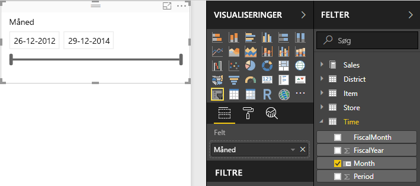

# Udsnitsværktøjer i Power BI
Du vil gerne give rapportlæserne mulighed for at se de overordnede salgstal, men samtidig fremhæve resultaterne for individuelle distriktsledere (District Manager) og forskellige tidsperioder. Du kan oprette separate rapporter eller diagrammer til sammenligning, eller du kan bruge udsnit. Et udsnit er en alternativ metode til filtrering, som begrænser den del af datasættet, der vises i andre visualiseringer i en rapport. 

I dette selvstudium bruges det gratis [eksempel på detailhandelsanalyse](sample-retail-analysis.md) til at gennemgå, hvordan du opretter, formaterer og bruger liste- og datointervaludsnit. Mor dig med at opdage måder, du kan formatere og bruge udsnit på. 

## Hvornår man bruger et udsnit
Udsnit er et fantastisk valg, når du vil:

* vise ofte brugte eller vigtige filtre på rapportlærredet af hensyn til lettere adgang
* gøre det nemmere at se den aktuelle filtrerede tilstand uden at skulle åbne en rulleliste 
* filtrere efter kolonner, der ikke er behov for, og som er skjult i datatabeller
* oprette mere fokuserede rapporter ved at placere udsnit ved siden af vigtige visualiseringer.

Der er følgende begrænsninger for udsnit i Power BI:

- Udsnit understøtter ikke inputfelter.
- Udsnit kan ikke fastgøres til et dashboard.
- Detaljeret visning understøttes ikke for udsnit.
- Udsnit understøtter ikke filtre på visualiseringsniveau.

## Opret udsnit

Du kan oprette et udsnit ved at vælge udnitsikonet og derefter vælge det datafelt, du vil filtrere efter (eller trække det til feltet **Felter** i ruden **Visualiseringer**), eller du kan vælge eller trække datafeltet først for at oprette en visualisering og derefter vælge udsnitsikonet for at ændre visualiseringen til et udsnit. Forskellige datatyper opretter forskellige typer udsnit med forskellige effekter og indstillinger. 

Når du ændrer en rapport første gang, vil knappen **Nulstil til standard** lyse op. Dette er en påmindelse om, at du har foretaget en ændring i de oprindelige rapportindstillinger. Hvis du navigerer væk fra rapporten, gemmes ændringen. Når du vender tilbage til rapporten, skal du ikke oprette nye udsnit.  Hvis du vil nulstille rapporten til forfatterens standardindstillinger, skal du dog vælge knappen **Nulstil til standard** på den øverste menulinje.

> [!NOTE]
> Hvis knappen **Nulstil til standard** forbliver deaktiveret, betyder det enten, at rapportens forfatter har deaktiveret funktionen for rapporten, eller det betyder, at rapporten indeholder en brugerdefineret visualisering. Du skal blot pege på knappen for at læse værktøjstippet for at få en forklaring. 

**Sådan opretter du et nyt udsnit for at filtrere data efter District Manager**

1. Åbn [Retail Analysis Sample](sample-retail-analysis.md) i Power BI Desktop eller Power BI-tjenesten. I Power BI-tjenesten skal du vælge **Rediger rapport** øverst til venstre.
2. På siden **Oversigt** skal du vælge ikonet **Udsnit** (uden at du har markeret noget på dit lærred)  i ruden **Visualiseringer** for at oprette et nyt udsnit. 
3. Med det nye udsnit markeret skal du vælge **District Manager** under **District** i ruden **Felter** for at udfylde udsnittet. Det nye udsnit er en liste med afkrydsningsfelter ud for navnene. 
    
    
    
4. Tilpas størrelsen på udsnittet, og træk udsnittet og andre elementet på lærredet for at gøre plads til udsnittet. Bemærk, at elementerne i udsnittet bliver afskåret, hvis du gør udsnittet for lille. 
5. Vælg navne på udsnittene, og bemærk, hvordan det påvirker de øvrige visualiseringer på siden. Vælg navnene igen for at fjerne markeringen af dem, og hold **Ctrl** nede for at markere mere end ét navn. Hvis du markerer alle navnene, vil det have samme effekt som ikke at markere nogen af dem. 

>[!TIP]
>Listeudsnitselementer sorteres som standard i stigende alfabetisk rækkefølge. Hvis du vil sortere elementerne i udsnittet i omvendt alfabetisk rækkefølge, skal du vælge prikkerne (**...**) i øverste højre hjørne af udsnittet og derefter vælge **Sortér efter District Manager**. 

**Sådan opretter du et nyt udsnit for at filtrere data efter datointerval**

1. Vælg rullelisten **Tid** i ruden Felter (uden først at markere noget på lærredet), og træk **Måned** (eller **Dato** i Power BI-tjenesten) til feltet **Værdier** i ruden Visualiseringer for at oprette en ny visualisering.
2. Med den nye visualisering markeret skal du vælge ikonet **Udsnit** for at konvertere den nye visualisering til et udsnit. Dette udsnit er en skyder med det angivne datointerval.
    
    
    
4. Tilpas størrelsen på udsnittet, og træk udsnittet og andre elementet på lærredet for at gøre plads til udsnittet. Vær opmærksom på, at udsnittets størrelse tilpasses, når du tilpasser størrelsen på udsnittet, men hvis udsnittet bliver for lille, skjules udsnittet, og datoerne vil være beskåret. 
4. Vælg et andet datointerval på skyderen, vælg et datofelt for at skrive en værdi, eller brug en pop op-kalender for at gør det nemt at vælge nøjagtige datoer. Bemærk, hvordan det påvirker de øvrige visualiseringer på siden.
    
    >[!NOTE]
    >Numeriske data og data af typen dato/klokkeslæt kan oprettet udsnit med skydere som standard. Fra og med Power BI-opdateringen i februar 2018 vil skyderen med heltalsintervaller nu fastgøre til heltalsværdier og ikke vise decimaler. 

>[!TIP]
>Selvom datafeltet **Måned** opretter et udsnit med intervalskyderen **Mellem** som standard, kan du ændre den til andre udsnitstyper og andre vælgere. Hvis du vil ændre udsnitstypen, skal du markere udsnittet, pege på det øverste højre hjørne af udsnittet for at få vist en rulleliste og vælge en af de andre indstillinger, for eksempel **Liste** eller **Før**. Bemærk, hvordan udsnittets udseende og indstillingerne ændres. 

Hvis du vil vide mere om, hvordan du opretter udsnit med datointervaller eller talintervaller, skal du se følgende video og se [Brug udsnittet til talintervaller i Power BI Desktop](desktop-slicer-numeric-range.md).
<iframe width="560" height="315" src="https://www.youtube.com/embed/zIZPA0UrJyA" frameborder="0" allowfullscreen></iframe> 

## Styr, hvilke visualiseringer på siden der påvirkes af udsnit
Som standard påvirker udsnit på rapportsider alle andre visualiseringer på den samme side – også hinanden. Når du vælger værdier på de liste- og datoudsnit,du har oprettet, kan du se ændringerne i de andre visualiseringer. De filtrerede data er skæringspunktet for de værdier, der er valgt i begge udsnit. 

Du kan bruge **Visuelle interaktioner** til at forhindre, at nogle visualiseringer på siden bliver påvirket. På siden **Oversigt** viser diagrammet "Total Sales Variance by FiscalMonth and District Manager" de overordnede sammenlignelige data for District Managers efter måned, som du vil vise hele tiden. Du kan bruge **Visuelle interaktioner** for at forhindre, at valg i udsnit filtrerer dette diagram. 

1. Med udsnittet District Manager valgt:
    - I Power BI Desktop skal du vælge menuen **Formater** under **Visuelle værktøjer** og vælge **Rediger interaktioner**.
    - I Power BI-tjenesten skal du vælge rullelisten **Visuelle interaktioner** på menulinjen og slå **Rediger interaktioner** til. 
   
   Kontrolelementerne til filtrering  vises over alle andre visualiseringer på siden. Alle ikonerne under **Filter** er valgt til at starte med.
   
2. Vælg ikonet **Ingen** over diagrammet **Total Sales Variance by FiscalMonth and District Manager** for at forhindre, at udsnittet filtrerer diagrammet. 
3. Vælg udsnittet **Måned**, og vælg igen ikonet **Ingen** over diagrammet **Total Sales Variance by FiscalMonth and District Manager** for at forhindre, at udsnittet filtrerer diagrammet. Når du vælger navne og datointervaller i udsnittet, vil diagrammet Total Sales Variance by FiscalMonth and District Manager nu forblive uændret. 

Se [Visuelle interaktioner i en Power BI-rapport](service-reports-visual-interactions.md) for at få flere oplysninger om redigering af interaktioner.

## Synkroniser og brug udsnit på andre sider
Fra og med opdateringen af Power BI i februar 2018 kan du synkronisere et udsnit og bruge det på en hvilken som helst side i en rapport. 

I den aktuelle rapport vil siden **District Monthly Sales** også have udsnittet **District Manager**, men det synkroniseres ikke med det, du har oprettet på siden **Oversigt** (der kan vælges forskellige elementer i de to udsnit). Siden **New Stores** har kun udsnittet **Store Name**. Du kan synkronisere det nye udsnit **District Manager** for disse sider, så udsnitsvalgene på enhver side påvirker visualiseringerne på alle tre sider. 

1. Vælg **Synkroniser udsnit** i menuen **Vis** i Power BI Desktop (eller slå ruden **Synkroniser udsnit** til i Power BI-tjenesten). Ruden **Synkroniser udsnit** vises. 
2. Vælg udsnittet **District Manager** på siden **Oversigt**. Bemærk, at siden **District Monthly Sales** allerede er valgt i kolonnen **Synlig**, da der også findes et District Manager-udsnit på den side, men det er ikke valgt i kolonnen **Synkroniser**. 
    
    
    
3. I kolonnen **Synkroniser** skal du vælge siden **New Stores** og siden **District Monthly Sales** for at synkronisere udsnittet **Oversigt** for disse sider. 
    
3. I kolonnen **Synlig** skal du vælge siden **New Stores** og lade siden **District Monthly Sales** være valgt. 
4. Se, hvordan synkronisering af slideren påvirker de andre sider. På siden **District Monthly Sales** viser udsnittet **District Manager** nu de samme valg som den på siden **Oversigt**. På siden **New Stores** vil valgene i udsnittet **District Manager** påvirke, hvilke valg der er tilgængelige i udsnittet **Store Name**. 
    
    >[!TIP]
    >Selvom udsnittet vises på de synkroniserede sider med samme størrelse og placering som på den oprindelige side, kan du flytte dem, ændre deres størrelse og formatere dem uafhængigt på de enkelte sider. 

>[!NOTE]
>Hvis du synkroniserer et udsnit til en side, men ikke gør det synligt på siden, vil udsnitsvalgene på de andre sider stadig filtrere dataene på siden.
 
## Formatér udsnit
Der findes forskellige indstillinger til formatering afhængigt af udsnitstypen. Hvis du bruger retningen **Vandret**, layoutet **Dynamisk** og **elementfarver**, kan du oprette knapper eller felter i stedet for almindelige listeelementer og få elementer i udsnit til at tilpasse størrelse, så de passer til forskellige skærmstørrelser og layout.  

1. Med udsnittet **District Manager** valgt på en af siderne skal du vælge ikonet **Format**  i ruden **Visualiseringer** for at få vist kontrolelementerne til formatering. 
    
    
    
2. Klik på pilene i rullelisten ud for hver kategori for at få vist og redigere indstillingerne. 

### Generelle indstillinger
1. Vælg rød under **Konturfarve**, og ret **Konturtykkelse** til "2". Dermed angives konturens farve og tykkelse eller understregning for overskrifter og elementer, når det aktiveres. 
2. Under **Retning** er **Lodret** valgt som standard. Vælg **Vandret** for at få et udsnit med vandret arrangerede felter eller knapper, og rul med pilene for at få adgang til elementer, der ikke vises på skyderen.
    
    
    
3. Slå layoutet **Dynamisk** til for at ændre størrelsen på og placeringen af udsnitselementerne efter visningsskærm og udsnitsstørrelse. For listeudsnit er dynamisk layout kun tilgængeligt i vandret format, og det forhindrer, at elementer afskæres på små skærme. For udsnit med intervalskydere vil dynamisk formatering ændre formatet for skyderen og give mere fleksible muligheder for tilpasning af størrelsen. Begge typer udsnit bliver filterikoner ved meget små størrelser. 
    
    
    
    >[!NOTE]
    >Ændringer af Dynamisk layout kan tilsidesætte særlig formatering af overskrifter og elementer, som du har angivet. 
    
4. Angiv skyderens placering og størrelse med tal under **X-placering**, **Y-placering**, **Bredde** og **Højde**, eller flyt og tilpas størrelsen på udsnittet direkte på lærredet. Afprøv forskellige størrelser på og placering af elementer, og se, hvordan dynamisk formatering ændres derefter.  

    

Se [Opret et dynamisk udsnit, som du kan ændre størrelsen på, i Power BI](power-bi-slicer-filter-responsive.md) for at få flere oplysninger om horisontal retning og dynamisk layout.

### Indstillinger for Kontrolelementer til markering (kun listeudsnit)
1. **Vis Vælg alle** er som standard slået **Fra**. Slå den **til** for at føje elementet **Vælg alle** til udsnittet, så du vælge eller fravælge alle elementer, når du skifter mellem indstillingerne. Når alle elementer er valgt, fravælger du et element ved at klikke eller trykke på det, hvilket aktiverer filtret af typen "er ikke". 
    
    
    
2. **Vælg én** er som standard slået **til**. Når du klikker eller trykker på hvert element, vælger du det, og når du holder **Ctrl** nede, mens du klikker eller trykker, vælger du flere elementer. Slå **Vælg én** **fra** for at muliggøre valg af flere elementer uden at skulle holde **Ctrl** nede. Når du klikker eller trykker på hvert element igen, fravælger du det. 

### Indstillinger for overskrifter
**Overskrifter** er som standard slået **til**, så datafeltnavnet vises øverst i udsnittet. 
1. Formatér teksten i overskriften for at angive **skriftfarven** til rød, **tekststørrelsen** til 14 pkt. og **skrifttypen** til Arial Black. 
2. Vælg **Kun knap** under **Kontur** for at oprette en understregning med den størrelse og farve, som du har angivet under **Generelle indstillinger**. 

### Indstillinger for element (kun listeudsnit)
1. Formatér elementernes tekst og baggrund for at angive **skriftfarven** til sort, **baggrunden** til lys rød, **tekststørrelsen** til 10 pkt. og **skrifttypen** til Arial. 
2. Vælg **Ramme** under **Kontur** for at tegne en kant omkring hvert element med den størrelse og farve, som du har angivet under **Generelle indstillinger**. 
    
    
    
    >[!TIP]
    >- Med **Retning > Vandret** vises den valgte tekst og de valgte baggrundsfarver for fravalgte elementer, mens systemstandarderne bruges for valgte elementer, hvilket normalt er sort baggrund med hvid tekst.
    >- Med **Retning > Lodret** vises de angivne farver altid for elementerne, og afkrydsningsfelterne er altid sorte, når de er markeret. 

### Dato/numerisk input og indstillinger for skyder (kun for udsnit med intervalskyder)
- Indstillingerne for dato/numerisk input er de samme som indstillingerne for **Element** for listeudsnit, men der findes ikke **Kontur** og understregning.
- Med indstillingerne for skyderen kan du angive farven på intervalskyderen, eller du kan slå skyderen **fra** og kun bruge numerisk input.

### Andre formateringsindstillinger
De andre formateringsindstillinger er som standard slået fra. Når de er slået **til**: 
- **Titel:** Tilføjer og formaterer en titel (udover og uafhængigt af overskriften) øverst i udsnittet. 
- **Baggrund:** Tilføjer en baggrundsfarve på hele udsnittet og angiver gennemsigtigheden.
- **Lås højde-bredde-forhold:** Bevarer formen af udsnittet, hvis størrelsen tilpasses.
- **Kant:** Tilføjer en kant på 1 pixel rundt om udsnittet og angiver farven på den. (Denne kant er forskellig fra og ikke påvirket af de generelle indstillinger for Kontur). 

## Næste trin
[Prøv det – det er gratis!](https://powerbi.com/)

Har du ideer til at forbedre Power BI? [Send en ide](https://ideas.powerbi.com/forums/265200-power-bi-ideas).

Har du flere spørgsmål? [Prøv at spørge Power BI-community'et](http://community.powerbi.com/)

[Føj en visualisering til en rapport](power-bi-report-add-visualizations-i.md)

[Visualiseringstyper i Power BI](power-bi-visualization-types-for-reports-and-q-and-a.md)

[Power BI – Grundlæggende begreber](service-basic-concepts.md)

