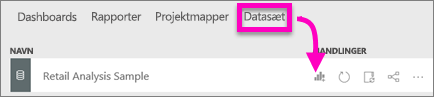
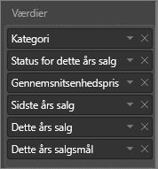
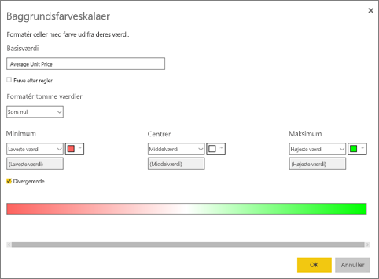
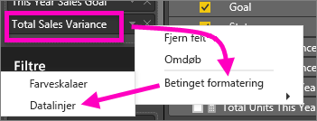
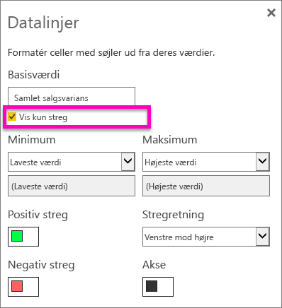

# Arbejd med tabeller i Power BI-rapporter og -dashboards (selvstudium)
En tabel er et gitter, der indeholder relaterede data i logiske serier af rækker og kolonner. Den kan også indeholde overskrifter og en række til totaler. Tabeller fungerer godt med kvantitative sammenligninger, hvor du får vist mange værdier for en enkelt kategori. Denne tabel viser for eksempel fem forskellige målinger for **Category**.

## Du skal bruge en tabel, til at
Tabeller er et godt valg til at:

* Se og sammenligne detaljerede data og nøjagtige værdier (i stedet for visuelle repræsentationer).
* Se data i tabelformat.
* Se numeriske data efter kategorier.   

> [!NOTE]
> Hvis en tabel indeholder for mange værdier, kan du overveje at konvertere den til en matrix og/eller bruge detailudledning.
> 
> 
## Forudsætninger
 - Power BI-tjenesten eller Power BI Desktop
 - Retail Analysis Sample

## Opret en tabel
I selvstudiet kan du oprette den tabel, der vises herover, for at få vist salgsværdierne efter varekategori. Log på Power BI-tjenesten for at følge fremgangsmåden, og vælg **Hent Data \>Eksempler \> Eksempel på detailhandelsanalyse > Opret forbindelse**, og vælg **Gå til dashboard. Oprettelse af en visualisering kræver redigeringsrettigheder til datasættet og rapporten. Heldigvis kan alle Power BI-eksemplerne redigeres. Hvis en rapport er blevet delt med dig, kan du ikke oprette visualiseringer i den.

1. I navigationsruden til venstre skal du vælge **Arbejdsområder > Mit arbejdsområde**.    
2. Vælg fanen Datasæt, og rul ned til eksempeldatasættet Detailhandelsanalyse, som du lige har tilføjet.  Vælg ikonet **Opret rapport**.
   
    
2. Vælg **Item** > **Category** i rapporteditoren.  Power BI opretter automatisk en tabel over alle kategorierne.
   
    
3. Vælg **Sales > Average Unit Price**, **Sales > Last Year Sales** og **Sales > This Year Sales**, og vælg alle tre indstillinger (Value, Goal, Status).   
4. Find **Værdier** i ruden Visualiseringer, og træk og slip værdierne, indtil rækkefølgen af diagramkolonnerne stemmer overens med det første billede på denne side.  Du skulle nu se følgende under Værdier.
   
    
5. Fastgør tabellen til dashboardet ved at vælge ikonet med tavlenålen  
   
     

## Formatér tabellen
Der er mange måder, hvorpå du kan formatere en tabel, og jeg beskriver kun nogle få af dem her. Hvis du vil vide mere om andre formateringsindstillinger, kan du åbne ruden Format (ikonet med malerullen ) og prøve dig frem.

* Prøv at formatere tabelgitteret. Her har jeg tilføjet et blåt lodret gitter, tilføjet mellemrum mellem rækkerne og forstørret kanten og tekststørrelsen en smule.
  
    
  
    
* I kolonneoverskrifterne har jeg ændret baggrundsfarven, tilføjet en kant og øget skriftstørrelsen. 
  
    
  
    
* Efter lidt yderligere formatering ser den endelige tabel sådan ud. Da der er så mange formateringsindstillinger, kan det være en god idé at starte med en almindelig tabel, åbne ruden Formatering  og så ellers prøve dig frem. 
  
    

### Betinget formatering
Der findes en type formatering, der kaldes *betinget formatering*, og den anvendes på felterne under **Værdier** i ruden **Visualiseringer** i Power BI-tjenesten eller Power BI Desktop. 

Med betinget formatering af tabeller kan du angive brugerdefinerede baggrundsfarver og skriftfarver for celler baseret på celleværdier, bl.a. ved hjælp af gradueringsfarver. 

1. Vælg den nedadvendte pil ud for den værdi under **Værdier** i ruden **Visualiseringer** i Power BI-tjenesten eller Power BI Desktop, du vil formatere (eller højreklik på feltet). Du kan kun administrere betinget formatering for felter i området **Værdier** under **Felter**.
   
    
2. Vælg **Baggrundsfarveskalaer**. Du kan konfigurere farven og *Minimum*- og *Maksimum*-værdierne i den dialogboks, der vises. Hvis du vælger feltet **Divergerende**, kan du også konfigurere en valgfri værdi af typen *Centreret*.
   
    
   
    Jeg vil prøve at anvende brugerdefineret formatering til Average Unit Price-værdierne. Vælg **Divergerende**, tilføj nogle farver, og vælg **OK**. 
   
    
3. Tilføj et nyt felt i tabellen, der har både positive og negative værdier.  Vælg **Sales > Total Sales Variance**. 
   
    
4. Tilføj betinget formatering for datalinjen ved at vælge den nedadvendte pil ud for **Total Sales Variance** og vælge **Betinget formatering > Datalinjer**.
   
    
5. I den viste dialogboks kan du angive farver for **Positiv streg**, **Negativ streg**, markere afkrydsningsfeltet **Vis kun streg** og foretage eventuelle andre ændringer.
   
    
   
    Når du vælger **OK**, erstatter datalinjerne de numeriske værdier i tabellen, så den er nemmere at skimme.
   
    
6. Hvis du vil fjerne betinget formatering fra en visualisering, skal du blot højreklikke på feltet igen og vælge **Fjern betinget formatering**.

> [!TIP]
> Du kan også angive betinget formatering i ruden Format (ikonet med malerullen). Vælg den værdi, du vil formatere, og angiv derefter **Farveskalaer** eller **Datalinjer** til Til for at anvende standardindstillingerne. Hvis du vil tilpasse indstillingerne, skal du vælge **Avancerede kontrolelementer**.
> 
> 

## Tilpas kolonnebredden i en tabel
Nogle gange kan Power BI afskære en kolonneoverskrift i en rapport og på et dashboard. Hvis du vil kunne se hele kolonnenavnet, skal du pege på mellemrummet til højre for overskriften for at få vist dobbeltpilene og klikke og trække.

Har du flere spørgsmål? [Prøv at spørge Power BI-community'et](http://community.powerbi.com/)

