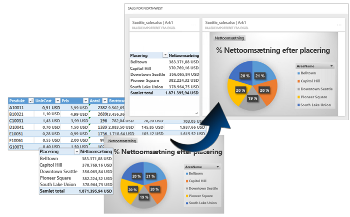
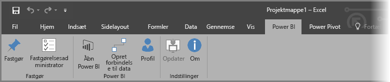
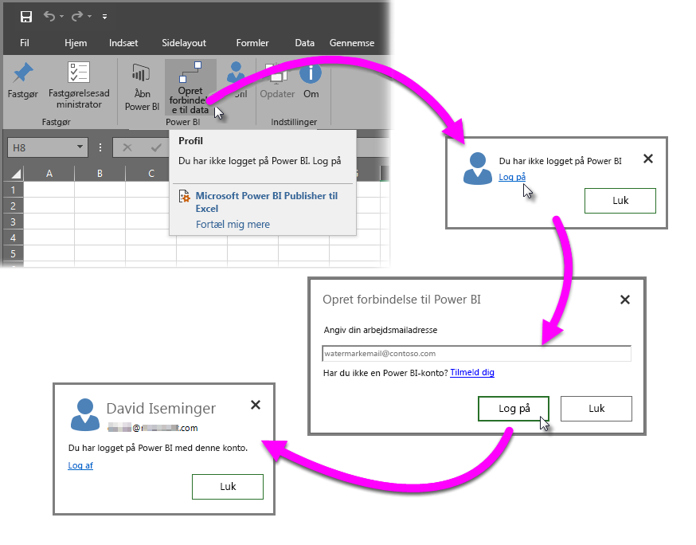
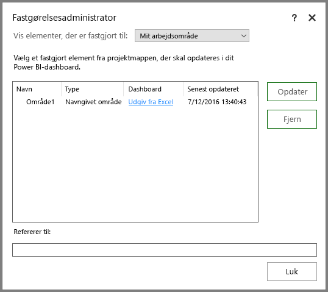
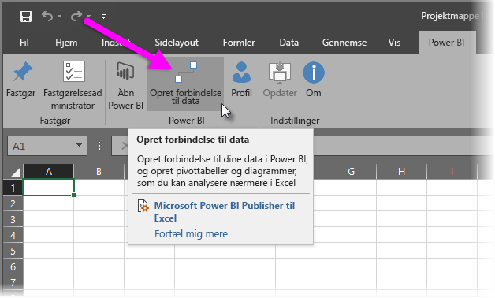
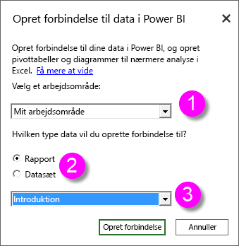
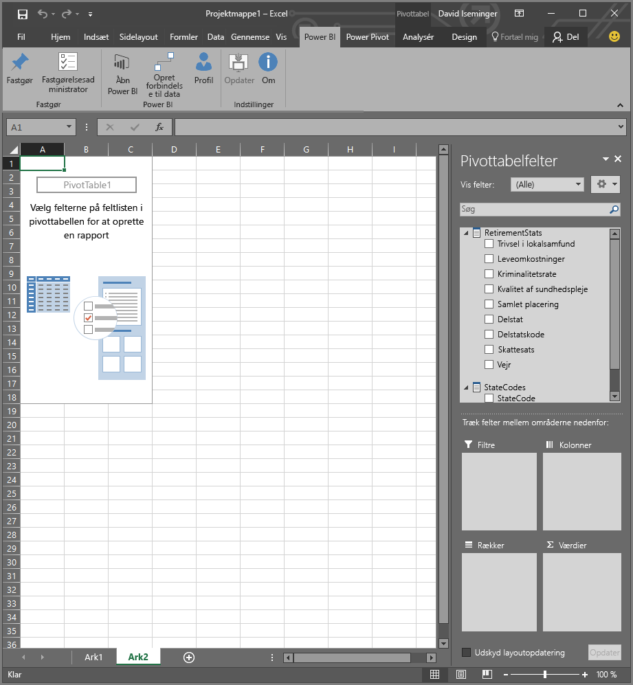
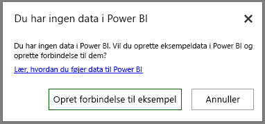

# Power BI Publisher til Excel
Med Microsoft **Power BI Publisher til Excel** kan du tage snapshots af dine vigtigste indsigter i Excel, f.eks. pivottabeller, diagrammer og områder og fastgøre dem til dashboards i Power BI.

Hvad kan du fastgøre? Næsten alt i et Excel-regneark. Du kan markere et celleområde fra et enkelt ark eller en enkel tabel, en pivottabel eller et pivotdiagram, illustrationer og billeder, tekst.

Hvad du ikke kan fastgøre: Du kan ikke fastgøre 3D-kort eller visualiseringer i Power View-ark. Der er også nogle elementer, som du kan fastgøre, men det vil ikke give meget mening, f.eks. et udsnit eller tidslinjefilter.

Når du fastgør et element fra Excel, føjes der et nyt felt til et nyt eller eksisterende dashboard i Power BI. Det nye felt er et snapshot, så det er ikke dynamisk, men du kan stadig opdatere det. Hvis du f.eks. foretager en ændring af en pivottabel eller et diagram, du allerede har fastgjort, opdateres dashboardfeltet ikke automatisk i Power BI, men du kan stadig opdatere de fastgjorte elementer ved hjælp af **Fastgørelsesadministrator**. Du kan få mere at vide om **Fastgørelsesadministrator** i følgende afsnit.

## Download og installer
Power BI Publisher til Excel er et tilføjelsesprogram, du kan downloade og installere på skrivebordsversioner af Microsoft Excel 2007 og nyere.

[Download Power BI Publisher til Excel](http://go.microsoft.com/fwlink/?LinkId=715729)

Når du har installeret udgiveren, får du vist et nyt **Power BI**-bånd i Excel, hvor du kan logge på (eller logge af) Power BI, fastgøre elementer til dashboards og administrere elementer, du har allerede har fastgjort.

Tilføjelsesprogrammet **Power BI Publisher til Excel** er som standard aktiveret, men hvis du af en eller anden årsag ikke kan se båndfanen Power BI i Excel, skal du aktivere den. Klik på **Filer** > **Indstillinger** > **Tilføjelsesprogrammer** > **COM-tilføjelsesprogrammer**. Vælg **Microsoft Power BI Publisher til Excel**.

## Fastgør et område til et dashboard
Du kan markere et celleområde fra regnearket og fastgøre et snapshot af dette område til et eksisterende eller et nyt dashboard i Power BI. Du kan også fastgøre det samme snapshot til flere dashboards.

Du skal først sikre, at du er logget på Power BI.

1. Vælg **Profil** fra båndfanen **Power BI** i Excel. Hvis du allerede er logget på Power BI, vises der en dialogboks med den konto, du er i øjeblikket logget på med. Hvis det er den konto, du vil bruge, skal du gå til det næste sæt trin for at fastgøre dit område. Vælg *Log af*, hvis du vil bruge en anden Power BI-konto. Hvis du ikke er logget på, skal du gå til næste trin (trin 2).
   
   
2. Hvis du ikke er logget på, skal du vælge linket **Log på**, der vises, når du vælger **Profil** fra båndfanen **Power BI** i Excel. I dialogboksen **Opret forbindelse til Power BI** skal du skrive mailadressen til den Power BI-konto, du vil bruge, og derefter vælge **Log på**.
   
   

Når du er logget på, skal du følge disse trin for at fastgøre et område til et dashboard:

1. Vælg båndfanen **Power BI** i Excel for at se knappen **Fastgør** på båndet.
2. Markér et område fra din Excel-projektmappe.
3. Klik på knappen **Fastgør** fra båndet **Power BI** for at få vist dialogboksen **Fastgør til dashboard**. Hvis du ikke allerede er logget på Power BI, bliver du bedt om at gøre det. Vælg et arbejdsområde på rullelisten **Arbejdsområde**. Hvis du vil fastgøre til dit eget dashboard, skal du kontrollere, at **Mit arbejdsområde** er valgt. Hvis du vil fastgøre til et dashboard i et gruppearbejdsområde, skal du vælge gruppen på rullelisten.
4. Vælg, om du vil fastgøre til et *eksisterende dashboard* eller oprette et *nyt dashboard*.
5. Klik på **I orden** at fastgøre valget til dashboardet.
6. Vælg i **Fastgør til dashboard** et eksisterende dashboard i arbejdsområdet, eller opret et nyt, og klik derefter på knappen **OK**.
   
   

## Fastgør et diagram til et dashboard
Du skal blot klikke på diagrammet og derefter klikke på Fastgør .

## Administrer fastgjorte elementer
Med **Fastgørelsesadministrator** kan du opdatere et fastgjort elements tilknyttede felt i Power BI. Du kan også fjerne fastgørelsen mellem et element, du allerede har fastgjort til dashboards i Power BI.

Hvis du vil opdatere felter i dashboardet, skal du i **Fastgørelsesadministrator** markere et eller flere elementer og derefter vælge **Opdater**.

Hvis du vil fjerne tilknytningen mellem et fastgjort element i Excel og det tilknyttede felt i et dashboard, skal du vælge **Fjern**. Når du vælger **Fjern**, fjerner du *ikke* elementet fra regnearket i Excel eller sletter det tilknyttede felt i dashboardet. Du fjerner fastgørelsen eller *tilknytningen* mellem dem. Det fjernede element vil ikke længere blive vist i **Fastgørelsesadministrator**. Hvis du fastgør elementet igen, vises det som et nyt felt.

Hvis du vil fjerne et fastgjort element (et felt) fra et dashboard, skal du gøre det i Power BI. I det felt, du vil slette, skal du vælge ikonet **Åbn menu**  og derefter vælge **Slet felt** .

## Opret forbindelse til data i Power BI
Du kan med start fra udgivelsen i juli 2016 af **Power BI Publisher til Excel** (herunder den aktuelle version, der er linket til herover) oprette direkte forbindelse til data i Power BI-tjenesten og analysere dataene i Excel ved hjælp af pivottabeller og pivotdiagrammer. Denne funktion gør det nemt at bruge Power BI-data og Excel sammen for at analysere data, der er vigtigst for dig.

Forbedringer omfatter følgende:

* Alle drivere, der kræves for at oprette forbindelse til data i Power BI, opdateres automatisk med hver version – ikke nødvendigt selv at installere eller administrere disse drivere.
* Du behøver ikke længere at downloade .odc-filer for at oprette forbindelser – **Power BI Publisher til Excel** opretter automatisk forbindelserne, når du vælger, hvilken rapport eller hvilket datasæt du vil bruge.
* Nu kan du oprette flere forbindelser og pivottabeller i den samme projektmappe
* Fejlmeddelelser er forbedrede og specifikke for **Power BI Publisher til Excel** i stedet for at bruge standardmeddelelser til Excel

### Sådan opretter du forbindelse til Power BI-data i Excel
Du kan oprette forbindelse til Power BI-data ved hjælp af **Power BI Publisher til Excel** ved at følge disse lette trin:

1. Du skal først sikre, at du er logget på Power BI. De trin, der beskriver, hvordan du logger på (eller logger på med en anden konto), er angivet ovenfor.
2. Når du er logget på Power BI med den konto, du vil bruge, skal du vælge **Opret forbindelse til data** fra båndfanen **Power BI** i Excel.
   
   
3. Excel opretter forbindelse til Power BI ved hjælp af en HTTPS-forbindelse og viser dialogboksen **Opret forbindelse til data i Power BI**, hvor du kan vælge det *arbejdsområde*, som du vil vælge dataene fra (1, på billedet nedenfor), hvilken *datatype* du vil oprette forbindelse til, enten en **rapport** eller et **datasæt** (2) og en rulleliste (3), hvor du kan vælge, hvilken *tilgængelig rapport eller hvilket tilgængeligt datasæt* der skal oprettes forbindelse til.
   
   
4. Når du foretager dine valg og vælger **Opret forbindelse** fra dialogboksen **Opret forbindelse til data i Power BI**, forbereder Excel en pivottabel og viser ruden **Pivottabelfelter**, hvor du kan vælge felter fra dine forbundne Power BI-data og oprette tabeller eller diagrammer, der kan hjælpe dig med at analysere dataene.
   
   

Hvis du ikke har nogen data i Power BI, registrerer Excel det og tilbyder at oprette eksempeldata, som du kan oprette forbindelse til og afprøve.

Der er et par ting, du skal overveje i denne udgave af **Power BI Publisher til Excel**:

* **Delte data** – Data, der er blevet delt med dig, men som du ikke kan se direkte i Power BI, er ikke tilgængelige i **Opret forbindelse til data**.
* **SSAS i det lokale miljø** – Hvis det valgte datasæt stammer fra en lokal SQL Server Analysis Services (SSAS), og datasættet i Power BI bruger DirectQuery til at få adgang til dataene, opretter **Power BI Publisher til Excel** forbindelse til disse data via den lokale netværksforbindelse og går *ikke* gennem Power BI for at oprette forbindelse til disse data. Det vil sige, at brugere, der forsøger at oprette forbindelse til disse datasæt, skal have forbindelse til netværket i det lokale miljø og godkendes for at få adgang til disse data ved hjælp af den godkendelsesmetode, der anvendes af Analysis Services-forekomsten, hvor dataene er gemt.
* **Påkrævede drivere** - **Power BI Publisher til Excel** installerer alle de drivere, der er nødvendige, for at denne funktion virker, og gør det automatisk. Blandt de automatisk installerede drivere er Excel OLE DB-driveren til Analysis Services. Hvis denne driver fjernes af brugeren (eller af andre årsager), fungerer forbindelsen til Power BI-data ikke.
* **Datasæt skal have målinger** – Datasættet skal have defineret modelmålinger, for at Excel kan behandle målingerne som værdier i pivottabeller og analysere dataene korrekt. Få mere at vide om [målinger](desktop-measures.md).
* **Understøttelse af grupper** – Datasæt, der deles med personer uden for den angivne gruppe, understøttes ikke, og der kan ikke oprettes forbindelse til dem.
* **Gratis abonnementer over for Pro-abonnementer** – Aktiviteter, der er knyttet til grupper, understøttes ikke for gratis brugere af Power BI, og de kan derfor ikke se datasæt eller rapporter, der er delt med en gruppe i deres eget arbejdsområde.
* **Delte rapporter eller datasæt** – Der kan ikke oprettes forbindelse til rapporter eller datasæt, der blev delt med dig.
* **Brug af tabeller i stedet for datamodeller** – Datasæt og rapporter, der er oprettet ved at importere udelukkende tabeller fra Excel (uden en datamodel), understøttes ikke i øjeblikket, og der kan ikke oprettes forbindelse til dem.

Når du har oprettet overbevisende diagrammer eller andre visualiseringer, f.eks. et dataområde, kan du nemt fastgøre dem til et dashboard i Power BI, som beskrevet tidligere i denne artikel.

## Relaterede artikler
Der er mange måder at bruge Excel og Power BI sammen på og få det bedste ud af begge. Kig på følgende artikler for at få flere oplysninger.

* [Analysér i Excel](service-analyze-in-excel.md)
* [Fejlfinding af analyse i Excel](desktop-troubleshooting-analyze-in-excel.md)

