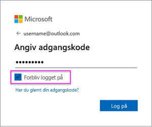

# Opdater et datasæt, der er baseret på en .CSV-fil på OneDrive eller SharePoint Online
## Hvad er fordelene?
Når du opretter forbindelse til en .csv-fil på OneDrive eller SharePoint Online, oprettes der et datasæt i Power BI. Derefter importeres data fra .csv-filen til datasættet i Power BI. Power BI opretter derefter automatisk forbindelse til filen og opdaterer eventuelle ændringer med datasættet i Power BI. Hvis du redigerer .csv-filen i OneDrive eller SharePoint Online, vil disse ændringerne blive vist i Power BI, når du gemmer (vises normalt ca. en time senere). Alle visuelle elementer i Power BI, der er baseret på datasættet, opdateres også automatisk.

Hvis dine filer er i en delt mappe på OneDrive for Business eller SharePoint Online, kan andre brugere arbejde på den samme fil. Når du har gemt, opdateres eventuelle ændringer, der er foretaget, automatisk i Power BI (normalt inden for en time).

Mange organisationer kører processer, der automatisk sender forespørgsler til databaser efter data, som derefter gemmes i en .csv-fil hver dag. Hvis filen er lagret på OneDrive eller SharePoint Online, og den samme fil overskrives hver dag i stedet for at oprette en ny fil med et nyt navn hver dag, kan du oprette forbindelse til denne fil i Power BI. Dit datasæt, der er forbundet med filen, synkroniseres efter kort tid, når filen på OneDrive eller SharePoint Online opdateres. Alle visuelle elementer, der er baseret på datasættet, opdateres også automatisk.

## Hvad understøttes?
Kommaseparerede værdifiler er simple tekstfiler, så forbindelser til eksterne datakilder og rapporter understøttes ikke. Du kan ikke planlægge en opdatering af et datasæt, der er baseret på en kommasepareret fil. Når filen er på OneDrive eller SharePoint Online, synkroniserer Power BI dog automatisk ændringer i filen med datasættet hver time.

## OneDrive eller OneDrive for Business. Hvad er forskellen?
Hvis du har både et personligt OneDrive og OneDrive for Business, anbefales det, at du opbevarer alle filer, som du vil forbinde med Power BI, i OneDrive for Business. Årsag: Du bruger sandsynligvis to forskellige konti til at logge på dem.

Når du opretter forbindelse til OneDrive for Business i Power BI, sker det normalt automatisk, fordi den konto, du bruger til at logge på Power BI med, ofte er den samme konto, der bruges til at logge på OneDrive for Business. Men med et personligt OneDrive kan du logge på med en anden [Microsoft-konto](https://account.microsoft.com).

Når du logger på din Microsoft-konto, skal du vælge Forbliv logget på. Power BI kan derefter synkronisere eventuelle opdateringer med datasæt i Power BI

Hvis du foretager ændringer i din .csv-fil på OneDrive, som ikke kan synkroniseres med datasættet i Power BI, fordi dine legitimationsoplysninger til Microsoft muligvis er blevet ændret, skal du oprette forbindelse til filen og importere den igen fra dit personlige OneDrive.

## Når det går galt
Hvis du ændrer data i .csv-filen på OneDrive, og disse ændringer ikke afspejles i Power BI, er det sandsynligvis, fordi Power BI ikke kan oprette forbindelse til dit OneDrive. Prøv at oprette forbindelse til filen, og importér den igen. Hvis du bliver bedt om at logge på, skal du vælge **Forbliv logget på**.

## Næste trin
[Værktøjer til fejlfinding i forbindelse med opdateringsfejl](service-gateway-onprem-tshoot.md)
[Fejlfinding i forbindelse med opdatering af scenarier](refresh-troubleshooting-refresh-scenarios.md)

Har du flere spørgsmål? [Prøv at spørge Power BI-community'et](https://community.powerbi.com/)

