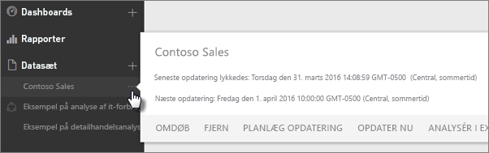
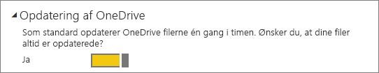
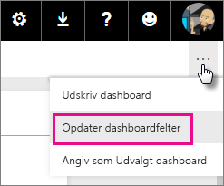
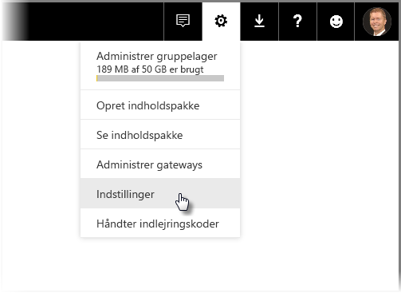
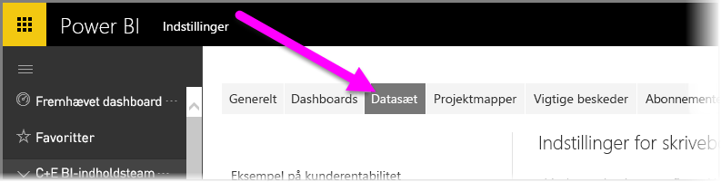
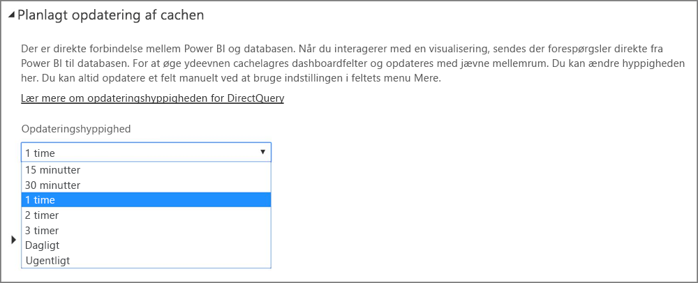

# Opdatering af data i Power BI
At sørge for altid at have de nyeste data er ofte kritisk for at kunne tage de rigtige beslutninger. Du har muligvis allerede brugt Hent data i Power BI til at oprette forbindelse til og overføre data, så du kunne oprette nogle rapporter og et dashboard. Nu skal du sikre dig, at dataene virkelig er de nyeste og bedste.

I mange tilfælde behøver du ikke foretage dig noget som helst. Nogle data, som fra f.eks. en Salesforce- eller Marketo-indholdspakke, opdateres automatisk for dig. Hvis din forbindelse gør brug af en liveforbindelse eller DirectQuery, bliver dataene holdt opdateret. Men i andre tilfælde, som f.eks. med en Excel-projektmappe eller Power BI Desktop-fil, der opretter forbindelse til en ekstern onlinedatakilde eller en datakilde i det lokale miljø, skal du opdatere manuelt eller oprette en tidsplan for opdatering, så Power BI kan opdatere dataene i dine rapporter og dashboards for dig.

Denne artikel er, sammen med et par andre, beregnet til at hjælpe dig med at forstå, hvordan opdatering af data i Power BI virkelig fungerer, om du har brug for at oprette en tidsplan for opdatering, og hvad der skal være på plads for at opdatere dine data.

## Forstå opdatering af data
Før du konfigurerer opdatering, er det vigtigt at forstå, hvad det er, der opdateres, og hvor du får dine data fra.

En *datakilde* er stedet, hvor dataene, du udforsker i dine rapporter og dashboards, egentlig kommer fra – f.eks. en onlinetjeneste som Google Analytics eller QuickBooks, en database i clouden som Azure SQL Database eller en database eller fil på en lokal computer eller server i din egen organisation. Disse er alle datakilder. Datakildens type bestemmer, hvordan data derfra opdateres. Vi ser nærmere på opdatering af den enkelte type datakilde lidt senere i afsnittet [Hvad kan opdateres?](#what-can-be-refreshed)

Et *datasæt* oprettes automatisk i Power BI, når du bruger Hent data til at oprette forbindelse til og overføre data fra en indholdspakke eller fil, eller du opretter forbindelse til en livedatakilde. I Power BI Desktop og Excel 2016 kan du også publicere din fil direkte til Power BI-tjenesten. Det fungerer på samme måde, som hvis du bruger Hent data.

I hvert enkelt tilfælde oprettes et datasæt, og det vises i Mit arbejdsområde eller Gruppe, som er objektbeholdere i Power BI-tjenesten. Hvis du vælger **ellipsen (...)**  ud for et datasæt, kan du udforske dataene i en rapport, redigere indstillingerne og konfigurere opdatering.

Et datasæt kan hente data fra en eller flere datakilder. Du kan f.eks. bruge Power BI Desktop til at hente data fra en SQL-database i din organisation og få andre data fra et OData-feed online. Derefter oprettes et enkelt datasæt, når du publicerer filen til Power BI, men det vil have datakilder til både SQL-databasen og OData-feedet.

Et datasæt indeholder oplysninger om datakilderne, legitimationsoplysninger til datakilderne og i de fleste tilfælde et undersæt af data, der er kopieret fra datakilden. Når du opretter visualiseringer i rapporter og dashboards, ser du på data i datasættet, eller hvis det er en liveforbindelse som Azure SQL Database, definerer datasættet dataene, du kan se, direkte fra datakilden. Hvis der er tale om en liveforbindelse til Analysis Services stammer datasætdefinitionen fra Analysis Services direkte.

> *Når du opdaterer data, opdaterer du dataene i det datasæt, der er gemt i Power BI fra din datakilde. Denne opdatering er en fuld opdatering og ikke trinvis.*
> 
> 

Når du opdaterer data i et datasæt, uanset om det er ved hjælp af Opdater nu, eller ved at indstille en tidsplan for opdatering, bruger Power BI oplysninger i datasættet til at oprette forbindelse til de datakilder, der er defineret for den, efterspørger opdaterede data og indlæser derefter de opdaterede data i datasættet. Alle visualiseringer i dine rapporter eller dashboards, der er baseret på dataene, opdateres automatisk.

Før vi fortsætter, er der noget andet, som er meget vigtigt at få med:

> *Uanset hvor ofte du opdaterer datasættet, eller hvor ofte du ser på livedata, er det dataene hos datakilden, som skal være opdaterede først.*
> 
> 

De fleste organisationer bearbejder deres data en gang om dagen, som regel om aftenen. Hvis du planlægger en opdatering af et datasæt, der er baseret på en Power BI Desktop-fil, der har forbindelse til en database i et lokalt miljø, og din it-afdeling bearbejder den SQL-database én gang om aftenen, skal du kun konfigurere planlagt opdatering til at køre en gang om dagen. For eksempel efter bearbejdningen af databasen har fundet sted, men før du tager på arbejde. Det er selvfølgelig ikke altid tilfældet. Power BI tilbyder mange måder, hvorpå du kan oprette forbindelse til datakilder, der opdateres ofte eller endda i realtid.

## Opdateringstyper
Der er fire primære opdateringstyper, der sker i Power BI. Opdatering af pakke, opdatering af model/data, opdatering af felt og opdatering af visuelle beholdere.

### Opdatering af pakke
Dette synkroniserer din Power BI Desktop- eller Excel-fil mellem Power BI-tjenesten og OneDrive eller SharePoint Online. Denne metode henter ikke data fra den oprindelige datakilde. Datasættet i Power BI vil kun blive opdateret med indhold, der er i filen i OneDrive eller SharePoint Online.

### Opdatering af model/data
Dette henviser til at opdatere datasættet i Power BI-tjenesten med data fra den oprindelige datakilde. Dette gøres enten ved hjælp af planlagte opdateringer eller Opdater nu. Det kræver en gateway i forbindelse med datakilder i lokale miljøer.

### Opdatering af felter
Opdatering af felter opdaterer cachen for feltvisuals på dashboardet, når dataene ændres. Dette sker ca. hvert 15. minut. Du kan desuden gennemtvinge en opdatering af felter ved at vælge **ellipsen (...)** i øverste højre hjørne af et dashboard og derefter vælge **Opdater dashboardfelter**.

Yderligere oplysninger om almindelige fejl under opdatering af felter finder du under [Fejlfinding af feltfejl](refresh-troubleshooting-tile-errors.md).

### Opdatering af visuelle beholdere
Opdatering af visuelle beholdere opdaterer de cachelagrede visuals i rapporten, når dataene ændres.

## Hvad kan opdateres?
I Power BI kan du typisk bruge Hent data til at importere data fra en fil på et lokalt drev, OneDrive eller SharePoint Online, publicere en rapport fra Power BI Desktop eller oprette direkte forbindelse til en database i clouden i din egen organisation. Stort set alle data i Power BI kan opdateres, men om du behøver det eller ej, afhænger af hvad dit datasæt er baseret på, og de datakilder det har forbindelse til. Lad os se på, hvordan hver af disse metoder opdaterer data.

Her er nogle vigtige definitioner, før vi gå videre:

**Automatisk opdatering** – Det betyder, at ingen brugerkonfiguration er nødvendig for, at datasættet kan opdateres med jævne mellemrum. Indstillinger for dataopdatering konfigurerer Power BI for dig. Ved onlinetjenesteudbydere opdateres der normalt en gang om dagen. Ved filer, der er indlæst fra OneDrive, sker opdatering automatisk cirka en gang i timen for data, der ikke kommer fra en ekstern datakilde. Det er muligt at konfigurere forskellige indstillinger for planlagte opdateringer og opdatere manuelt, men det er formentlig ikke nødvendigt.

**Brugerkonfigureret manuel eller planlagt opdatering** – Det betyder, at du manuelt kan opdatere et datasæt ved hjælp af Opdater nu eller konfigurere en tidsplan for opdatering ved hjælp af Planlæg opdatering i indstillingerne for et datasæt. Denne type opdatering er påkrævet for Power BI Desktop-filer og Excel-projektmapper, der har forbindelse til eksterne onlinedatakilder og datakilder i det lokale miljø.

> [!NOTE]
> Når du konfigurerer et tidspunkt for en planlagt opdatering, kan der være en forsinkelse på op til en time, før den starter.
> 
> 

**Live/DirectQuery** – Det betyder, at der er en liveforbindelse mellem Power BI og datakilden. Ved datakilder i det lokale miljø skal administratorer have en datakilde, der er konfigureret i en virksomhedsgateway, men indgriben fra brugeren er muligvis ikke nødvendig.

> [!NOTE]
> For at forbedre ydelsen opdateres dashboards med data, der er forbundet med DirectQuery, automatisk. Du kan også til enhver tid manuelt opdatere et felt ved hjælp af menuen **Mere** på feltet.
> 
> 

## Lokale filer og filer på OneDrive eller SharePoint Online
Dataopdatering understøttes for Power BI Desktop-filer og Excel-projektmapper, der er forbundet med eksterne onlinedatakilder eller datakilder i det lokale miljø. Denne metode vil kun opdatere dataene til datasættet i Power BI-tjenesten. Din lokale fil opdateres ikke.

Hvis du lagrer dine filer på OneDrive eller SharePoint Online og opretter forbindelse til dem fra Power BI, får du stor fleksibilitet. Men fordi du får al den fleksibilitet, er det også en af de løsninger, der er sværest at forstå. Planlagte opdateringer af filer, der er gemt i OneDrive eller på SharePoint Online, er anderledes end opdatering af pakker. Du kan få mere at vide i afsnittet [Opdateringstyper](#types-of-refresh).

### Power BI Desktop-fil
| **Datakilde** | **Automatisk opdatering** | **Brugerkonfigureret manuel eller planlagt opdatering** | **Gateway påkrævet** |
| --- | --- | --- | --- |
| Hent data (på båndet) bruges til at oprette forbindelse til og sende en forespørgsel om data fra alle viste onlinedatakilder. |Nej |Ja |Nej (se nedenfor) |
| Hent data bruges til at oprette forbindelse til og udforske en live-Analysis Services-database. |Ja |Nej |Ja |
| Hent data bruges til at oprette forbindelse til og udforske en understøttet DirectQuery-datakilde i det lokale miljø. |Ja |Nej |Ja |
| Hent data bruges til at oprette forbindelse til og sende forespørgsler om data fra en Azure SQL Database, Azure SQL Data Warehouse, Azure HDInsight Spark. |Ja |Ja |Nej |
| Hent data bruges til at oprette forbindelse til og sende en forespørgsel om data fra alle viste datakilder i det lokale miljø undtagen Hadoop-filer (HDFS) og Microsoft Exchange. |Nej |Ja |Ja |

> [!NOTE]
> Hvis du bruger [ **Web.Page** ](https://msdn.microsoft.com/library/mt260924.aspx)-funktionen, har du brug for en gateway, hvis du har genpubliceret datasættet eller din rapport efter 18. november 2016.
> 
> 

Se flere oplysninger under [Opdater et datasæt, der er baseret på en Power BI Desktop-fil på OneDrive](refresh-desktop-file-onedrive.md).

### Excel-projektmappe
| **Datakilde** | **Automatisk opdatering** | **Brugerkonfigureret manuel eller planlagt opdatering** | **Gateway påkrævet** |
| --- | --- | --- | --- |
| Tabeller med data i et regneark, der ikke er indlæst i Excel-datamodellen. |Ja, én gang i timen *(kun OneDrive/SharePoint Online)* |Kun manuelt *(kun OneDrive/SharePoint Online)* |Nej |
| Tabeller med data i et regneark, der er forbundet med en tabel i Excel-datamodellen (sammenkædede tabeller). |Ja, én gang i timen *(kun OneDrive/SharePoint Online)* |Kun manuelt *(kun OneDrive/SharePoint Online)* |Nej |
| Power Query* bruges til at oprette forbindelse til og sende forespørgsler om data fra alle viste onlinedatakilder og til at indlæse data i Excel-datamodellen. |Nej |Ja |Nej |
| Power Query* bruges til at oprette forbindelse til og sende forespørgsler om data fra alle viste datakilder i det lokale miljø undtagen Hadoop-filer (HDFS) og Microsoft Exchange og til at indlæse data i Excel-datamodellen. |Nej |Ja |Ja |
| Power Pivot bruges til at oprette forbindelse til og sende forespørgsler om data fra alle viste onlinedatakilder og til at indlæse data i Excel-datamodellen. |Nej |Ja |Nej |
| Power Pivot bruges til at oprette forbindelse til og sende forespørgsler om data fra alle viste datakilder i det lokale miljø og til at indlæse data i Excel-datamodellen. |Nej |Ja |Ja |

*\*Power Query er kendt som Hent og omdan data i Excel 2016.*

Du kan få mere at vide under [Opdater et datasæt baseret på en Excel-arbejdsmappe på OneDrive](refresh-excel-file-onedrive.md).

### Fil med kommaseparerede værdier (.csv) på OneDrive eller SharePoint Online
| **Datakilde** | **Automatisk opdatering** | **Brugerkonfigureret manuel eller planlagt opdatering** | **Gateway påkrævet** |
| --- | --- | --- | --- |
| Enkel kommasepareret værdi |Ja, én gang i timen |Kun manuelt |Nej |

Du kan få mere at vide under [Opdater et datasæt, der er baseret på en fil med kommaseparerede værdier (.csv) på OneDrive](refresh-csv-file-onedrive.md).

## Indholdspakker
Der er to typer indholdspakker i Power BI:

**Indholdspakker fra onlinetjenester**: som f.eks. Adobe Analytics, SalesForce og Dynamics CRM Online. Datasæt, der er baseret på onlinetjenester, opdateres automatisk en gang om dagen. Du kan manuelt opdatere eller oprette en tidsplan for opdatering, men det er formentlig ikke nødvendigt. Der er ikke behov for en gateway, fordi onlinetjenester er i skyen.

**Organisationsindholdspakker**: oprettes og deles af brugere i din egen organisation. Forbrugere af indholdspakker kan ikke oprette en tidsplan for opdatering eller opdatere manuelt. Kun personen, der har oprettet indholdspakken, kan konfigurere opdatering af datasættene i indholdspakken. Indstillinger til opdateringer nedarves i datasættet.

### Indholdspakker fra onlinetjenester
| **Datakilde** | **Automatisk opdatering** | **Brugerkonfigureret manuel eller planlagt opdatering** | **Gateway påkrævet** |
| --- | --- | --- | --- |
| Onlinetjenester i Hent data-tjenester&gt; |Ja |Ja |Nej |

### Organisationsindholdspakker
Opdateringsfunktionerne for et datasæt, der er en del af en organisationsindholdspakke, afhænger af datasættet. Se oplysninger ovenfor i forbindelse med lokale filer, OneDrive eller SharePoint Online.

Du kan få mere at vide i [Introduktion til organisationsindholdspakker](service-organizational-content-pack-introduction.md).

## Liveforbindelser og DirectQuery til datakilder i det lokale miljø
Med datagatewayen i det lokale miljø kan du sende forespørgsler fra Power BI til dine datakilder i det lokale miljø. Når du arbejder med en visualisering, sendes forespørgsler fra Power BI direkte til databasen. Derefter returneres opdaterede data, og visualiseringer opdateres. Da der er en direkte forbindelse mellem Power BI og databasen, er det ikke nødvendigt at planlægge en opdatering.

Når der oprettes forbindelse til en SQL Service Analysis Services (SSAS)-datakilde ved hjælp af en liveforbindelse, kan liveforbindelsen til SSAS-kilden i modsætning til DirectQuery køre mod cachen, selvom den indlæser en rapport. Denne adfærd forbedrer indlæsningsydeevnen for rapporten. Du kan sende en forespørgsel om de seneste data fra SSAS-datakilden ved hjælp af knappen til **opdatering**. Ejere af SSAS-datakilder kan konfigurere hyppigheden for planlagt opdatering af cachen for datasættet for at sikre, at rapporterne er så opdaterede, som de kræver. 

Når du konfigurerer en datakilde med datagatewayen i det lokale miljø, kan du bruge denne datakilde som den planlagte opdateringsmulighed. Det ville være et alternativ til at bruge den personlige gateway.

> [!NOTE]
> Hvis dit datasæt er konfigureret til en live- eller DirectQuery-forbindelse, opdateres datasæt ca. en gang i timen, eller når der arbejdes med dataene. Du kan tilpasse *opdateringshyppigheden* manuelt i indstillingen *Planlagt cacheopdatering* i Power BI-tjenesten.
> 
> 

| **Datakilde** | **Live/DirectQuery** | **Brugerkonfigureret manuel eller planlagt opdatering** | **Gateway påkrævet** |
| --- | --- | --- | --- |
| Analysis Services Tabel |Ja |Ja |Ja |
| Analysis Services Multidimensional |Ja |Ja |Ja |
| SQL Server |Ja |Ja |Ja |
| SAP HANA |Ja |Ja |Ja |
| Oracle |Ja |Ja |Ja |
| Teradata |Ja |Ja |Ja |

Læs mere i [Datagateways i det lokale miljø](service-gateway-onprem.md)

## Databaser i clouden
Med DirectQuery er der en direkte forbindelse mellem Power BI og databasen i clouden. Når du arbejder med en visualisering, sendes forespørgsler fra Power BI direkte til databasen. Derefter returneres opdaterede data, og visualiseringer opdateres. Og fordi både Power BI-tjenesten og datakilden er i clouden, er det ikke nødvendigt at have en personlig gateway.

Hvis der ingen brugerinteraktion er i visualiseringen, opdateres dataene automatisk ca. en gang i timen. Du kan ændre denne opdateringsfrekvens ved hjælp af indstillingen *Planlagt cacheopdatering* og angive opdateringshyppigheden.

Hvis du vil angive frekvensen, skal du vælge **tandhjulsikonet** i øverste højre hjørne af Power BI-tjenesten og derefter vælge **Indstillinger**.

Siden **Indstillinger** vises, og her kan du vælge det datasæt, som du vil justere frekvensen for. På denne side skal du vælge fanen **Datasæt** øverst.

Vælg datasættet. I ruden til højre får du vist et udvalg af indstillinger for dette datasæt. I forbindelse med DirectQuery-/liveforbindelser kan du angive opdateringshyppigheden fra perioder på 15 minutter til en gang om ugen ved hjælp af den tilknyttede rullelistemenu, som vist på følgende billede.

| **Datakilde** | **Live/DirectQuery** | **Brugerkonfigureret manuel eller planlagt opdatering** | **Gateway påkrævet** |
| --- | --- | --- | --- |
| SQL Azure Data Warehouse |Ja |Ja |Nej |
| Spark på HDInsight |Ja |Ja |Nej |

Du kan få mere at vide i [Azure og Power BI](service-azure-and-power-bi.md).

## Realtidsdashboards
Realtidsdashboards bruger Microsoft Power BI REST API eller Microsoft Stream Analytics til at sørge for, at dataene er opdateret. Da dashboards i realtid ikke kræver, at brugerne konfigurerer opdatering, dækkes de ikke i denne artikel.

| **Datakilde** | **Automatisk** | **Brugerkonfigureret manuel eller planlagt opdatering** | **Gateway påkrævet** |
| --- | --- | --- | --- |
| Brugerdefinerede apps, der er udviklet med Power BI Rest API eller Microsoft Stream Analytics |Ja, livestreaming |Nej |Nej |

Du kan læse mere i [Oprettelse af et realtidsdashboard i Power BI](https://msdn.microsoft.com/library/mt267603.aspx).

## Konfigurer planlagt opdatering
Hvis du vil vide, hvordan du konfigurerer planlagt opdatering, skal du se [Konfigurer planlagt opdatering](refresh-scheduled-refresh.md)

## Almindelige dataopdateringsscenarier
Nogle gange er det nemmest at lære om opdatering af data i Power BI ved at se på et par eksempler. Her er nogle af de mest almindelige dataopdateringsscenarier:

### Excel-projektmappe med tabeller med data
Du har en Excel-projektmappe med flere tabeller med data, men ingen af dem er indlæst i Excel-datamodellen. Du kan bruge Hent data til at overføre projektmappefilen fra din lokale harddisk til Power BI og oprette et dashboard. Men nu har du foretaget nogle ændringer i et par af projektmappens tabeller på din lokale harddisk, og du vil gerne opdatere dit dashboard i Power BI med de nye data.

Desværre understøttes opdatering ikke i denne situation. For at opdatere datasættet på dit dashboard skal du overføre projektmappen igen. Der er dog en glimrende løsning: Gem din projektmappefil på OneDrive eller SharePoint Online!

Når du opretter forbindelse til en fil på OneDrive eller SharePoint Online, viser dine rapporter og dashboards data, som de ser ud i filen. I dette tilfælde din Excel-projektmappe. Power BI tjekker automatisk efter opdateringer i filen en gang i timen. Hvis du foretager ændringer i projektmappen (der er gemt i OneDrive eller SharePoint Online), afspejles disse ændringer i dit dashboard og dine rapporter inden for en time. Du behøver slet ikke at konfigurere opdatering. Men hvis du vil se dine opdateringer i Power BI med det samme, kan du manuelt opdatere datasættet ved hjælp af Opdater nu.

Du kan få mere at vide under [Excel-data i Power BI](service-excel-workbook-files.md) eller [Opdater et datasæt baseret på en Excel-arbejdsmappe på OneDrive](refresh-excel-file-onedrive.md).

### Excel-projektmappe, der opretter forbindelse til en SQL-database i din virksomhed
Lad os sige, at du har en Excel-projektmappe, der er navngivet SalesReport.xlsx på din lokale computer. Power Query i Excel blev brugt til at oprette forbindelse til en SQL-database på en server i din virksomhed og sendte forespørgsler om salgsdata, der indlæses i datamodellen. Hver morgen åbner du projektmappen og klikker på Opdater for at opdatere din pivottabeller.

Nu vil du gerne se nærmere på dine salgsdata i Power BI, så du bruger Hent data til at oprette forbindelse til og overføre SalesReport.xlsx-projektmappen fra den lokale harddisk.

I dette tilfælde kan du manuelt opdatere dataene i SalesReport.xlsx-datasættet eller oprette en tidsplan for opdatering. Da dataene virkelig kommer fra SQL-databasen i din virksomhed, skal du downloade og installere en gateway. Når du har installeret og konfigureret gatewayen, skal du gå til indstillingerne for SalesReport-datasættet og logge på datakilden, men du behøver kun gøre det en gang. Du kan derefter oprette en tidsplan for opdatering, så Power BI automatisk opretter forbindelse til SQL-databasen og henter opdaterede data. Dine rapporter og dashboards vil også bliver opdateret automatisk.

> [!NOTE]
> Denne metode opdaterer kun dataene i datasættet i Power BI-tjenesten. Din lokale fil opdateres ikke som en del af opdateringen.
> 
> 

Hvis du vil vide mere, kan du se [Excel-data i Power BI](service-excel-workbook-files.md), [Power BI Gateway – Personal](personal-gateway.md), [Datagateway i det lokale miljø](service-gateway-onprem.md), [Opdater et datasæt, der er baseret op en Excel-projektmappe på et lokalt drev](refresh-excel-file-local-drive.md).

### Power BI Desktop-fil med data fra et OData-feed
I dette tilfælde skal du bruge Hent data i Power BI Desktop for at oprette forbindelse til og importere censusdata fra et OData-feed.  Du opretter flere rapporter i Power BI Desktop og navngiver derefter filen WACensus og gemmer den på et delt drev i din virksomhed. Du publicerer derefter filen til Power BI-tjenesten.

I dette tilfælde kan du manuelt opdatere dataene i WACensus-datasættet eller oprette en tidsplan for opdatering. Da dataene i datakilden stammer fra et OData-feed online, behøver du ikke at installere en gateway, men du skal åbne indstillingerne for WACensus-datasættet og logge på OData-datakilden. Du kan derefter oprette en tidsplan for opdatering, så Power BI automatisk opretter forbindelse til OData-feeden og henter opdaterede data. Dine rapporter og dashboards vil også bliver opdateret automatisk.

Hvis du vil vide mere, kan du se [Publicér fra Power BI Desktop](desktop-upload-desktop-files.md), [Opdater et datasæt, der er baseret på en Power BI Desktop-fil på et lokalt drev](refresh-desktop-file-local-drive.md), [Opdater et datasæt, der er baseret på en Power BI Desktop-fil på OneDrive ](refresh-desktop-file-onedrive.md).

### Delt indholdspakke fra en anden bruger i din organisation
Du har oprettet forbindelse til en organisationsindholdspakke. Den indeholder et dashboard, flere rapporter og et datasæt.

I denne situation kan du ikke konfigurere opdatering af datasættet. Dataanalytikeren, der oprettede indholdspakken, er ansvarlig for at sikre, at datasættet opdateres, afhængigt af de datakilder, der er anvendt.

Hvis dine dashboards og rapporter fra indholdspakken ikke opdateres, skal du tale med dataanalytikeren, der oprettede indholdspakken.

Hvis du vil vide mere, kan du se [Introduktion til organisationsindholdspakker](service-organizational-content-pack-introduction.md), [Arbejd med organisationsindholdspakker](service-organizational-content-pack-copy-refresh-access.md).

### Indholdspakke fra en udbyder af onlinetjenester, f.eks. Salesforce
I Power BI kan du bruge Hent data til at oprette forbindelse til og importere data fra en udbyder af onlinetjenester, som f.eks. Salesforce. Her skal du ikke gøre så meget. Det planlægges automatisk, at dit Salesforce-datasæt opdateres en gang om dagen. 

Som de fleste udbydere af onlinetjenester opdaterer Salesforce data en gang i døgnet, som regel om natten. Du kan opdatere dit Salesforce-datasæt manuelt eller oprette en tidsplan for opdatering, men det er ikke nødvendigt, da Power BI automatisk opdaterer datasættet, og dine rapporter og dashboards opdateres også.

Hvis du vil vide mere, kan du se [Salesforce-indholdspakken til Power BI](service-connect-to-salesforce.md).

## Fejlfinding
Når tingene går galt, skyldes det normalt, at Power BI ikke kan logge på datakilder, eller at gatewayen er offline, når datasættet opretter forbindelse til en datakilde i det lokale miljø. Sørg for, at Power BI kan logge på datakilder. Hvis en adgangskode, du bruger til at logge på en datakilde med, ændres, eller Power BI logges af datakilden, skal du prøve at logge på datakilderne igen vha. legitimationsoplysningerne for datakilden.

Du kan se flere oplysninger om fejlfinding i [Værktøjer til fejlfinding i forbindelse med opdateringproblemer](service-gateway-onprem-tshoot.md) og [Fejlfinding i forbindelse med opdatering af scenarier](refresh-troubleshooting-refresh-scenarios.md).

## Næste trin
[Værktøjer til fejlfinding af opdateringsfejl](service-gateway-onprem-tshoot.md)  
[Fejlfinding i forbindelse med opdatering af scenarier](refresh-troubleshooting-refresh-scenarios.md)  
[Power BI Gateway – Personal](personal-gateway.md)  
[Datagateway i det lokale miljø](service-gateway-onprem.md)  

Har du flere spørgsmål? [Prøv at spørge Power BI-community'et](http://community.powerbi.com/)

