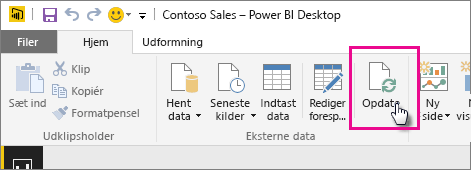

# Opdater et datasæt, der er oprettet via en Power BI Desktop-fil på et lokalt drev
## Hvad understøttes?
I Power BI understøttes "Opdater nu" og "Planlæg opdatering" for de datasæt, der er oprettet via Power BI Desktop-filer, som er importeret fra et lokalt drev, hvor Hent data/Forespørgselseditor bruges til at oprette forbindelse til og indlæse data fra en af følgende datakilder:

### Power BI Gateway – Personlig
* Alle onlinedatakilder, der vises i Hent data og Query Editor i Power BI Desktop.
* Alle datakilder i det lokale miljø, der vises i Hent data og Forespørgselseditor i Power BI Desktop, undtagen Hadoop-fil (HDFS) og Microsoft Exchange.

<!-- Refresh Data sources-->
[!INCLUDE [refresh-datasources](./includes/refresh-datasources.md)]

> [!NOTE]
> En gateway skal være installeret og køres, før Power BI kan oprette forbindelse til datakilder i det lokale miljø, og datasættet opdateres.
> 
> 

Du kan udføre en manuel engangsopdatering direkte i Power BI Desktop ved at vælge Opdater på båndet Hjem. Når du vælger Opdater her, opdateres dataene i *filens* model med de opdaterede data fra den oprindelige datakilde. Denne type opdatering, udelukkende fra selve Power BI Desktop-programmet, er forskellig fra den manuelle eller planlagte opdatering Power BI, og det er vigtigt at forstå forskellen.

Når du importere din Power BI Desktop-fil fra et lokalt drev, indlæses data og andre oplysninger om modellen i et datasæt i Power BI-tjenesten. Du vil opdatere dataene i datasættet i Power BI-tjenesten, ikke Power BI Desktop, da det er det, dine rapporter i Power BI-tjenesten er baseret på. Da datakilderne er eksterne, kan du manuelt opdatere datasættet vha. **Opdater nu**, eller du kan oprette en tidsplan for opdatering vha. **Planlæg opdatering**.

Når du opdaterer datasættet, oprettes der ikke forbindelse til filen på det lokale drev via Power BI for at forespørge om opdaterede data. Oplysningerne i datasættet bruges til at oprette forbindelse direkte til datakilderne for at forespørge om opdaterede data, som derefter indlæses i datasættet.

> [!NOTE]
> Opdaterede data i datasættet synkroniseres ikke med filen på det lokale drev igen.
> 
> 

## Hvordan kan jeg planlægge en opdatering?
Når du konfigurerer en tidsplan for opdatering, oprettes der direkte forbindelse til datakilderne i Power BI vha. forbindelsesoplysningerne og legitimationsoplysningerne i datasættet for at hente opdaterede data. Derefter indlæses de opdaterede data i datasættet. Alle visuelle elementer i rapporter og dashboards, der er baseret på dette datasæt i Power BI-tjenesten, opdateres også.

Du kan finde oplysninger om, hvordan du konfigurerer en tidsplan for opdatering, under [Konfigurer tidsplan for opdatering](refresh-scheduled-refresh.md).

## Når det går galt
Når tingene går galt, skyldes det som regel, at Power BI ikke kan logge på datakilder, at gatewayen er offline, eller hvis datasættet opretter forbindelse til en datakilde i det lokale miljø. Kontrollér, at Power BI kan logge på datakilderne. Hvis en adgangskode, du bruger til at logge på en datakilde med, ændres, eller Power BI logges af datakilden, skal du prøve at logge på datakilderne igen vha. legitimationsoplysningerne for datakilden.

Sørg for, at indstillingen **Send mig en mail med meddelelse om opdateringsfejl** er markeret. Du vil have det at vide med det samme, hvis en planlagt opdatering mislykkes.

## Fejlfinding
Nogle gange går opdateringen af data muligvis ikke som forventet. Dette skyldes som regel et problem i forbindelse med en gateway. Se artiklerne om fejlfinding af gatewayen for at få oplysninger om værktøjer og kendte problemer.

[Fejlfinding af datagatewayen i det lokale miljø](service-gateway-onprem-tshoot.md)

[Fejlfinding af Power BI Gateway – Personlig](service-admin-troubleshooting-power-bi-personal-gateway.md)

Har du flere spørgsmål? [Prøv at spørge Power BI-community'et](http://community.powerbi.com/)

