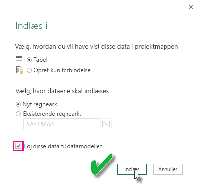

# Opdater et datasæt, der er baseret på en Excel-projektmappe på et lokalt drev
## Hvad understøttes?
I Power BI understøttes Opdater nu og Planlæg opdatering for datasæt, der er baseret på Excel-projektmapper, som er importeret fra et lokalt drev, hvor Power Query (Hent og omdan data i Excel 2016) eller Power Pivot bruges til at oprette forbindelse til en af følgende datakilder og indlæse data i Excel-datamodellen:  

### Power BI Gateway – Personal
* Alle onlinedatakilder, der vises i Power Query.
* Alle datakilder i det lokale miljø, der vises i Power Query, undtagen Hadoop-fil (HDFS) og Microsoft Exchange.
* Alle onlinedatakilder, der vises i Power Pivot.\*
* Alle datakilder i det lokale miljø, der vises i Power Pivot, undtagen Hadoop-fil (HDFS) og Microsoft Exchange.

<!-- Refresh Data sources-->
[!INCLUDE [refresh-datasources](./includes/refresh-datasources.md)]

> **Bemærk!**  
> 
> * En gateway skal være installeret og køre, før Power BI kan oprette forbindelse til datakilder i det lokale miljø, og datasættet opdateres.
> * Når du bruger Excel 2013, skal du sørge for, at du har opdateret Power Query til den nyeste version.
> * Opdatering understøttes ikke for Excel-projektmapper, der er importeret fra et lokalt drev, hvor data kun findes i regneark eller sammenkædede tabeller. Opdatering understøttes for data i regneark, hvis de gemmes og importeres fra OneDrive. Du kan få mere at vide under [Opdater et datasæt baseret på en Excel-arbejdsmappe på OneDrive eller SharePoint Online](refresh-excel-file-onedrive.md).
> * Når du opdaterer et datasæt, der er baseret på en Excel-projektmappe, som er importeret fra et lokalt drev, opdateres kun data, som indhentes via forespørgsler fra datakilder. Hvis du ændrer datamodellens struktur i Excel eller Power Pivot, f.eks. ved at oprette en ny måling eller ændre navnet på en kolonne, vil disse ændringer ikke blive kopieret til datasættet. Hvis du har foretaget sådanne ændringer, skal du overføre dem igen eller publicere projektmappen igen. Hvis du vil foretage regelmæssige ændringer i strukturen i din projektmappe, og du ønsker, at de skal afspejles i datasættet i Power BI, uden at du behøver overføre igen, kan du overveje at placere projektmappen på OneDrive. Power BI opdaterer automatisk både struktur og regnearksdata fra de projektmapper, der er gemt og importeret fra OneDrive.
> 
> 

## Hvordan kan jeg være sikker på, at data indlæses i Excel-datamodellen?
Når du bruger Power Query (Hent og omdan data i Excel 2016) til at oprette forbindelse til en datakilde, kan du indlæse dataene på forskellige måder. For at sikre at du indlæser data i datamodellen, skal du vælge indstillingen **Føj disse data til datamodellen** i dialogboksen **Indlæs til**.

> [!NOTE]
> Billederne her viser Excel 2016.
> 
> 

I **Navigator** skal du klikke på **Indlæs til ...**  
    

Eller du kan åbne Query Editor ved at klikke på **Rediger** i Navigator. Der kan du klikke på **Luk og indlæs til ...**  
    

Derefter skal du i **Indlæs til** sørge for at vælge **Føj disse data til datamodellen**.  
    

### Hvad sker der, hvis jeg bruger Hent eksterne data i Power Pivot?
Det er ikke noget problem. Når du bruger Power Pivot til at oprette forbindelse til og forespørge om data fra en lokal eller onlinedatakilde, indlæses dataene automatisk i datamodellen.

## Hvordan kan jeg planlægge en opdatering?
Når du konfigurerer en tidsplan for opdatering, oprettes der direkte forbindelse til datakilderne i Power BI vha. forbindelsesoplysningerne og legitimationsoplysningerne i datasættet for at hente opdaterede data. Derefter indlæses de opdaterede data i datasættet. Alle visuelle elementer i rapporter og dashboards, der er baseret på dette datasæt i Power BI-tjenesten, opdateres også.

Du kan finde oplysninger om, hvordan du konfigurerer en tidsplan for opdatering, under [Konfigurer tidsplan for opdatering](refresh-scheduled-refresh.md).

## Når det går galt
Når tingene går galt, skyldes det som regel, at Power BI ikke kan logge på datakilder, at gatewayen er offline, eller hvis datasættet opretter forbindelse til en datakilde i det lokale miljø. Kontrollér, at Power BI kan logge på datakilderne. Hvis en adgangskode, du bruger til at logge på en datakilde, ændres, eller Power BI logges af datakilden, kan du prøve at logge på datakilderne igen vha. legitimationsoplysningerne for datakilden.

Sørg for, at indstillingen **Send mig en mail med meddelelse om opdateringsfejl** er markeret. Du vil have det at vide med det samme, hvis en planlagt opdatering mislykkes.

>[!IMPORTANT]
>Opdatering understøttes ikke for OData-feeds, der er tilknyttet og forespurgt fra Power Pivot. Brug Power Query, når du bruger en OData-feed som datakilde.

## Fejlfinding
Nogle gange går opdateringen af data muligvis ikke som forventet. Dette skyldes som regel et problem i forbindelse med en gateway. Se artiklerne om fejlfinding af gatewayen for at få oplysninger om værktøjer og kendte problemer.

[Fejlfinding af datagatewayen i det lokale miljø](service-gateway-onprem-tshoot.md)

[Fejlfinding af Power BI Gateway – Personlig](service-admin-troubleshooting-power-bi-personal-gateway.md)

## Næste trin
Har du flere spørgsmål? [Prøv at spørge Power BI-community'et](https://community.powerbi.com/)

