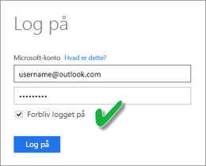
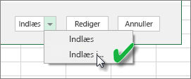
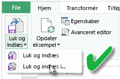
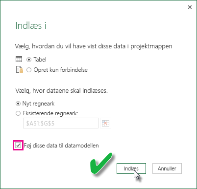

# Opdater et datasæt baseret på en Excel-arbejdsmappe på OneDrive eller SharePoint Online
Du kan importere Excel-arbejdsmapper, der er gemt på din lokale computer eller lagret i clouden, som f.eks. OneDrive for Business eller SharePoint Online. Vi vil nu se på fordelene ved at bruge cloudlagring til dine Excel-filer. Du kan finde flere oplysninger om, hvordan du importerer Excel-filer til Power BI, under [Hent data fra Excel-projektmappefiler](service-excel-workbook-files.md).

## Hvad er fordelene?
Med import af filer fra OneDrive eller SharePoint Online er det nemt at sørge for, at arbejdet, du udfører i Excel, altid er synkroniseret med Power BI-tjenesten. Alle data, du har indlæst i din fils model, importeres i datasættet, og de rapporter, du har oprettet i filen, indlæses i Rapporter i Power BI. Hvis du ændrer din fil på OneDrive eller SharePoint Online, ved f.eks. at tilføje nye målinger, ændre kolonnenavnene eller redigere visuelle elementer, opdateres disse ændringer også i Power BI (som regel inden for cirka en time), når du gemmer.

Når du importerer en Excel-projektmappe fra dit personlige OneDrive, importeres data i projektmappen, som f.eks. tabeller i regneark og/eller data, der indlæses i Excel-datamodellen og datamodellens struktur, til et nyt datasæt i Power BI. Alle Power View-visuelle effekter genoprettes i Rapporter. Power BI opretter automatisk forbindelse til projektmappen på OneDrive eller SharePoint Online cirka en gang i timen for at tjekke efter opdateringer. Hvis projektmappen er blevet ændret, opdaterer Power BI datasættet og rapporterne i Power BI-tjenesten.

Du kan opdatere datasættet i Power BI-tjenesten. Når du opdaterer manuelt eller planlægger en opdatering af datasættet, opretter Power BI direkte forbindelse til de eksterne datakilder for at sende en forespørgsel om opdaterede data, som programmet derefter indlæser i datasættet. Opdatering af et datasæt fra Power BI opdaterer ikke disse data i projektmappen på OneDrive eller SharePoint Online. 

## Hvad understøttes?
I Power BI understøttes "Opdater nu" og "Planlæg opdatering" for de datasæt, der er oprettet via Power BI Desktop-filer, som er importeret fra et lokalt drev, hvor Hent data/Forespørgselseditor bruges til at oprette forbindelse til og indlæse data fra en af følgende datakilder:  

### Power BI Gateway – Personlig
* Alle onlinedatakilder, der vises i Hent data og Query Editor i Power BI Desktop.
* Alle datakilder i det lokale miljø, der vises i Hent data og Forespørgselseditor i Power BI Desktop, undtagen Hadoop-fil (HDFS) og Microsoft Exchange.

<!-- Refresh Data sources-->
[!INCLUDE [refresh-datasources](./includes/refresh-datasources.md)]

> [!NOTE]
> Der skal være installeret og køre en gateway, for at Power BI kan oprette forbindelse til datakilder i det lokale miljø og opdatere datasættet.
> 
> 

## OneDrive eller OneDrive for Business. Hvad er forskellen?
Hvis du har både et personligt OneDrive og OneDrive for Business, anbefales det, at du opbevarer alle filer, som du vil importere til Power BI, i OneDrive for Business. Årsag: Du bruger sandsynligvis to forskellige konti til at logge på dem.

Når du opretter forbindelse til OneDrive for Business i Power BI, sker det normalt automatisk, fordi den konto, du bruger til at logge på Power BI med, ofte er den samme konto, der bruges til at logge på OneDrive for Business. Men med et personligt OneDrive kan du logge på med en anden [Microsoft-konto](http://www.microsoft.com/account/default.aspx).

Når du logger på med din Microsoft-konto, skal du vælge Forbliv logget på. Power BI kan derefter synkronisere eventuelle opdateringer, som du foretager i filen i Power BI Desktop, med datasæt i Power BI  
    

Hvis du foretager ændringer i din fil på OneDrive, som ikke kan synkroniseres med datasættet eller rapporterne i Power BI, fordi dine legitimationsoplysninger til Microsoft muligvis er blevet ændret, skal du oprette forbindelse til og importere filen igen fra dit personlige OneDrive.

## Sådan kan du oprette forbindelse til Excel-fil
Når du opretter forbindelse til en Excel-projektmappe på OneDrive for Business eller SharePoint Online, har du to valgmuligheder i forhold til, hvordan du flytter indholdet fra din projektmappe til Power BI.

[**Importér Excel-data til Power BI** ](service-excel-workbook-files.md#import-or-connect-to-an-excel-workbook-from-power-bi) – Når du importerer en Excel-projektmappe fra dit OneDrive for Business eller SharePoint Online, fungerer det som beskrevet ovenfor.

[**Opret forbindelse, administrer og se Excel i Power BI** ](service-excel-workbook-files.md#one-excel-workbook--two-ways-to-use-it) – Når du bruger denne valgmulighed, skal du oprette forbindelse fra Power BI direkte til din projektmappe på OneDrive for Business eller SharePoint Online.

Når du opretter forbindelse til en Excel-projektmappe på denne måde, oprettes der ikke et datasæt i Power BI. Men projektmappen vises i Power BI-tjenesten under Rapporter med et Excel-ikon ud for navnet. I modsætning til Excel Online kan du oprette en tidsplan for opdateringer, når du opretter forbindelse til din projektmappe fra Power BI, hvis din projektmappe har forbindelse til eksterne datakilder, der indlæser data i Excel-datamodellen.

Når du konfigurerer en tidsplan for opdateringer på denne måde, er den eneste forskel, at opdaterede data ender i projektmappens datamodel på OneDrive eller SharePoint Online i stedet for et datasæt i Power BI.

## Hvordan kan jeg være sikker på, at data indlæses i Excel-datamodellen?
Når du bruger Power Query (Hent og omdan data i Excel 2016) til at oprette forbindelse til en datakilde, kan du indlæse dataene på forskellige måder. For at sikre at du indlæser data i datamodellen, skal du vælge indstillingen **Føj disse data til datamodellen** i dialogboksen **Indlæs til**.

> [!NOTE]
> Billederne her viser Excel 2016.
> 
> 

I **Navigator** skal du klikke på **Indlæs til ...**  
    

Eller du kan åbne Query Editor ved at klikke på **Rediger** i Navigator. Der kan du klikke på **Luk og indlæs til ...**  
    

Derefter skal du i **Indlæs til** sørge for at vælge **Føj disse data til datamodellen**.  
    

### Hvad sker der, hvis jeg bruger Hent eksterne data i Power Pivot?
Det er ikke noget problem. Når du bruger Power Pivot til at oprette forbindelse til og forespørge om data fra en lokal eller onlinedatakilde, indlæses dataene automatisk i datamodellen.

## Hvordan kan jeg planlægge en opdatering?
Når du konfigurerer en tidsplan for opdatering, oprettes der direkte forbindelse til datakilderne i Power BI vha. forbindelsesoplysningerne og legitimationsoplysningerne i datasættet for at hente opdaterede data. Derefter indlæses de opdaterede data i datasættet. Alle visuelle elementer i rapporter og dashboards, der er baseret på dette datasæt i Power BI-tjenesten, opdateres også.

Du kan finde oplysninger om, hvordan du konfigurerer en tidsplan for opdatering, under [Konfigurer tidsplan for opdatering](refresh-scheduled-refresh.md).

## Når det går galt
Når tingene går galt, skyldes det som regel, at Power BI ikke kan logge på datakilder, at gatewayen er offline, eller hvis datasættet opretter forbindelse til en datakilde i det lokale miljø. Kontrollér, at Power BI kan logge på datakilderne. Hvis en adgangskode, du bruger til at logge på en datakilde, ændres, eller Power BI logges af datakilden, kan du prøve at logge på datakilderne igen vha. legitimationsoplysningerne for datakilden.

Sørg for, at indstillingen **Send mig en mail med meddelelse om opdateringsfejl** er markeret. Du vil have det at vide med det samme, hvis en planlagt opdatering mislykkes.

## Vigtige noter
\*Opdatering understøttes ikke for OData-feeds, der er tilknyttet og forespurgt fra Power Pivot. Brug Power Query, når du bruger en OData-feed som datakilde.

## Fejlfinding
Nogle gange går opdateringen af data muligvis ikke som forventet. Dette skyldes som regel et problem i forbindelse med en gateway. Se artiklerne om fejlfinding af gatewayen for at få oplysninger om værktøjer og kendte problemer.

[Fejlfinding af datagatewayen i det lokale miljø](service-gateway-onprem-tshoot.md)

[Fejlfinding af Power BI Gateway – Personlig](service-admin-troubleshooting-power-bi-personal-gateway.md)

Har du flere spørgsmål? [Prøv at spørge Power BI-community'et](http://community.powerbi.com/)

