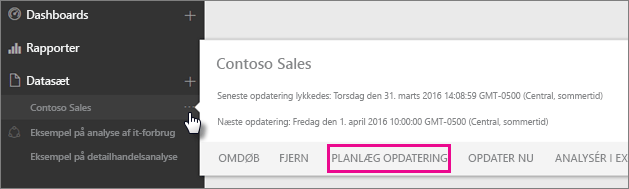
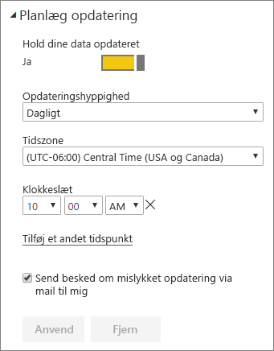

# Konfigurering af planlagt opdatering

>[!NOTE]
>Efter to måneders inaktivitet bliver planlagt opdatering af dine datasæt midlertidigt afbrudt. Se afsnittet [*Planlæg opdatering*](#schedule-refresh) senere i denne artikel for at få mere at vide.
> 
> 

Hvis dine datasæt understøtter planlagt opdatering ved hjælp af Opdater nu og Planlæg opdatering, er der et par krav og indstillinger, som er vigtige for, at opdateringen bliver en succes. Det er: **Gatewayforbindelse**, **Legitimationsoplysninger for datakilde** og **Planlæg opdatering**. Lad os se nærmere på dem hver især.

Følgende beskriver de muligheder, der er for både [Power BI Gateway – Personal](personal-gateway.md) og [en gateway i det lokale miljø](service-gateway-onprem.md).

Du kan gøre følgende for at åbne skærmen til planlægning af opdatering.

1. Vælg **de tre prikker (...)** ved siden af et datasæt under **Datasæt**.
2. Vælg **Planlæg opdatering**.
   
    

## Gateway-forbindelse
Her vil du se forskellige valgmuligheder, afhængigt af om du har en personlig gateway eller en virksomhedsgateway, der er online og tilgængelig.

Hvis ingen gateway er tilgængelig, vil du se, at **Gateway-indstillinger** er deaktiveret. Du vil også se en besked om, hvordan du kan installere en personlig gateway.

Hvis du har konfigureret en personlig gateway, vil den kunne vælges, hvis den er online. Den vil blive vist som offline, hvis den ikke er tilgængelig.

Du kan også vælge en virksomhedsgateway, hvis en sådan er tilgængelig for dig. Du vil kun kunne se en tilgængelig virksomhedsgateway, hvis din konto er angivet på fanen Brugere i datakilden, der er konfigureret for pågældende gateway.

## Legitimationsoplysninger for datakilde
### Power BI Gateway - Personal
Hvis du bruger den personlige gateway til at opdatere data, skal du angive legitimationsoplysningerne, der bruges til at oprette forbindelse til back end-datakilden. Hvis du har oprettet forbindelse til en indholdspakke fra en onlinetjeneste, vil de legitimationsoplysninger, du angav for at oprette forbindelse, blive ført videre til planlagte opdateringer.

Du skal kun logge på datakilder, første gang du opdaterer det pågældende datasæt. Når de er indtastet, gemmes disse legitimationsoplysninger sammen med datasættet.

> [!NOTE]
> I forbindelse med visse godkendelsesmetoder skal du også ændre adgangskoden for datakilden i Legitimationsoplysninger til datakilde, hvis adgangskoden du brugte til at logge på en datakilde udløber eller ændres.
> 
> 

Hvis noget går galt, har problemet som regel enten noget at gøre med, at gatewayen er offline, fordi den ikke kunne logge på Windows og starte tjenesten, eller at Power BI ikke kunne logge på datakilderne for at anmode om opdaterede data. Hvis opdateringen mislykkes, skal du tjekke datasættets indstillinger. Hvis gatewaytjenesten er offline, kan du se fejlen under Gatewaystatus. Hvis Power BI ikke kan logge på datakilderne, kan du se fejlen under Legitimationsoplysninger til datakilde.

### Datagateway i det lokale miljø
Hvis du bruger en datagateway i det lokale miljø til at opdatere data, skal du ikke angive legitimationsoplysninger, da de defineres for datakilden af gatewayadministratorerne.

> [!NOTE]
> Når du opretter forbindelse til SharePoint i det lokale miljø for at udføre en dataopdatering, understøtter Power BI kun godkendelsesmekanismerne: *Anonym*, *Basis* og *Windows (NTLM/Kerberos)*. Power BI understøtter ikke *ADFS* eller nogen form for *formularbaserede godkendelsesmekanismer* til dataopdatering af SharePoint-datakilder i lokale miljøer. 
> 
> 

## Planlæg opdatering
I afsnittet om planlægning af opdateringer angiver du frekvensen og tidspunktet for opdatering af datasæt. Nogle datakilder kræver ikke en tilgængelig gateway for at kunne konfigureres. Andre kræver en gateway.

Du skal indstille skyderen **Hold dine data opdateret** til **Ja** for at konfigurere indstillingerne.

> [!NOTE]
> Power BI-tjenesten stiler efter at starte opdateringen af dine data inden for **15 minutter** efter dit planlagte opdateringstidspunkt.
> 
> 

> [!NOTE]
> Efter to måneders inaktivitet bliver planlagt opdatering af dine datasæt midlertidigt afbrudt. Et datasæt anses for at være inaktivt, når ingen brugere har besøgt et dashboard eller en rapport, der er baseret på datasættet. På dette tidspunkt modtager datasættets ejer en mail, der fortæller, at planlagte opdateringer er midlertidigt afbrudt, og tidsplanen for opdatering af datasættet vises som **deaktiveret**. For at fortsætte med planlagte opdateringer skal du ganske enkelt besøge et vilkårligt dashboard eller en vilkårlig rapport, der er baseret på datasættet.
> 
> 

## Hvad understøttes?
Visse datasæt understøttes i forhold til forskellige gateways til planlagte opdateringer. Her er en forklaring på, hvad der er tilgængeligt.

### Power BI Gateway - Personal
**Power BI Desktop**

* Alle onlinedatakilder, der vises i Hent data og Query Editor i Power BI Desktop.
* Alle datakilder i det lokale miljø, der vises i Hent data og Query Editor i Power BI Desktop, undtagen Hadoop-fil (HDFS) og Microsoft Exchange.

**Excel**

> [!NOTE]
> I Excel 2016 og nyere udgaver angives Power Query nu i Data-afsnittet på båndet under Hent og omdan data.
> 
> 

* Alle onlinedatakilder, der vises i Power Query.
* Alle datakilder i det lokale miljø, der vises i Power Query, undtagen Hadoop-fil (HDFS) og Microsoft Exchange.
* Alle onlinedatakilder, der vises i Power Pivot.\*
* Alle datakilder i det lokale miljø, der vises i Power Pivot, undtagen Hadoop-fil (HDFS) og Microsoft Exchange.

<!-- Refresh Data sources-->
[!INCLUDE [refresh-datasources](./includes/refresh-datasources.md)]

## Fejlfinding
Nogle gange går opdateringen af data muligvis ikke som forventet. Dette skyldes som regel et problem i forbindelse med en gateway. Se artiklerne om fejlfinding af gatewayen for at få oplysninger om værktøjer og kendte problemer.

[Fejlfinding af datagateway i det lokale miljø](service-gateway-onprem-tshoot.md)

[Fejlfinding af Power BI Gateway – Personal](service-admin-troubleshooting-power-bi-personal-gateway.md)

## Næste trin
[Opdatering af data i Power BI](refresh-data.md)  
[Power BI Gateway - Personal](personal-gateway.md)  
[Datagateway i lokalt miljø](service-gateway-onprem.md)  
[Fejlfinding af datagateway i lokalt miljø](service-gateway-onprem-tshoot.md)  
[Fejlfinding af Power BI Gateway – Personlig](service-admin-troubleshooting-power-bi-personal-gateway.md)  

Har du flere spørgsmål? [Prøv at spørge Power BI-community'et](http://community.powerbi.com/)

