# Brug delte datasæt i Power BI Report Builder

Du kan bruge et datasæt, som du opretter i Power BI Desktop, som en datakilde til sideinddelte rapporter i Power BI Report Builder. Forestil dig dette scenarie: Du har oprettet en Power BI-rapport i Power BI Desktop. Du har brugt en masse tid på at designe datamodellen og derefter oprettet en smuk Power BI-rapport med alle mulige flotte visuals. Rapporten har en matrix med mange rækker, så du skal rulle for at se dem alle. Dine rapportlæsere vil have en rapport, som de kan udskrive, og som viser alle rækkerne i den pågældende matrix. Det kan en sideinddelt rapport fra Power BI gøre: udskrive en tabel eller matrix, der fylder flere sider, med sidehoveder og sidefødder og et perfekt sidelayout, som du designer. Den vil supplere Power BI Desktop-rapporten. Du vil gerne have, at de skal være baseret på de samme data uden uoverensstemmelser, så du bruger det samme datasæt.

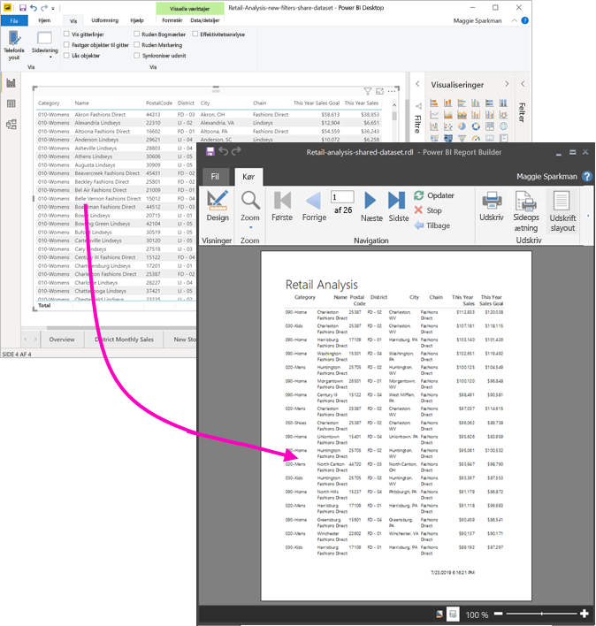

Datasættet behøver ikke at være i et arbejdsområde i en Premium-kapacitet, og du behøver ikke at være medlem af arbejdsområdet. Du skal blot have [Build-tilladelse](service-datasets-build-permissions.md) til datasættet. Hvis du vil publicere din sideinddelte rapport, skal du have en Power BI Pro-licens. Du skal også som minimum have rollen bidragyder for et arbejdsområde i en Premium-kapacitet.

## Det skal du bruge

Her er en liste over, hvad du skal bruge, og hvad du ikke behøver for at bruge et delt datasæt i Power BI Report Builder.

- Power BI Report Builder. [Download og installér Power BI Report Builder](https://go.microsoft.com/fwlink/?linkid=2086513).
- Hvis du vil have adgang til et Power BI datasæt, skal du have Build-tilladelse til datasættet. Læs mere om [Build-tilladelse](service-datasets-build-permissions.md).
- Du behøver ikke en Power BI Pro-licens for at oprette en sideinddelt rapport i Report Builder. 
- Du skal have en Power BI Pro-licens for at publicere din sideinddelte rapport. Du skal også som minimum have rollen bidragyder for et arbejdsområde i en Premium-kapacitet. 
- Valgfrit: Hvis du vil følge med i denne artikel, kan du downloade filen Power BI Desktop [Retail Analysis sample.pbix](https://download.microsoft.com/download/9/6/D/96DDC2FF-2568-491D-AAFA-AFDD6F763AE3/Retail%20Analysis%20Sample%20PBIX.pbix), åbne den i Power BI Desktop og tilføje en tabel med mange kolonner. Slå **Totaler** fra i ruden **Formular**. Publicer den derefter til et arbejdsområde i Power BI-tjenesten.

    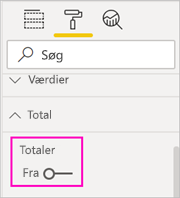

## Opret forbindelse til Power BI-datasættet

1. Åbn Microsoft Power BI Report Builder.
1. Vælg **Log på** i øverste højre hjørne af Report Builder for at logge på din Power BI-konto.
1. I ruden Rapportdata skal du vælge **Ny** > **Power BI-datasætforbindelse**.

    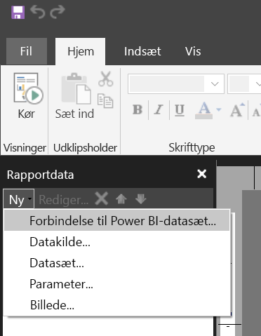

    > [!NOTE]
    > Du kan ikke oprette datakilden eller datasættet for et Power BI-datasæt ved hjælp af guiderne Report Builder Table, Matrix eller Chart. Når du har oprettet dem, kan du bruge guiderne til at oprette tabeller, matrixer eller diagrammer, der er baseret på dem.

1. Søg efter det datasæt eller det arbejdsområde, hvor det befinder sig > **Vælg**.
    Report Builder udfylder navnet på datasættet.

    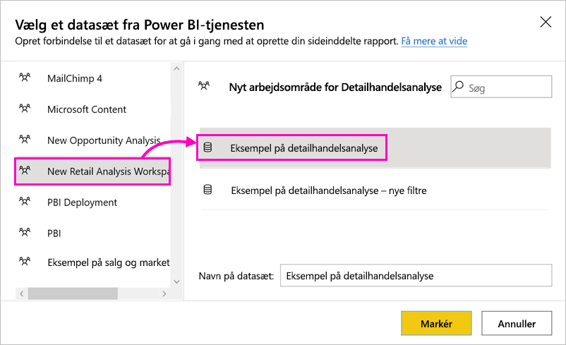
    
1. Datasættet er anført under Datakilder i ruden Rapportdata.

    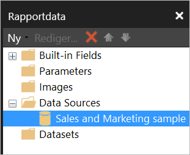

    Husk, at du kan oprette forbindelse til flere Power BI-datasæt og andre datakilder i den samme sideinddelte rapport.

## Hent forespørgslen til datasættet

Hvis du vil have, at dataene i din Power BI-rapport og i din Report Builder-rapport skal være ens, er det ikke nok at oprette forbindelse til datasættet. Du skal også bruge den forespørgsel, der bygger på dette datasæt.

1. Åbn Power BI-rapporten (.pbix) i Power BI Desktop.
1. Sørg for, at du har en tabel i din rapport, der indeholder alle de data, du ønsker i din sideinddelte rapport.

1. Vælg **Effektivitetsanalyse** på båndet **Vis**.

    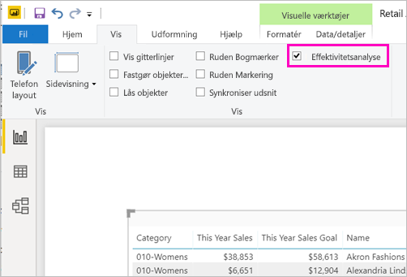

1. I ruden **Effektivitetsanalyse** vælger du **Start optagelse** og vælger derefter **Opdater visuals**.

    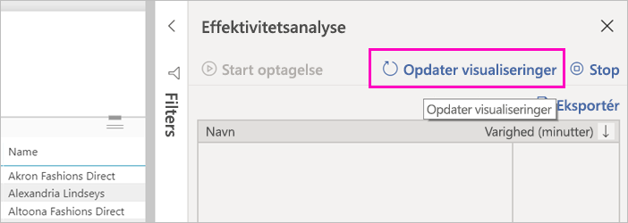

1. Udvid plustegnet ( **+** ) ved siden af tabelnavnet, og vælg derefter **Kopiér forespørgsel**. Forespørgslen er den DAX-formel, du skal bruge til datasættet i Power BI Report Builder.

    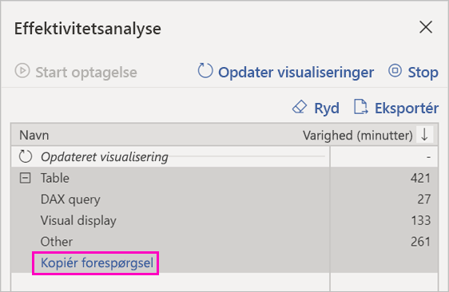

## Opret datasættet med forespørgslen

1. Gå tilbage til Power BI Report Builder.
1. Højreklik på datasættet under **Datakilder**, og vælg **Tilføj datasæt**.

    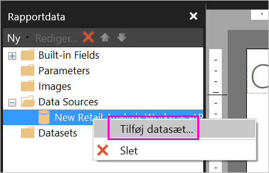

1. I Egenskaber for datasæt skal du give det et navn og vælge **Forespørgselsdesigner**.

4. Sørg for, at **DAX** er valgt, og fjern derefter markeringen af ikonet **Designtilstand**.

    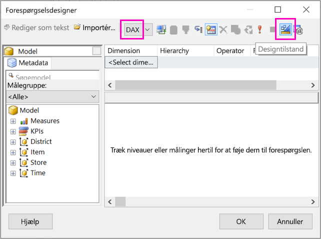

1. Indsæt den forespørgsel, du kopierede fra Power BI Desktop, i den øverste boks.

1. Vælg **Udfør forespørgsel** (det røde udråbstegn, !) for at sikre dig, at forespørgslen fungerer. 

    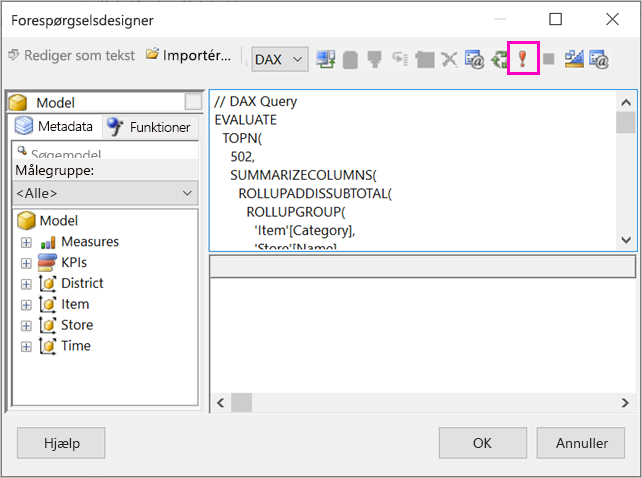

    Du kan se resultaterne af forespørgslen i den nederste boks.

    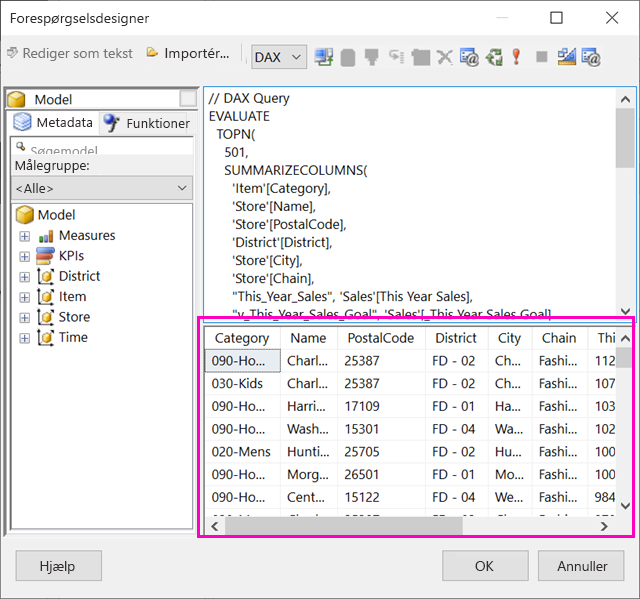

1. Vælg **OK**.

    Du kan se din forespørgsel i vinduet **Forespørgsel** i dialogboksen **Egenskaber for datasæt**.

    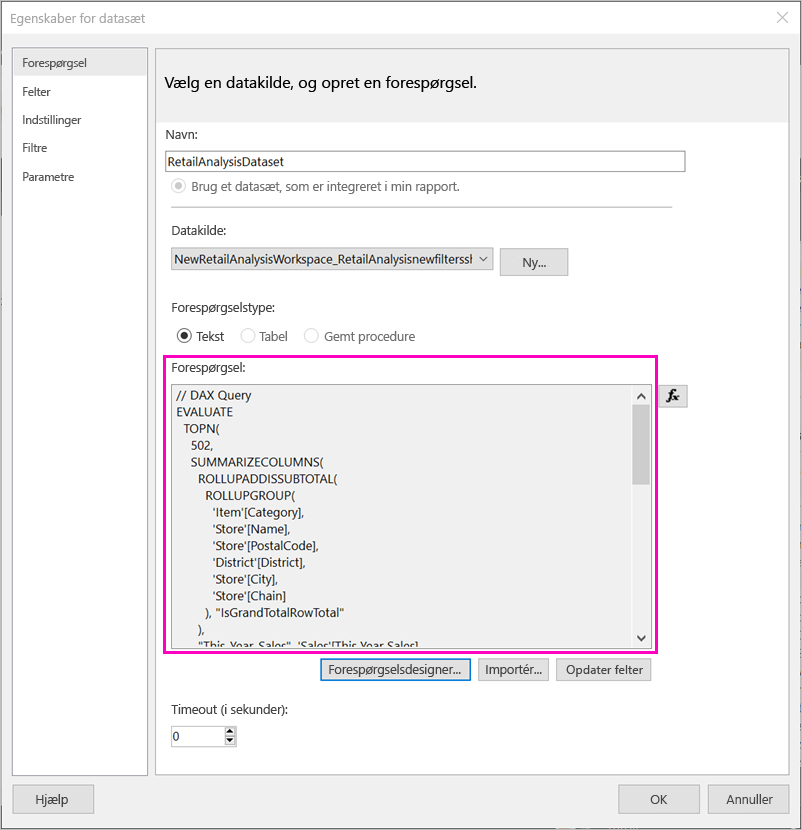

1. Vælg **OK**.

    Nu kan du se dit nye datasæt med en liste over felterne i ruden Rapportdata.

    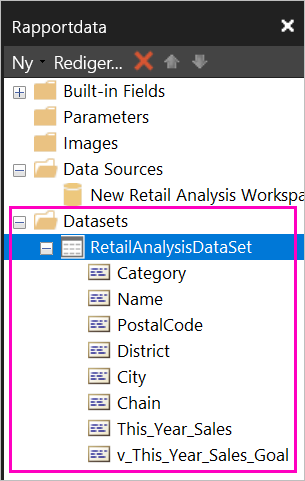

## Opret en tabel i rapporten

En hurtig måde at oprette en tabel på er at bruge guiden Tabel.

1. På båndet **Indsæt** skal du vælge **Tabel** > **Guiden Tabel**.

    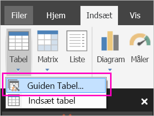

1. Vælg det datasæt, du oprettede med DAX-forespørgslen > **Næste**.

    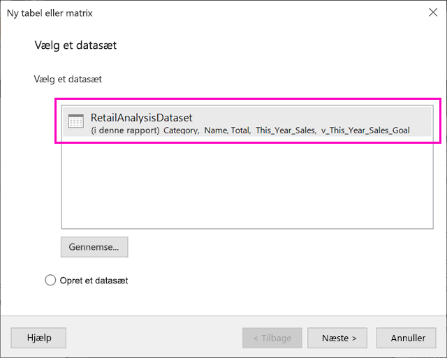

1. Hvis du vil oprette en flad tabel, skal du vælge de felter, du vil have, i **Tilgængelige felter**. Du kan vælge flere felter ad gangen ved at markere det første, du vil have, holde Skift nede og vælge det sidste.

    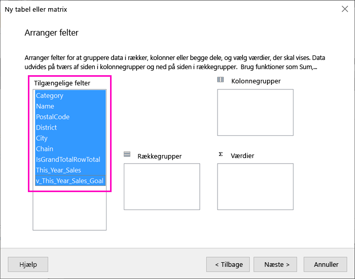

1. Træk felterne til boksen **Værdier** > **Næste**.

    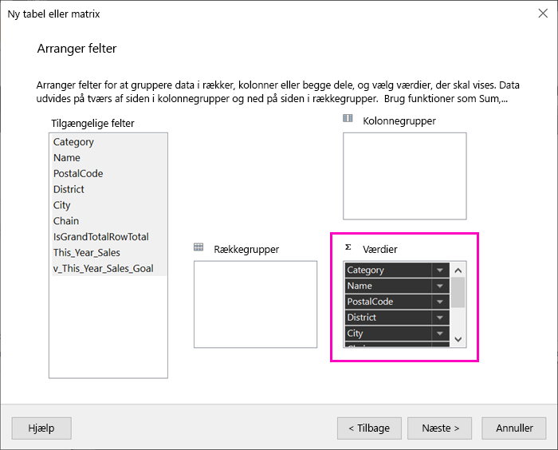

1. Vælg de ønskede layoutindstillinger > **Næste**.

1. Vælg **Udfør**.
    Du kan se din tabel i Designvisning.

    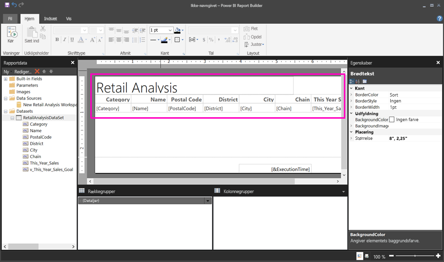

1. Vælg **Klik for at tilføje en titel**, og tilføj en titel.

1. Vælg **Kør** for at få vist rapporten.

    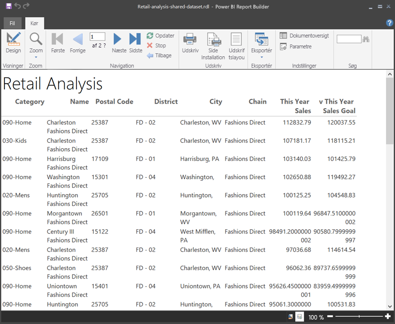

1. Vælg **Udskriftslayout** for at se, hvordan rapporten vil se ud i udskrift. 

    Dette rapportlayout kræver noget tilpasning. Den har 54 sider, fordi kolonnerne og margenerne gør tabellen to sider bred.

    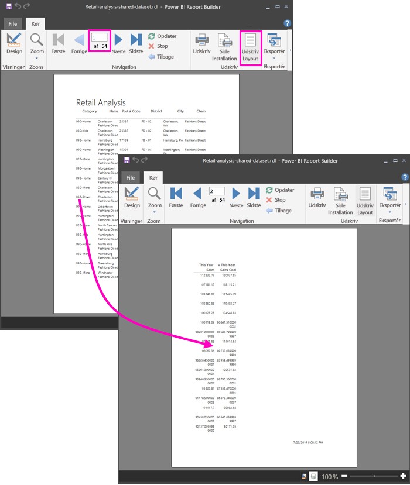

## Formatér rapporten

Du har flere formateringsmuligheder, så du kan få tabellen til at passe på én side. 

1. Du kan reducere sidemargenerne i ruden Egenskaber. Hvis du ikke kan se ruden Egenskaber, skal du markere afkrydsningsfeltet **Egenskaber** på båndet **Vis**.

1. Vælg rapporten, ikke tabellen eller titlen.
1. I ruden **Egenskaber for rapport** skal du under **Side** udvide **Margener** og ændre dem alle til **0,75"** .

    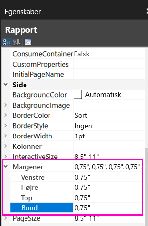

1. Du kan også gøre kolonnerne smallere. Markér kolonnekanten, og træk højre side til venstre.

    

1. En anden mulighed er at sørge for, at talværdierne er formateret pænt. Vælg en celle med en talværdi. 
    > [!TIP]
    > Du kan formatere mere end celle ad gangen ved at holde Skift-tasten nede, mens du markerer de øvrige celler.

    

1. På båndet **Hjem** i afsnittet **Tal** skal du ændre formatet **Standard** til et numerisk format, f.eks. **Valuta**.

    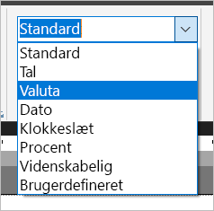

1. Skift typen af **Pladsholder** til **Eksempelværdier**, så du kan se formateringen i cellen. 

    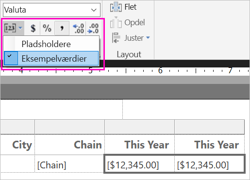

1. Hvis det er relevant, skal du i afsnittet **Tal** reducere decimalerne for at spare mere plads.

### Sletning af tomme sider

Selvom du har gjort margenerne og tabelkolonnerne smallere, kan du stadig komme ud for, at hver anden side er tom. Hvorfor? På grund af matematikken. 

Når du tilføjer de sidemargener, du angiver, plus bredden af rapportens *brødtekst*, skal den være mindre end bredden af rapportformatet.

Antag f.eks., at din rapport har et format på 8,5" x 11", og du har angivet, at sidemargenerne skal være på 0,75" hver. De to margener udgør tilsammen 1,5", så brødteksten skal have en bredde på mindre end 7".

1. Vælg den højre kant af rapportens designoverflade, og træk den, så den bliver mindre end det ønskede tal på linealen. 

    > [!TIP]
    > Du kan indstille den mere præcist i egenskaberne for **brødtekst.** Angiv egenskaben **Bredde** under **Størrelse**.

    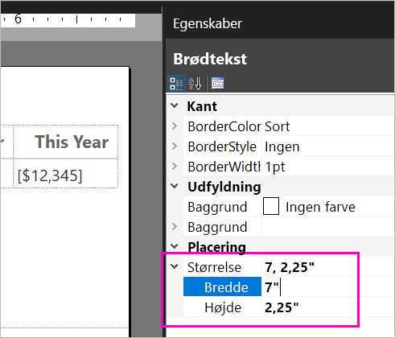

1. Vælg **Kør** for at få vist din rapport og kontrollere, at de tomme sider er forsvundet. Denne rapport indeholder nu kun 26 sider i stedet for de oprindelige 54. Udført!

    

## Begrænsninger og overvejelser 

- For de datasæt, der bruger en direkte forbindelse til Analysis Services, kan du oprette forbindelse direkte ved hjælp af den indbyggede Analysis Services-forbindelse i stedet for et delt datasæt.
- Datasæt med hævede eller certificerede påtegninger vises på listen over tilgængelige datasæt, men de er ikke markeret som sådanne. 

## Næste trin

- [Hvad er sideinddelte rapporter i Power BI Premium?](paginated-reports-report-builder-power-bi.md)