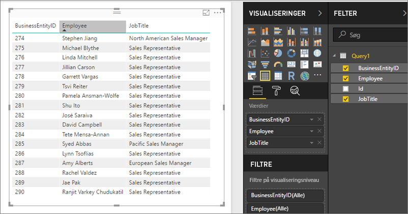

# Adgang til delte datasæt som OData-feeds i Power BI-rapportserver
Du kan få adgang til delte datasæt fra Power BI Desktop med et OData-feed.

1. Med OData-feed'ets URL-adresse kan du oprette forbindelse til OData-kilden.
   
    
2. Når du har overført dataene til Power BI Desktop, kan du ændre dem i Query Editor.
   
    
3. Nu kan du bruge dataene, når du designer rapporter.
   
    

Sørg for at bruge **Avancerede indstillinger** , så du kan aktivere Åbn typekolonner og formatere kolonnerne i Power Query efter dine behov.

Læs mere om at [oprette forbindelse til OData-feeds i Power BI Desktop](../desktop-connect-odata.md).

Har du flere spørgsmål? [Prøv at spørge Power BI-community'et](https://community.powerbi.com/)

