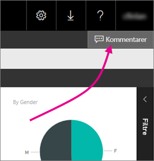
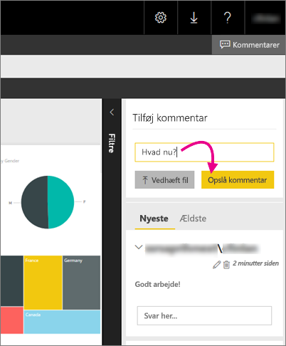

# Tilføj kommentarer i en rapport på en rapportserver – Power BI-rapportserver

Du kan tilføje kommentarer i rapporter, herunder Power BI-rapporter, på webportalen til en rapportserver. Kommentarerne gemmes sammen med rapporten, og alle, der har rettigheder til den, kan se kommentarerne til rapporten. Se i afsnittet [Tilladelser](#permissions) herunder for at få flere oplysninger.

## Tilføj eller få vist kommentarer

1. Åbn en sideinddelt rapport eller en Power BI-rapport på en rapportserver.
2. Vælg **Kommentarer** i øverste højre hjørne.

    

    Du kan se eventuelle eksisterende kommentarer i ruden Kommentarer.
3. Skriv din kommentar, og vælg derefter **Skriv kommentar**.

    

    Din kommentar vises i ruden på webportalen sammen med alle tidligere kommentarer. De vises ikke sammen med rapporten i Power BI-mobilappsene.

   > [!TIP]
   > Vidste du det? Du kan [anmærke Power BI-rapporter i Power BI-mobilapps](../consumer/mobile/mobile-annotate-and-share-a-tile-from-the-mobile-apps.md) og dele de anmærkede rapporter med andre.

## Tilladelser

Afhængigt af dine tilladelser kan du:

* Ikke se kommentarer.
* Se alle kommentarer, og send, rediger og slet dine egne.
* Se alle kommentarer, send, rediger og slet dine egne, og slet andres kommentarer.

## Næste trin
* [Hvad er Power BI-rapportserveren?](get-started.md)  

Har du flere spørgsmål? [Prøv at spørge Power BI-community'et](https://community.powerbi.com/)

